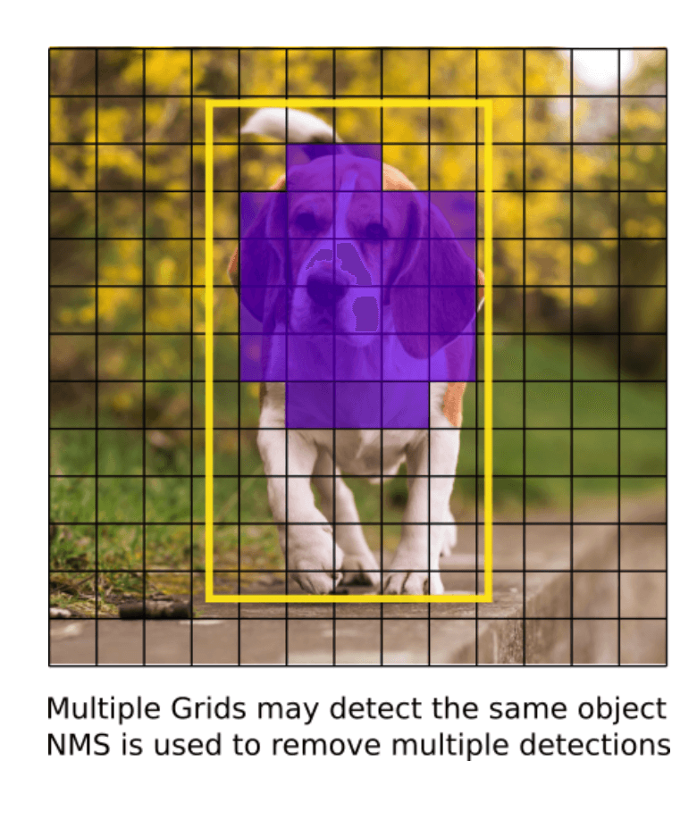

<h2>Part 1 - YOLO가 어떻게 작동되는지 이해하기</h2>

#### 영어를 대체할만한 제대로 된 한국어를 찾지 못한 경우에는 그대로 영어로 작성했다는 것을 참고해주세요. 도움을 위해 한 번씩 영어 옆에 한국어로 괄호로 작성했습니다 :)
 

> Opencv DNN, Tensorflow, Pytorch로 YOLO v3를 구현해본 코드를 보려면 [Github repo](https://github.com/dojinkimm/Object_Detection_Video_DNN_Tensorflow_Pytorch) 를 참고하세요. 

### 본문

[본 내용 링크](https://blog.paperspace.com/how-to-implement-a-yolo-object-detector-in-pytorch/)

Object detection 분야는 최근에 딥러닝의 발전으로 가장 크게 혜택을 본 분야이다. 최근 몇년동안 사람들이 YOLO, SSD, Mask RCNN과 RetinaNet을 포함한 많은 다양한 object detection 알고리즘들을 개발했다. 

지난 몇 개월 동안, 나는(저자) object detection을 개선하기 위해 research lab에서 일하고 있었다. 이 분야를 경험하면서 object detection을 배우기 위한 가장 가장 좋은 방법은 처음부터 알고리즘을 구현해보는 것이라는 것을 느끼게 되었다. 그래서 이 튜토리얼에서는 처음부터 구현을 시작해 볼 것이다.

우리는 YOLOv3에 기반한 object detector를 Pytorch로 구현할 것이다. YOLOv3은 가장 빠른 object detection 알고리즘 중 하나이다. 

해당 코드는 `Python 3.5`, `Pytorch 0.4` 에서 실행되게끔 디자인이 되었고, 이 [Github repo](https://github.com/ayooshkathuria/YOLO_v3_tutorial_from_scratch)(저자가 구현한 코드)에서 코드들을 볼 수 있다.

튜토리얼은 총 5 단계로 나뉘어져 있다:

&nbsp;1. Part 1: YOLO가 어떻게 작동되는지 이해하기 
&nbsp;2. [Part 2 : 네트워크 구조의 layers들 구현하기](https://devjin-blog.com/yolo-part2/) 
&nbsp;3. [Part 3 : 네트워크의 forward pass 구현하기](https://devjin-blog.com/yolo-part3/) 
&nbsp;4. [Part 4 : Objectness 점수 thresholding과 non-maximum suppression(NMS)](https://devjin-blog.com/yolo-part4/) 
&nbsp;5. [Part 5 : 입력과 출력 pipeline 디자인하기](https://devjin-blog.com/yolo-part5/) 
 

# 사전에 알아야할 지식

- Convolutional Neural Network(CNN)이 어떻게 작동하는지 이해를 해야 한다. Residual blocks, skip connections, upsampling*에 대한 지식들도 포함한다.
- Object detection, bounding box regression, IoU 그리고 non-maximun suppression이 무엇인지 이해를 해야 한다.
- 기본적이 Pytorch 사용법을 알아야 한다. 간단한 neural network 정도는 직접 구현할 줄 알아야 한다.

이해를 돕기 위해 post 밑에 관련된 링크들을 첨부했다.   

# YOLO란 무엇인가?
 

YOLO는 You Only Look Once(딱 한번만 본다(?))의 줄임말이다. 이 object detector는 deep CNN을 통해 학습한 feature(특징)들로 object들을 detect(감지)하는데 사용된다. 

# A Fully Connected Neural Network(FCN)
 

YOLO는 convolutional layers들만 사용해서 fully convolutional network(FCN)을 만든다. Skip connections와 upsampling* layer들을 포함해 총 75개의 convolutional layer들로 구성되었다. Pooling은 사용되지 않고, feature map을 downsample*하기 위해서 2의 stride를 가진 convolutional layer가 사용된다. 이는 pooling으로 인해서 low-lever feature들이 자주 loss되는 것을 방지하기 위함이다. 

FCN이기 때문에, YOLO는 입력 이미지 크기에 영향을 받지 않는다. (이미지 크기에 따라서 네트워크가 더 빨라지거나 느려지지 않는다) 그러나, 알고리즘을 구현할 때 다양한 문제들이 일어날 수 있기 때문에 일정한 입력 크기를 유지할 것이다. 

그 중 가장 큰 문제가 될 수 있는 것은, batch로 이미지를 처리하려고 하면 모든 이미지들의 높이와 너비가 고정되어 있어야 한다는 것이다. (이미지들을 batch로 처리하면 GPU로 병렬처리가 가능해서 속도를 높힐 수 있다) 이건 여러 이미지를 하나의 큰 batch로 연결하기 위해 필요하다. (여러개의 Pytorch tensor들을 하나로 연결한는 것)

네트워크는 `stride`라는 factor을 이용해서 이미지를 downsample*한다. 예를 들어, 네트워크의 stride가 32면, 416x416 크기의 입력 이미지는 13x13 크기의 출력을 생성할 것이다. 일반적으로, **네트워크 layer의 `stride`는 layer의 출력이 네트워크의 입력 이미지보다 작은 요인과 같다.**

# 출력 예측하기
 

통상적으로, (다른 object detectors 한해서) convolutional layer들을 통해 학습된 feature들은 classifier 혹은 regressor로 전달이 되고 detection prediction이 이루어진다. (bounding box의 좌표, 클래스 라벨..등등)

YOLO에서 prediction은 1x1 convolutional layer을 사용해서 이뤄진다.

그래서, 주목해야할 점은 바로 우리의 **출력 결과는 feature map**이라는 것이다. 1x1 convolution을 사용했기 때문에 prediction map의 크기는 이전의 feature map가 크기가 같다. YOLO v3(YOLO의 다른 종류들도 포함)에서 각 cell은 고정된 숫자의 bounding box를 예측할 수 있고 이러한 방법으로 prediction map을 예측할 수 있게 된다. 

> Feature map의 unit들을 더 기술적이고 올바르게 표현한 용어는 neuron이지만, 현 내용에서는 cell이라고 부르는 것이 더 직관적이다.

**깊이를 봤을 때, (B x (5+C))개의 entry가 feature map에 있다.** B는 각 cell이 예측할 수 있는 bounding box들의 숫자를 표현한다. 논문에 의하면, B bounding box들은 특정 종류의 object들을 detect하는 데 특화될 수 있다. 각각의 bounding box들은 5+C개의 attributes(속성)들을 가지고 있고, 이 attribute들은 bounding box의 중심 좌표, dimension(크기), objectnesss 점수 그리고 C class 신뢰도를 표현한다. YOLOv3는 각 cell당 3개의 bounding box를 예측한다. 

**Object의 중심이 cell의 receptive field에 있는 경우, feature map의 각 cell이 bounding box중 하나를 이용해서 object를 예측할 것이다.** (Receptive field는 입력 이미지가 cell에 보이는 영역이다. 자세한 설명은 CNN에 대한 링크를 참고하세요).

이 것은 YOLO가 trained된 방법과 관련이 있다, 단 하나의 bounding box만 주어진 object를 detect할 책임이 있다. 첫 째로, 이 bounding box가 어떤 cell에 속하는지 알아야 한다.

그러기 위해서, 우리는 **입력** 이미지를 최종 feature map의 크기와 같게 grid로 나눠야 한다.

밑에 예시를 참고하자면, 입력 이미지는 416x416이고 네트워크의 stride는 32이다. 이 전에 언급했듯이, feature map의 dimension은 13x13이 될 것이다. 우리는 입력 이미지를 13x13으로 나눌 것이다.

이후에, object의 ground truth box 중심을 포함한 cell(입력 이미지에서)은 object를 예측하는 대상으로 선정이 된다. 위 이미지에서는 빨간색으로 마크된 cell이고, 이 cell은 노란색으로 마크된 ground truth box의 중심을 포함하고 있다.

빨간 cell은 grid의 7번째 행의 7번째 cell이다. 우리는 7번째 행의 7번째 cell을 feature map에서 개를 detect하는 것을 책임지는 cell로 지정을 한다.

이 cell은 총 3개의 bounding box들을 예측할 수 있다. 그렇다면, 어떤 box가 개의 ground truth label로 배정이 될 것인가? 이 질문을 이해하기 위해서는 `anchors`에 대한 개념을 짚고 넘어가야 한다.   

> 여기서 얘기하는 cell은 prediction feature map에 있는 cell임을 인지해야 한다. **입력 이미지**를 grid로 나누는 이유는 **prediction feature map**에 cell중에 어떤 cell이 예측하는 것에 책임이 있는지 알기 위함이다.

# Anchor Boxes
 

Bounding box의 높이와 너비를 예측하는 것이 의미가 있을 수 도 있지만, 실제로는 training시에 불안정한 gradient를  발생시킨다. 그래서, 대부분의 현대 object detectors들은  log-space transforms를 예측하던지, `anchors` 라고 불리는 미리 정의된 bounding box들을 사용한다. 

이 transforms들은 anchor box들에 적용이 되서 예측값을 얻게 된다. YOLOv3는 3개의 anchors가 있어서각 cell마다 3 개의 bounding box가 예측이 된다. 

이전에 했던 질문으로 돌아가서, 개를 detect하는 것에 책임을 지게 될 bounding box는 ground truth box와 함께 가장 높은 IoU를 가진 anchor가 될 것이다. 

# Prediction 하기
 

다음 수식은 bounding box prediction을 얻기 위해 네트워크 출력이 어떻게 변환되는지를 설명한다.

*bx, by, bw, bh* 는  prediction의 x,y의 중심 좌표, 너비와 높이이다. tx, ty, tw, th는 네트워크의 출력이다. cx and cy 는 grid의 왼쪽 위 좌표이다. pw 와 ph는 box의 anchor dimension이다. 

### 중심 좌표

여기서 우리는 sigmoid 함수를 통해 중심 좌표 예측을 한다. 이렇게 되면 출력 값은 0과 1 사이가 된다. 왜 이 경우가 문제가 될까? 

일반적으로 YOLO는 bounding box 중심의 절대 좌표를 예측하지 않는다. 대신에, 다음의 offset들을 예측한다:

- Object을 예측하는 grid cell의 왼쪽 위 코너에 상대적인 offset.
- Feature map에서 cell의 dimension에 의해 정규화된 offset, 즉 1.

위에 있는 개 사진의 예시를 고려하자면, 중심이 (0.4, 0.7)로 예측이 되었다면 이는 중심이 13x13 feature map 위에 (6.4, 6.7)에 있다는 의미이다. (빨간색 cell의 왼쪽 위 좌표 (6,6)이기 때문)

만약에 x,y 좌표가 1보다 크고 값이 (1.2, 0.7)인 경우에는 중심이 (7.2, 6.7)에 있게 된다. 이 좌표는 빨간 cell에 위치해있지 않고 빨간 cell 바로 옆 cell에 있음을 알 수 있다 - 7번째 행의 8번째 cell. 하지만 이러한 경우는 **YOLO의 이론을 깨뜨리게 된다,** 왜냐하면 만약 빨간 cell이 개를 예측하는데 책임이 있다고 가정했을 때 개의 중심 좌표는 무조건 빨간 cell에 위치해 있어야 하기 때문이다, 다른 cell에 위치해 있으면 안된다. 

이 문제를 해결하기 위해서 출력 값은 `sigmoid function` 을 거쳐서 0과 1 사이의 값으로 만들어지고, 이로 인해 object의 중심 좌표가 중심 cell에 언제나 유지 될 수 있게 된다. 

### Bounding Box의 Dimensions

Bounding box의 dimensions는 log-space transform을 출력 값에 적용한 다음에 anchor에 곱함으로써 에측이 이뤄진다.

Detector output이 어떻게 transform되서 최종 예측을 하는지 표현한 그림*. Image Credits. [http://christopher5106.github.io/](http://christopher5106.github.io/)*

예측된 결과, bw와 bh는 이미지의 너비와 높이에 의해 정규화 된다 (Training labels들은 이 방식으로 선택이 된다). 그래서 만약 개를 담고 있는 box의 bx와 by 예측값이 (0.3, 0.8)이라면, 13x13 feature map에서의 실제 너비와 높이 (13x0.3, 13x0.8)이다.  

### Objectness 점수

Object 점수는 object가 bounding box에 포함될 확률을 나타낸다. 빨간 cell과 이웃 grid에서 점수는 1에 가까워야 하고, grid의 코너에서 점수는 0에 가까워야 한다. 

Objectness 점수도 확률로 나타나지기 때문에 `sigmoid function` 을 거친다.  

### **Class Confidences(클래스 신뢰도)**

Class confidence는 detect된 object가 특정한 클래스(개, 고양이, 바나나, 자동차, 등)에 속학 확률을 나타낸다. V3 이전의 YOLO 버전에서 class 점수를 얻기 위해 softmax가 사용이 되었다. 

하지만, v3에서는 제거가 되었고, 저자들은 sigmoid를 사용하기로 결정했다. Class 점수들을 softmaxing 하는 것은 class들이 상호 배타적이라고 가정하기 때문이다. 쉽게 얘기하면, 한 object가 특정한 하나의 class에 속한다면 다른 class에는 속하지 않는다는 것이 보장된다. 우리의 기반이 될 detector인 COCO database에서는 맞는 말이다. 

하지만, 만약 **여성**과 **사람**과 같은 class들이 있다면 이 가정은 맞지 않게 된다. 이러한 이유 때문에 저자들은 softmax activation 사용하지 않게 되었다.

# 다른 Scale에 대한 Prediction
 

YOLO v3는 3가지의 다른 scale에 대해서 prediction을 한다. Detection layer는 3가지의 다른 크기를 가진 feature map**(32, 16, 8을 가진 stride)**을 detect 한다. 이 사실이 의미하는 것은, 416x416 입력이 주어졌을 때 우리는 13x13, 26x16, 그리고 52x52 크기에 detection을 한다는 것이다. 

네트워크는 첫 번째 detection layer까지 입력 이미지를 downsample* 한다, 이 layer에서 detection은 stride 32를 가진 layer의 feature map을 사용해서 이뤄진다. 나아가서, layer들은 2의 계수로 upsample*이 되고 동일한 feature map 크기를 가진 이전 layer의 feature map과 concatenate(합쳐지다) 된다. 다른 detection이 stride 16을 가진 layer에서 이뤄진다. 이전과 같이 upsampling* 이 반복되고, 최종 detection은 stride 8을 가진 layer에서 이뤄진다. 

각 scale에서, 각 cell들은 3개의 anchors들을 사용해서 3개의 bounding box들을 예측한다. 그래서 anchor들의 총 합은 9가 된다 (anchor들은 scale마다 다르다)

저자들은 이 방법으로 YOLO v3이 작은 object들을 더 잘 detect할 수 있게 되었다고 한다.  Upsampling*은 네트워크가 작은 object들을 detect하는 데 도움이 되는 세부적인 특징들을 학습하는데 도움이 될 수 있다.

# **Output Processing**
 

416x416 크기를 가진 이미지에 대해서 YOLO는 총 ((52 x 52) + (26 x 26) + 13 x 13)) x 3 = **10647개의 bouding box들을** 예측한다. 하지만 우리가 고려하고 있는 이미지 같은 경우에는 하나의 object만 존재한다. 그렇다면 어떻게 10647개의 detection들을 1로 줄일 수 있을까?

### **Thresholding by Object Confidence**

첫 째로, 우리는 objectness 점수를 기준으로 box들을 filter한다. 일반적으로,특정한 threshold 값 이하의 점수를 가진 box들은 무시된다. 

### **Non-maximum Suppression**

NMS는 동일한 이미지를 여러번 detect하는 것을 방지한다. 예를 들어, 빨간 grid cell의 모든 3개의 bouding box들이 box를 detect할 수도 있고 혹은 인접한 cell들이 같은 object를 detect할 수 있다. 

NMS가 무엇인지 모르면, 밑에 링크를 참고하세요.

# **Our Implementation**
 

YOLO는 네트워크를 train할 때 사용되었던 dataset에 있는 class들에 속한 object들만 detect할 수 있다. 우리는 공식적으로 제공되는 weight 파일을 사용할 예정이다. 이 weights들은 COCO dataset으로 train 된 네트워크이고 80개의 object들을 detect할 수 있다. 

더 자세히 YOLO가 동작하는 방법을 알고 싶다면 원 논문을 읽는 것을 추천한다. 

다음 [Part2](https://devjin-blog.com/yolo-part2/)에는 다양한 layer들을 구현할 예정이다. 

# **Further Reading**
 

&nbsp;1. [YOLO V1: You Only Look Once: Unified, Real-Time Object Detection](https://arxiv.org/pdf/1506.02640.pdf)  
&nbsp;2. [YOLO V2: YOLO9000: Better, Faster, Stronger](https://arxiv.org/pdf/1612.08242.pdf) 
&nbsp;3. [YOLO V3: An Incremental Improvement](https://pjreddie.com/media/files/papers/YOLOv3.pdf) 
&nbsp;4. [Convolutional Neural Networks](http://cs231n.github.io/convolutional-networks/) 
&nbsp;5. [Bounding Box Regression (Appendix C)](https://arxiv.org/pdf/1311.2524.pdf) 
&nbsp;6. [IoU](https://www.youtube.com/watch?v=DNEm4fJ-rto) 
&nbsp;7. [Non maximum suppresion](https://www.youtube.com/watch?v=A46HZGR5fMw) 
&nbsp;8. [PyTorch Official Tutorial](http://pytorch.org/tutorials/beginner/deep_learning_60min_blitz.html) 

 

# Terms

- Upsampling은 신호의 샘플링 주기를 높이는 것이다. [1 2 3 4 5]의 신호가 있을 때 샘플링 주기를 3배로 업샘플링한다면 [1 0 0 2 0 0 3 0 0 4 0 0 5 0 0]이 된다. 업샘플링 후에는 LPF(Low Pass Filter)로 인터폴레이션(Interpolation)을 하여야 한다.
- Downsampling은 신호의 샘플링 주기를 낮추는 것이다. [1 2 3 4 5 6 7 8 9 10 11 12]의 신호가 있을 때 샘플링 주기를 1/3로 다운샘플링한다면 [1 4 7 10]이다. 다운샘플링 전에는 LPF로 주파수를 낮춰야 한다. 다운샘플링을 데시메이션(Decimation)이라고도 한다.

출처: [https://article2.tistory.com/1188](https://article2.tistory.com/1188)