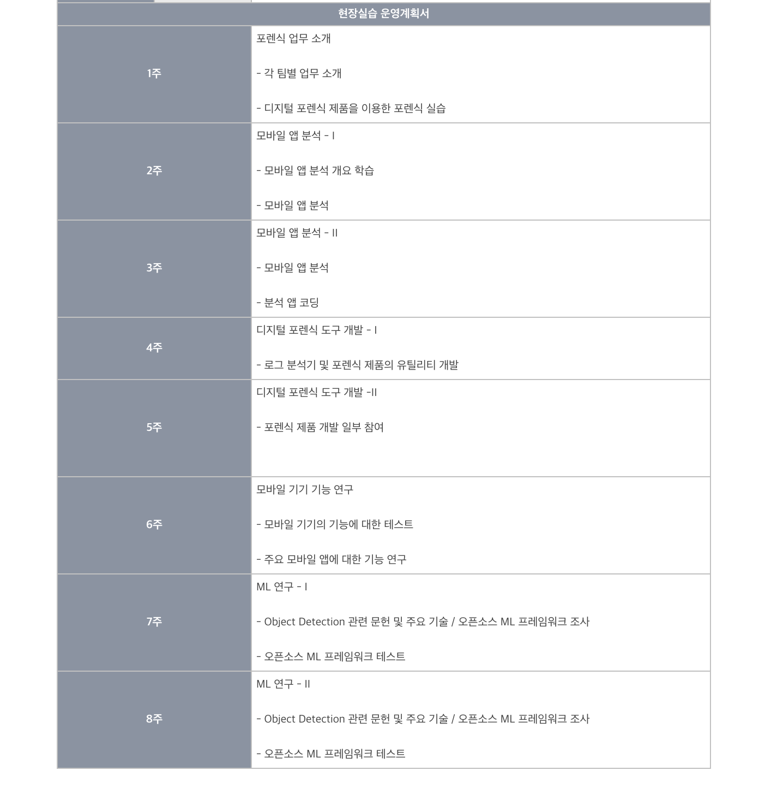
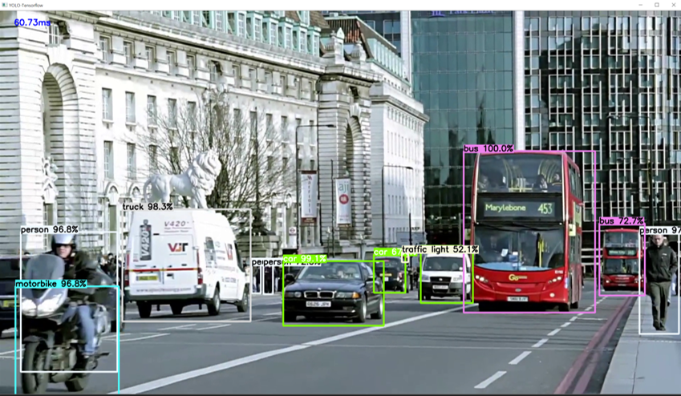
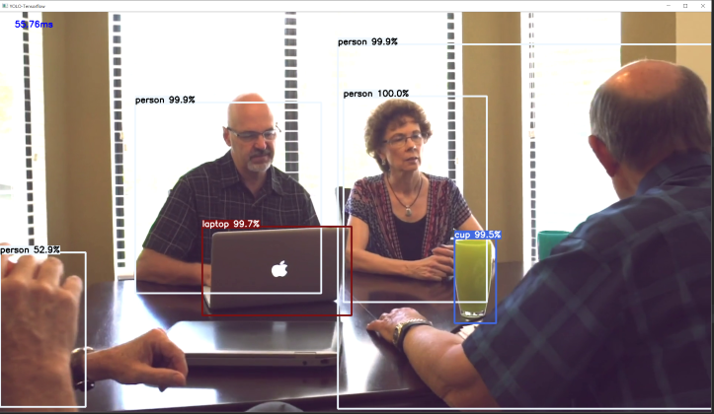
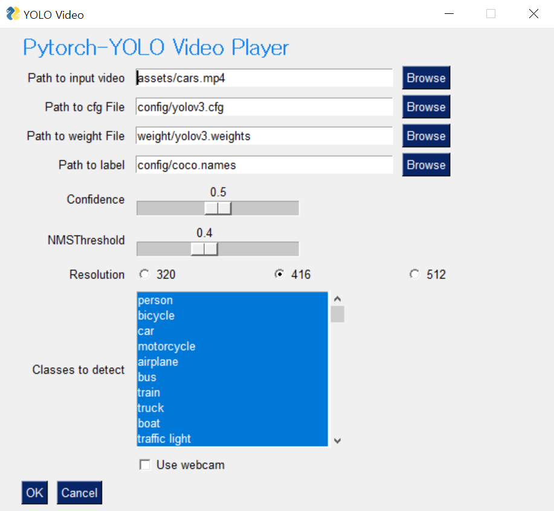
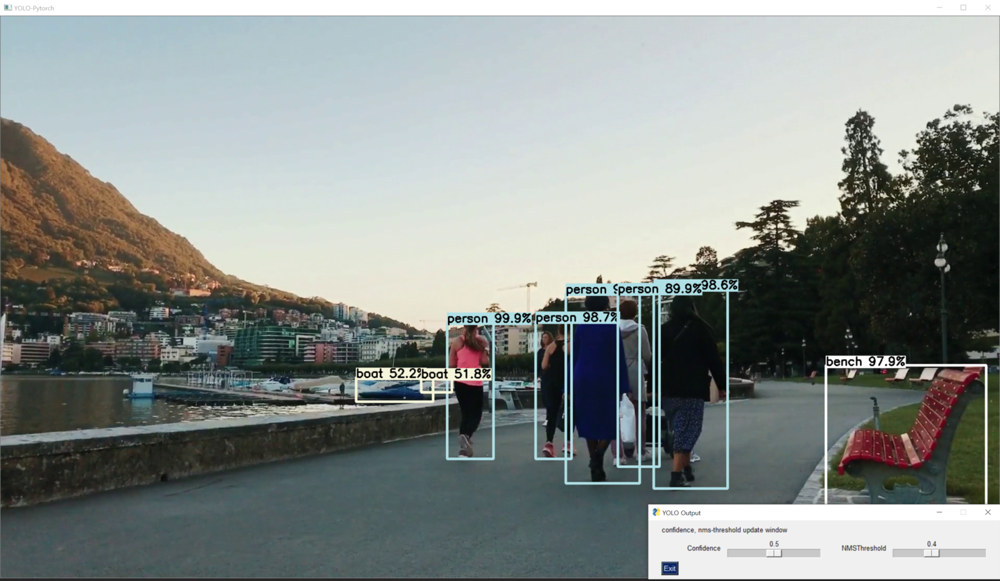

2019.06~08 한컴지엠디에서의 인턴 후기

# 인턴을 하게 된 계기
 

인턴을 지원하게 된 가장 큰 계기는 졸업을 하기 전에 인턴을 해서 실무적인 경험을 쌓고 싶었기 때문이다. 머신러닝을 배우고 개발할 수 있는 기업에서 인턴으로 일하고 싶은 생각이 있었다. 마침 대학교와 연계되어있는 한컴지엠디가 하계 인턴을 모집하고 있었고 현장실습 운영계획서를 보니 ML연구를 할 예정이라고 해서 지원을 했다. 
지원하고 나서 판교에 있는 회사에 가서 코딩 시험 및 간단한 면접을 보고 인턴으로 일을 시작했다.

# 소개
 

**[한컴지엠디](https://www.hancomgmd.com/ko/)**는 모바일 포렌식 솔루션을 개발하는 기업이다. 회사 인원은 많지 않지만 이 분야에서는 한국에서 독보적이고 해외에도 진출을 활발하게 하고 있는 강소 기업이다.  

# 내가 개발한 프로그램
 

회사에 가서 인턴이 나에게 주어진 일은 **머신러닝을 사용해서 object detection을 하는 프로그램**을 개발하는 것이었다. 네트워크를 training하고 parameter를 조절해서 object detection을 하는 프로그램 개발을 요구한 것은 아니었고, 다양한 pre-trained 된 모델을 가지고 다양한 프레임워크를 사용해서 각 모델과 프레임워크의 장단점 및 성능 비교를 원헀던 것이다.

회사가 앞으로 이 분야로 product를 개발하려는 것으로 보였고, 제대로 개발을 시작하기 전에 어떤 네트워크 구조와 어떤 프레임워크가 적합할지에 대한 비교가 필요했던 것으로 보였다. 

내가 한 일을 자세하게 말하면 다음과 같다:

&nbsp; 1. pre-trained된 모델 선택하기(Faster RCNN, Mask RCNN, SSD, YOLOv3...)  
&nbsp; 2. pre-trained된 모델로 object detection할 프레임워크 선택하기(Opencv DNN, Pytorch, Tensorflow) 
&nbsp; 3. object detection진행하기 

(+추가) 성능을 높이기 위해 multithreading을 사용하기

개발한 프로그램을 document화해서 [Github repo](https://github.com/dojinkimm/Object_Detection_Video_DNN_Tensorflow_Pytorch)에 올려놨다. 

### 작업환경

- GPU(NVIDIA GeForce GTX 1080) 2대를 사용했고,
- Python 3.6,
- Tensorflow 1.4.0, Pytorch 1.0을 사용했다

### Pre-Trained model 어떻게 얻었는가?

일단 가장 많은 pre-trained model을 얻을 수 있었던 것은 [tensorflow github](https://github.com/tensorflow/models/blob/master/research/object_detection/g3doc/detection_model_zoo.md) 통해서이다. Tensorflow에서 이 모델들을 바로 사용할 수 있지만 다른 프레임워크(opencv, pytorch)에서 사용하려면 모델을 convert하는 작업을 했다.

그 다음으로 가장 많이 object detection에 사용되는 YOLOv3는 [Darknet homepage](https://pjreddie.com/darknet/yolo/) 에서 다운로드를 받았고 이 역시 각 프레임워크에서 사용할 수 있게 convert를 해줬다.

### Object Detection 결과 및 성능은?

위 그림들이 Object Detection을 한 결과이다.

일단 가장 detection횟수가 많았던 네트워크 구조는 FasterRCNN이었다. 다만, 너무 detection을 많이해서 가끔 오버해서 이상한 물체까지 잡는 현상이 생겼다. YOLOv3는 가장 빨랐지만 정확도는 다소 떨어졌다. 
 

|            | FasterRCNN | YOLOv3   |
|------------|------------|----------|
| Opencv DNN | 2FPS       | 6FPS     |
| Tensorflow | 5~6FPS     | 15~16FPS |
| Pytorch    | 5~6FPS     | 14~15FPS |

 

Opencv DNN이 가장 느린 이유는 Nvidia GPU를 사용하지 못했기 때문이다. Opencv가 Intel에서 만들었기 때문에 Intel GPU는 호환이 되는데 다른 GPU들은 호환이 되지 않는다. 그래서 이후에는 Opencv로는 성능실험을 하지 않았다.

Tensorflow가 Pytorch보다 YOLOv3에서는 속도가 약간 빨랐다. 하지만, 나중에 확인해보니 두 프로그램 모두 하나의 GPU에서만 작동이 되고 있었다. 어떻게 하면 inference를 멀티 GPU에서 할 수 있는지 찾았지만 제대로 된 답변을 찾지 못했다. 

### 어떻게 하면 성능을 높힐 수 있을까? 고민 또 고민....

GPU 2대를 full로 활용해서 object detection을 하면 프로그램의 속도를 늘릴 수 있을 것이라고 생각했다. 그래서 수동으로 multithreading을 사용해서 GPU에 비디오 프레임을 할당하는 프로그램을 개발했다. [Multithreading GPU](https://github.com/dojinkimm/ObjectDetection_MultiThreading_Tensorflow) 에 가면 Tensorflow로 multithrading을 사용해서 수동으로 GPU를 할당한 프로그램을 볼 수 있다. GPU 2대에 할당했다고 해서 속도가 2배로 빨라지지는 않았지만 전체 시간은 줄어들어서 유의미한 결과가 나왔다.

### 심심한데 GUI

인턴 3일정도가 남았고 새롭게 모델을 찾고 성능을 높히는 방법을 찾기에는 시간이 촉박해서 GUI를 python으로 구현을 했다. 지금까지는 terminal에 명령어에 argument들을 적어서 프로그램을 작동시켰는데, 조금 더 시각화하기 위해 gui 프로그램을 만들었다. PySimpleGUI를 이용해서 지금까지 개발했던 프로그램들이 똑같이 작동될 수 있게 구현을 했다.

# 소감
 

2달간 인턴을 통해서 회사에서 원하는 인재가 되어보기 위해 고민을 많이 했다. 프로그램 개발 일이 주어졌을 때, 어떻게 하면 이 프로그램의 성능을 향상 시킬 수 있을지 계속 고민을 하고 리서치도 많이 했다. 회사에 다들 바쁘다보니 내가 개발하던 것을 자세히 봐주고 디렉션을 제대로 주지는 못해서 조금 해맸지만, 혼자서 트러블슈팅을 하고 스스로 고민을 하다보니 새롭게 배운 것들이 많았다. 

이론을 공부하는 것도 중요하지만 실제로 개발을 하며 에로사항을 해결해가다 보니 더 기억에 남는 공부를 할 수 있었다. 어떤 전공이던간에 실제 프로덕트를 만드는 회사에서 인턴을 하는 것은 좋은 경험이라고 생각한다 (물론 나에게 좋은 일을 주는 회사를 찾는 것이 중요하다). 

### 결과물

[ObjectDetection_MultiThreading_Tensorflow](https://github.com/dojinkimm/ObjectDetection_MultiThreading_Tensorflow)  
[Object_Detection_Video_DNN_Tensorflow_Pytorch](https://github.com/dojinkimm/Object_Detection_Video_DNN_Tensorflow_Pytorch)  
[Pytorch_YOLO_GUI](https://github.com/dojinkimm/Pytorch_YOLO_GUI)  