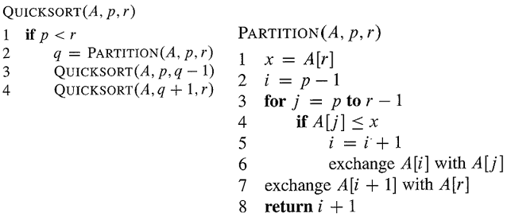

<div align="center">

</div>

Quick sort는 `Divide and Conquer(분할 정복)` 알고리즘 종류중 하나이다. 분할정복이란 주어진 문제를 여러 sub 문제들로 나눈 다음에 그 문제들을 해결한 다음에 합치는 것을 의미한다. 

### Pseudo-code 설명
Quicksort는 임의의 숫자를 기준으로 정한 다음에 그 숫자보다 작은 숫자들과 큰 숫자들에 다시 재귀를 사용해서 quick sort 알고리즘을 적용한다. 그러면 다시 그 분할된 숫자들 중에서 기준을 정하고 나눠서 quick sort를 진행한다. 조금 더 자세히 설명하면, 임의의 숫자를 고르고 나서 해당 숫자보다 작은 숫자들을 왼쪽에 위치시키고, 해당 숫자보다 큰 숫자들을 오른쪽에 위치시킨다. 그러고 나서 정해진 임의의 숫자를 그 중간에 위치시키는 것이다.

`Partition` 부분을 자세히 살펴보기 전에 각 인자들이 무엇을 의미하는지 보려고 한다. `A`는 주어진 list이다. `p`는 주어진 list의 lower part로 list의 시작 부분을 의미하고, `r`은 주어진 list의 higher part로 list의 끝 부분을 의미한다.

1. pivot을 정한다
2. i는 list의 시작 index보다 하나 작게 둔다. i는 pivot인 A[r]보다 작은 숫자들의 list 중 가장 높은 index를 의미한다.
3. j는 주어진 list의 시작 부분인 p부터 시작해서 r-1까지 반복한다.
    1. item이 pivot보다 작으면 i+=1을 해준다. pivot보다 작은 수들의 index 범위를 늘리는 작업이다.
    2. 그러고 나서 서로 swap을 해준다.
4. 마지막에 pivot을 pivot보다 작은 수 그리고 큰 수들로 나뉜 구간 중간에 위치시킨다.
5. i+1, 즉, pivot의 위치 index를 리턴한다.

Quick sort는 추가적으로 메모리를 사용하지 않고 할당된 list의 메모리만 사용하기 때문에 `inplace` 알고리즘으로 불린다. 물론, 구현 방법에 따라서 non-inplace 알고리즘으로도 작성될 수 있다.

Quick sort 알고리즘의 평균 시간 복잡도는 `O(nlgn)`이다. Worse case는 pivot으로 항상 list의 가장 작은 값 혹은 가장 큰 값으로 정했을 때 발생하고 그 때의 시간 복잡도는 `O(n^2)`가 된다. 하지만, 보통 pivot을 정할 때 랜덤으로 정하기 때문에 평균적으로는 시간복잡도가 `O(nlgn)`이 된다. 

<div align="center">

</div>

<div align="center">

source: <a href="https://www.studytonight.com/data-structures/quick-sort">studytonight-quick-sort</a>

</div>

이제 그림을 보면서 quick sort가 sorting을 하는 과정을 살펴보자. 해당 그림은 Iteration마다 바뀌는 과정을 보여주는 것이 아니라 한번 divide되고 conquer되는 과정을 보여준다. 그림 내 6개의 작은 그림들이 있는데 각각 step1~6으로 표현을 하려고 한다.

- step1에서는, pivot은 list[r]인 6이 선택되었다.

- step2에서는, 6은 3번째 index에 위치하게 되었고, 해당 index를 기준으로 왼쪽 index들의 값들은 6보다 작고, 오른쪽은 6보다 크다. 6이 자기 자리를 찾았기 때문에 정렬되었다고 간주를 한다. 그러고 나서 새로운 pivot들을 선택하게 되고, 숫자 6을 기준으로 왼쪽 list인 [2,3,5]와 오른쪽 list인 [7,9,10,11,14,12]에서 각각 새로운 pivot들이 정해졌다.

- step3에서는, 3과 11을 정렬된 자리에 이동을 시켰다. 그러고 나서 3의 좌우 list에서 각각 pivot(2,5)을 고르고, 11의 좌우 list에서 각각 pivot(10,12)을 선택했다.

- ste4에서는, 2와 5는 각각 자신들이 p이자 r이기 때문에 정렬된 상태로 간주되었다. 10을 기준으로 왼쪽에 자신보다 큰 숫자들이 없으니 그대로 위치 이동을 안하고 12는 한칸 이동을 했다. 그러고 나서 다시 pivot(9,14)를 선택했다.

- step5에서는, 9와 14를 더 움직일 곳이 없었기 때문에 정렬된 상태로 간주했다. 그러고 마지막 pivot으로 선택되지 않았던, 7을 선택한다.

- step6에서는, 7이 p이자 r이기 때문에 정렬된 상태로 간주하게 된다. 이렇게 되면, 전체 list가 정렬이 된다.

위에서 QuickSort 알고리즘을 호출할 때 필요한 인자들의 의미는 설명했고, 이제 초기에 어떤 값을 넣어야 하는지 설명하려고 한다. `A`자리에는 정렬해야할 list를 넘기고, `p`의 자리에는 list의 시작 index, `r`자리에는 list의 가장 마지막 index를 전달하면 된다.

### Python Code


```python
import random

class QuickSort:
    def __init__(self, num):
        self.num = num

    def quick_sort(self, p, r):
        # p는 list시작, r은 끝, q는 중간인 pivot
        if p<r:
            q = self.partition(p,r)
            self.quick_sort(p,q-1) # pivot의 왼쪽을 다시 분할한다
            self.quick_sort(q+1,r) # pivot의 오른쪽을 다시 분할한다
        

    def partition(self, p, r):
        x = self.num[r] # pivot 값 저장
        i = p - 1
        for j in range(p, r): 
            if self.num[j] <= x: # pivot보다 작으면 해당 값을 pivot index보다 왼쪽으로 이동시킨다
                i += 1
                self.num[i], self.num[j] = self.num[j] ,self.num[i] 
        self.num[i+1], self.num[r] = self.num[r], self.num[i+1] # pivot을 전체 list에 정렬된 위치에 놓는다
        return i+1  # pivot의 위치를 리턴한다


number = [i for i in range(10)]
random.shuffle(number)
print(number)
quick = QuickSort(number)
quick.quick_sort(0, len(number)-1) # list의 첫 index와 가장 마지막 index를 전달한다
print(quick.num)
```

