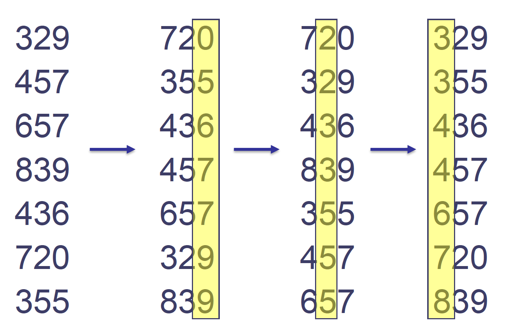

Radix sort(기수정렬)의 기본 아이디어는 각각 자리수끼리 비교해서 정렬을 하는 것이다. 자릿수를 비교할 때는 `counting sort`를 사용 한다. Radix sort에 대해 찾아보면 LSD와 MSD가 있다는 것을 알 수 있다. LSD는 가장 낮은 자릿수부터 비교하면서 정렬을 하는 것이고, MSD는 가장 높은 자릿수부터 비교하면서 정렬을 하는 것이다. 자릿수가 고정되어있기 때문에 `stable`한 알고리즘이다.

Radix Sort는 `O(kn)`의 시간복잡도를 가지고 있는 정렬 알고리즘이다 (k는 가장 큰 데이터의 자릿수이다). 이 알고리즘이 작동하려면 몇가지의 조건들이 필요하다:

1. 숫자이어야 한다 (ex. ["banana", "apple"] 와 같은 리스트는 정렬 불가)
2. 부동소숫점이 없는 정수여야 한다 (ex. [12.332, 29.112] 와 같은 리스트는 정렬 불가)

위의 조건들을 만족하지 않으면 Radix sort는 사용할 수 없다. 그리고 `k`의 크기가 클 수록 알고리즘의 속도도 늘어나기 때문에 `k`가 작은 상황일수록 더 빠르게 정렬을 할 수 있다. 

<div align="center">

</div>

그림을 보면 이해를 더 쉽게 할 수 있다. LSD를 사용해서 정렬을 진행한 그림이다.

1. 처음에, 가장 낮은 1의 자리수들을 비교해서 정렬을 했다. 이 때 이 숫자들을 정렬할 때 `counting sort`를 사용한다. 그 결과 720이 355보다 큼에도 0이 5보다 작기 때문에 720이 리스트 앞에 오게 된 것이다. 
2. 그 다음에는 10의 자리수들을 비교해서 정렬을 했다. 457과 657을 보면 10의 자리수가 커서 뒤로 밀려나긴 했지만 서로의 순서가 바뀌지 않았음을 볼 수 있다. 이는 radix sort가 `stable`한 알고리즘이기 때문에 이렇게 되는 것이다.
3. 마지막으로 100의 자리수들을 비교해서 정렬을 했다.


## Python Code

```python
class RadixSort:
    def __init__(self, num):
        self.num = num

    def radix_sort(self):
        # 최대 digit을 알아보기 위해 가장 큰 수를 찾는다
        max1 = max(self.num) 
    
        exp = 1
        while max1/exp > 0: 
            self.count_sort(self.num,exp) 
            exp *= 10


    def count_sort(self, A, k):
        B = [0] * len(A)
        C = [0] * (10) # 1의 자리, 10의 자리수만 비교하기 때문에 범위는 0~9이다

        for i in range(0, len(A)): # 각 element가 몇개있는지 C에 저장한다
            index = (A[i]//k) 
            C[ (index)%10 ] += 1
        
        for i in range(1,10): # C를 누적값으로 바꾼다, 0~9까지 밖에 없다
            C[i] += C[i-1]

        i = len(A)-1
        while i>=0:  # C 를 indexing해서 정렬된 리스트를 찾는다
            index = (A[i]//k) 
            B[ C[ (index)%10 ] - 1] = A[i] 
            C[ (index)%10 ] -= 1
            i -= 1

        # 기존 리스트에 복사를 한다
        for i in range(len(A)): 
            A[i] = B[i]

number = [ 170, 45, 75, 90, 802, 24, 2, 66] 
print(number)
radix = RadixSort(number)
radix.radix_sort() 
print(radix.num)
```
