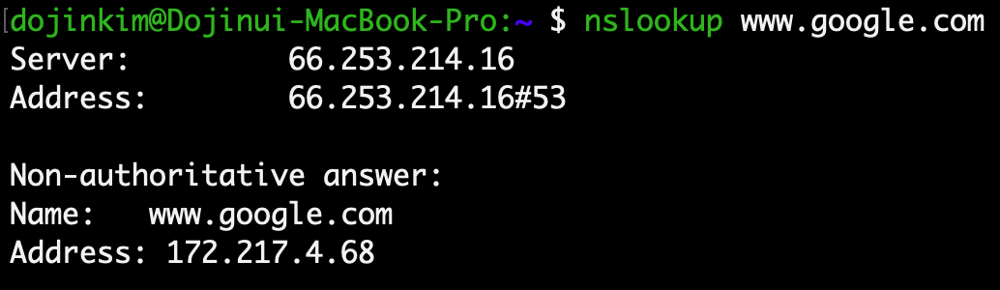
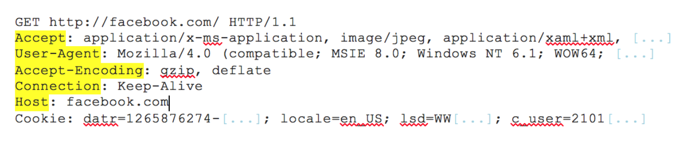
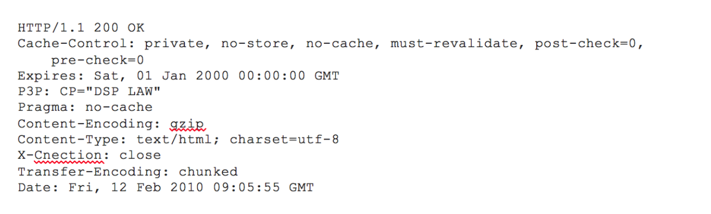

#### [What happens when you type an URL in the browser and press enter?](https://medium.com/@maneesha.wijesinghe1/what-happens-when-you-type-an-url-in-the-browser-and-press-enter-bb0aa2449c1a) - 본문

개발자라면 인터넷이 어떻게 작동을 하고 정보들이 어떻게 주고 받아지는지 기본적으로 이해하는 것이 필요하다고 생각해서 공부할 겸 미디움 블로그를 번역했다. 

** 내용 조금 수정 및 추가한 부분 있음

검색할 것이 있어서 `www.google.com`에 접속을 하려고 할 때 웹페이지가 어떻게 불러와지는지 순서대로 설명을 하려고 한다. 

## 1. www.google.com을 브라우저 주소창에 친다

## 2. Browser는 캐싱된 DNS 기록들을 통해 www.google.com에 대응되는 IP 주소가 있는지 확인한다

DNS(Doman Name System)은 URL들의 이름과 IP주소를 저장하고 있는 데이터베이스이다. 인터넷에 있는 모든 URL들에는 고유의 IP 주소가 지정되어있다. 이 IP 주소를 통해서 해당 웹사이트를 호스팅하고 있는 서버 컴퓨터에 접근을 할 수 있다. 예를 들어, [www.google.com](http://www.google.com)의 IP 주소를 알아보기 위해서는 `nslookup www.google.com`을 터미널에 작성하면 해당 사이트의 IP 주소를 알려준다. 현재 내가 있는 지역에서 해당 명령어를 작성했을 때 172.217.4.68이 나왔고 IP 주소를 브라우저에 검색했을 때 www.google.com의 결과와 같았다. 구글을 사용하는 사용자가 매우 많기 때문에 구글의 서버 IP 주소는 여러개가 있고([구글의 IP 주소](https://www.lifewire.com/what-is-the-ip-address-of-google-818153)들) , nslookup으로는 그 중 내가 접근이 가능한 IP 주소를 보여준다. 이처럼 DNS는 전화번호부와 비슷한 역할을 한다, 웹사이트의 이름들과 웹사이트를 접근하기 위해 필요한 IP주소를 저장하고 있다. 

(여기서 non-authoritative answer이란, name 서버가 도메인에서 만든 원본 소스 파일을 갖고 있지 않다는 뜻이다. 이 서버에는 다른 DNS들에서 얻어진 도메인인의 파일을 캐싱 형태로 갖고 있는 것이다. )

**DNS의 가장 큰 목적은 사람들에게 편리함을 주기 위해서이다.** 숫자로 된 IP 주소를 작성해도 원하는 웹사이트에 접속할 수 있지만, 매번 랜덤해보이는 숫자들을 검색하는 것은 매우 복잡한 일이다. 사람은 네이버, 다음, 구글처럼 이름을 외우는 것에 더 친숙하기 때문이다. DNS는 이처럼 사람들이 웹사이트 주소에 쉽게 접속할 수 있게 매핑을 해주는 역할을 한다.

웹사이트 이름을 브라우저에 검색하면 브라우저는 DNS 기록을 4가지의 캐시에서 확인을 한다

1. 가장 먼저 브라우저 캐시를 확인한다. 브라우저는 일정기간 동안(유저가 이전에 설정한)의 DNS 기록들을 저장하고 있다. DNS query가 이 곳에서 가장 먼저 실행이 된다. 
2. 그 다음에 브라우저는 OS 캐시를 확인한다. 브라우저 캐시에 웹사이트 이름의 IP 주소가 발견되지 않았다면, 브라우저는 systemcall을 통해서 OS가 저장하고 있는 DNS 기록들의 캐시에 접근한다
3. 그 다음에는 router 캐시를 확인한다. 컴퓨터에 DNS 기록을 찾지 못하면 브라우저는 DNS 기록을 캐싱하고 있는 router와 통신을 해서 찾으려고 한다.
4. 그래도 못 찾는다면 마지막으로, ISP 캐시를 확인한다. ISP는 DNS 서버를 구축하고 있고 브라우저가 마지막으로 DNS 기록이 있기를 바라며 접근하게 된다. 

왜 이렇게 많은 곳에서 캐시들을 저장하는지 궁금할 것이다. 개인정보를 생각했을 때 정보가 여기저기에 캐싱된게 조금 불편할 수 있겠지만, 캐시는 네트워크 트래픽을 조절하고 데이터 전송 시간을 줄이기 위해 매우 중요하다. 

## 3. 요청한 URL이 캐시에 없으면, ISP의 DNS 서버가 www.google.com을 호스팅하고 있는 서버의 IP 주소를 찾기 위해 DNS query를 날린다

위에서 언급했던 것 처럼 www.google.com에 접속하고 싶으면 IP 주소를 반드시 알아야 한다. DNS query의 목적은 여러 다른 DNS 서버들을 검색해서 해당 사이트의 IP 주소를 찾는 것이다. 이러한 검색을 `recursive search`라고 부른다. IP 주소를 찾을 때 까지 DNS 서버에서 다른 DNS 서버를 오가면서 반복적으로 검색하던지 못 찾아서 에러가 발생할 때 까지 검색을 진행한다. 

이 상황에서, ISP의 DNS 서버를 DNS recursor라고 부르고 인터넷을 통해 다른 DNS 서버들에게 물어 물어 도메인 이름의 올바른 IP 주소를 찾는데 책임을 갖고 있다. 다른 DNS 서버들은 name server라고 불린다. 이들은 웹사이트 도메인 이름의 구조에 기반해서 검색을 하기때문이다. 

도메인 이름 구조에 기반해서 검색한다고 하면 이해하기 어려워보이지만 원리는 매우 간단하다.  일단 도메인 이름들의 구조를 보면 다음과 같다 

우리가 마주하는 웹사이트 URL들은 third-level domain, second-level domain, top-level domain을 가지고 있다. 각 레벨별로 자신들만의 name 서버가 있고 여기서 DNS look up 프로세스 중에 쿼리가 진행된다. 

www.[google.com](http://google.com)에 대해서, 처음에 DNS recursor가 root name server에 연락을 한다. root name 서버는 `.com` 도메인 name server로 리다이렉트한다. `.com` name server는 `google.com` name server로 라디아렉트한다. `google.com` name server는 DNS 기록에서 www.google.com에 매칭되는 IP 주소를 찾고 DNS recursor로 보내게 된다.

이 모든 요청들은 작은 데이터 패킷들을 통해서 보내진다. 패킷 안에는 보내는 요청의 내용과 DNS recursor의 IP 주소가 포함되어 있다. 이 패킷들은 원하는 DNS 기록을 가진 DNS 서버에 도달할 때 까지 클라이언트와 서버를 여러번 오간다. 패킷들이 움직이는 것도 routing table에 기반한다. Routing table을 통해서 어떤 길로 가야 가장 빠른지 확인할 수 있다. 만약 패킷이 도중에 loss되면 request fail error가 발생하게 된다. 

## 4. Browser가 서버와 TCP connection을 한다

브라우저가 올바른 IP 주소를 받게 되면 서버와 connection을 빌드하게 된다. 브라우저는 인터넷 프로토콜을 사용해서 서버와 연결이 된다. 인터넷 프로토콜의 종류는 여러가지가 있지만, 웹사이트의 **HTTP 요청의 경우에는 일반적으로 TCP를 사용한다.** 

클라이언트와 서버간 데이터 패킷들이 오가려면 TCP connection이 되어야 한다. **TCP/IP three-way handshake**라는 프로세스를 통해서 클라이언트와 서버간 connection이 이뤄지게 된다. 단어 그대로 클라이언트와 서버가 SYN과 ACK메세지들을 가지고 3번의 프로세스를 거친 후에 연결이 된다. 

1. 클라이언트 머신이 SYN 패킷을 서버에 보내고 connection을 열어달라고 물어본다
2. 서버가 새로운 connection을 시작할 수 있는 포트가 있다면 SYN/ACK 패킷으로 대답을 한다
3. 클라이언트는 SYN/ACK 패킷을 서버로부터 받으면 서버에게 ACK 패킷을 보낸다

이 과정이 끝나면 TCP connection이 완성되는 것이다. 

## 5. Browser가 웹 서버에 HTTP 요청을 한다.

TCP로 연결이 되었다면, 데이터를 전송하면 된다. 

클라이언트의 브라우저는 GET 요청을 통해 서버에게 www[.google.com](http://maps.google.com) 웹페이지를 요구한다. 요청을 할 때 비밀 자료들을 포함하던지, form을 제출하는 상황에서는 POST 요청을 사용할 수도 있다. 이 요청을 할 때 다른 부가적인 정보들도 함께 전달이 된다:

- browser identification(User-Agent 헤더)
- 받아들일 요청의 종류(Accept 헤더)
- 추갖거인 요청을 위해 TCP connection을 유지를 요청하는 connection 헤더
- 브라우저에서 얻은 쿠키 정보
- 기타 등등

밑에는 샘플 GET 요청이다 (노란색으로 하이라이트 된 부분이 헤더이다)

(HTTP 요청의 내용을 보고 싶으면 Firebug같은 툴을 사용해서 볼 수 있다)

## 6. 서버가 요청을 처리하고 response를 생성한다

서버는 웹서버를 가지고 있다(i.e. Apache, IIS...). 이들은 브라우저로부터 요청을 받고 request handler한테 요청을 전달해서 요청을 읽고 response를 생성하게 한다. Request handler란 ASP.NET, PHP, Ruby 등으로 작성된 프로그램을 의미한다. 이 request handler는 요청과 요청의 헤더, 쿠키를 읽어서 요청이 무엇인지 파악하고 필요하다면 서버에 정보를 업데이트 한다. 그 다음에 response를 특정한 포맷으로(JSON, XML, HTML) 작성한다. 

## 7. 서버가 HTTP response를 보낸다

서버의 response에는 요청한 웹페이지, status code, compression type(Content-Encoding) - 어떻게 인코딩 되어 있는지, 어떻게 페이지를 캐싱할지(Cache-Control), 설정할 쿠키가 있다면 쿠키, 개인정보 등이 포함된다.

샘플 HTTP 서버 response는 다음과 같다

위 response의 첫줄은 status code를 나타낸다. Status code란 현재 response의 상태를 의미하고 총 5가지의 종류가 있다: 

- 1xx은 정보만 담긴 메세지라는 것을 의미한다
- 2xx response가 성공적이라는 것을 의미한다
- 3xx 클라이언트를 다른 URL로 리다이렉트함을 의미한다
- 4xx 클라이언트 측에서 에러가 발생했음을 의미한다
- 5xx 서버 측에서 에러가 발생했음읠 의미한다

## 8. Browser가 HTML content를 보여준다

브라우저는 HTML content를 단계적으로 보여준다. 처음에는 HTML의 스켈레톤(기본 틀이라고 보면 될듯하다)을 렌더링한다. 그 다음에는는 HTML tag들을 체크하고 나서 추가적으로 필요한 웹페이지 요소들을(이미지, CSS 스타일시트, Javascript 파일, 등) GET으로 요청한다. 이 정적인 파일들은 브라우저에 의해 캐싱이 되서 나중에 해당 페이지를 방문할 때 다시 서버로부터 불러와지지 않도록 한다. 그 다음에는 그토록 원했던 www.google.com의 모습이 보이게 된다.

www.google.com을 검색하고 웹페이지가 뜰 때까지 엄청 많은 일들이 일어나지만, 이 모든 일들이 1초도 되지 않아서 완료가 된다. 

지금까지 사이트 이름을 검색하고 웹페이지가 틀어질 때까지 어떤 과정들을 거치는지 알아봤다. 각 단계들을 디테일하게 보면 더 많은 일들이 일어난다.  이 글은 프로세스가 어떻게 이뤄지는지 간략하게 다뤘다.