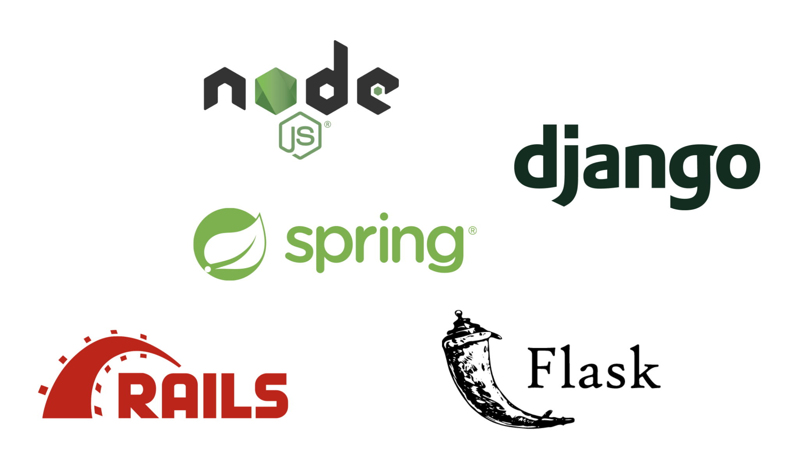
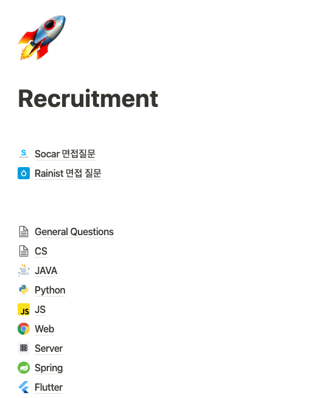
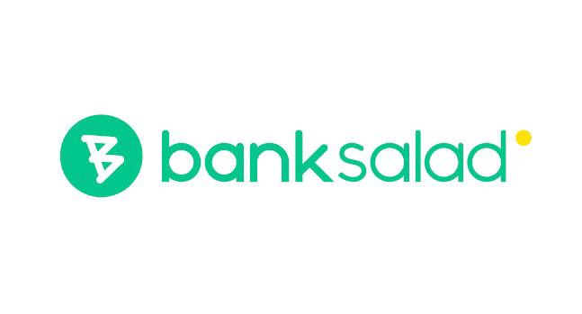

2월에 졸업을 앞두고 있었지만 2학기 때 IITP의 지원을 받아 미국 퍼듀대학교에서 연구 및 개발을 하느라 취업 준비를 하나도 못했다. 
미국에 가면 취업 준비 시즌을 놓칠 것이라는 것을 알았지만, 지금 안가면 언제 또 미국에 가보겠어....라는 마인드로 다녀왔다. 미국에 가서는 실컷 놀고 많은 것을 보고 왔기 때문에 취준을 조금 늦게 시작하는 것에 대한 후회는 전혀 없다.

(만약 취업전이고, 본인의 대학교가 소중대에 소속되어 있다면 IITP KSW 프로그램에 참여해보는 것도 좋은 것 같다)

# 어떤 기업에 지원하지?

한국에 12월 말에 돌아온 다음에, 실질적인 취업 준비는 1월부터 진행하기로 마음을 먹고 12월 남은 기간 동안은 쉬면서 나는 어떤 기업에 가고 싶고 어떤 기업에 지원을 할지 고민을 하기로 했다. 

회사 선택시 내가 세웠던 우선 순위:

&nbsp;1. 내가 성장할 수 있는가? (사수 및 개발 문화가 좋은지)  
&nbsp;2. 회사가 성장가능성이 있는가? (비전이 있는지) 
&nbsp;3. 연봉 
&nbsp;4. 출퇴근 시간 

주니어이기 때문에 내가 성장할 수 있는 사수가 있고 개발문화가 좋은 회사에 가장 가고 싶었다. 어떤 기준으로 회사를 선택할지 스스로 기준을 정한 다음에 위 사항들을 최대한 만족하는 회사들을 찾아봤다. 밑에는 취준을 하면서 기업을 찾기 위해 이용했던 구인구직 사이트들이다. 

[원티드](https://www.wanted.co.kr/)

[로켓펀치](https://www.rocketpunch.com/)

[자소설닷컴](https://jasoseol.com/recruit)

위 조건들에 나름 부합하다고 생각되는 기업들을 다 스크랩해서 정리를 해뒀다. 기업에 지원 할 때, 실제로 그 기업에서 사용하는 기술 스택을 미리 경험해보면 서류나 면접에 있어서 도움이 많이 될 것 같아서 기업들의 기술 스택도 유심히 봤다. 참고로 서버개발자로 지원을 할 예정이었기 때문에 서버개발자를 뽑는 회사들의 기술 스택을 살펴봤다. 12월동안은 기업들을 조사하고 주변에도 물어보면서 내가 일해보고 싶은 회사들을 검색했다.

# 무엇을 어떻게 준비하지? 
 

취업 준비를 하기 위해 내가 하기로 계획한 것은 3가지였다.

&nbsp;1. 알고리즘 공부  
&nbsp;2. 개인 프로젝트 
&nbsp;3. 면접 준비 

요즘 대부분 IT 기업들은 코딩 테스트를 1차로 해서 지원자들을 거르기 때문에 알고리즘 공부는 무조건 해야겠다는 생각을 했다. 알고리즘은 프로그래머스, 백준, Leetcode를 사용하기로 했다. `종만북`이라고 불리는 알고리즘 문제해결 전략 책도 구입해서 한 번 빡세게 알고리즘 준비를 해야겠다는 다짐을 했다.

서버 개발자로 지원을 하려고 마음은 먹었지만 사실 지금까지 서버에 관련된 프로젝트를 진행해본 적이 한번도 없었다... 서버 개발자로 지원했는데 서버 개발 능력이 없으면 안되기 때문에 프로젝트를 하나 진행하기로 했다. 하나의 상용서비스를 클론 프로젝트를 진행하면서 서버 개발 경험을 쌓아야 겠다는 생각을 했고, 사람들이 알법한 서비스를 찾다보니 `Airbnb`를 클론하기로 마음을 먹었다. Front 없이는 Sever 개발을 진행할 수 없기 때문에 일단 Front는 React를 사용하기로 했다. Server는 개발 프레임워크나 언어가 많기 때문에 각 언어와 프레임워크들이 어떤 회사에서 사용되는지 조금 살펴봤다.

Spring-Java - 역시 가장 많이 사용되는 언어 및 프레임워크였다. 특히, 대기업, 금융권, Naver, Kakao, 우아한 형제들 등등. 

Ruby-RoR - 어느정도 인지도를 갖춘 회사들이 이 스택을 사용하는 것으로 보였다. 당근마켓 등등

Python-Flask or Django - 많은 스타트업들

Nodejs - Express - 많은 스타트업들

더 다양한 언어들과 프레임워크들이 있지만 이 4개 중에서 하나를 파려고 마음을 먹었다. 고민을 하다가 그냥 어차피 Front도 내가 개발을 해야했기 때문에 이왕이면 더 빠르게 배우기 위해 Nodejs-Express 조합을 선택했다. 그리고 요새는 Typescript에 대한 수요도 많고 있고 그 장점이 많아서 앞으로도 많이 사용될 것 같았다. 그래서 Front는 Typescript React, Server는 Typescript Express를 적용해서 개발을 진행해보기로 했다. 나중에 단순 클라이언트 서버 개발이 어느정도 완료되면, 테스팅도 진행하고 CI/CD툴들을 사용해서 자동 배포까지 완료하는 것이 목표였다.

(허나, 갑작스럽게 면접 준비를 진행해버리는 바람에, 내가 계획 했던 목표의 30%밖에 완료하지 못했다)

[Airbnb Clone Front End](https://github.com/dojinkimm/Airbnb_Clone_FE)

[Airbnb Clone Server](https://github.com/dojinkimm/Airbnb_Clone_API_Server)

마지막으로, 면접 준비는 붙고 보자라는 생각에 나중으로 미뤘다. (그래도 일단 책은 샀다, 코딩 인터뷰 완전 분석이라는 책이고 유명하다)

 

# 스타트업 지원
 

사실 1~2월은 알고리즘, 개인 프로젝트를 빡세게 진행하고 3월쯤 되서야 하나씩 지원을 하려고 했다. 하지만, 인생은 타이밍이다. 어찌어찌 하다보니 기회가 생겨서 쏘카와 레이니스트에 지원하게 되었다.

## 쏘카

서버개발자로 지원을 했고 채용 프로세스는 다음과 같았다.

`코딩테스트 => 1차 실무 면접 => 2차 임원 면접`

코딩 테스트는 프로그래머스 사이트에서 진행됬고 2시간 3문제였다. 카카오 문제보다는 쉬웠고 네이버 공채(떨어짐) 문제를 봤을 때와 난이도는 비슷했다. 결과는 3일뒤에 알려줬고 합격이었다.

1차 기술 면접은 실무진 3명과 나 혼자 3:1으로 1시간 10분정도 진행되었다. 간단한 자기소개 및 지원동기 등등을 먼저 물어봤다. 취업준비하는 개발자들이 생각보다 자기소개나 지원동기와 같은 기본적인 질문들에 대한 답변을 많이 준비하지 않는 것 같은데, 이러한 질문들에 대한 답변을 준비하는 것은 필수인 것 같다. 적어도 내가 이 회사에 들어오기 위해 이 정도 노력을 했다라는 것을 보여줄 수 있기 때문이다. 기본적인 질문들에 대한 답변을 한 후에는 본격적으로 기술 면접에 들어갔다.

기술 면접에서는 자료 구조, 알고리즘 설명, 상황을 주고 어떻게 해결할 것인지, 라이브 코딩 테스트 순서로 진행이 되었다. 알고리즘 같은 경우는 시간 복잡도와 왜 그런 시간 복잡도를 갖게되는지 질문을 했다. 그리고 상황에 관련된 문제는 음..... 면접관님이 특정 케이스를 주고 이 때 어떤 알고리즘으로 이 문제를 해결할 수 있는지 질문을 했다. 이런 스타일의 문제는 처음 접해봐서 좀 버벅였지만 다행히도 면접관님이 힌트를 조금 주셔서 어느정도 얘기할 수 있었다. 

1차 기술 면접은 다행히 합격해서 2차 임원 면접으로 넘어갔다. 2차 임원면접에서도 간단한 자기소개 및 프로젝트 관련해서 얘기를 나눴다. 어떤 기술을 사용했고, 왜 사용했고와 같은 질문들을 주셨고 대답을 했다. 그 뒤에는 코딩 테스트때 봤던 코드에 대해 리뷰하는 시간을 갖었다. 리뷰하면서 느낀 것이 코딩 테스트를 볼 때도 좋은 코드 스타일을 유지하는 것이 중요하다는 생각을 하게 되었다. 면접관이 봤을 때 변수명이 이상하고 주석도 없으면 한 눈에 어떤 로직으로 구현했는지 알기 쉽지 않기 때문이다. 가독성 있는 코드를 면접관님은 더 선호할 것이라고 생각한다. 내가 주석을 잘 달고 변수명도 교과서처럼 작성한 코드에 대해서는 별다른 질문을 하지 않으셨지만, 변수명이 애매한 부분들은 지적을 당했다. 

코딩 테스트에 대한 리뷰 이후에는 인성 관련된 질문들을 받았다. 그러한 질문들에 대비해서 미리 준비했기 때문에 스무스하게 대답했다. 

그렇게 쏘카에서 모든 프로세스가 끝났고 기다렸다. 그러고 2차 면접본지 5일만에 `합격`이라는 전화를 받았다.

## 레이니스트 (뱅크샐러드)

레이니스트는 이력서 서류 제출을 하고 서류 패스를 했다. 패스를 하고 나니 면접을 보는 날 전까지 작성해야 할 질문들 리스트를 받았다. 질문들의 양이 꽤 많았고 한 사람의 가치관에 대한 질문들이 많았었다. 비록 양이 많았지만 질문들이 워낙 나의 근본적인 태도 및 비전에 대해 물어봤기 때문에, 언젠가는 내 인생에서 해야할 고민들이라는 생각을 가지게 되었다. 그래서 제출기간이 짧았지만 밤을 새서 진지하게 고민을 하며 질문들에 답변을 달았다. 

면접은 약 4~5시간 정도 진행이 되었다. 기술 면접과 회사에서 컬쳐면접이라고 부르는 인성 면접을 순서대로 진행했다. 면접 날짜를 잡기 전에 '면접 시간이 긴 만큼 점심시간을 따로 제공해줄까요?' 라는 질문을 받았었다. 나는 그냥 빨리 끝내버리고 가고 싶은 마음이 컸기 때문에 점심시간을 건너뛰고 스트레이트로 하겠다고 했다.

처음에는 쏘카에서와 같이 간단한 자기소개 및 지원동기, 프로젝트 관련 질문들을 받았다. 하지만 그 이후에 진행된 레이니스트의 기술 면접은 쏘카와는 또 다른 느낌이었다. 나는 인터넷에 서버 개발자 면접 질문 같은 키워드를 입력해서 나온 질문들과 답들을 공부했었다. 예를 들면, OOP의 특징, Python의 gc가 어떻게 작동하는지 등등.... 그러나, 레이니스트의 기술 면접은 전혀 답이 있는 질문들이 아니었다. 아키텍처와 관련된 질문을 받았다. 경험이 없는 주니어이기에 당황스러운 문제였지만 내가 지금까지 배워온 지식들을 토대로 대답을 했다. 답이 없는 질문이었기 때문에 아마 내가 어떻게 문제에 접근하고 어느정도 까지 생각을 할 수 있는지 테스트하려고 했던 것 같다. 

아키텍쳐링 이후에는 코딩 테스트를 화이트보드에 직접 작성을 하면서 진행했다. 문제의 난이도는 많이 높지는 않았지만, 내가 실수한 부분들이 있어서 좋은 코드를 작성하지 못해서 조금 아쉬웠다. 

기술 면접 이후에는 개발자들이 아닌 다른 부서 사람들과 이전에 작성했던 질문들을 가지고 면접을 진행했다. 내가 이 회사에 잘 적응할 수 있는지, 회사의 문화를 잘 받아들일 수 있는지 초점을 맞추고 질문을 했다. 나는 모든 질문들에 대해 솔직하게 생각하는대로 얘기를 했다. 인성면접을 다 끝나고 나니 자그마치 5시간이 지나가 있었다.... 

힘들었지만 재미있었고 또 새로운 경험이었다. 레이니스트의 채용 프로세스는 스타트업답게 빨라서 좋았다. 레이니스트로부터도 `합격`통보를 받았다.

# 취업 팁

- 알고리즘

  알고리즘 공부는 선택이 아닌 필수다. 언어는 상관없지만, 만약 알고리즘 공부를 처음 시작하고 시간이 없다면 Python을 추천한다. Python은 사용하기도 쉽게 간결한 코딩을 할 수 있기 때문이다. 요새 프로그래머스라는 사이트에서 코딩 테스트를 진행하는 경우가 많기 때문에 플랫폼에 익숙해질 겸 해당 사이트에서 코딩 연습을 해보는 것도 추천한다.

- 개인 프로젝트

  자신이 가고 싶은 분야에 포트폴리오가 부족하다면 개인 프로젝트를 진행하는 것을 추천한다. 괜히 새로운 아이템을 기획해서 개발하는 것보다 이미 있는 사이트나 제품을 클론하면서 개발해보는 것이 더 좋다. 가고 싶은 회사의 제품을 클론해보면 회사 제품에 대해 고민해볼 수 있기도 해서 이 또한 괜찮은 방법인 것 같다. 중요한 건 일단 해보는 것이다. 뭐할지 고민할 시간에 빠르게 하나 잡아서 개발을 진행해보는 것을 추천한다.

- 면접

  자기소개, 회사 지원 동기, 직무 지원 동기, 협업 경험, 갈등을 어떻게 해결하는가와 같은 면접 단골 질문들은 미리 한번 스크립트를 작성해보고 연습해보는 것이 중요하다. 준비를 안하고 가면 횡설수설하게 돼서 내가 의도치 않은 말들을 자꾸 말하게 되는 경우가 생길 수 있다. 완벽하게 외울 필요는 없고 그저 지원자가 회사에 오기 위해 준비를 조금 했구나 라는 인상을 주는 것이 중요하다고 생각한다. 

  기술 면접은 기본 CS상식들을 다시 찾아보고, 특히 지원 직무에 관련된 지식들을 찾아보는 것이 중요하다. 회사에서 자신들이 사용하는 기술 스택에 관련되서 질문할 가능성도 있기 때문에 회사의 기술 스택을 미리 알아보고 준비해보는 것도 중요하다.

# 결과

타이밍 때문에 더 많은 기업들을 지원 못해 본 것은 아쉬웠지만, 내 기준으로 아주 좋은 회사 2개에서 면접을 보고 합격까지 했기 때문에 만족한다. 

두 회사 중에 나는 `레이니스트`에 가기로 결정을 했다. 

둘 다 좋은 회사지만 레이니스트에 가기로 한 것은 개발문화, 회사의 비전, 그리고 현직자들의 애사심 때문이다. 기술면접을 CTO님과 보면서 개발문화에 대해서 들으면서 레이니스트가 추구하는 개발 문화대로 내가 배우고 개발을 진행하면 진짜 많은 것을 배울 수 있겠다는 생각을 하게 되었다. 비효율성을 제거하기 위해 CTO님께서 개발 문화를 많이 바꾸시려는 모습이 인상이 깊었다. 그리고 회사의 비전에 대해 들으면서 이 회사의 성장 가능성이 매우 높다는 느낌을 받았다. 그리고 고작 신입인데도 너무 친절하게 CTO님께서 많은 정보들을 공유해주시는 것을 보면서 마음이 더 기울어졌다. 

레이니스트에 오고 싶게끔 만든 마지막 이유는 나를 추천해준 지인의 애사심 때문이다. 지인이 회사에 너무 큰 애착을 갖고 있고 회사의 일을 자기 일 처럼 하려는 것이 보였다. 그런 모습을 보면서 이 회사는 직원들을 인간적으로 대우해준다는 느낌을 받게 되었다. 그래서 나도 이 회사에 가서 대우를 받으면서, 회사의 프로덕트에 애착을 갖고 내 제품이라고 생각하며 개발을 해보고 싶다 라는 마음을 갖게 되었다. 

입사는 바로 그 다음주에 진행하기로 했다. 

PS. 면접 준비나 기타 궁금한 점이 있으면 댓글 남겨주세요. 