Notion앱이 고질적인 performance 문제를 어떻게 해결했는지에 대한 번역 글입니다.

👉 [본문](https://3perf.com/blog/notion/)

<hr/>

웹 퍼포먼스는 위기를 해결해주지는 않는다. 

하지만, 요즘 들어서 빠른 앱의 중요성은 나날이 커져가고 있다. 인터넷에 대한 수요가 늘어남에 따라서 [인터넷이 더 느려지고 있고](https://www.fastly.com/blog/how-covid-19-is-affecting-internet-performance), [사람들은 핸드폰을 더 오래 보게 되었다](https://www.cnet.com/news/mobile-phone-shipments-will-drop-to-10-year-low-this-year-as-coronavirus-hurts-demand/). 즉, 앱이 느리다면 유저들은 직접적으로 영향을 받게 된다.

> 느린 앱 = 악화되는 비즈니스

Notion 앱의 최대 단점은 시작 시간이었고, 이는 소비자들이 가장 많이 불평하던 부분이었다. 


그러나, 최근에 Notion은 이 부분을 개선하기 위해 상당히 노력했고, 상당 부분 개선되었다. 이제 리버스 엔지니어링을 통해 어떻게 최적화가 되었는지 살펴보려고 한다.


# 🧐 How Notion loads

Notion은 리액트 웹앱이다. 시작 시간이 길다는 것은 `웹의 로딩 시간이 길다`는 것을 의미한다. 

> Desktop에서는 웹앱이 Electron에 wrap되어 있다. 모바일에서는 Notion 앱이 RN과 웹 파트를 둘다 실행한다 한다.

Web 파트가 어떻게 로딩되는지 보기 위해, notion 앱의 public page를 새로 만들어 보고 [WebPageTest](https://webpagetest.org/)(performance 테스팅 툴) audit을 실행 해봤다. WebPageTest는 아주 유용한 정보들을 제공해주고, 그 중 로딩 waterfall(로딩 실행 흐름)을 보여 준다.

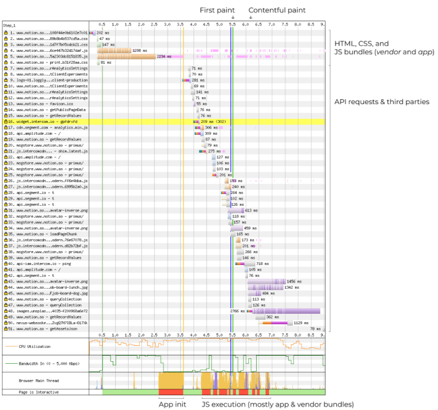


조금 자세히 들여다보자


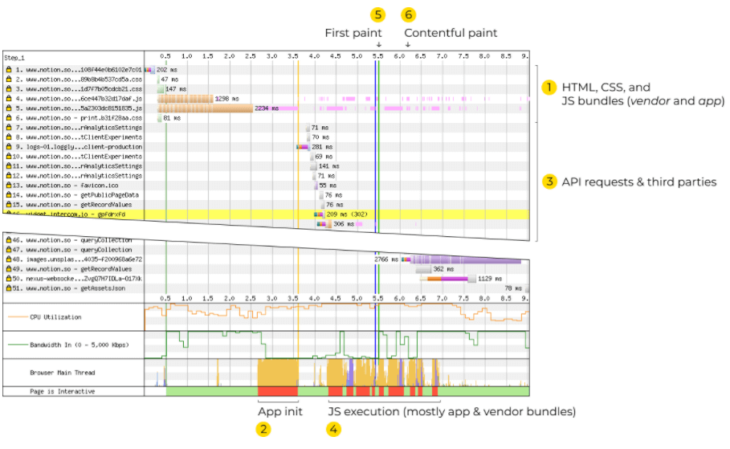

1. 처음에 페이지를 열면, 페이지는 몇개의 stylesheet과 2개의 JS bundle을 load 한다 - `vendor`와 `앱`
2. Bundle들이 로드되고 나서 실행을 한다 - 거의 1초가 걸림
3. 앱이 시작되면, page data에 대해서 API request를 보내기 시작한다. 그리고 analytics를 로드한다.
4. 추가적인 코드를 실행한다.
5. 5.6초가 되었을 때, 첫 번째 paint가 보이게 된다. 그리고 spinner만....보인다. 

    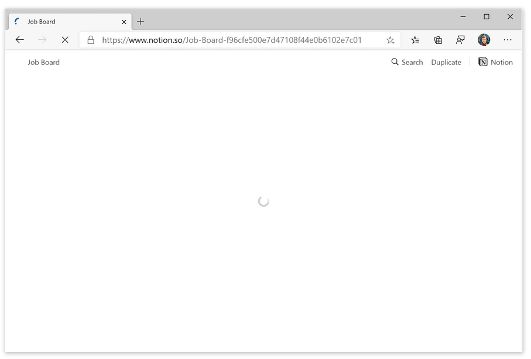

6. 6.2초쯤 되었을 때, page content가 실제로 렌더링 된다.

    

모든 hero image들을 load하기 까지는 몇 초가 더 걸린다.

Desktop에서도 6.2초는 꽤 긴 시간이지만, 중간 티어의 모바일 폰에서는 시작 시간이 12.6초까지 늘어난다. 


이제 어떻게 성능을 향상시킬 수 있을지 봐보자

# 💸 Cost of Javascript

`loading speed`는 보통 `networking performance`를 의미한다. 네트워크에 대해서는 Notion이 잘 하고 있다. HTTP/2를 사용하고 있고, 파일들을 gzip하고, proxy CDN으로 Cloudflare를 사용하고 있다. 

`loading speed`의 다른 부분에는 `processing performance`도 있다. 모든 리소스들을 다운로드 하는 것에는 processing cost가 있다: gzip은 decompress(압축 해제)가 되어야 하고, 이미지들은 디코딩되어야 하고, JS가 실행 되어야 한다.

Networking performance와 다르게 processing performance는 네트워크가 좋아진다고 나아지지 않는다. 오히려 유저 기기의 CPU에 따라서 이 시간이 달라진다. (특히 안드로이드 폰에서 매우 느리다....)

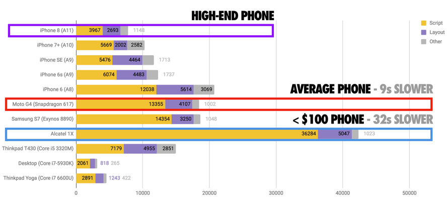

Networking cost는 앱에 캐싱하면 해결하기 쉽다. 하지만, processing cost는 앱이 시작될 때마다 내야하는 cost이다. 

테스트를 했을 때 Nexus 5에서, `vendor`와 `app` bundle을 execut하는데 약 4.9초가 걸렸다. 이 시간 동안 유저들은 비어있는 페이지를 보게 된다. 

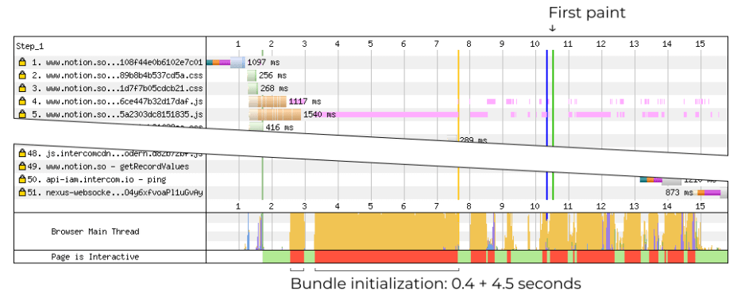

그럼 이 시간동안 뭐가 일어나는가? WebPageTest는 JS의 trace를 기록하지 않기 때문에 DevTools로 가서 local audit을 실행하면 뭐가 일어나는지 볼 수 있다.

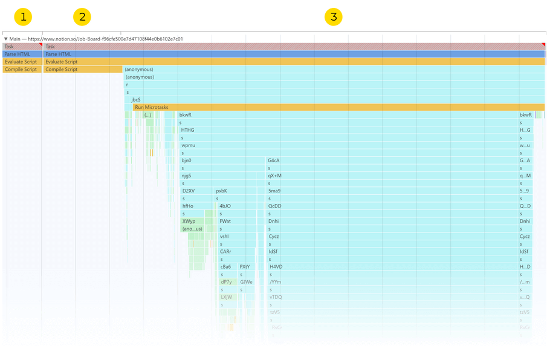

처음에 `vendor` bundle이 컴파일 될 때까지 약 0.4초가 걸린다. 그 다음에, `app` bundle이 컴파일 될 때까지 약 1.2초가 걸린다. 마지막으로, 두 bundle이 실행되는데 3.3초가 걸린다.

그렇다면, 어떻게 이 시간을 줄일 수 있을까?

# ⛔️ Defer JS execution

Bundle의 실행 phase를 봐보자. 

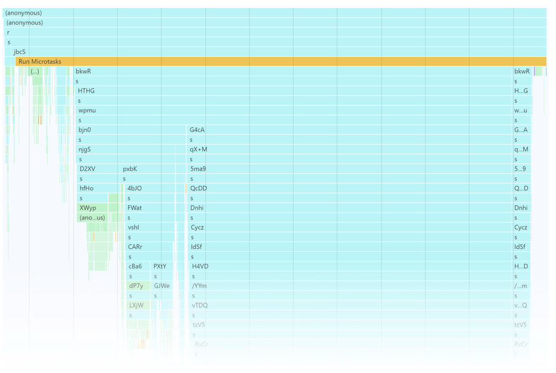


- 4글자 함수들은 (e.g. `bkwR` or `Cycz`) application module들이다.

    webpack이 bundle을 빌드할 때, 각 module을 함수로 wrap하고 ID를 부여 한다. ID는 함수의 이름이 된다. Bundle에서는 다음과 같이 보이게 된다:
    ```jsx
    // Before
    import formatDate from './formatDate.js';

    // After
    fOpr: function(module, __webpack_exports__, __webpack_require__) 
    { |"use strict"| | __webpack_require__.r(__webpack_exports__); | | var
    _formatDate__WEBPACK_IMPORTED_MODULE_0__ = |
    __webpack_require__("xN6P"); | | // ... | }, |
    ```

- 그리고 `s` 함수는  `__webpack_require__`을 의미한다.

    `__webpack_require__`는 webpack의 internal함수로써 module을 require하는데 사용된다. `import`를 사용할 때마다, webpack은 `__webpack_require__()`로 변환한다.

Bundle initialization이 많은 시간이 걸리는 이유는 이 모든 module들을 실행하기 때문이다. 각 module은 실행하는데 몇 ms만 걸릴 수 있다, 하지만 Notion에는 1100+개의 module들이 있기 때문에 이 시간이 어마어마해지는 것이다. 

이 문제를 해결할 수 있는 유일한 방법은 처음에 몇개의 module들만 실행시키는 것이다.

## 1. Use code splitting

시작 시간을 줄일 수 있는 가장 좋은 방법은 당장 사용되지 않는 feature들을 `code-split`하는 것이다. [Code-Split](https://webpack.js.org/guides/code-splitting/)

```jsx
// Before
<Button onClick={openModal} />

// After
<Button
  onClick={() => import('./Modal').then(m => m.openModal())}
/>
```

<mark>Code splitting은 가장 좋은 optimization 방법중 하나이다</mark> - performance에 엄청난 이득을 가져다 준다. [Tinder는 이 방식을 사용해서 load time을 60%](https://medium.com/@addyosmani/a-tinder-progressive-web-app-performance-case-study-78919d98ece0)나 줄였다고 한다. Framer는 [CPU idle 시간을 40~45%](https://3perf.com/#clients)를 줄일 수 있었다고 한다.

[Code splitting을 할 때 여러 방법들이 있다.](https://medium.com/js-dojo/3-code-splitting-patterns-for-vuejs-and-webpack-b8fff1ea0ba4)

1. page 별로 bundle split
2. below-the-fold 코드 들을 split
3. conditional content를 split (당장 보이지 않는 다이나믹 UI도)

Notion 앱은 page가 없고, code-splitting below-the-fold는 Notion의 페이지들이 워낙 다이나믹해서 하기가 어려웠다. Notion에게 적합한 방법은 3번째 방법뿐이었다. 다음의 파트들은 split하기 좋은 후보군들이다:

- _Settings, Import, Trash_ - 이 UI들을 거의 사용되지 않는다
- _Sidebar, Share, Page Options_ - 자주 사용되는 UI지만 앱이 처음 시작될 때 필요한 부분들은 아니다. 앱이 시작 된 다음에 initialize되어도 괜찮다
- _Heave page 블록_. 몇몇 page 블록들은 매우 무겁다, 예를 들어, 68개의 언어를 highlight하는 Code 블록은 120+개의 minified된 KBs를 Prism.js에서 가져와서 bunlde화 한다. Notion은 이미 몇개의 블록들은 split하고 있다 (e.g. Math equation). 이는 다른 블록들에도 적용될만 하다.

Sidebar과 자주 사용되지 않은 UI들
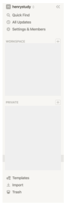

무거운 block들
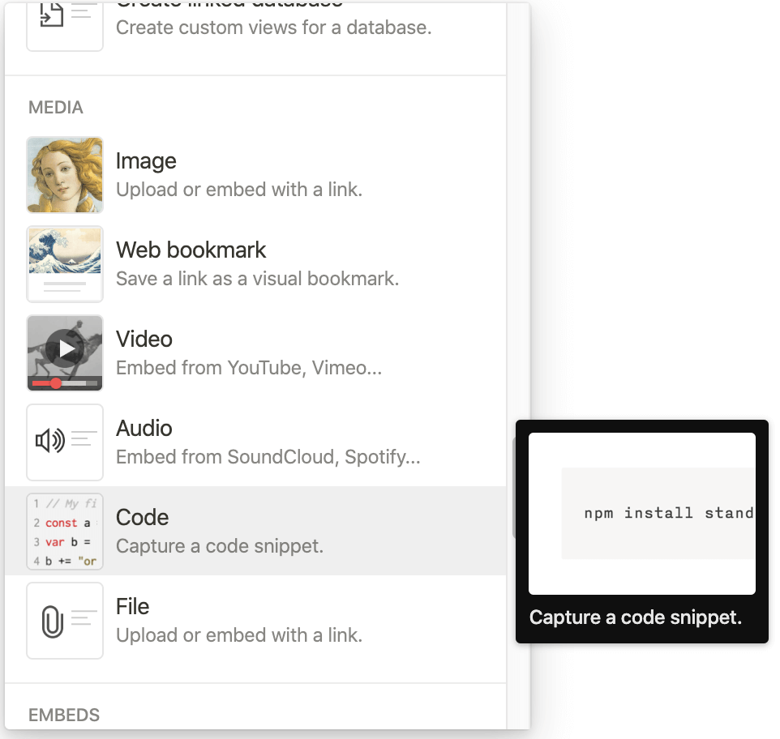


## 2. Check that module concatenation is working

webpack에서 [module concatenation feature](https://webpack.js.org/plugins/module-concatenation-plugin/)는 작은 ES module들을 하나로 merge한다. 사용되지 않는 module들을 processing하는 오버헤드를 줄여주고, 사용되지 않는 코드들을 효과적으로 제거해준다.

module concatenation이 제대로 작동하는지 확인하려면:

- ES module을 Babel로 CommonJS로 transpile하지 않는 것을 확인해야 한다. [`@babel/preset-env`](https://babeljs.io/docs/en/babel-preset-env)는 ES module을 CommonJS로 transpile하지 않는다.
- [`optimization.concatenateModules`](https://webpack.js.org/configuration/optimization/#optimizationconcatenatemodules)가 명시적으로 disable 안되어있는지 확인한다.
- production webpack에서 [`--display-optimization-bailout`](https://webpack.js.org/plugins/module-concatenation-plugin/#debugging-optimization-bailouts)을 실행한 후에 module concatenation이 bail out하는 경우가 있는지 확인한다.

> Fun Fact. 모든 import들이 `__webpack_require__`함수로 transform된다는 것을 기억해보자.
>
> 만약 같은 함수가 1100번 불리면 어떻게 될까? 전체 시간의 26.8%를 잡아먹는 hot path가 된다. (`s`는 `__webpack_require__`의 minified 이름이다)
>
> 하지만 이 부분을 최적화 할 수 있는 [방법은 거의 없다](https://github.com/webpack/webpack/issues/2219).

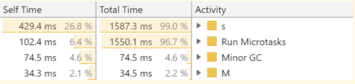

## 3. Try `lazy` option of Babel's `plugin-transform-modules-commonjs`

> Note: 이 제안은 module concatenation호환이 안되서 서로 같이 사용될 수는 없다.

[`@babel/plugin-transform-modules-commonjs`](https://babeljs.io/docs/en/babel-plugin-transform-modules-commonjs#lazy)는 ES import들을 CommonJS의 `require()`로 transform해주는 Babel의 공식 플러그인이다.

```jsx
// Before
import formatDate from './formatDate.js';
export function getToday() {
  return formatDate(new Date());
}

// After
const formatDate = require('./formatDate.js');
exports.getToday = function getToday() {
  return formatDate(new Date());
};
```

`lazy` option을 활성화 시키면, 모든 `require`들을 사용되는 곳에 inline으로 바꿔준다. 

```jsx
// After, with `lazy: (path) => true`, simplified
exports.getToday = function getToday() {
  return require('./formatDate.js')(new Date());
};
```

바꿔주는 덕분에, `getToday()`가 호출되지 않는다면 `./formatDate.js`는 절대 import되지 않는다. import에 대한 cost를 줄일 수 있다.

하지만, 이 방법에 몇가지 단점이 있다:

- 기존 codebase를 `lazy`로 바꾸는 것은 tricky할 수 있다. 어떤 module들은 다른 module에 의존할 수 있다. [공식 플러그인](https://babeljs.io/docs/en/babel-plugin-transform-modules-commonjs#lazy)도 `lazy` option이 cyclic dependency를 깨트릴 수 있다고 주의를 준다.
- CommonJS module로 바꾸는 것은 [webpack의 tree shaking](https://webpack.js.org/guides/tree-shaking/)을 비활성화 시킨다. 이 말은 즉슨, 사용되지 않은 코드들도 bundle에 유지될 수도 있다는 것이다. [webpack5에서는 이 부분을 지원하겠다고 했다](https://github.com/webpack/changelog-v5/blob/df28f37494ee62967623af75d8f3fe45bd70fe5b/README.md#commonjs-tree-shaking)
- CommonJS module로 바꾸는 [module concatenation을 비활성화 시킨다](https://webpack.js.org/plugins/module-concatenation-plugin/). 이 말은 즉슨, module processing의 오버헤드가 더 커질 수 있다는 것이다.

이 단점들은 다른 방법들에 비해 이 방법론을 더 리스크 있게 만든다. 하지만, 제대로만 사용된다면 훨씬 이득이 있다.

> **몇개의 module들이 이 방식대로 defer될 수 있나?**
>
> Chrome DevTools에 들어가서 JS-heavy한 페이지를 열면 알 수 있다. DevTools에 들어가서 Windows에서는 `Ctrl+Shift+P`, Mac에서는 `Cmd+Shift+P`를 누른 다음에  `start coverage`를 작성하고 Enter를 치면 된다. Page가 reload되고 첫 렌더링때 얼만큼의 코드가 실행 됐는지 볼 수 있다.
> 
> Notion을 예로 들면, 39%의 vendor bundle과 61%의 app bundle이 page가 render된 다음에 사용되지 않는다.

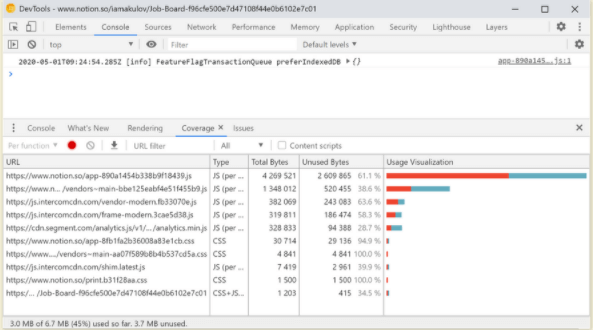

# 🗑️ Remove unused JS code

Bundle initialization trace를 다시 봐보자.

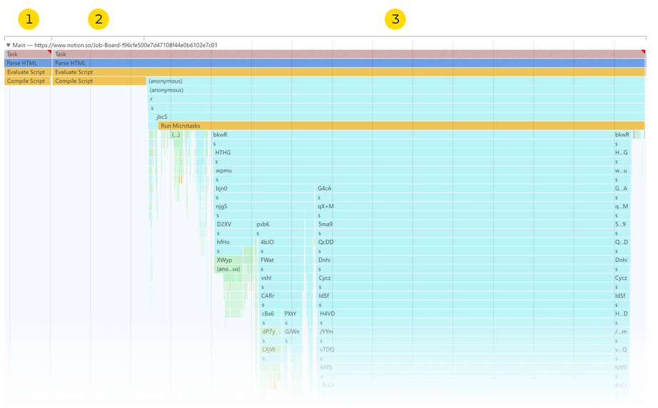

여기서 `Compile Script`라는 부분이 약 1.6초가 걸린다 (1,2번 부분). 그렇다면 이게 뭘까?

V8 (Chrome의 JS 엔진)은 다른 JS 엔진들처럼 [JIT 컴파일](https://blog.sessionstack.com/how-javascript-works-inside-the-v8-engine-5-tips-on-how-to-write-optimized-code-ac089e62b12e)을 사용한다. 모든 코드들은 일단 머신 코드로 먼저 컴파일 되어야 함을 의미한다.

코드가 많을 수록 컴파일하는데 오랜 시간이 걸릴 수 밖에 없다. 2018년에 평균적으로 V8은 전체 execution시간에서 10~30%를 JS를 파싱하고 컴파일하는데 사용했다. Notion앱 경우에는 전체 4.9초 중에 1.6초를 컴파일하는데 사용했으니 - 32%정도이다.

> 컴파일 시간을 줄이는 유일한 방법은 JS를 덜 사용하는 것이다. (다른 방법으로는 JS를 머신 코드로 먼저 컴파일 하는 방법이 있을 수 있지만, [현재 불가능하다](https://gist.github.com/addyosmani/4009ee1238c4b1ff6f2a2d8a5057c181))

## 1. Use code splitting

다시 언급하자면, 사용되지 않는 기능들을 code-splitting을 하면 bundle init 시간을 줄일 수 있을 뿐만 아니라, 컴파일 시간도 줄일 수 있다. 

## 2. Remove unused vendor code

Page가 load될 때 약 40%의 Notion의 `vendor` bundle이 사용되지 않고 있었다.

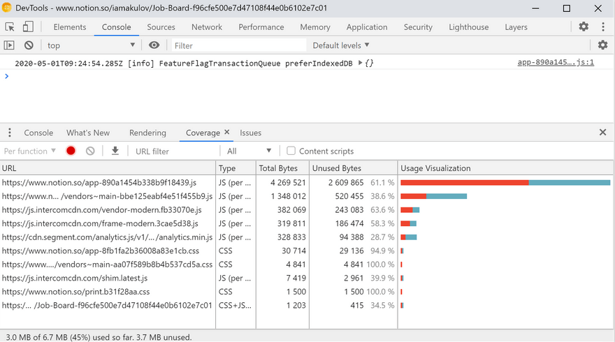

몇몇의 코드들은 나중에 유저가 필요로 하면 사용될 수 있다. 하지만 얼마나 사용될 것인가?

Notion은 source map을 publish 하지 않는다, 이 말은 즉슨, bundle을 explore하고 가장 큰 module을 찾을 때 `source-map-explorer`를 사용할 수 없다는 것을 의미한다. 하지만, minified 되지 않은 string들을 Github에서 찾아보면 대충 예측 할 수는 있다.

`vendor` bundle에서 사용되는 module중 가장 큰 10개의 module들은 다음과 같다:

1. `moment` - 227KB
2. `react-dom` - 111KB
3. `libphonenumber-js/metadata.min.json` - 81KB
4. `loadsh` - 71KB
5. `amplitude-js` - 55KB
6. `diff--match-patch` - 54KB
7. `tinymce` - 48KB
8. `chroma-js` - 35KB
9. `moment-timezone` - 32KB
10. `fingerprintjs2`  - 29KB

> (이 리스트는 여러개의 작은 파일들로 이뤄진 라이브러리는 포함하지 않았다. 예를 들어, `core-js`는 154KB를 차지 하지만 300+ 파일들로 이뤄져 있다)

모든 module중에서, 가장 쉽게 최적화할 수 있는 것들은 `moment`, `lodash`, `libphonenumber-js`이다. 

`moment`는 JS library이고 날짜를 다루는데 사용된다. Localization 파일들을 160+ minified된 KB로 bundle한다. Notion은 영어만 지원하기 때문에 거의 필요 없는 부분이다.

그렇다면 어떻게 할 수 있을까?

- 첫째 방법으로, 사용되지 않는 `moment` locale들을 `moment-locales-webpack-plugin`으로 제거할 수 있다
- 둘째 방법으로, `moment`를 `date-fns`로 바꾸는 것을 고려할 수 있다. `date-fns`는 필요한 메소드에 대한 날짜만 import해서 사용할 수 있다. `addDays(date,5)`를 사용한다면 date parser를 bundle할 필요는 없게 된다.

`loadash`는 utility를 다루는 데이터의 셋이고 300+ 함수를 bundle한다. 실제로 앱에서는 5~30개의 메소드들만 사용한다.

가장 쉬운 방법은 `babel-plugin-loadsh`를 사용해서 사용되지 않는 메소드들을 제거하는 것이다. 이외에, `lodash-webpack-plugin`은 몇개의 loadsh feature들을 메소드 안에서 제거 한다 (캐싱이나 Unicode 지원을 통해).

`libphonenumber-js`는 전화번호를 parsing하고 formatting하는데 사용되고 전화번호 metadata로 81KB의 JSON 파일을 bundle한다. 

아마 Notion 앱을 깊이 파고들면 어딘가에 사용되는 곳이 있긴 하겠지만, 저자는 이 라이브러리가 사용되는 곳을 찾아보지 못했다고 한다. 그렇다면 차라리 삭제하고, 커스텀 코드를 사용하는 것이 더 낫다. 

## 3. Remove polyfills

`vendor` bundle에 있는 큰 dependency중 하나는 `core-js` 라이브러리의 polyfills이다.

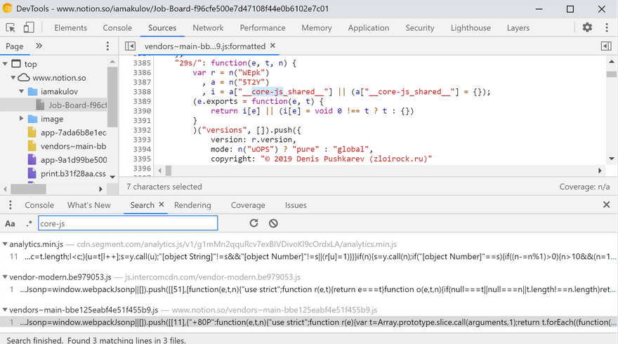

2가지 문제가 있다.

**불필요하다.** Notion은 Chrome81에서 테스팅 되고 있고 모든 모던한 JS feature들을 지원한다. 하지만, bundle은 그럼에도 `Symbol`이나 `Object.assign` 및 다른 메소드들을 필요로 하지 않는데도 포함하고 있다.

이 부분은 Notion 앱에도 영향을 준다. Destkop 앱에서 Js 엔진은 모던 버전이다. `Symbol`이나 `Object.assign`가 없을 일이 전혀 없다. 하지만 app은 그럼에도 같은 polyfills들을 다운받는다. 

모던 버전에서는 polyfills들을 다운 받지 않고, 이전 버전에서만 다운 받도록 해야 한다. [필요할 때만 polyfills load하는 방법](https://3perf.com/blog/polyfills/)을 참고하면 된다.

**여러번 bundle 한다**. `vendor` bundle은 `core-js`의 copyright을 3번 포함한다. 매번 copyright은 동일하지만, 다른 module로 ship 된다.

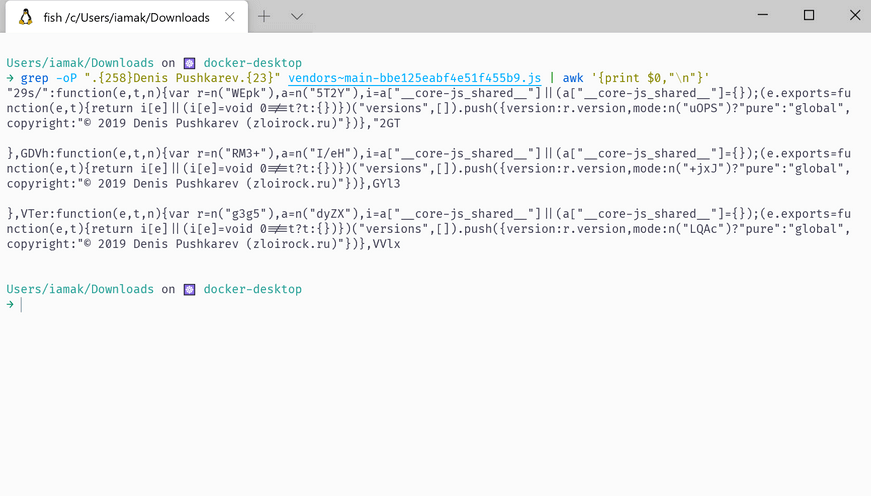

`core-js`가 3번 bundle됨을 의미한다. 왜 이런 일이 일어나는지 조금 깊이 파보려고 한다.

minified되지 않은 form에서 module의 copyright은 다음과 같이 생겼다:

```jsx
var core = require('./_core');
var global = require('./_global');
var SHARED = '__core-js_shared__';
var store = global[SHARED] || (global[SHARED] = {});

(module.exports = function (key, value) {
  return store[key] || (store[key] = value !== undefined ? value : {});
})('versions', []).push({
  version: core.version,
  mode: require('./_library') ? 'pure' : 'global',
  copyright: '© 2019 Denis Pushkarev (zloirock.ru)',
});
```

library를 표현하는 두가지의 bit가 있다:

- version을 위한 라이브러리 - `var core = require('./_core'); core.version`
- library mode를 위한 - `require('./_library') ? 'pure' : 'global'`

minified된 코드에서는 각각 

- `var r=n(<MODULE_ID>);r.version`
- `n(<MODULE_ID>)?"pure":"global"`

에 해당한다. Bundle에서 이 module ID를 따라가보면 밑과 같은 것을 볼 수 있다.

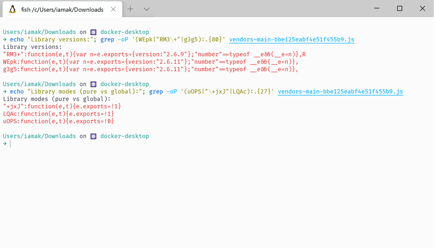

위가 의미하는 것은 3개의 `core-js` 버전이:

- `2.6.9`, `global` mode,
- `2.6.11`, `global` mode,
- `2.6.11` ,  `pure` mode

인 것을 알 수 있다.

이 이슈는 [꽤나 common한 이슈](https://twitter.com/iamakulov/status/1225069880988270592)였다. 앱이 특정 버전의 `core-js`에 의존하지만 다른 것들이 다른 버전에 의존할 때 생기는 이슈이다.

그렇다면 어떻게 해결하나? `yarn why core-js`를 run해서 어떤 것들이 어떤 버전에 의존하는지 찾아본다. 추가적인 `core-js` 버전을 사용하는 의존성을 제거 혹은 재구성하면 된다. 혹은 [`resolove.alias`](https://webpack.js.org/configuration/resolve/#resolvealias)를 사용해서 중복을 제거 하면 된다.

# ⚙️ Optimize the loading waterfall

이제 Notion loading의 다른 부분들을 살펴보자


- API request는 bundle이 완전히 다운로드 되기전까지 시작되지 않는다
- Contentful paint는 대부분의 API request가 완료 되기 전까지 발생하지 않는다. (35개의 request를 기다린다)
- API request는 3가지의 서드파티 툴과 혼합되어 있따: Intercom, Segment, Amplitude

이제 다음과 같이 최적화 하려고 한다.

## 1. Defer third parties

서드파티는 ad, analytics와 같은 기능들을 추가하기 위한 다른 도메인의 스크립트들이다. 비즈니스적으로 보면 서드파티들은 유용하면서도 문제가 있다. 

- **유용한 점:** 확실한 비즈니스 밸류를 위해 서드파티를 추가 한다 (e.g. 유저들이 앱을 어떻게 사용하는지에 대한 분석).
- **문제점:** 서드파티들은 loading performance에 안좋은 영향을 준다.

Notion에서 이 서드파티들은 앱이 initialize될 떄 메인 쓰레드를 막아서 performance에 악영향을 준다. 현실적으로, 이 서드파트들을 없애는 것은 불가능하고 밑과 같이 defer할 수는 있다.

```jsx
// Before
async function installThirdParties() {
  if (state.isIntercomEnabled) intercom.installIntercom();

  if (state.isSegmentEnabled) segment.installSegment();

  if (state.isAmplitudeEnabled) amplitude.installAmplitude();
}

// After
async function installThirdParties() {
  setTimeout(() => {
    if (state.isIntercomEnabled) intercom.installIntercom();

    if (state.isSegmentEnabled) segment.installSegment();

    if (state.isAmplitudeEnabled) amplitude.installAmplitude();
  }, 15 * 1000);
}
```

위처럼 하면 앱이 완전히 initialize되기 전까지 load되지 않을 것이다.

> `setTimeout` vs `requestIdleCallback` vs `events`. `setTimeout`은 가장 좋은 방법은 아니다 (timeout을 하드코딩하기 때문), 하지만 나름 괜찮은 방법이다.
> 
> 가장 좋은 방법은 page가 완전하기 렌더링 된 event를 받고 나서 실행하는 것이다. (저자는 Notion에 이런 event가 있는지 불확실하다고 한다)
>
> `requestIdleCallback`은 좋은 방법이라고 생각될 수 있지만, 사실 아니다. 저자가 Chromium에서 테스트 했을 때 너무 일찍 trigger 되는 경우가 있다고 한다.

> **Loading analytics on interaction.** Analytics를 defer하는 좋은 방법은 유저가 처음으로 interaction을 할 때 (e.g. 첫 클릭 혹은 탭) load하는 것이다.
>
> 하지만, synthetic test 같은 경우에는 이 analytics가 작동을 안하게 되는 문제가 있다. 실제로 유저들에게 영향이 가는 JS cost를 계산하려면 Real User Monitoring 라이브러리인 [SpeedCurve](https://speedcurve.com/features/lux/)나 [Browser Insights](https://blog.cloudflare.com/introducing-browser-insights/)를 사용해야 한다. 

## 2. Preload API data

Notion에서 page가 렌더링 되기 전에 브라우저는 9개의 request를 API로 보낸다.

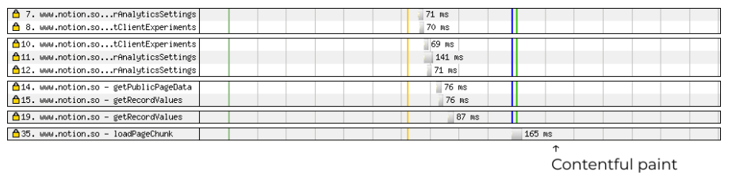

각 request는 70~500ms 걸린다. 어떤 request들은 순차적으로 이뤄져서 이전 request가 완료되어야지만 실행되는 경우도 있다. 이런 느린 API request가 latency에 악영향을 줄 수 있음을 의미한다. 

하지만 이 latency를 실제 앱에서 어떻게 제거할 수 있을까?

**Inline page data into the HTML.** 가장 좋은 방법은 API data를 server에서 계산 하고 HTML response를 리턴하는 것이다. 

```jsx
app.get('*', (req, res) => {
  /* ... */
  
  // Send the bundles so the browser can start loading them
  res.write(`
    <div id="notion-app"></div>
    <script src="/vendors-2b1c131a5683b1af62d9.js" defer></script>
    <script src="/app-c87b8b1572429828e701.js" defer></script>
  `);
  
  // Send the initial state when it’s ready
  const stateJson = await getStateAsJsonObject();
  res.write(`
    <script>
      window.__INITIAL_STATE__ = JSON.parse(${stateString})
    </script>
  `);
})
```

1) [data를 JSON으로 인코딩을 하고](https://joreteg.com/blog/improving-redux-state-transfer-performance)
2) data를 [jsesc](https://github.com/mathiasbynens/jsesc)를 사용해서 (`json: true, isScriptContext: true`) escape해서 XSS 공격을 피해야 한다.

또한, bundle은 `defer` attribute이 있기 때문에, bundle을 `__INITIAL_STATE__` script 이후에 실행시켜야 한다.

위 방법대로 하면 앱은 API response를 기다리지 않고 바로 렌더링 할 수 있게 된다.

> **Cloudfare workers.** Notion은 Cloudfare를 CDN provider로 사용하고 있다. Notion의 HTML page가 static하다면 [Cloudfare workers](https://workers.cloudflare.com/)는 유용하게 사용될 수 있다.
>
> Cloudfare workers로 page를 intercept할 수 있고, 다이나믹 데이터를 CDN worker로부터 fetch해서 page 끝에다 데이터를 덧붙힐 수 있다. 
>
> 참고 문서 - [Streams documentation](https://developers.cloudflare.com/workers/reference/apis/streams/), 
> 참고 예시 - [Streaming recipes](https://developers.cloudflare.com/workers/archive/recipes/streaming-responses/), [Fast Google Fonts](https://github.com/cloudflare/worker-examples/tree/master/examples/fast-google-fonts)

**Inline a script to prefetch page data.** 다른 방법으로는 data를 미리 fetchgksms inline script를 작성할 수 있다.

```jsx
<div id="notion-app"></div>
<script>
  fetchAnalytics();
  fetchExperiments();
  fetchPageChunk();

  function fetchAnalytics() {
    window._analyticsSettings = fetch(
      '/api/v3/getUserAnalyticsSettings',
      {
        method: 'POST',
        body: '{"platform": "web"}',
      }
    ).then((response) => response.json());
  }

  async function fetchExperiments() { /* ... */ }

  async function fetchPageChunk() { /* ... */ }
</script>
<script src="/vendors-2b1c131a5683b1af62d9.js"></script>
<script src="/app-c87b8b1572429828e701.js"></script>
```

앱은 `window._analyticsSettings`까지 `await` 할 수 있다. Data가 시간이 지나면서 load되면 거의 바로 실행이 된다.

# Other Stuff

최적화하기 위한 고려할 수 있는 사항들 

## 1. `Cache-Control` on responses

Notion은 response의 header에 `Cache-Control`을 설정하고 있지 않다. Caching은 안 한다는 의미는 아니고, [각 브라우저가 response마다 다르게 caching을 한다](https://paulcalvano.com/index.php/2018/03/14/http-heuristic-caching-missing-cache-control-and-expires-headers-explained/)는 의미이다. 이 부분은 client-side 버그들을 야기할 수 있다.

버그들을 방지하기 위해서는, 올바른 `Cache-Control` header가 bundle asset과 API response에 설정되어야 한다.

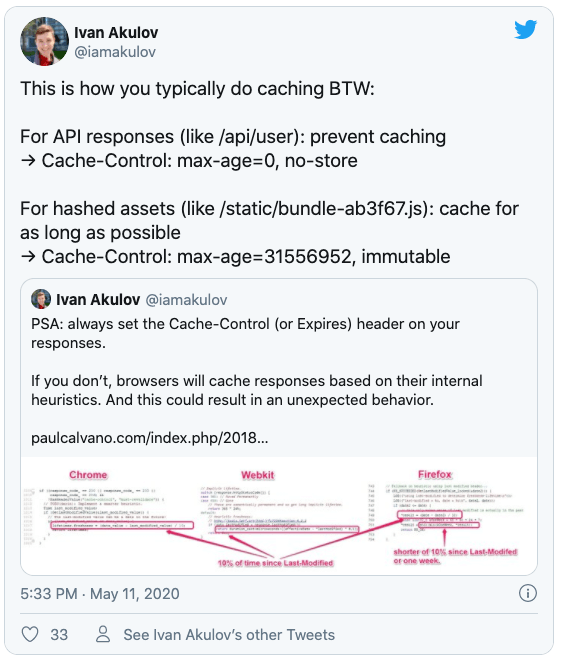

## 2. Loading skeleton

Notion 앱은 원래 page가 로딩 될 떄 spinner를 보여줬었다.


Spinner는 뭔가가 로딩된다는 것을 잘 보여주지만, 가끔 performance가 더 안 좋다고 느끼게 하는 경우가 있다. Spinner가 보이면 더 앱이 느려 보이는 경향이 있다.  이 부분은 skeleton UI를 사용해서 해결을 했다.

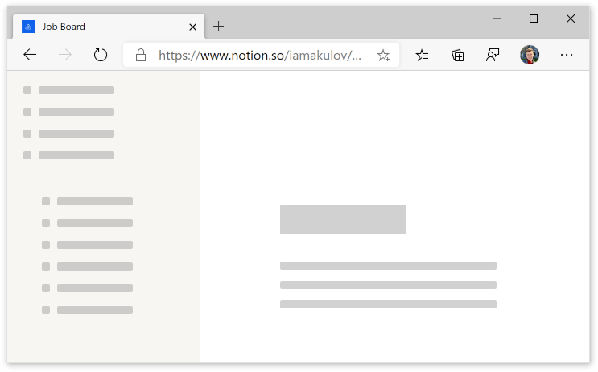

# Summing up

그래서 얼마나 최적화가 되었는가?

- vendor bundle에서 사용되지 않은 의존성들을 제거하고, polyfills shipping을 하지 않아서 30% 정도를 매니징 할 수 있었다고 가정해보자. 추가로, code-split으로 main bundle의 20%를 매니징 할 수 있었다고 가정해보자. 
정확히 컴파일이나 execution 시간을 측정하기는 어려우나, 기기에 따라서 10~50%의 시간 절감이 있다고 볼 수 있다. 약 25%라고 생각을 해보자
- API data를 미리 load해서 contentful paint 시간을 10% 절감할 수 있다
- 서드파티 deferring은 1초 정도를 더 벌어줄 수 있다

위에서 한 rough 계산으로 12.6초에서 3.9초를 save할 수 있었다 - 30%의 시간 절감. Bundle config를 몇개 튜닝하고 loading들을 defer해서 이 정도로 Notion앱은 최적화할 수 있었다고 한다. 

License: [CC BY-SA](https://creativecommons.org/licenses/by-sa/4.0/)
