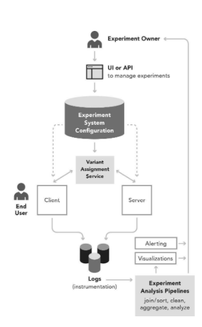

> **Trustworthy Online Controlled Experiments: A Practical Guide to A/B Testing**라는 책을 읽고 요약하고 있다. 이 포스트에서는 **4장: Experimentation Platform and Culture**에 대해 다루고 있다.  

> 글에서 얘기하는 **실험**은 **online controlled experiment**를 의미한다. online controlled experiment은 때로 A/B 테스트라고도 불린다.


📕 2장에서는 **실험을 design - run - analyze할 때 지켜야할 기본 원칙들**을 예시와 함께 살펴봤다. 3장은 통계적인 용어들이 많이 나오는데 (SRM 검증, p-value를 측정할 때 발생하는 흔한 오해 등등), 통계적 용어들이나 기법들에 대해 완벽하게 이해하지 못해서 3장에 대한 요약은 skip했다.  

그래서 이번 포스트에서 다루게 될 4장은 **실험 플랫폼의 단계와 실험플랫폼을 구축하기 위해 필요한 요소들**에 대한 내용을 담고 있다. 견고하고 신뢰할 수 있는(trustworthy) 실험플랫폼을 만들기 위해서는 이번 포스트에서 얘기하는 요소들이 담겨 있어야 한다. 

# 🧪 Experimentation Maturity Models

실험의 성숙도 모델(Experimentation Maturity Model)은 데이터 드리븐 조직이 되기 위해 거쳐야할 단계들에 대해 설명을 한다. 성숙도는 총 4가지의 단계로 나눠진다:


### 1. Crawl

이 단계에서의 목표는 실험에 필요한 장 기본적인 것들을 충족하는 것이다. 간단한 실험을 design, run, analysis를 할 수 있어야 한다.  몇 개의 실험을 성공적으로 마무리하면 그 다음 단계로 넘어갈 수 있는 좋은 모멘텀이 된다. 

(약, 실험 1개/월)

### 2. Walk

이 단계에서는 표준 metrics를 정의하고 더 많은 실험을 진행하게 된다. A/A 테스트, SRM(Sample Ratio Mismatch)와 같은 테스트들을 진행해서 실험의 신뢰도를 높혀야 한다. 

(약, 실험 1개/주)

### 3. Run

대규모의 실험을 할 수 있을 때 이 단계에 도달했다고 할 수 있다. 이 단계에서는 metrics들을 더 확장하되 여러 metrics간 tradeoff를 고려해서 OEC를 체계화하는 것이 목표이다. 조직은 새로운 feature이나 변화를 줄 때 실험을 통해 평가를 하게 된다.

(약, 실험 1개/일)

### 4. Fly

이제 모든 변화에 실험을 하게 된다. 각 팀들은 DS의 도움 없이도 실험을 실행하고 분석할 수 있게 된다. 이 단계에서는 더욱 확장성 있게 실험을 지원하기 위해 자동화를 고려하게 된다. 

다음 단계로 넘어갈 때마다 실험의 수는 약 4~5배 많아진다. 

이러한 단계별 실험플랫폼울 구축하는 것에 대해 얘기하기 전에 단계에 상관 없이 조직이 관심을 갖어야 할 부분들을 강조하려고 한다. 

# 👑 Leadership

제품을 구축할 때 실험을 하게끔 만드는 문화를 정착시키는 것이 리더십이 해야할 중요한 임무 중 하나이다. 그러기 위해서는 다음의 일들을 해야 한다:

- OEC를 확립하기
- Feature X에서 Y로 바꾸는 것이 목표가 아닌 metric을 향상시킬 수 있는 목표 세우기. Metrics를 떨어트리지 않는 실험을 하는 것이 아니라, 정의된 metrics를 향상 시킬 수 있는 실험을 할 수 있는 문화를 만들기
- 빠르게 실패하는 문화 만들기. Key metrics를 혁신시키고 향상시킬 수 있도록 팀들을 지원하기.
- 많은 실험들이 실패한 다는 것을 인식시키기. 그리고 그 실패로부터 배워서 혁신을 지속할 수 있도록 지원하기.
- 높은 데이터의 퀄리티 유지하기

등등

리더들은 단순히 실험플랫폼을 구축하고 툴을 제공해주는 것만으로 끝내면 안된다. 리더들은 언제나 조직이 올바른 프로세스로 실험을 진행해서 데이터 드리븐 의사결정을 할 수 있도록 지원해야 한다. 특히, Crawl, Walk 단계에 있을 때 조직의 목표를 세우고 실험을 장려하는 것이 매우 중요하다.

또한, 실험이 성공하고 더 확장되려면 실험의 임팩트에 대해 투명성이 보장되어야 한다.

- 실험 대시보드 같은 곳에 OEC나 중요한 metric들이 계산돼서 보여져야 한다. 그래서 팀들이 실험 결과를 공유할 때 체리픽(cherry-pick)하는 것을 방지할 수 있다.
- 놀라운 실험 결과(성공 혹은 실패)이 있으면 이메일이나 뉴스레터를 보내서 알려야 한다. 이것의 목표는 다른 팀들이 실험을 어떻게 하는지 배우기 위함이다.
- Treatment가 metrics에 나쁜 임팩트를 끼칠때 배포하는 것을 어렵게 만들어야 한다. 워닝을 줄 수도 있고, 실제로 배포를 멈추는 것까지 고려할 수 있다.
- 실패한 아이디어에서 배울 수 있도록 해야 한다. 대부분의 아이디어는 망한다, 키는 실패에서 배우는 것이다.

# 🛠 Infrastructure and Tools

실험을 design - deploy - analyze하려면 실험플랫폼에서 다음 요소들을 갖춰야 한다

1. 실험 Management
2. 실험 Deployment
3. 실험 Instrumentation
4. 실험 Analytics



<p style="text-align: center;"> 실험플랫폼 아키텍처의 한 예시. </p>

### 1. 실험 정의, 설정 매니지먼트

실험을 많이 진행하려면, 실험을 쉽게 정의하고 설정을 하고 매니징을 할 수 있는 방법이 필요하다. 실험을 정의하려면 다음의 내용들이 필요하다:

- 실험 owner
- 실험 이름
- 실험 설명
- 실험의 시작 시간과 끝나는 시간
- 그 외 다른 필드들

또한, 실험플랫폼에서는 다음과 같은 기능들을 제공해야 한다:

- 실험 설정에 대한 draft(초안)을 작성 및 수정할 수 있는 기능
- 현재 진행되고 있는 실험의 설정을 변경하려고 할 때, 어떤 점이 변경되었는지 차이를 볼 수 있는 기능
- 실험의 타임라인 혹은 히스토리를 볼 수 있는 기능 (언제 실험이 어떻게 설정이 변경되었는지 보기 위해)
- 자동으로 실험 id, 변수 등을 생성해주는 기능
- 실험 설정에 에러가 없음을 검증하는 기능 (실험 이름이 올바른지, 실험의 타겟이 올바른지 등)
- 실험의 상태(시작했는지, 종료되었는지)를 볼 수 있는 기능. 실험을 즉시 중단시킬 수 있는 기능.

실험이 시작되면 실제로 유저들한테 임팩트가 전달되기 때문에, 실험이 잘못 설정될 수 있는 가능성을 최대한 방지해야 한다. 

### 2. 실험 배포

실험이 올바르게 설정이 되었다면 유저들에게 적용될 수 있게 배포가 되어야 한다. 실험 배포는 2가지로 나뉜다:

1. 실험 정의 및 어떤 유저들한테 이 실험을 할당할지에 대한 실험 정보의 배포
2. 실제 프로덕션 코드에서 유저가 실험의 어떤 그룹에 할당되었는지에 따라 다르게 작동하도록 코드 변경하고 배포

가장 흔하게 유저들을 실험에 할당하는 방법은 user ID를 사용하는 것이다. user ID를 기반으로 유저가 어떤 그룹에 할당 되었는지에 대한 값을 받았다면 실제 프로덕션 코드에서는 다음과 같은 아키텍처로 실험의 결과를 반영할 수 있다:

- userID 기반으로 유저가 어떤 그룹에 속하는지에 대한 정보를 받은 다음에, 분기 처리를 하는 것이다.

```go
variant = getVariant(userID)
if (variant == Treatment) {
   buttonColor = red
} else {
   buttonColor = blue
}
```

- 코드 내에서 바로 분기처리를 하는 것이 아니라, 실험 파라미터로 분기처리를 하는 것이다.

```go
variant = getVariant(userID)
if (variant == Treatment) {
   buttonColor = variant.getParam("buttonColor")
} else {
   buttonColor = blue
}

// 혹은
variant = getVariant(userID)
...
buttonColor = variant.getParam("buttonColor")
```

- 세번째 아키텍처는 유저를 할당하는 부분도 아예 `config`와 같은 곳에 옮겨놓고 프로덕션 코드에서는 `config`에서 받은 값으로 분기처리를 하는 것이다.

```go
buttonColor = config.getParam("buttonColor")
```

위에 제시한 모든 아키텍처에서 기본 값은 항상 설정되어 있어야 한다 (위 예제에서는 `blue`가 기본 값), 그리고 유저가 Treatment(실험군)에 속했을 때 새로운 값을 보여줄 수 있도록 되어야 한다. 

위에서 밑으로 코드의 아키텍처가 변경될 수록 기술적 부채를 가장 많이 줄일 수 있는 방향이다. 물론, 어떤 아키텍처를 선택하던 간에 일단 실험이 가능하게 하는 것이 중요하다. 그리고 현재 코드를 분석해서 어떤 방식을 적용해야 cost를 더 줄일 수 있는지 저울질을 해봐야 한다. 

### 3. 실험 instrumentation

유저의 행동이나 시스템의 퍼포먼스는 항상 로깅이 되어야 한다. 실험에 있어서 특정 유저가 어떤 그룹에 속하게 되었고, 어떤 행동을 했는지에 대한 정보를 알 수 있어야 한다. 그래야만, 실험의 결과에 대해 정확한 분석을 할 수 있게 된다. 

### 4. 실험 분석

실험플랫폼이 더 고도화되려면 실험 분석도 자동화가 되어야 한다. 실험 분석 자동화를 통해서 팀들이 분석하는데 사용하는 시간을 절약할 수 있고, 모두가 같은 분석 기법을 사용해서 실험의 결과를 신뢰하게 만들 수 있다. 

분석 자동화 가장 먼저 `data processing`을 요구로 한다. 실험의 데이터를 사용 가능한 형태로 정제하는 것을 의미한다. 데이터가 사용 가능해야 계산을 할 수 있고 시각화까지 할 수 있는 것이다. 

`data processing`이 가능해졌다면 다음으로 챙겨야할 것은 metrics들에 대한 `data computation`이다.  Segment별(예, 국가별, 언어별, 플랫폼별) metric 계산이나, p-value 계산, SRM 검증과 같은 계산들을 의미한다. 그 중 실험 결과 데이터의 신뢰성을 높혀줄 수 있는 계산을 가장 우선시 해야 한다.

마지막으로는 `data visualization`이 필요하다. 시각화를 실험의 결과를 쉽게 이해할 수 있게 만들어야 한다. Metrics들이 보여지고, 실험 결과가 통계적으로 유의미한지 보여줘야 한다. 실험하는 문화를 자리 잡는 시기에는 이 결과들을 사내 구성원들이 쉽게 이해할 수 있게 만들어야 한다. 

✍️ 다음 포스트는 **Speed Matters**에 대한 내용을 요약하려고 한다.


