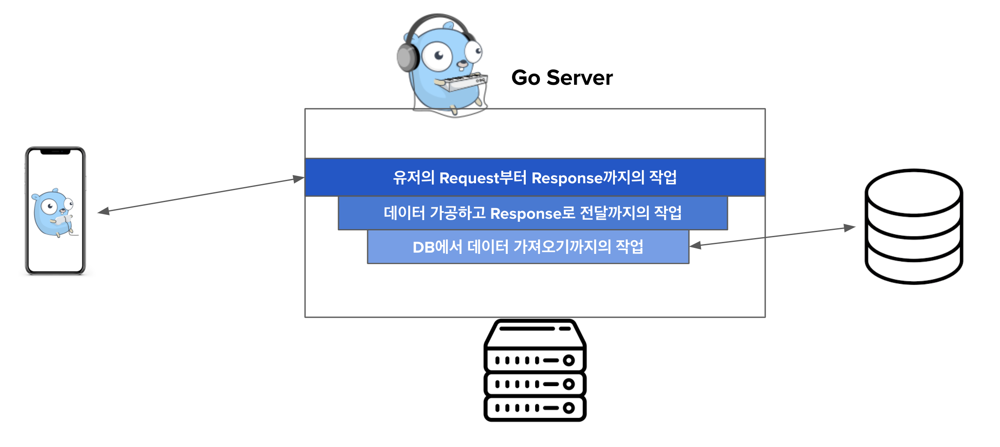
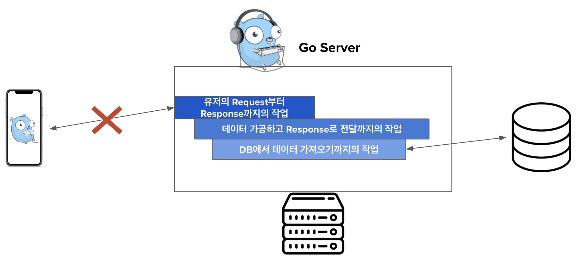
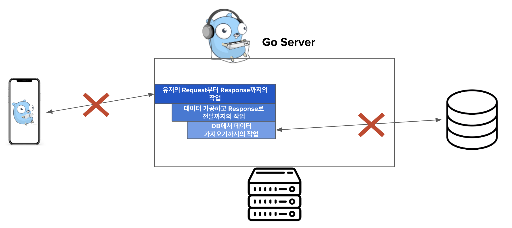

Go로 HTTP 서버, DB, 혹은 고루틴을 구현해본 사람이라면 무조건 `context`를 사용해본 경험이 있을 것이다. 다른 오픈소스 코드들을 볼때 `context`의 자매품(?)인 `WithCancel`,`WithTimeout`, `WithDeadline`등도 종종 접해볼 기회가 있었을 것이다. 이처럼 개발하다 보면 자주 등장하는 패키지임에도 사용법이 복잡하지는 않아서 깊이 공부하지 않고 넘어가는 경우가 있었을 것이라고 생각한다 (내가 그랬다...). 하지만, 내가 작성한 코드가 어떻게 돌아가는지 이해하기 위해서는 `context`의 개념을 반드시 짚고 넘어가야할 개념이라고 생각해서 이번 블로그 포스트에서 `context`에 대해 다뤄보려고 한다.  
<br/>


# 🔎 Context란?

[공식 Golang 도큐먼트](https://golang.org/pkg/context/#pkg-overview)에 의하면 다음과 같다:

> Package context defines the Context type, which carries deadlines, cancellation signals, and other request-scoped values across API boundaries and between processes.

한글로 풀어서 설명하면, `context`란 패키지는 프로세스 & API간 전달되는 `Context`라는 type을 정의하는 패키지이다. 그리고 이 type은 deadline(마감기간), cancellation signal(취소 시그널), request-scoped 값을 지닌다. 

장재휴님의 "[Go언어에서 Context 사용하기](https://jaehue.github.io/post/how-to-use-golang-context/)" 블로그 글에 나오는 표현을 빌려서 설명해보면, `context`는 하나의 `맥락`이고, 이 `맥락`을 프로세스나 API에 전달해서 모든 연계되는 작업들이 하나의 `맥락`안에서 이뤄지도록 하는 것이다.  

하나의 `맥락`을 유지하기 위해, 다른 함수를 호출할 때 예제와 같이 `context`를 첫번째 인자로 전달한다.

```go
func DoSomething(ctx context.Context, arg Arg) error {
   // ... use ctx ...
}
```
<br/>


**⚠️ 주의할 점** 
`context`는 struct로 갖고 있으면 안된다, 위 예제처럼 항상 명시적으로 전달을 해야 한다. `nil` `context`를 파라미터로 전달이 허용되도 절대 `nil`을 전달하면 안된다. 어떤 `context`을 전달할지 모르겠다면 `context.TODO`를  전달하면 된다.

이제 `Context` type에  대해 더 깊이 알아보자. `Context` type은 interface이고 4개의 method로 구성되어 있다. 

```go
type Context interface {
    // Done returns a channel that is closed when this Context is canceled
    // or times out.
    Done() <-chan struct{}

    // Err indicates why this context was canceled, after the Done channel
    // is closed.
    Err() error

    // Deadline returns the time when this Context will be canceled, if any.
    Deadline() (deadline time.Time, ok bool)

    // Value returns the value associated with key or nil if none.
    Value(key interface{}) interface{}
}
```
<br/>

## 1. Done

`Done` method는 해당 `context`(맥락)이 cancel 혹은 타임아웃 되었을 때 닫힌 channel을 리턴한다. 

```go
Done() <-chan struct{}
```

만약 cancel될 수 없는 `context`라면 `Done` method가 nil을 리턴할 수 있다.

- `context.Background()`
- `context.TODO`

가 cancel 될 수 없는 `context`들이다. 
<br/>

## 2. Err

만약 `Done`이 닫혀있지 않다면 `Err`는 nil을 리턴한다. 만약 `Done`이 닫혀있다면 `Err`는 non-nil 에러를 리턴한다. 에러에는 왜 `context`가 cancel되었는지에 대한 설명이 존재한다.

```go
Err() error
```
<br/>

## 3. Deadline

`Deadline` method는 마감기간(deadline)이 존재할 때 주어진 `context`(맥락)의 마감기간을 리턴한다. 만약 마감기간이 정해져있지 않다면 `ok`값으로는 `false`를 리턴한다

```go
Deadline() (deadline time.Time, ok bool)
```
<br/>

## 4. Value

`Value`는 `context`(맥락)에 key가 있으면, 그 key에 해당하는 값이다. 자세한 내용은 밑에 `WithValue`를 참고하면 된다. 

```go
Value(key interface{}) interface{}
```
<br/>

# 💁‍♂️ Empty Context

⇒ context.Background & context.TODO

`context.Background()`와 `context.TODO()`는 empty context이다. 이 `context`들은 값을 지니지 않고, deadline도 없고, 절대 cancel되지 않는다. 

empty context의 구현을 보면 밑과 같고, 이들의 4개 method들의 값은 존재하지 않는다 (nil 값). 

```go
type emptyCtx int

func (*emptyCtx) Deadline() (deadline time.Time, ok bool){
    return         
}

func (*emptyCtx) Done() <-chan struct{} {
    return nil
}

func (*emptyCtx) Err() error {
	  return nil
}

func (*emptyCtx) Value(key interface{}) interface{} {
	  return nil
}

func (e *emptyCtx) String() string {
	  switch e {
	  case background:
		  return "context.Background"
	  case todo:
		  return "context.TODO"
	  }
	  return "unknown empty Context"
}

var (
  	background = new(emptyCtx)
	  todo       = new(emptyCtx)
)

func Background() Context {
	return background
}

func TODO() Context {
	return todo
}
```

`context.Background()`와 `context.TODO()` 둘다 empty context이긴 하지만 사용 법에서는 조금 다르다. 

- `context.Backgroud()`는 보통 main 함수, initialization, 테스트, 혹은 request의 최상단에 선언되고 사용된다.
- `context.TODO()`는 어떤 `context`를 사용해야 할지 모호한 경우에 보통 사용된다.
<br/>

# 🙅‍♂️ Cancel context

Context 사용에 있어서 이 cancel context 부분을 이해하는 것이 매우 중요하다. Go를 동시성있게 고루틴을 이용한 코드를 작성할 수 있는 것이 cancel할 수 있는 context가 있기 때문이다. 고루틴을 사용할 때 종료를 제대로 해주지 않으면 종료되지 않는 작업을 만들게 될 수 있다. 그 때, 이 고루틴의 종료를 관리해줄 수 있는 것이 바로 cancel 가능한 context인 것이다. 

중간에 작업을 cancel할 수 있는 부분이 왜 중요한지 예제를 통해 설명해보려고 한다. 



위 Figure처럼 유저의 데이터를 가져오는 API와 이를 처리하는 Go 서버가 있다고 생각해보자. 유저가 데이터를 달라고 서버에 request를 보내면 서버에서 request를 처리하기 위해 필요한 정보들을 DB에서 가져오고, 그 데이터를 적절하게 가공한 다음에 유저한테 response를 보낸다.  



그렇지만, 만약에 유저가 response를 받기 전에 request를 cancel하게 되도, 서버는 그대로 request를 처리하기 위해 DB에서 데이터를 가져오고, 가공한 다음 response를 보내게 된다 (물론 유저가 request를 cancel했기 때문에 response도 전달 실패한다). 이런 경우에 early cancel이 되어서 그 뒤에 있는 작업들은 request가 cancel되었다는 것을 모르고 **불필요한 작업을 계속 하게 되는 것**이다. 

이 때, 이제 cancel 가능한 context가 필요한 이유가 생기는 것이다.



cancel 가능한 context가 있다면, 유저가 response가 오기 전에 request를 cancel하게 되면 그 이상 작업을 진행하지 않고 작업을 종료할 수 있게 된다. 이 때 최상단의 작업이 cancel됨을 밑에 진행되는 작업들이 스스로 cancel될 수 있어야 한다. Go의 cancel 가능한 context는 이런 부분을 가능하게 한다.

이러한 context의 특징 덕분에, 고루틴을 사용해서 병렬적으로 작업을 진행하고 있더라도, 하나의 고루틴이 cancel되면 나머지 모든 고루틴의 작업들도 빠르게 cancel시킬 수 있게 되는 것이다. 

왜 cancel 가능한 context가 필요한지 대략 이해했으니, 어떻게 이런 context가 구현되어있는지 보려고 한다.
<br/>

## 1. `WithCancel`

Cancel할 수 있는 context를 만들어주는 `WithCancel` 의 구현을 line by line 뜯어보려고 한다.  하나씩 설명해나가기 앞서 `WithCancel`에 대한 간략한 설명을 하자면, 이 함수는 parent context의 copy본과 새로운 Done channel을 리턴한다. 이 새로운 Done channel은 함수가 리턴하는 `cancel` 함수가 호출되던지, 혹은 parent context의 Done channel이 닫힐 때 같이 닫히게 된다. 

```go
func WithCancel(parent Context) (ctx Context, cancel CancelFunc) {
	if parent == nil {
		panic("cannot create context from nil parent")
	}
	c := newCancelCtx(parent)
	propagateCancel(parent, &c)
	return &c, func() { c.cancel(true, Canceled) }
}
```

`WithCancel` 함수를 총 5가지 step으로 나눠서 설명하려고 한다.
<br/>

### 1.1 Parameter

함수의 paremeter 값을 보면, 이 함수를 호출하기 전에 미리 parent `context` (`context.Background()` 혹은 `context.TODO()`)를 만들고, 해당 `context`를 인자로 전달해야 함을 알 수 있다.

```go
// 예시
...
ctx, cancel := context.WithCancel(context.Background())
...

```
<br/>

### 1.2 Parent context Validation

위처럼 valid한 `context` 를 `WithCancel` 함수에 전달해야 하는 이유는 가장 첫줄에 `nil`을 validation하는 로직이 있기 때문이다. 이 때, 만약 `Context` type의 값이 정상 값이 아니라면,  panic을 야기한다.

```go
	...
	if parent == nil {
		panic("cannot create context from nil parent")
	}
	...
```
<br/>

### 1.3 새로운 Cancel할 수 있는 context 생성

만약 parent가 `nil` 값이 아니라면, 새로운 cancel 가능한 `context`를 `newCancelCtx`라는 함수를 호출해서 만든다.

```go
c := newCancelCtx(parent)
```

`newCancelCtx`함수는 `cancelCtx`라는 struct를 리턴하는데, 이 struct의 `Context` type에 전달받은 parent의 context를 initialize하고 리턴한다. `cancelCtx`는 밑과 같은 struct이다. 

```go
func newCancelCtx(parent Context) cancelCtx {
	return cancelCtx{Context: parent}
}

type cancelCtx struct {
	Context

	mu       sync.Mutex            // protects following fields
	done     chan struct{}         // created lazily, closed by first cancel call
	children map[canceler]struct{} // set to nil by the first cancel call
	err      error                 // set to non-nil by the first cancel call
}
```

일단, mutex는 다른 값들을 지켜주는 역할을 하고, 이 메커니즘을 통해 `context` 패키지는 동시성(concurrency)이 가능해지는 것이다.

`cancelCtx`는 cancel될 수 있다. 그리고 cancel될 때는 이 canceler를 구현한 모든 children들이 함께 cancel된다. 즉, `newCancelCtx` 함수에 parent `context`를 인자로 넣으면 새로운 `context`를 만들어서 리턴해주는 데, 이 새로운 `context`가 cancel되면 그 밑에 있는 모든 children들까지 다 cancel이 되는 것이다.
<br/>

### 1.4 Propagate Cancel

`WithCancel` 함수에서 새로운 cancel 가능한 `context`가 만들어진 다음에는, parent `context`와 방금 새로  만들어진 cancel 가능한 `context`를 `propagateCancel`이라는 함수에 전달한다.

```go
propagateCancel(parent, &c)
```

이 `propagateCancel` 함수는 밑과 같고, 이 함수도 라인 by 라인으로 분석해보려고 한다.

```go
var goroutines int32

// propogateChannel은 parent가 cancel될때 child도 cancel 될 수 있게 한다
func propagateCancel(parent Context, child canceler) {
	done := parent.Done()
	if done == nil {
		return // parent이고 절대 cancel 되지 않는다
	}

	select {
	case <-done:
		// parent가 이미 cancel되었다
		child.cancel(false, parent.Err())
		return
	default:
	}

	if p, ok := parentCancelCtx(parent); ok {
		p.mu.Lock()
		if p.err != nil {
			// parent가 이미 cancel되었다
			child.cancel(false, p.err)
		} else {
			if p.children == nil {
				p.children = make(map[canceler]struct{})
			}
			p.children[child] = struct{}{}
		}
		p.mu.Unlock()
	} else {
		atomic.AddInt32(&goroutines, +1)
		go func() {
			select {
			case <-parent.Done():
				child.cancel(false, parent.Err())
			case <-child.Done():
			}
		}()
	}
}
```

가장 먼저 parent의 `Done()`을 확인한다. parent가 `context.Background()`이거나 `context.TODO()`이면 값이 `nil`일 것이기 때문에 바로 리턴될 것이다. 즉, parent가 cancel될 수 있는지 확인하는 로직이다. 만약 인자로 들어온 parent context가 cancel 가능한 context인 `cancelCtx`이면 `Done()`을 호출했을 때 `nil`이 아닐 것이다. 

```go
done := parent.Done()
if done == nil {
	return // parent이고 절대 cancel 되지 않는다
}
```

그 다음 로직이 수행된다는 것은, parent context가 cancel 가능한 `cancelCtx` type이라는 것이다. 이때, parent의 channel이 닫혀 있는지 확인을 한다. 만약 parent의 channel이 닫혀 있다면, child도 그냥 닫아 버린다. 즉, parent의 context가 먼저 cancel되면 그 밑에 child context는 항상 cancel되는 것이 보장됨을 알 수 있다.  

```go
select {
	case <-done:
		// parent가 이미 cancel되었다
		child.cancel(false, parent.Err())
		return
	default:
	}
```

channel이 닫혀있지 않다면, 아직 parent가 cancel되지 않았다고 판단되서 그 밑의 로직들을 수행하게 된다. 밑에서는 `parentCancelCtx`에 parent context를 인자로 전달하고 리턴되는 boolean 값에 따라서 if / else statement를 수행한다.

```go
if p, ok := parentCancelCtx(parent); ok {
		p.mu.Lock()
		if p.err != nil {
			// parent가 이미 cancel되었다
			child.cancel(false, p.err)
		} else {
			if p.children == nil {
				p.children = make(map[canceler]struct{})
			}
			p.children[child] = struct{}{}
		}
		p.mu.Unlock()
} else {
		atomic.AddInt32(&goroutines, +1)
		go func() {
			select {
			case <-parent.Done():
				child.cancel(false, parent.Err())
			case <-child.Done():
			}
		}()
}
```

boolean을 리턴하는 `parentCancelCtx`의 구현은 밑과 같다. 간략하게 이 함수의 목적을 설명하면, parent의 Value를 확인해서 가장 deep하게 있는 `*cancelCtx`를 찾고, 이 `context`의 `Done()`의 값과 parent의 `Done()`값이 같은지 비교한다. 만약 값이 다르다면, `*cancelCtx`가 커스텀하게 한번더 wrap되어서 사용되었기 때문에 다른 done channel을 가지고 있음을 의미하게 된다.

```go
func parentCancelCtx(parent Context) (*cancelCtx, bool) {
	done := parent.Done()
	if done == closedchan || done == nil {
		return nil, false
	}
	p, ok := parent.Value(&cancelCtxKey).(*cancelCtx)
	if !ok {
		return nil, false
	}
	p.mu.Lock()
	ok = p.done == done
	p.mu.Unlock()
	if !ok {
		return nil, false
	}
	return p, true
}
```

`parentCancelCtx`에서 `true` 값이 리턴된다면, 현재 parent context에 cancel 가능한 `cancelCtx` type의 child를 덧붙힌다. Parent context에 어떤 children 들이 있는지 추적을 해야 하기 때문에 해당 정보를 map으로 관리를 한다. 만약, 첫 child라면 map을 초기화하고, 이미 child들이 여럿 있었더라면 기존 존재하는 map에 child를 덧붙힌다.

```go
if p, ok := parentCancelCtx(parent); ok {
		p.mu.Lock()
		if p.err != nil {
			// parent가 이미 cancel되었다
			child.cancel(false, p.err)
		} else {
			if p.children == nil {
				p.children = make(map[canceler]struct{}) // child가 없으니 child를 track할 수 있는 map을 초기화 한다
			}
			p.children[child] = struct{}{} // 새로운 child를 덧붙힌다
		}
		p.mu.Unlock()
} else {
...
}
```

`parentCancelCtx`에서 `false` 값이 리턴된다면, valid한 `cancelCtx` deep한 내부에 없다고 판단을 한다. 그러고는 parent나 child의 `Done()`channel이 닫히는지 listen하는 고루틴을 활성화 시킨다.

```go
...
} else {
		atomic.AddInt32(&goroutines, +1)
		go func() {
			select {
			case <-parent.Done():
				child.cancel(false, parent.Err())
			case <-child.Done():
			}
		}()
}
```
<br/>

### 1.5 Context와 CancelFunc 리턴

위 과정들이 다 마치면 `WithCancel` 함수는 새롭게 만들어진 cancel 가능한 context와 그 context를 cancel할 수 있는 함수를 리턴하게 된다.

```go
return &c, func() { c.cancel(true, Canceled) }

// cancel의 두번째 인자인 Canceled는 context가 cancel되었다는 메세지를 담은 에러이다
// var Canceled = errors.New("context canceled")
```
<br/>

### **😓  아직 cancel에 대한 내용이 끝나지 않았다...**

`WithCancel` 함수를 통해 cancel 가능한 context를 만드는 것까지의 내용은 위에서 다뤘다. 그렇다면, 실제로 context가 어떤 방식으로 cancel 되는지에 대한 이해가 남았다. 

context를 cancel하는 함수의 구현은 밑과 같다. 

```go
func (c *cancelCtx) cancel(removeFromParent bool, err error) {
	if err == nil {
		panic("context: internal error: missing cancel error")
	}
	c.mu.Lock()
	if c.err != nil {
		c.mu.Unlock()
		return // already canceled
	}
	c.err = err
	if c.done == nil {
		c.done = closedchan
	} else {
		close(c.done)
	}
	for child := range c.children {
		// NOTE: acquiring the child's lock while holding parent's lock.
		child.cancel(false, err)
	}
	c.children = nil
	c.mu.Unlock()

	if removeFromParent {
		removeChild(c.Context, c)
	}
}
```

cancel 가능한 context를 cancel하려고 `cancel()` 함수를 호출하면  먼저 인자로 들어온 에러가 nil인지 확인한다. context의 에러를 확인하고 에러가 있다면 이미 cancel된 것이기 때문에 early 리턴을 한다. 

아직 cancel이 안되었다면, context의 channel을 닫아버린다. 자신의 channel도 닫아버리면서 자신 밑에 있는 모든 children context들도 순차적으로 cancel 시킨다. 이렇게 되면 본인 및 본인 밑에 있는 나머지 child context들은 다 cancel되는 것이다.

마지막으로 남는 작업은 본인과 parent context와의 관계를 끊는 것이다. `removeChild`를 호출해서 해당 작업을 수행한다.

```go
func removeChild(parent Context, child canceler) {
	p, ok := parentCancelCtx(parent)
	if !ok {
		return
	}
	p.mu.Lock()
	if p.children != nil {
		delete(p.children, child)
	}
	p.mu.Unlock()
}
```

비로소 `WithCancel` 함수에 대한 설명이 끝이 났다. `WithCancel`의 자매품인 `WithDeadline`과 `WithTimeout`이 있는데, `WithCancel`의 내부 구현과 cancel 자체가 어떻게 되는지 이해하면 쉽게 이해할 수 있는 부분들이다.
<br/>

## 2. `WithDeadline`

`WithDeadline`도 `WithCancel`과 유사하게 cancel 가능한 context와 cancel을 할 수 있는 함수를 리턴해준다. 차이점이 있다면 

- `WithDeadline`은 인자로 마감기간에 대한 정보도 같이 받는다.
- 리턴되는 새로운 context는 특정 마감기간(deadline)이 지나면 자동 cancel이 된다는 것이다.

물론 마감기간이 지나지 않았더라도 함께 리턴된 cancel 함수를 활용해서 cancel을 할 수 있다.

```go
func WithDeadline(parent Context, d time.Time) (Context, CancelFunc) {
	if parent == nil {
		panic("cannot create context from nil parent")
	}
	if cur, ok := parent.Deadline(); ok && cur.Before(d) {
		return WithCancel(parent)
	}
	c := &timerCtx{
		cancelCtx: newCancelCtx(parent),
		deadline:  d,
	}
	propagateCancel(parent, c)
	dur := time.Until(d)
	if dur <= 0 {
		c.cancel(true, DeadlineExceeded) // 마감기간이 이미 지남
		return c, func() { c.cancel(false, Canceled) }
	}
	c.mu.Lock()
	defer c.mu.Unlock()
	if c.err == nil {
		c.timer = time.AfterFunc(dur, func() {
			c.cancel(true, DeadlineExceeded)
		})
	}
	return c, func() { c.cancel(true, Canceled) }
}
```

 `WithDeadline`도 가장 먼저 parent context가 `nil`이 아닌지 확인한다.

```go
if parent == nil {
		panic("cannot create context from nil parent")
}
```

그 다음에는 parent의 `Deadline()`을 확인한다. 이미 `WithDeadline` 함수로 전달된 마감기간보다 이른 기한이라면 의미가 없다고 판단되서 (parent가 cancel되면 child는 당연히 cancel되기 때문), `WithCancel`을 호출해서 마감기간은 없지만 cancel 가능한 context를 리턴하도록 한다. 

```go
if cur, ok := parent.Deadline(); ok && cur.Before(d) {
		return WithCancel(parent)
}
```

위 조건을 패스한다면, **마감기간을 갖을 수 있는** & **cancel 가능한** **context**라고 간주하고 `timerCtx` 타입의 context를 생성한다.

```go
c := &timerCtx{
		cancelCtx: newCancelCtx(parent),
		deadline:  d,
}
```

```go
type timerCtx struct {
	cancelCtx
	timer *time.Timer // Under cancelCtx.mu.

	deadline time.Time
}
```

그 다음에는 `WithCancel`에서 그랫듯이 `propagateCancel`을 호출해서 새로운 context를 parent에 덧붙힌다.

```go
propagateCancel(parent, c)
```

그 다음에는 `context`의 기간을 계산한다. 만약 마감기간이 이미 지났다면, cancel을 하고 `context deadline exceeded` 메세지를 보여주는 에러를 리턴한다. 마감기간이 아직 지나지 않았다면, 마감기간이 지났을 때 cancel되는 `context`를 리턴한다.

```go
dur := time.Until(d)
if dur <= 0 {
	c.cancel(true, DeadlineExceeded) // 마감기간이 이미 지남
	return c, func() { c.cancel(false, Canceled) }
}
c.mu.Lock()
defer c.mu.Unlock()
if c.err == nil {
	c.timer = time.AfterFunc(dur, func() {
		c.cancel(true, DeadlineExceeded)
	})
}
return c, func() { c.cancel(true, Canceled) 
}
```
<br/>

## 3. `WithTimeout`

`WithCancel`, `WithDeadline`을 이해했다면, `WithTimeout`을 매우 쉽게 이해할 수 있다. `WithTimeout`함수에 일정 시간이 지난 다음 `context`를 cancel하는 timeout 시간을 전달하면, 내부에서 (현재 시간 + 인자로 전달된 timeout 시간)을 더해서 `WithDeadline`의 마감기간으로 전달한다. 

```go
func WithTimeout(parent Context, timeout time.Duration) (Context, CancelFunc) {
	return WithDeadline(parent, time.Now().Add(timeout))
}
```
<br/>

**➕ `WithValue`**

`WithValue`는 cancel할 수 있는 `context`를 리턴하는 함수는 아니지만, 이 파트에서 설명하려고 한다 (설명할 부분도 많지 않다). 이 함수는 key-value pair를 가진 `context`를 리턴한다. 리턴된 `context`에서 key를 입력해서 해당하는 value가 있다면 그 value를 전달한다. 

```go
func WithValue(parent Context, key, val interface{}) Context {
	if key == nil {
		panic("nil key")
	}
	if !reflectlite.TypeOf(key).Comparable() {
		panic("key is not comparable")
	}
	return &valueCtx{parent, key, val}
}

// A valueCtx carries a key-value pair. It implements Value for that key and
// delegates all other calls to the embedded Context.
type valueCtx struct {
	Context
	key, val interface{}
}
```
<br/>

# 🙇‍♂️ 마무리

드디어 Go의 context 패키지 이해하기 포스트가 끝났다. Go로 서버를 구현하면서 `context` 패키지를 자주 마주했지만 제대로 이해하지 못한 체 사용하고 있었다. 이번 기회에 `context` 패키지의 내부를 분석해 보면서 동작법을 제대로 이해하게 되었다. 앞으로 `context` 관련 에러가 발생한다면 더 빠르게 디버깅 해볼 수 있을 것만 같다 😇. 
<br/>

# 🔗 References

- [Package Context](https://golang.org/pkg/context/#pkg-overview)
- [Examples Using Context](https://golang.org/src/context/example_test.go)
- [Under the hood of Go's context](https://vishnubharathi.codes/blog/go-contexts/)
- [Using context cancellation in Go](https://www.sohamkamani.com/golang/2018-06-17-golang-using-context-cancellation/)
- [Go concurrency patterns: context](https://blog.go-lang.org/context)