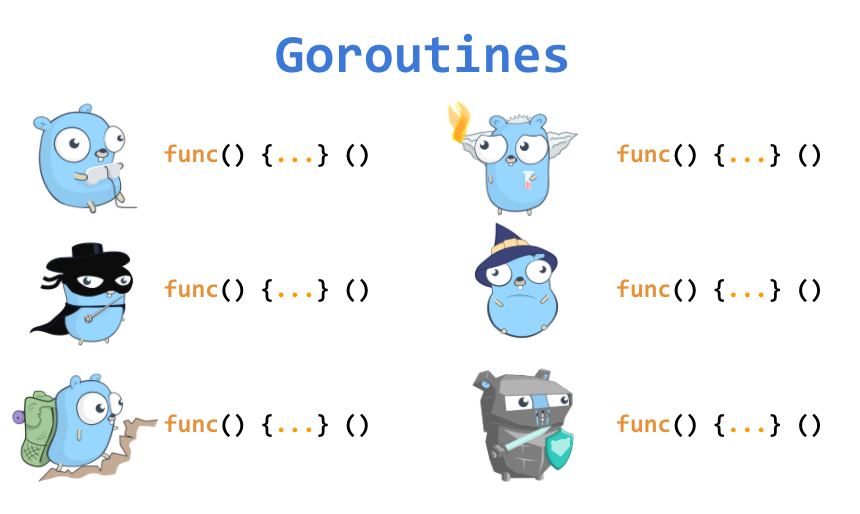
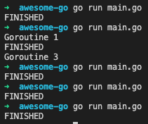

goroutine과 channel은 Golang을 공부할 때 가장 많이 접하게 되는 용어들이다. 그리고 goroutine과 channel을 통해서 동시성 프로그래밍을 사용할 수 있게 된다.  이번 블로그 포스트에서는 goroutine을 10배 잘 활용할 수 있도록 도와주는 `[golang.org/x/sync](http://golang.org/x/sync)` 패키지의 `errgroup`을 소개하려고 한다. 
<br/>

# 일반적인 goroutine

## `WaitGroup` 없는 goroutine

Goroutine들을 아무리 많이 선언해도 main function이 종료되면 goroutine들은 실행될 타이밍을 놓치면 그대로 종료 된다. 밑에 예제는 main function이 3개의 goroutine들의 작업들이 마칠 때까지 가다려주지 않는 예제이다.  

```go
func main() {

	go func() {
		fmt.Println("Goroutine 1")
	}()

	go func() {
		fmt.Println("Goroutine 2")
	}()

	go func() {
		fmt.Println("Goroutine 3")
	}()

	fmt.Println("FINISHED")
}
```
<br/>




이 프로그램을 총 5번 run 해봤는데 한번은 우연히 1,3 번째 goroutine이 실행되고 나서 main function이 종료되었지만, 나머지 4번은 main function이 먼저 종료되서 3개의 goroutine들이 아예 실행되지도 못했다. 이런 방식으로 프로그램이 종료되기를 의도하는 프로그램을 구현할 일은 거의 없을 거라고 생각한다. 그렇기 때문에 main function은 모든 goroutine들이 실행되고 goroutine들이 작업을 마무리 한 것을 다 기다리고 나서 종료되어야 한다. 
<br/>


## `WaitGroup` 있는 goroutine

Main fuction이 끝나기 전에 goroutine들이 작업을 다 마쳤는지 기다려주는 기능을 추가하는 것은 좋은 practice이다. [`sync` 패키지](https://golang.org/pkg/sync/)에 있는 `WaitGroup`을 활용하면 goroutine들이 작업을 완료할 때까지 기다리게 할 수 있다. `WaitGroup`이 사용할 수 있는 함수는 총 3개가 있다. 

1. `Add` - `WaitGroup`의 수를 늘린다. 즉, `WaitGroup`이 기다려야 할 goroutine의 수를 증가시킨다고 보면 된다.  
2. `Done` - `WaitGroup`의 수를 줄인다. `Add`와는 반대로 goroutine 작업이 완료되면 이 함수 호출을 통해 `WaitGroup`이 기다려야할 goroutine의 수를 감소시킨다.
3. `Wait` - `WaitGroup`의 수가 0 이 될 때까지 기다린다. 

```go
func main(){
  _, cancel := context.WithCancel(context.Background())
	var wg sync.WaitGroup

	for i := 0; i < 5; i++ {
		wg.Add(1) // WaitGroup이 기다려야할 goroutine의 수 증가
		go func(i int) {
			defer wg.Done() // WaitGroup이 기다려야할 goroutine의 수 감소
			if err := printIndex(i); err != nil {
				cancel()
			}
		}(i)
	}

	wg.Wait() // WaitGroup의 수가 0이 될 때까지 기다린다
}

func printIndex(n int) error {
	if n == 3 {
		return errors.New("invalid index")
	}

	fmt.Println("goroutine", n)
	return nil
}
```
<br/>


## ⚠️ Warning

`WaitGroup`을 사용하면서 가장 주의해야하는 부분은 `WaitGroup`의 수가 결국엔 0이 될 수 있도록 잘 구현이 되어야 한다는 것이다. 

- Goroutine `Add`의 수 < `Done`의 수 일 때, goroutine의 수만큼 `WaitGroup` `Add`를  안 해준 경우이다. 이때 `WaitGroup`의 수가 0보다 작아지기 때문에 `panic`이 야기된다.
- Goroutine `Add`의 수 > `Done`의 수 일 때,  goroutine이 작업을 마쳤는데도 `Done`을 호출하지 않은 경우이다. `WaitGroup`의 `Wait`은 수가 0이 될 때까지 기다리지만 이 경우에는 항상 양수의 수로 남아있기 때문에 `Wait`에 도달하는 일이 절대 없게 되고 deadlock이 발생한다.

여기서 goroutine 익명 함수를 사용할 때 **추가로 주의해야할 점**은 goroutine 밖에서 사용되는 변수를 goroutine 내부에서 사용하려면 인자로 전달해야 한다는 것이다. 만약 밑에 예제처럼 goroutine 외부에서 사용되는 변수를 바로 사용하게 되면 프로그램이 의도한 결과대로 작동하지 않을 것이다.

```go
for i := 0; i < 5; i++ {
	wg.Add(1) // WaitGroup이 기다려야할 goroutine의 수 증가
	go func() {
		defer wg.Done() // WaitGroup이 기다려야할 goroutine의 수 감소
		if err := printIndex(i); err != nil {
			cancel()
		}
	}()
}

// 결과
// goroutine 5
// goroutine 5
// goroutine 5
// goroutine 5
// goroutine 5
```
<br/>


# `errgroup`을 활용한 goroutine

[golang.org/x/sync](http://golang.org/x/sync) 패키지의 `errgroup`을 활용하면 위 `WaitGroup`만을 활용할 때 발생할 수 있는 에러들을 방지할 수 있다.

`errgroup`은 [golang.org/x/sync](http://golang.org/x/sync) 패키지에 포함되어 있는 4가지의 구현 중 하나이다. 

- `[semaphore](https://github.com/golang/sync/blob/master/semaphore/semaphore.go)` - weight가 있는 세마포어가 구현되어 있다
- `[singleflight](https://github.com/golang/sync/blob/master/singleflight/singleflight.go)` - 중복 function call suppression을 지원한다고 되어 있다 (사용 안해봐서 잘 모름...)
- `[syncmap](https://github.com/golang/sync/blob/master/syncmap/pre_go19.go)` - map type을 동시성있게 여러 goroutine내에서 사용할 수 있게 해준다.
- `[errgroup](https://github.com/golang/sync/blob/master/errgroup/errgroup.go)` - 하나의 공통적인 작업의 subtask들을 실행하는 goroutine들의 context cancellation, synchronization, 그리고 error propagation을 지원한다.

`WaitGroup`을 사용해서 goroutine을 다루던 예제를 `errgroup`을 사용하던 예제로 바꾸면 밑과 같다. `errgroup`은 특히 진행하는 작업들이 에러를 야기하는 경우가 있을 때 사용하기 유용하다.

```go
func main() {

	g, _ := errgroup.WithContext(context.Background())

	for i := 0; i < 5; i++ {
		i := i
		g.Go(func() error {
			if err := printIndex(i); err != nil {
				return err
			}

			return nil
		})
	}

	if err := g.Wait(); err != nil {
		log.Error(err)
	}
}
```
<br/>

`errgroup`의 `WithContext`에 기존의 `context`를 전달하면 Group type과 ctx를 리턴한다. 리턴된 Group type으로 goroutine을 시작할 수 있다.

기존에 `go ...` 로 goroutine을 시작하던 부분을 `g.Go(func() ...)`  로 대체할 수 있다. `errgroup`은 goroutine을 실행시키고 해당 goroutine 작업에서 에러가 발생 되는지 지켜본다.

`errgroup`의 장점은 다음과 같다:

1. `errgroup`을 사용하면  `WaitGroup`을 사용했을 때 처럼 `Add` 나 `Done`을 사용해서 **goroutine들의 수를 직접 조정할 필요가 없다**.  
2. goroutine들이 완료될 때까지 `errgroup` 이 알아서 기다리고 에러가 발생하면 어떤 에러가 발생했는지도 `if err:= g.Wait();`을 통해 바로 받아 볼 수 있다. 

`WaitGroup`을 추가하고, goroutine이 끝나는 것에 대한 처리 작업도 다 필요 없는데다 에러가 발생하면 아주 쉽게 그 에러를 찾아볼 수 있기 때문에 단순히 `WaitGroup`을 사용하는 것보다 `errgroup`을 활용한다면 g**oroutine을 10배 더 잘 활용할 수 있다**!

어떻게 `errgroup`이 그 내부를 파해쳐보려고 한다.

## `errgroup` 구현체

`errgroup`은 밑과 같이 구현되어 있다:

```go
package errgroup

import (
	"context"
	"sync"
)

type Group struct {
	cancel func()

	wg sync.WaitGroup

	errOnce sync.Once
	err     error
}

func WithContext(ctx context.Context) (*Group, context.Context) {
	ctx, cancel := context.WithCancel(ctx)
	return &Group{cancel: cancel}, ctx
}

func (g *Group) Wait() error {
	g.wg.Wait()
	if g.cancel != nil {
		g.cancel()
	}
	return g.err
}

func (g *Group) Go(f func() error) {
	g.wg.Add(1)

	go func() {
		defer g.wg.Done()

		if err := f(); err != nil {
			g.errOnce.Do(func() {
				g.err = err
				if g.cancel != nil {
					g.cancel()
				}
			})
		}
	}()
}  
```
<br/>

가장 먼저 `errgroup.WithContext(...)` 에서 첫번째로 리턴되는 `Group` struct type을 보려고 한다. 

- `cancel`은 해당 goroutine에서 사용중인 `context`를 cancel할 수 있는 함수이다.
- `wg`는 `WaitGroup` 값을 갖고 있다.
- `errOnce`는 `sync.Once` type이고, 이는 딱 한번의 액션만 수행하는 object이다. [참고](https://golang.org/pkg/sync/#Once)
- `err`는 goroutine에서 리턴되는 에러 값을 지닌다.

`WithContext` 함수는 context를 cancel 시킬 수 있는 Group struct와 cancel 가능한 `context`를 리턴한다. 

> Context가 뭔지, cancel 가능한 context가 뭔지 궁금하다면 내 이전 블로그 포스트인 **[Go의 context 패키지 이해하기](https://devjin-blog.com/golang-context/)**를 읽어보는 것을 추천한다.

```go
type Group struct {
	cancel func()

	wg sync.WaitGroup

	errOnce sync.Once
	err     error
}

func WithContext(ctx context.Context) (*Group, context.Context) {
	ctx, cancel := context.WithCancel(ctx)
	return &Group{cancel: cancel}, ctx
}
```
<br/>

그 다음에는 실제로 goroutine을 실행시키는 `Go` 함수를 보려고 한다. `WaitGroup`을 사용했던 예제의 포맷이  `Go` 함수 내부에 비슷하게 구현되어 있음을 알 수 있다.  

```go
func (g *Group) Go(f func() error) {
	g.wg.Add(1)

	go func() {
		defer g.wg.Done()

		if err := f(); err != nil {
			g.errOnce.Do(func() {
				g.err = err
				if g.cancel != nil {
					g.cancel()
				}
			})
		}
	}()
}  
```
<br/>

1. `Go` 함수가 호출되면 `Add(1)`을 호출하면서 `WaitGroup`에 새로운 goroutine 하나가 시작된다는 신호를 보내 `WaitGroup`의 count를 증가시킨다. 
2. 그 다음에는 goroutine을 실행시킨다. 
3. goroutine 맨 위에는 `defer g.wg.Done()`이 선언되어 있어서 goroutine이 작업을 마치면 `WaitGroup`의 count를 감소시키도록 되어 있다.  (위에 `WaitGroup` 만 사용한 예제와 거의 비슷한 구조죠?) 
4. 실제 goroutine의 작업은 `f()` 에서 진행된다. `Go` 함수를 호출할 때 함수의 인자로 아예 함수를 전달했었고, 그 함수가 `Go` 함수 내부에서는 `f()`로 사용되는 것이다.
    1. 에러가 없다면, `defer g.wg.Done()`이 호출된다.
    2. 하지만, 에러가 있다면 `Group` struct에 있던 `errOnce`를 호출해서 현재 발생한 에러를 `Group` struct의 `err`에 저장을 한다. 그러고 나서 `g.cancel != nil`이라면 `Group` struct의 `cancel()` 을 호출해서 `context`를 cancel한다.

`errgroup`의 구조를 보니 위에 `WaitGroup`만을 이용한 예제의 구조와 비슷함을 알 수 있다. 즉, `errgroup`은`WaitGroup`으로 goroutine들을 관리할 때  `Add` `Done` 등을 잘못 활용해서 발생할 수 있는 경우들을 보완했고, 에러를 쉽게 받을 수 있도록 구현이 되어 있다. 
<br/>


# 🔗 References

- [https://bionic.fullstory.com/why-you-should-be-using-errgroup-withcontext-in-golang-server-handlers/](https://bionic.fullstory.com/why-you-should-be-using-errgroup-withcontext-in-golang-server-handlers/)
- [http://www.inanzzz.com/index.php/post/lcxn/cancelling-all-running-goroutines-with-sync-errgroup-if-one-returns-an-error-within-golang](http://www.inanzzz.com/index.php/post/lcxn/cancelling-all-running-goroutines-with-sync-errgroup-if-one-returns-an-error-within-golang)
- [https://godoc.org/golang.org/x/sync/errgroup](https://godoc.org/golang.org/x/sync/errgroup)