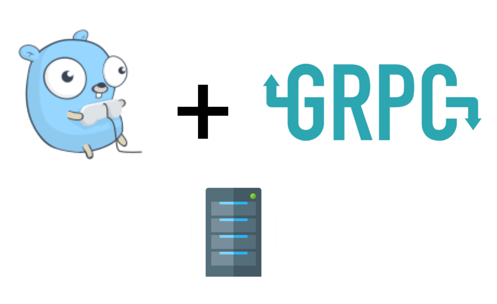

올해 입사 후에 Golang으로 많은 코드를 작성했다. Golang으로 gRPC 통신하는 여러 microservice 들을 개발했다. 그러다가 문득, Golang으로 많이 개발 하긴 했지만 내가 gRPC와 gRPC server, gRPC gateway, middleware등에 대해 정확하게 이해하고 있나? 라는 생각이 들었다. 그래서 내가 잘 이해하고 있는가 확인하기 위해 내가 사용하고 있는 기술들을 공부하며 정리 차원에서 글을 작성하려고 한다.

gRPC 개념 정리부터 gRPC로 통신하는 Golang server를 구축하는 것까지 이론부터 실전까지 step by step으로 차근차근히 시리즈로 정리해나가려고 한다. 

**Contents** 

1. [Golang gRPC server 구축하기 (1) - gRPC란 무엇인가?](https://devjin-blog.com/golang-grpc-server-1/)
2. Golang gRPC server 구축하기 (2) - gRPC server 파헤쳐보기
3. Golang gRPC server 구축하기 (3) - REST로 gRPC server와 통신하기
4. Golang gRPC server 구축하기 (4) - gRPC middleware란?

# gRPC란?

gRPC의 개념과 사용법을 바로 설명하는 것보다, gRPC 대신에 어떤걸 사용하고 있는지 살펴보면 더 gRPC를 이해하는데 도움이 될 것 같다 (다른말로 하면, gRPC의 대체제가 무엇인지). 

gRPC 대신에 흔히 가장 많이 사용되는 것이 JSON을 사용한 HTTP API이다. HTTP API는

- Client ←→ Server
- Server ←→ Server

간 서로 데이터를 주고 받을 때 사용되는 통신 방법이라고 생각할 수 있다. 

밑에 예제를 보면 Client가 HTTP로 RESTful하게 서버에게 GET으로 post들을 요청 한다. 그리고 서버는 요청에 대해 JSON으로 post들을 리스트로 전달하게 된다. (HTTP와 REST라는 개념은 거의 항상 붙어다녀서 사용된다, [이 블로그](https://gmlwjd9405.github.io/2018/09/21/rest-and-restful.html)를 참고하면 이해에 도움된다)


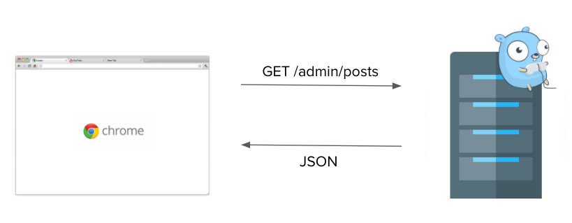

예제를 보면 알 수 있듯이 JSON을 사용한 HTTP API는 **데이터를 서로 주고 받을 때** 사용된다. 

밑에는 [gRPC 홈페이지](https://grpc.io/docs/what-is-grpc/introduction/)에 가면 볼 수 있는 그림이다. 자세히 들여다보면 위 HTTP API로 통신하는 그림과 gRPC 홈페이지 그림의 차이점은 GET대신에 `Proto Request`를 전달하는 것 같고, `JSON`대신에 `Proto Response`를 전달하는 것처럼 보인다. 결국, 큰틀에서 봤을 때는 JSON을 사용한 HTTP API와 같이 gRPC도 결국엔 client ←→ server, server ←→server간 데이터를 주고 받는 방식 중 하나라고 생각해 볼 수 있는 것이다.

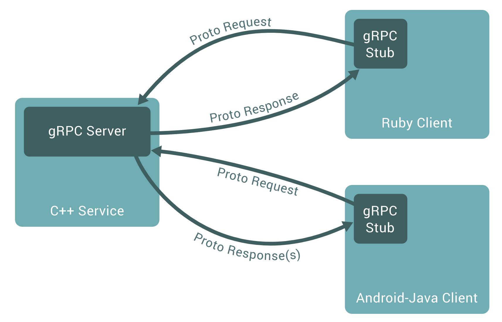

이제 gRPC가 대략 뭔지 이해를 했다면, 조금 더 깊이 gRPC에 대한 이해도를 높혀보려고 한다. 

일단 gRPC가 뭔지 알려면 `RPC`가 뭔지 짚고 넘어가야 한다. `RPC(Remote Procedure Call)`는 원래 분산환경 시스템에서 서로 다른 컴퓨터 프로그램들이 서로 다른 주소에서 서로를 호출하지만 마치 같은 주소에서 호출하는 것처럼 작동하게 하는 원격 프로시져 프로토콜이다. 즉, 프로그램들은 서로가 누구인지 알 필요 없이 정해진 방식대로 단순히 `함수 호출`만 하면 되는 것이다. 위 사진을 예제로 들면 Ruby Client는 통신하고 있는 C++ Service가 어느 위치에 있던, 어떤 코드로 작성되었던 간에 상관 없이 정해진 Proto라는 규격만 있으면 자유롭게 데이터를 주고 받을 수 있는 것이다. 

그렇다면 `g` RPC는 무엇일까?

Google이 만든 **protobuf(a.k.a protocol buffer)라는 방식을 사용해 `RPC`라는 프로토콜을 데이터를 주고 받는 플랫폼**을 의미한다. 

(🤫 Google이 만들어서 gRPC의 `g`는 google의 `g`라는 소문이 있다 - 그리고 실제로도 그럴 것이라는 의견이 지배적이다)

여기까지 왔다면, gRPC는 protobuf라는 방식을 사용해서 통신하는 프로그램들간 서로에 대한 네트워크나 주소 등에 대한 정보를 모르고도 데이터를 주고 받을 수 있는 통신 방식 중 하나라고 이해할 수 있을 것이다. 

# 왜 gRPC를 사용하는가?

gRPC가 뭔지 이해했다면, 도대체 어떤 장점들이 있길래 gRPC 사용이 요즘에 🔥 핫해지고 🔥 있는지 알아보려고 한다. 

feat. gRPC를 사용하고 있는 🚀 스타트업들
- [뱅크샐러드 기술 블로그 - 프로덕션 환경에서 사용하는 golang과 gRPC](https://blog.banksalad.com/tech/production-ready-grpc-in-golang/)
- [당근마켓 기술 블로그 - 안심번호 마이크로서비스 개발하기](https://medium.com/daangn/%EC%95%88%EC%8B%AC%EB%B2%88%ED%98%B8-%EB%A7%88%EC%9D%B4%ED%81%AC%EB%A1%9C%EC%84%9C%EB%B9%84%EC%8A%A4-%EA%B0%9C%EB%B0%9C%ED%95%98%EA%B8%B0-fb1a8817b059)
- [버즈빌 기술 블로그 - gRPC를 쓰면 REST가 공짜!?](https://www.mobiinside.co.kr/2019/09/26/buzzvil-grpc/)

gRPC의 장점은 다음과 같다.

1. 빠르다

    protocol buffer라는 방식은 XML과 같이 구조화된 데이터를 직렬화(serialize)하는 방식인데 압축을 해서 훨씬 빠르고, 사용법도 간단하고, 데이터의 크기도 작다. JSON 직렬화보다 최대 8배 더 빠를 수 있다고 한다 [ref](https://docs.microsoft.com/ko-kr/dotnet/architecture/cloud-native/grpc). 

2. 엄격한 사양 덕분에 생기는 가이드의 존재 유무 (IDL)

    gRPC로 통신하기 위해서는 protocol buffer로 어떻게 데이터를 주고 받을 것인지 정의해놔야 한다. 그렇기 때문에, 데이터를 주고 받을 때는 어떤 형식으로 전달해야하는지에 대한 가이드가 코드로 생성되기 때문에 따로 API 문서같은 것을 만들 필요가 없게 되는 것이다. 여러 회사에서도 이런 엄격한 사양 덕분에 개발 생산성이 높아지는 이유도 있어서 gRPC를 사용하는 경우가 다수 있다. ref. [뱅크샐러드 기술 블로그](https://blog.banksalad.com/tech/production-ready-grpc-in-golang/)

3. HTTP/2

    gRPC는 HTTP/2를 지원한다. gRPC는 HTTP/1.1과 호환되지만 HTTP/2만의 고급 기능들도 사용할 수 있다. 동일한 연결로 병렬적인 요청을 처리할 수 있고, 연결을 유지해서 connection을 매번 하는데 사용되는 cost도 줄일 수 있다. 

gRPC의 이러한 장점들은 요새 유행하고 있는 Microservice에 안성맞춤이다. Microservie는 간단히 말하면 서비스의 모든 기능들을 하나의 큰 서버에 몰아놓는 것이 아닌, 각각의 독립적인 기능으로 여러 서버로 만들고 서버들간 통신하게 만드는 아키텍처를 의미한다. ref. [마이크로서비스 아키텍처의 장단점](https://www.popit.kr/why-microservice/)

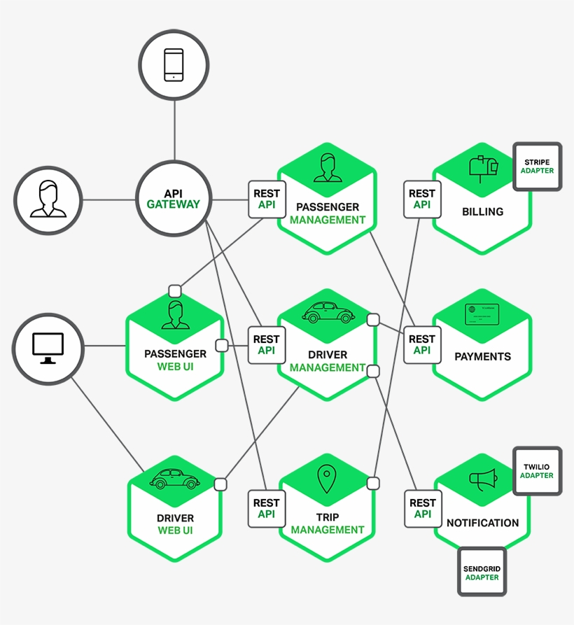

Microservice에는 독립적인 기능을 수행하는 서버들이 수많이 있기 때문에 이 서버들간 내부 통신이 매우 많게 된다. 처리하는 데이터양이 많기 때문에 효율적으로 데이터를 통신할 수 있어야 한다. 그리고 gRPC는 JSON, XML보다 훨씬 빠르고 효율적으로 많은 데이터를 압축해서 사용하기 때문에 이런 아키텍처에 적합한 것이다. 추가로, 서버간 통신할때 어떤 request를 보내야 하는지 엄격한 사양으로 코드로 정의되어 있으니 microservice들을 관리하는데 더 수월한 것이다.

물론, gRPC의 단점도 존재하긴 한다. 

- 일단 가장 크게 브라우저와 서버간은 gRPC통신이 아직 지원되지 않는다. 그래서 브라우저에서는 흔히 JSON으로 서버로 요청하면 서버는 grpc-gateway를 통해 protobuf 형식으로 데이터를 변환한 뒤에 사용하게 된다.
- 그리고, 사람이 읽을 수 없는 데이터 형식이기 때문에 네트워크 단에서 데이터를 보고 싶으면 추가적인 작업들이 필요하다.

이와 같이 gRPC에는 장단점들이 있지만, microservice 아키텍처에서는 사용하기 적합한 기술이기 때문에 단점이 있음에도 불구하고 많은 회사들이 해당 기술을 적용하고 있는 추세인 것이다.

(사용빈도가 높아지고는 있으나, JSON을 사용한 HTTP API 통신에 비해서는 아직도 점유율은 매우 낮긴 하다)

앞서 gRPC와 protobuf에 대해 간략히 소개를 들었으니 이제 gRPC를 사용한 server를 구축해보려고 한다.

# 간단한 gRPC server 구현하기

Protobuf는 현재 C++, Java, Python, Go, Ruby, Objective-C등을 지원하지만([ref](https://developers.google.com/protocol-buffers/docs/overview)), 이 포스트에서는 내가 주로 사용하는 Go 위주로 다루려고 한다. 

Go 언어를 설치하는 방법들은 워낙 다른 블로그들에서 자세히 나와있기 때문에 따로 다루지 않으려고 한다. 다만, 내가 Go를 처음 설치해서 사용하려고 할 때 참고했던 블로그들 몇개만 공유하려고 한다:

- [예제로 배우는 Go 프로그래밍](http://golang.site/go/article/2-Go-%EC%84%A4%EC%B9%98%EC%99%80-Go-%ED%8E%B8%EC%A7%91%EA%B8%B0-%EC%86%8C%EA%B0%9C)
- [Go언어 시작하기 - Golang Korean Community](https://golangkorea.github.io/post/go-start/getting-start/)
- [go mod를 이용한 패키지 관리 방법](https://lejewk.github.io/go-mod/)
- [golang - 설치와 GoPath](https://jacking75.github.io/go_install/)
- [(번역) Go Modules 사용하기](https://johngrib.github.io/wiki/golang-mod/)

위 예제들을 참고하면 Go 언어를 컴퓨터에 잘 설치할 수 있을 것이다. 그렇다면 이제 간단한 gRPC server를 구현해보려고 한다. 

(블로그에 나오는 코드들은 전부 [Github Repository](https://github.com/dojinkimm/go-grpc-example)에서도 볼 수 있다)

먼저 `go mod init 모듈 이름`으로 Go 모듈을 만든다.

```bash
// 예시
go mod init github.com/dojinkimm/go-grpc-example
```

`go.mod`에 다른 모듈들을 import할 수 있고, import하게 되면 해당 모듈들을 프로젝트 내에서 자유롭게 사용 할 수 있게 된다. `go.mod` 파일이 생성되고 나서는 `grpc` 모듈을 import해야 한다. Go로 구현된 gRPC의 코드는 오픈소스로 [grpc-go repository](https://github.com/grpc/grpc-go)에 있다. `go get -u` 모듈 이름 으로 `grpc-go` 패키지를 import 해온다.

```bash
go get -u google.golang.org/grpc
```

`grpc-go` 모듈을 import하면 `main.go`에서 불러와서 사용할 수 있다. gRPC server를 구현하는 것은 매우 간단한다. 

1. 먼저 `net` 표준 라이브러리 패키지([net package](https://golang.org/pkg/net/))를 사용해서 어떤 네트워크에 어떤 port number로 서버를 실행시킬지 정의한다.
2. import한 [google.golang.org/grpc](http://google.golang.org/grpc) 모듈에서 `NewServer()` 함수를 호출해와서 gRPC server를 만든다 ([ref 코드](https://github.com/grpc/grpc-go/blob/d79063fdde284ef7722591e56c72143eea59c256/server.go#L514-L544)). 
3. `net` 패키지를 사용해서 만든 listener connection을 `Serve()`라는 함수의 인자로 넣어준다 ([ref 코드](https://github.com/grpc/grpc-go/blob/d79063fdde284ef7722591e56c72143eea59c256/server.go#L693-L785)). 

```go
// simple/main.go
package main

import (
	"log"
	"net"

	"google.golang.org/grpc"
)

const portNumber = "9000"

func main(){
	lis, err := net.Listen("tcp", ":" + portNumber)
	if err != nil {
		log.Fatalf("failed to listen: %v", err)
	}

	grpcServer := grpc.NewServer()

	log.Printf("start gRPC server on %s port", portNumber)
	if err := grpcServer.Serve(lis); err != nil {
		log.Fatalf("failed to serve: %s", err)
	}
}
```

이제 이 `main.go` 를 `go run simple/main.go`로 실행시키면 9000 port number에 gRPC server를 실행시킬 수 있게 된다.

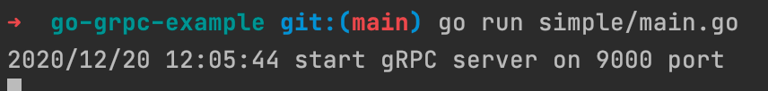

물론, 아무 request도 못 받는 무용지물의 gRPC server이지만, 이렇게 몇줄의 코드로 간단한 gRPC server를 구현했다.

# Protobuf 서비스 정의하기

위에서 gRPC server를 구현하는 법을 배웠으니, 이제는 microservice에 맞게 특정 서비스를 담당하는 gRPC server를 구현해보려고 한다. gRPC sever는 protobuf 라는 방식을 사용해서 정해진 양식대로 데이터를 주고 받는다. 그래서, protobuf로 만들 gRPC server의 메세지들을 먼저 정의 해야 한다.

이번에 구현하게 될 gRPC server는 유저의 정보를 담당하는 microservice 형태이다. Protobuf 사용법에 대해 더 자세히 알고 싶으면 밑에 두 사이트를 참고하면 도움이 많이 된다.

- [Google Protobuf Buffer Developer Guide](https://developers.google.com/protocol-buffers/docs/proto3)
- [Protocol Buffer Golang Github Repo](https://github.com/protocolbuffers/protobuf-go/tree/v1.25.0)

User 서비스는 두 개의 rpc를 갖도록 구현할 예정이다. 

1. `GetUser`는 user id를 전달하면, user id에 맞는 유저의 정보를 리턴하는 rpc이다
2. `ListUsers`는 서비스에 존재하는 모든 유저들의 유저 정보를 리턴하는 rpc이다

```protobuf
// user/user.proto
syntax = "proto3";

package user;

option go_package = "github.com/dojinkimm/go-grpc-example/user";

service User {
    rpc GetUser(GetUserRequest) returns (GetUserResponse);
    rpc ListUsers(ListUsersRequest) returns (ListUsersResponse);
}

message UserMessage {
    string user_id = 1;
    string name = 2;
    string phone_number = 3;
    int32 age = 4;
}

message GetUserRequest {
    string user_id = 1;
}

message GetUserResponse {
    UserMessage user_message = 1;
}

message ListUsersRequest{}

message ListUsersResponse {
    repeated UserMessage user_messages = 1;
}
```

`proto`를 정의했다면, 그 다음은 실제로 gRPC server에서 사용할 수 있도록 `protoc` 컴파일러를 사용해서 컴파일 해야 한다. [ref](https://developers.google.com/protocol-buffers/docs/gotutorial#compiling-your-protocol-buffers)

`protoc` 컴파일러를 다운 받고 나서, 밑의 명령어를 활용해서 Golang protobuf plugin을 설치한다. 

```bash
go install google.golang.org/protobuf/cmd/protoc-gen-go
```

설치가 완료되었다면 이제 서비스를 정의한 `proto`  파일을 gRPC server에서 사용할 수 있도록 컴파일 해준다. `user/user.proto`에 파일을 생성했기 때문에 밑의 명령어를 사용해서 컴파일 해준다.

```bash
protoc -I=. \
	    --go_out . --go_opt paths=source_relative \
	    --go-grpc_out . --go-grpc_opt paths=source_relative \
	    user/user.proto
```

컴파일이 되면 `user.proto`파일이 있는 폴더에 `user.pb.go`와 `user_grpc.pb.go` 파일들이 함께 생성된다.

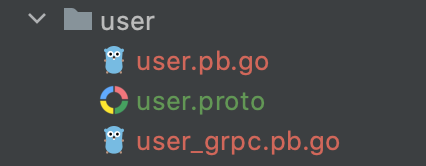

# 정의한 Protobuf로 gRPC server 구현하기

User 서비스를 정의했으니 이제, 서비스를 담당하는 microservice형태의 gRPC server를 구현해보려고 한다. User들의 정보를 가져오는 gRPC server이기 때문에 실제 microservice에서라면 user 들의 정보를 DB에서 가져오겠지만, 예제이기 때문에 static하게 선언을 해놨다. 

```go
// data/user.go
package data

import (
	pb "github.com/dojinkimm/go-grpc-example/user"
)

var UserData = []*pb.UserMessage{
	{
		UserId: "1",
		Name: "Henry",
		PhoneNumber: "01012341234",
		Age: 22,
	},
	{
		UserId: "2",
		Name: "Michael",
		PhoneNumber: "01098128734",
		Age: 55,
	},
	{
		UserId: "3",
		Name: "Jessie",
		PhoneNumber: "01056785678",
		Age: 15,
	},
	{
		UserId: "4",
		Name: "Max",
		PhoneNumber: "01099999999",
		Age: 37,
	},
	{
		UserId: "5",
		Name: "Tony",
		PhoneNumber: "01012344321",
		Age: 25,
	},
}
```

user 서비스에는 총 5명의 유저가 존재하고 유저들이 갖고 있는 값들은 `user.proto`에서 정의한 값들과 같다. 

```go
// simple-user/main.go
import (
	"context"
	"log"
	"net"

	"google.golang.org/grpc"

	"github.com/dojinkimm/go-grpc-example/data"
	pb "github.com/dojinkimm/go-grpc-example/user"
)

const portNumber = "9000"

type userServer struct {
	pb.UnimplementedUserServer
}

// GetUser returns user message by user_id
func (s *userServer) GetUser(ctx context.Context, req *pb.GetUserRequest) (*pb.GetUserResponse, error) {
	userID := req.UserId

	var userMessage *pb.UserMessage
	for _, u := range data.UserData {
		if u.UserId != userID {
			continue
		}
		userMessage = u
		break
	}

	return &pb.GetUserResponse{
		UserMessage: userMessage,
	}, nil
}

// ListUsers returns all user messages
func (s *userServer) ListUsers(ctx context.Context, req *pb.ListUsersRequest) (*pb.ListUsersResponse, error) {
	userMessages := make([]*pb.UserMessage, len(data.UserData))
	for i, u := range data.UserData {
		userMessages[i] = u
	}

	return &pb.ListUsersResponse{
		UserMessages: userMessages,
	}, nil
}

func main(){
	lis, err := net.Listen("tcp", ":" + portNumber)
	if err != nil {
		log.Fatalf("failed to listen: %v", err)
	}

	grpcServer := grpc.NewServer()
	pb.RegisterUserServer(grpcServer, &userServer{}) // user service를 gRPC server에 등록하는 부분

	log.Printf("start gRPC server on %s port", portNumber)
	if err := grpcServer.Serve(lis); err != nil {
		log.Fatalf("failed to serve: %s", err)
	}
}
```
유저들의 정보를 정의했으니, 이제 `user.proto`를 사용해 user service를 담당하는 gRPC server를 구현할 차례이다. 기존 틀은 위에서 구현한 service 없는 gRPC server와 유사하다. 추가된 부분은 2가지이다.

- User 서비스를 gRPC server에 등록하는 부분
- User 서비스의 rpc들을 구현한 부분


gRPC server에서 정의한 user 서비스를 사용하도록 만드는 것은 매우 간단하다. gRPC server에 정의한 user 서비스를 사용하도록 만드는 함수가 이미 컴파일된 `user_grpc.pb.go` 파일에 존재한다. `RegisterUserServer` 함수를 가져와서 user 서비스를 등록하면 된다. 이 작업이 끝나면 아주 간단하게 user 서비스를 담당하는 gRPC server가 생성되는 것이다. 
```go
type userServer struct {
	pb.UnimplementedUserServer
}

...
grpcServer := grpc.NewServer()
pb.RegisterUserServer(grpcServer, &userServer{})
...
```

그 다음에는 `user.proto`에 정의한 rpc들을 구현하는 차례가 남았다. user_id로 유저의 정보를 갖고오는 `GetUser` rpc와 유저들의 정보 모두를 갖고오는 `ListUsers` rpc는 밑과 같이 구현할 수 있을 것이다. 로직은 간단하니 따로 설명하지 않겠다.

```go
// GetUser returns user message by user_id
func (s *userServer) GetUser(ctx context.Context, req *pb.GetUserRequest) (*pb.GetUserResponse, error) {
	userID := req.UserId

	var userMessage *pb.UserMessage
	for _, u := range data.UserData {
		if u.UserId != userID {
			continue
		}
		userMessage = u
		break
	}

	return &pb.GetUserResponse{
		UserMessage: userMessage,
	}, nil
}

// ListUsers returns all user messages
func (s *userServer) ListUsers(ctx context.Context, req *pb.ListUsersRequest) (*pb.ListUsersResponse, error) {
	userMessages := make([]*pb.UserMessage, len(data.UserData))
	for i, u := range data.UserData {
		userMessages[i] = u
	}

	return &pb.ListUsersResponse{
		UserMessages: userMessages,
	}, nil
}
```

user 서비스를 gRPC server에 등록하고 + 필요한 rpc들을 구현했다면 이제 실제로 이 gRPC server가 의도한대로 작동하는지 확인이 필요하다. 흔히 사용되는 JSON으로 통신하는 HTTP API라면 `localhost:9000/users/:user_id` 이런 식으로 curl이나 Postman 같은 툴로 잘 되는지 확인할 수 있었을 것이다. 하지만, gRPC server는 따로 curl로 접근할 수 있는 HTTP endpoint가 없기 때문에 기존 방식으로는 확인할 수 없다.

(grpc-gateway를 활용하면 가능하고 이 부분은 다른 포스트에서 다룰 예정)

gRPC server로 curl하려면 그걸 가능해주는 툴들을 설치해야 한다:

- [grpccurl](https://github.com/fullstorydev/grpcurl) - cli 툴
- [bloomrpc](https://github.com/uw-labs/bloomrpc) - gui 툴

 

이 포스트에서는 `bloomrpc`를 활용해서 user 서비스를 담당하는 gRPC server가 잘 작동하는지 확인해보려고 한다. 설치 방법은 생략하고 사용법으로 바로 들어가보려고 한다.

### 1. Proto 파일 import하기

프로그램의 왼쪽위에 + 를 눌러서 `proto` 파일을 찾습니다. 

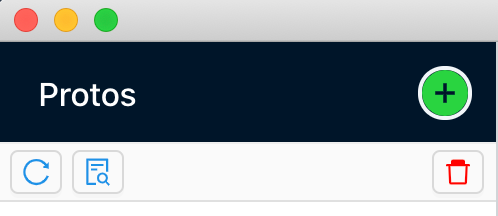

`user.proto`를 찾아서 열기를 누릅니다.


`user.proto`를 import하게 되면 밑과 같이 `user.proto` 에 정의된 rpc들에 통신할 수 있는 형태가 만들어집니다.

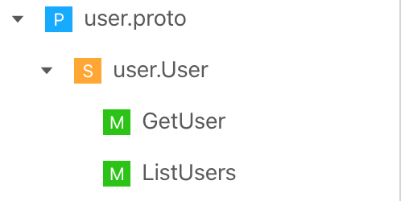

### 2. gRPC 통신하기

먼저 `main.go`를 실행시켜서 `http://localhost:9000` 에 gRPC server를 열어줍니다.

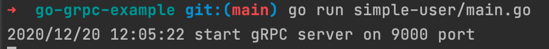

Server를 실행시키고 나서 `bloomrpc`에서 생성해준 rpc들을 클릭하면 자동으로 request를 보낼 수 있는 형식으로 포맷을 변경시켜줍니다. 그런 다음에 request 형식에 맞게 데이터를 보내면 의도한 대로 데이터가 잘 response로 오는 것을 확인할 수 있습니다.

`GetUser` rpc 호출 결과
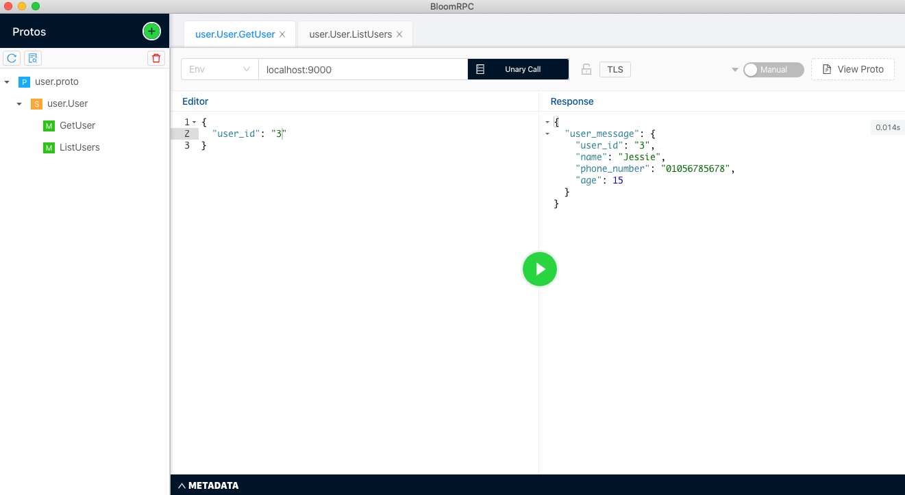

`ListUsers` rpc 호출 결과
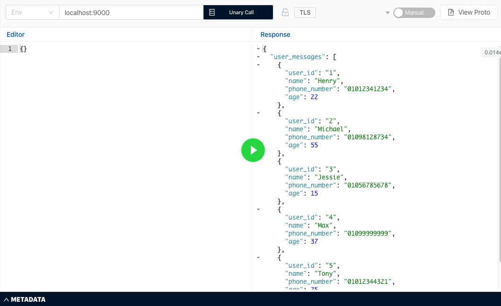


# 마무리

Golang gRPC server 구축하기 시리즈의 1편이 끝났다. 이번 포스트에서는 gRPC가 무엇인지에 대한 개념을 잠깐 짚어봤고, gRPC로 통신하는 Golang server를 간단하게 구축해봤다. 다음 시리즈 2편에서는 grpc-go에서 지원하는 많은 유용한 기능들을 파헤쳐보려고 한다(ex. health checking, load balanding 등등), 그리고 실제로 microservice에서 gRPC server들간 어떻게 통신을 하는지 알아보려고 한다. 

블로그 글을 작성하면서 나도 새로 배우는 것들이 있다보니 이해를 잘 하지 못해 충분히 설명하지 못한 부분도 있을 것 같다. 보완이 필요한 부분을 보시는 분들은 언제나 피드백 주시면 감사하겠습니다. 

이 예제에 나오는 모든 코드들은 [Github Repository](https://github.com/dojinkimm/go-grpc-example)에 공개되어 있다.