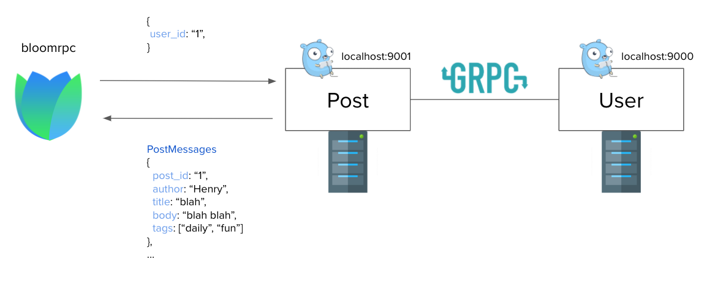
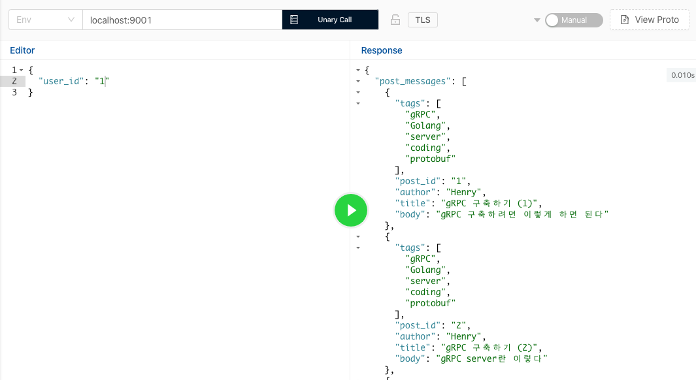
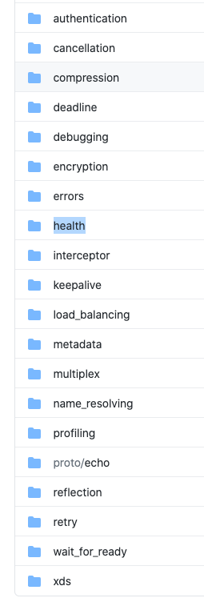
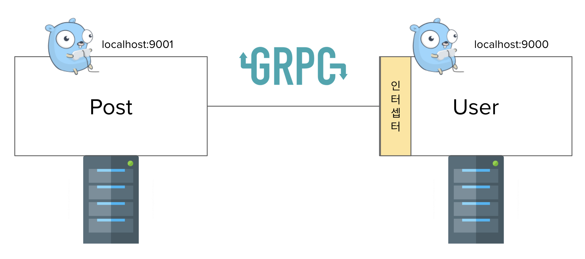
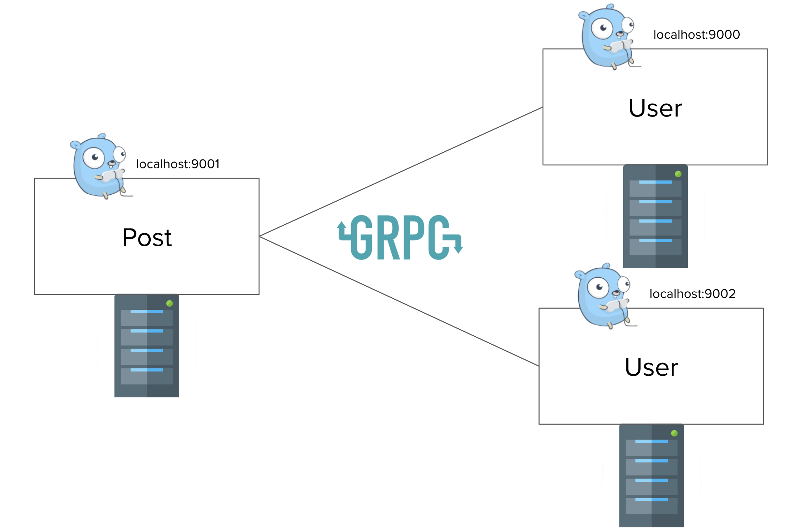

이번 블로그 글은 Golang gRPC server 구축하기의 2번째 글이다. 지난번 [블로그 글](https://devjin-blog.com/golang-grpc-server-1/)에서는

- gRPC의 개념
- gRPC의 장단점과 왜 요새 관심을 많이 받고 있는지
- 간단히 protobuf로 gRPC server 구성하는 방법

들에 대해서 다뤘다. 

이번 글에서는 microservice architecture에서 gRPC server들간 통신하는 방법과 gRPC server를 구축할때 유용한 feature들을 소개하려고 한다. ([grpc-go repository의 example들](https://github.com/grpc/grpc-go/tree/master/examples)을 다루며 설명할 예정이다)

**Contents**

1. [Golang gRPC server 구축하기 (1) - gRPC란 무엇인가?](https://devjin-blog.com/golang-grpc-server-1/)
2. [Golang gRPC server 구축하기 (2) - gRPC server 파헤쳐보기]((https://devjin-blog.com/golang-grpc-server-2/))
3. Golang gRPC server 구축하기 (3) - RESTful하게 gRPC server와 통신하기
4. Golang gRPC server 구축하기 (4) - gRPC middleware란?

# 새로운 Protobuf service 정의하기

Server간 gRPC통신 하는 예제를 하나 만들어서 microservice architecture에서 어떻게 server들간 통신하는지 설명하려고 한다. 이전 블로그 글에서 유저의 정보를 알려주는 `User` 서비스를 담당하는 gRPC server를 구축했었다. 이 글에서는 `Post` 서비스를 담당하는 gRPC server를 하나 더 만들어서 `User` 서비스와 통신하도록 만드려고 한다.

`Post` 서비스는 유저들이 작성한 Post(게시글)들을 담당하고 있는 서비스이고 두개의 rpc를 갖도록 구현하려고 한다. ([post.proto](https://github.com/dojinkimm/go-grpc-example/blob/main/protos/post/post.proto))

1. `ListPostsByUserId` user id를 전달하면, user id에 해당하는(유저가 작성한) 모든 Post(게시글)들을 리턴하는 rpc이다
2. `ListPosts`는 서비스에 존재하는 모든 Post(게시글)들을 리턴하는 rpc이다

`Post` 서비스는 어떤 user id가 어떤 Post(게시글)들을 만들었는지는 알고 있지만, 그 user id에 해당하는 유저의 이름은 모른다고 가정을 해보자. 하지만, protobuf 정의에 의해 `Post` 서비스의 rpc들은 `Author`이란 필드에 유저의 이름을 넣어서 보내줘야 한다. 

```go
// data/post.go
package data

import (
	postpb "github.com/dojinkimm/go-grpc-example/protos/post"
)

type PostData struct {
	UserID string
	Posts  []*postpb.PostMessage
}

var UserPosts = []*PostData{
	{
		UserID: "1",
		Posts: []*postpb.PostMessage{
			{
				PostId: "1",
				Author: "", // Post 서비스는 자체적으로 유저의 이름은 알지 못한다
				Title:  "gRPC 구축하기 (1)",
				Body:   "gRPC 구축하려면 이렇게 하면 된다",
				Tags:   []string{"gRPC", "Golang", "server", "coding", "protobuf"},
			},
			{
				PostId: "2",
				Author: "", // Post 서비스는 자체적으로 유저의 이름은 알지 못한다
				Title:  "gRPC 구축하기 (2)",
				Body:   "gRPC server란 이렇다",
				Tags:   []string{"gRPC", "Golang", "server", "coding", "protobuf"},
			},
...
```

`Author`이란 필드에 유저의 이름을 채워서 보내기 위해서 `Post` 서비스는 유저의 모든 정보들을 알고 있는 `User` 서비스와의 통신을 통해 해당 데이터를 받아와야 한다. 마침 `Post` 서비스는 어떤 user id가 어떤 Post(게시글)들을 만들었는지 알고, `User` 서비스는 user id만 request로 보내주면 그에 해당하는 유저 정보를 리턴하는 `GetUser` rpc가 있기 때문에 가능한 것이다.

그래서, 다음과 같은 구조로 `Post` 서비스와 `User` 서비스는 통신하게 된다. `Post` 서비스는 `User` 서비스에 user id에 해당하는 유저의 정보를 받고 그 정보중에서 유저의 이름만 빼와서 `Author` 이란 메세지 필드값에 유저의 이름 값을 채워주는 것이다. 

`Post` 서비스와의 통신은 지난 블로그에서 사용한 [bloomrpc](https://github.com/uw-labs/bloomrpc)를 사용하려고 한다. 



# Microservice간 gRPC로 통신하는 server들 구현하기

일단, `User` service를 담당하는 server의 코드는 저번 글에서 구현한 그대로를 가져다 사용하려고 한다 (ref. [simple-user](https://github.com/dojinkimm/go-grpc-example/blob/main/simple-user/main.go)). 

`Post` service를 담당하는 server의 코드는 다음과 같다.

```go
// simple-client-server/post-server/main.go
package main

import (
	"context"
	"log"
	"net"

	"google.golang.org/grpc"

	"github.com/dojinkimm/go-grpc-example/data"
	postpb "github.com/dojinkimm/go-grpc-example/protos/post"
	userpb "github.com/dojinkimm/go-grpc-example/protos/user"
	client "github.com/dojinkimm/go-grpc-example/simple-client-server"
)

const portNumber = "9001"

type postServer struct {
	postpb.PostServer

	userCli userpb.UserClient
}

// ListPostsByUserId returns post messages by user_id
func (s *postServer) ListPostsByUserId(ctx context.Context, req *postpb.ListPostsByUserIdRequest) (*postpb.ListPostsByUserIdResponse, error) {
	userID := req.UserId

	resp, err := s.userCli.GetUser(ctx, &userpb.GetUserRequest{UserId: userID})
	if err != nil {
		return nil, err
	}

	var postMessages []*postpb.PostMessage
	for _, up := range data.UserPosts {
		if up.UserID != userID {
			continue
		}

		for _, p := range up.Posts {
			p.Author = resp.UserMessage.Name
		}

		postMessages = up.Posts
		break
	}

	return &postpb.ListPostsByUserIdResponse{
		PostMessages: postMessages,
	}, nil
}

// ListPosts returns all post messages
func (s *postServer) ListPosts(ctx context.Context, req *postpb.ListPostsRequest) (*postpb.ListPostsResponse, error) {
	var postMessages []*postpb.PostMessage
	for _, up := range data.UserPosts {
		resp, err := s.userCli.GetUser(ctx, &userpb.GetUserRequest{UserId: up.UserID})
		if err != nil {
			return nil, err
		}

		for _, p := range up.Posts {
			p.Author = resp.UserMessage.Name
		}

		postMessages = append(postMessages, up.Posts...)
	}

	return &postpb.ListPostsResponse{
		PostMessages: postMessages,
	}, nil
}

func main() {
	lis, err := net.Listen("tcp", ":"+portNumber)
	if err != nil {
		log.Fatalf("failed to listen: %v", err)
	}

	userCli := client.GetUserClient("localhost:9000")
	grpcServer := grpc.NewServer()
	postpb.RegisterPostServer(grpcServer, &postServer{
		userCli: userCli,
	})

	log.Printf("start gRPC server on %s port", portNumber)
	if err := grpcServer.Serve(lis); err != nil {
		log.Fatalf("failed to serve: %s", err)
	}
}
```

`Post` gRPC server의 구현은 `User` gRPC server와 유사하다. 크게 바뀐 부분은 `User` gRPC server를 호출하는 부분이 추가된 것이다.

일단, 예제에서는 localhost에 2개의 서버를 동시에 띄울 것이기 때문에 port number를 다르게 가져갔다 - 기존 `User` gRPC server는 `localhost:9000`이고, `Post` gRPC server는 `http://localhost:9001`. 그런 다음 gRPC server에 등록할 `Post` 서비스를 struct로 정의했고, 해당 struct에서 `User` 서비스를 사용할 수 있도록 `userpb.UserClient` 타입을 선언해줬다. 그 다음에는 `User` gRPC 서버와 connection을 맺는 userCli를 선언 한 다음에 struct에 connection 값을 넣어줬다. 

즉, `Post` gRPC server내에서 `User` gRPC server에 접근할 수 있는 client를 struct로 들고 있어서 코드 내에서 언제든지 접근할 수 있게 된 것이다.

```go
...
const portNumber = "9001"

type postServer struct {
	postpb.PostServer

	userCli userpb.UserClient
}

...
	userCli := client.GetUserClient("localhost:9000") // connection 선언
	grpcServer := grpc.NewServer()
	postpb.RegisterPostServer(grpcServer, &postServer{
		userCli: userCli, // struct에 User gRPC server와 통신할 수 있는 client 넣어줌
	})

...
```

`User` gRPC server와의 connection을 유지시켜주는 코드는 다른 파일에 구현을 했다. Client connection을 리턴하는 함수의 구현체는

- [뱅크샐러드 - 프로덕션 환경에서 사용하는 golang과 gRPC](https://blog.banksalad.com/tech/production-ready-grpc-in-golang/)
- [grpc-go의 예제](https://github.com/grpc/grpc-go/blob/master/examples/helloworld/greeter_client/main.go)

를 참고했다. `sync.Once`는 gRPC server 내에서 싱글톤으로 초기에 한번만 client를 생성하고, 한번만 생성되고 나서는 각 rpc내에서는 같은 client를 계속 사용하기 위함이다. 

`grpc.Dial`([ref](https://github.com/grpc/grpc-go/blob/53788aa5dcb46078eb29b05869a7472a5cd886e8/clientconn.go#L103-L106))은 target(여기서는 gRPC service)와의 connection을 생성해주는 grpc-go의 함수이다. 첫 인자로 connection을 맺을 target 정보를 받고, 그 외에 인자들은 connection을 맺을 때 필요한 추가적인 [dial option](https://github.com/grpc/grpc-go/blob/master/dialoptions.go)들이다.

```go
// // simple-client-server/user_client.go
package simple_client_server

import (
	"sync"

	"google.golang.org/grpc"

	userpb "github.com/dojinkimm/go-grpc-example/protos/user"
)

var (
	once sync.Once
	cli  userpb.UserClient
)

func GetUserClient(serviceHost string) userpb.UserClient {
	once.Do(func() {
		conn, _ := grpc.Dial(serviceHost,
			grpc.WithInsecure(),
			grpc.WithBlock(),
		)

		cli = userpb.NewUserClient(conn)
	})

	return cli
} 
```

예제에서는 2가지의 dial option들만 추가했다. 

하나는 `WithInsecure`이고, 이 옵션은 transport security를 비활성화 시킨다. 즉, 이 옵션을 추가하면서 `Post` gRPC server와 `User` gRPC server가 통신을 할 때 별다른 보안을 챙기지 않겠다는 의미이다. 보안이 중요하고 서버간 통신이 외부에 노출될 수 있는 상황이면 이 옵션을 제거해서 connection을 맺을 때 credential을 확인하는 절차가 필요하다. 예제에서는 해당 옵션이 굳이 불필요하기 떄문에 추가했다.

다른 하나인 `WithBlock`은 connection이 맺어지기 전까지 block을 해놓는 옵션이다. 만약 connection이 당장 맺어지지 않아도 된다면 이 옵션을 제거해도 된다. 이 옵션이 없다면 default로는 백그라운드에서 connection이 이뤄지게 된다.

더 많은 dial option들이 존재하지만, 현재 예제에서는 위 2개의 옵션들만 있어도 충분하기 때문에 다른 option들은 추가하지 않았다.

위 step들을 거치고 나면 이제 `Post` gRPC server는 `User` gRPC server와 통신할 수 있게 되었다. 이제 `Post`의 rpc내에서 유저의 정보를 갖고 오려면 어떻게 해야하는지 설명하려고 한다.

```go
// ListPostsByUserId returns post messages by user_id
func (s *postServer) ListPostsByUserId(ctx context.Context, req *postpb.ListPostsByUserIdRequest) (*postpb.ListPostsByUserIdResponse, error) {
	userID := req.UserId

	resp, err := s.userCli.GetUser(ctx, &userpb.GetUserRequest{UserId: userID})
	if err != nil {
		return nil, err
	}

	var postMessages []*postpb.PostMessage
	for _, up := range data.UserPosts {
		if up.UserID != userID {
			continue
		}

		for _, p := range up.Posts {
			p.Author = resp.UserMessage.Name
		}

		postMessages = up.Posts
		break
	}

	return &postpb.ListPostsByUserIdResponse{
		PostMessages: postMessages,
	}, nil
}
```

user id를 전달하면 user id에 해당하는 모든 Post(게시물)들을 리턴해주는 rpc의 구현이다. 가장 먼저 user id에 해당하는 유저의 정보가 필요하기 때문에 struct에 저장해놓은 `userCli`를 통해 `User` gRPC server의 `GetUser` rpc를 호출한다. Protobuf로 request는 어떤 값을 보내야 하는지 매우 잘 알기 때문에 형식에 맞춰서 request를 보내준다. Response도 protobuf로 정의해놨기 때문에 `GetUser`를 호출하면 유저의 정보가 response로 오는 것을 잘 알 수 있다.

```go
resp, err := s.userCli.GetUser(ctx, &userpb.GetUserRequest{UserId: userID})
if err != nil {
	return nil, err
}
```

유저의 정보를 갖고 와서 유저의 정보를 이제 알고 있기 때문에, 리턴해야하는 Post(게시물)들의 `Author` 필드에 유저의 이름 값을 저장한다.

```go
	var postMessages []*postpb.PostMessage
	for _, up := range data.UserPosts {
		if up.UserID != userID {
			continue
		}

		for _, p := range up.Posts {
			p.Author = resp.UserMessage.Name
		}

		postMessages = up.Posts
		break
	}
```

`Post` 서비스의 `ListPostsByUserId` 를 호출하면 그림과 같이 `Author` 값이 비어있지 않고 `User` 서비스에 있는 유저 정보들이 제대로 반영이 된 것을 알 수 있다.



# gRPC 형식 (ex. Unary, Stream...)

`Post` 서비스와 `User` 서비스가 client-server로 통신하는 방법은 Unary rpc 형식으로 구현되었다. 그렇다면 어떤 gRPC 형식들이 있고, 각각은 어떤 역할을 하는 것일까?

참고로, 밑의 글들을 참고했다:

- [grpc-go gotutorials](https://github.com/grpc/grpc-go/blob/master/examples/gotutorial.md)
- [gRPC 구현 - Unary RPC #1](https://blog.breezymind.com/2019/11/19/grpc-%EA%B5%AC%ED%98%84-unary-rpc-1/)
- [프로덕션 환경에서 사용하는 golang과 gRPC](https://blog.banksalad.com/tech/production-ready-grpc-in-golang/) (뱅샐 블로그는 reference로 여러번 나오는듯...)

## Unary

일단, 예제에서 사용한 Unary rpc 방식은 client가 request를 보내면 server로부터 response가 올때까지 기다리는 방식이다. 일반적으로 사용되는 함수와 똑같다.

```go
rpc GetUser(GetUserRequest) returns (GetUserResponse);
```

예제에서는 한번 `Post` server의 rpc가 호출되었을 때 `User` server한테 user id를 전달하고 유저의 정보를 리턴할 때까지 기다렸다. 그리고 그 정도면 충분했기 때문에 Unary 방식으로 구현한 것이다.

## Server-side streaming

Server-side streaming 방식은 client가 Unary와 같이 request를 보내는데 server는 stream으로 메세지를 리턴하는 방식이다. Client는 단일의 메세지를 바로 받고 끝내는 것이 아니라, server가 전달한 stream을 구독하고 있고 메세지가 더 없을 때까지 계속 구독하는 것이다.  

한번에 큰 데이터를 리턴하게 되면 client는 데이터를 받기 까지 계속 blocking이 되어있어서 다른 작업들을 하지 못하게 된다. 이를 해결하기 위해 server-side streaming 방식을 사용할 수 있다고 보면 된다.

```go
rpc GetUser(GetUserRequest) returns (stream GetUserResponse);
```

## Client-side streaming

Client-side streaming은 반대로 client가 stream으로 server한테 request를 보내는 방식이다. Client는 stream으로 데이터를 다 보내고 나서 server가 그 데이터를 다 받아들이고 처리해서 response를 줄 때까지 기다린다. 

```go
rpc GetUser(stream GetUserRequest) returns (GetUserResponse);
```

## Bidirectional streaming

Bidirectional streaming은 client와 server가 둘다 stream방식으로 서로 주고 받는 방식이다. 2개의 stream은 각각 독립적이여서 client나 server는 어떤 순서로도 동작이 가능하다. 예시를 들면, server는 client가 stream으로 request를 다 보낼때까지 기다리고 나서 response를 주던지, 혹은 request가 올 때마다 바로 response를 보낼 것인지 자율적으로 할 수 있다. 

```go
rpc GetUser(stream GetUserRequest) returns (stream GetUserResponse);
```

이처럼 gRPC server에서 다른 server와 client-server 관계로 통신할 때 사용할 수 있는 방법들을 나열해봤다. 이런 stream을 지원하는 것이 gRPC의 큰 장점중 하나이고 이는 gRPC가 HTTP2를 지원하기 때문에 가능한 부분이기도 하다. HTTP2에서는 동시에 그리고 순서에 상관없이 양방향으로 데이터를 stream으로 받아볼 수 있기 때문이다.

HTTP2에 대해 더 자세히 알고 싶으면 다음의 글들을 읽으면 도움이 된다.

- [나만 모르고 있던 HTTP2](https://www.popit.kr/%EB%82%98%EB%A7%8C-%EB%AA%A8%EB%A5%B4%EA%B3%A0-%EC%9E%88%EB%8D%98-http2/)
- [HTTP2 소개](https://developers.google.com/web/fundamentals/performance/http2/?hl=ko)
- [RFC 7540(HTTP 2) 전체적인 동작방식](https://b.luavis.kr/http2/http2-overall-operation)

# gRPC server를 구축할때 유용한 feature들

 [grpc-go/examples/features](https://github.com/grpc/grpc-go/tree/master/examples/features) 에 가면 gRPC server간 통신할 때 유용하게 사용될 수 있는 feature들이 정리되어 있다. 이 feature 중 일부들을 소개하려고 한다. 



## Authentication

[grpc-go/authentication 샘플 코드](https://github.com/grpc/grpc-go/tree/master/examples/features/authentication)

위에서 `Post` gRPC server와 `User` gRPC server와 통신을 할 때 별다른 보안 검사를 하지 않기 위해 `User` gRPC server와 통신하는 connection에 `WithInsecure()` 옵션을 줬었다. 하지만, 통신간에 Authentication 인증을 통해 통신의 보안을 강화하고 싶은 경우가 있을 것이다. 이런 경우를 위해 grpc-go는 Authentication feature를 제공하고 있다.

Connection 단위로 같은 보안 토큰으로 검사를 할 수 있도록 정할 수도 있고, 매 통신마다 다른 보안 토큰으로 검사를 하도록 정할 수 있다. 기본적인 구조는 이전에 설명했던 구조들과 똑같지만 바뀐것은 Client역할을 하는 Server에서는 Dial Option 그리고 Server에서는 grpc Server Option에 추가적인 코드들이 작성된 것이다. 

**Client**

보안 검사를 하고 싶으니, DialOption에 `WithInsecure()`를 제거하고 `grpc.WithPerCredentials(perRPC)` 라는 옵션을 추가해준다. 

- `WithPerCredentials()` - Connection을 맺을 때 보안 검사를 진행하고, 같은 connection안에서는 여러번의 RPC call이 이뤄지더라도  같은 OAuth 토큰으로 보안 검사를 한다.
- `WithTransportCredentials()` - TLS와 같은 transport단에서 보안을 강화해준다.

```go
// authentication/client/main.go
func main() {
	...
	// connection을 위한 credential 정보를 initialize해준다
	perRPC := oauth.NewOauthAccess(fetchToken())
  // TLS 통신을 위한 credential
	creds, err := credentials.NewClientTLSFromFile(data.Path("x509/ca_cert.pem"), "x.test.example.com")
	if err != nil {
		log.Fatalf("failed to load credentials: %v", err)
	}
	opts := []grpc.DialOption{
		// credential로 connection을 맺을 때 보안 검사를 진행한다. 
		// 매 RPC call마다 보안 검사를 하려면 CallOption에 PerRPCCredential을 설정해주면 된다
		grpc.WithPerRPCCredentials(perRPC),
		// OAuth가 transport할때 안전하게 진행될 수 있도록 Transport 보안을 추가해준다.
    // ex) TLS 
		grpc.WithTransportCredentials(creds),
	}

	opts = append(opts, grpc.WithBlock())
	conn, err := grpc.Dial(*addr, opts...)
  ...
}
```


**Server**

Server에서는 중간에 interceptor에서 토큰을 인증해주고 인증된다면 그 다음 step을 할 수 있게 해주는 코드가 추가되었다. OAuth 토큰은 일반적으로 `Authorization` 헤더에 존재한다. 그래서 이 헤더이 있는 값을으로 토큰을 인증하고 인증된 토큰일 때만 RPC로 요청이 전달될 수 있도록 한다. 

```go
// authentication/server/main.go
func main() {
	...

	cert, err := tls.LoadX509KeyPair(data.Path("x509/server_cert.pem"), data.Path("x509/server_key.pem"))
	if err != nil {
		log.Fatalf("failed to load key pair: %s", err)
	}
	opts := []grpc.ServerOption{
		// 토큰 인증하는 interceptor
		grpc.UnaryInterceptor(ensureValidToken),
		// Connection에 TLS를 허용한다
		grpc.Creds(credentials.NewServerTLSFromCert(&cert)),
	}
	s := grpc.NewServer(opts...)
	pb.RegisterEchoServer(s, &ecServer{})
	lis, err := net.Listen("tcp", fmt.Sprintf(":%d", *port))
	...
}
```

## Encryption

[grpc-go/encryption 코드](https://github.com/grpc/grpc-go/tree/master/examples/features/encryption)

위에서 언급했던 Authentication으로 인증을 할 때 같이 추가되는 옵션인 TLS에 관해 설명하려고 한다. Authentication을 사용하기 위해서는 TLS 옵션이 있어야하기 때문에 같이 추가한 것인데, Authentication 없어도 TLS 옵션으로 보안을 강화할 수도 있다. TLS 자체에 대한 개념을 이해하고 싶으면 이 [블로그 글](http://wiki.gurubee.net/display/SWDEV/SSL+%28TLS%29)을 보면 좋다.

**Client**

서버와 통신을 하는 Client에서는 certificate에 대한 정보를 갖도록 한다. 그리고 Server와 통신하기 위해서는 credential 정보를 전달하도록 `grpc.WithTransportCredentials` Dial Option에 위에서 생성한 credential 정보를 넘겨준다.

```go
// encryption/client/main.go
func main() {
	...
	// TLS 통신을 위한 credential
	creds, err := credentials.NewClientTLSFromFile(data.Path("x509/ca_cert.pem"), "x.test.example.com")
	if err != nil {
		log.Fatalf("failed to load credentials: %v", err)
	}

	conn, err := grpc.Dial(*addr, grpc.WithTransportCredentials(creds), grpc.WithBlock())
	if err != nil {
		log.Fatalf("did not connect: %v", err)
	}
  ...
}
```

**Server**

Server에서는 server certificate(public key)와 server private key로 credential을 생성한다. 그리고 Server로 통신이 올 때마다 이 credential을 확인해서 보안 검사를 할 수 있도록 `grpc.Creds`라는 함수를 호출한다. 

```go
// encryption/server/main.go
func main() {
	...

	// Create tls based credential.
	creds, err := credentials.NewServerTLSFromFile(data.Path("x509/server_cert.pem"), data.Path("x509/server_key.pem"))
	if err != nil {
		log.Fatalf("failed to create credentials: %v", err)
	}

	s := grpc.NewServer(grpc.Creds(creds))
	...
}
```

## Health

[grpc-go/health 샘플 코드](https://github.com/grpc/grpc-go/tree/master/examples/features/health)

Health는 서버의 상태가 원활인지 모니터링하는 방법을 제공한다. 특히, microservice 아키텍처에서는 서버가 여러개가 있기 때문에 전체 서비스의 안정성을 위해서는 각 서버들이 정상적으로 작동하고 있는 상태인지 모니터링이 잘되어야 한다. 

(Health checking이 무엇인지에 대한 더 자세한 정보는 [MS글](https://docs.microsoft.com/ko-kr/dotnet/architecture/microservices/implement-resilient-applications/monitor-app-health)에서 볼 수 있다)

**Server**

Server에서 본인의 상태가 healthy한지 알려주는 grpc-go 라이브러리가 있다. 먼저 기존과 같이 gRPC server를 초기화해주고, health 라이브러리를 사용해서 health server를 초기화해준다. 그 다음에는 health 서버에 기존 gRPC server를 등록해준다. 

Health server가 등록된 server는 `UNKNOWN`, `SERVING`, `NOT_SERVING`, `SERVICE_UNKNOWN` 4가지 상태중 하나를 리턴한다. 

- `UNKNOWN` 은 현재 상태가 아직 준비가 안되었다는 것을 의미한다.
- `SERVING` 은 현재 server 상태가 원활하게 request를 받을 준비가 되었다는 것을 의미한다.
- `NOT_SERVING` 은 server가 request를 받을 준비가 안되었다는 것을 의미한다.
- `SERVICE_UNKNOWN` 은 client가 호출한 server의 service 이름을 알 수 없을 때 이 상태를 리턴한다.  `Watch()`라는 방법으로만 리포팅된다고 한다.

```go
// health/server/main.go
func main() {
	...
	s := grpc.NewServer()
	healthcheck := health.NewServer()
	healthpb.RegisterHealthServer(s, healthcheck)
	pb.RegisterEchoServer(s, &echoServer{})
	...
}
```

## Interceptor

Intercept는 영어로 가로챈다는 의미이다. 그렇기 때문에 어떤 요청이 왔을 때 이 요청이 바로 RPC로 가지 않고 이 Interceptor가 그 요청을 가로채서 특정 작업을 수행한 다음에 RPC로 요청을 흘려보내는 중간 역할을 한다. 

 


일반적으로 interceptor에 모든 RPC 요청에서 확인하고 싶은 작업들을 설정해놓는다. 예를 들어, 로깅, token 확인 같은 authentication 등등. gRPC 형식에 따라서 unary interceptor가 있을 수 있고 stream intercetor가 있을 수 있다. Interceptor에 대한 자세한 내용들은 추후에 grpc-middleware에 관해서 다룰 떄 설명할 예정이다. 

## Keepalive

[grpc-go/keepalive 샘플 코드](https://github.com/grpc/grpc-go/tree/master/examples/features/keepalive)

Keepalive는 client와 server간 connection이 계속 유지되고 있는지 확인하기 위해 중요한 feature이다. Connection이 서버 시작할 때 맺어지고 나서 connection이 도중에 끊어졌는데 client에서는 이 사실을 모르고 있다면 나중에 통신을 시도할 때 실패하게 된다. 이를 방지하기 위해서는 keepalive라는 전략을 사용해서 통신이 이뤄지고 있지 않는 타이밍에도 간헐적으로 connection의 상태를 확인할 수 있다. 그러면 통신 실패하기 전에 connection이 끊어졌음을 더 빠르게 알 수 있고, 더 빠르게 조치를 취할 수 있게 된다. 

Client나 Server side에 둘다 keepalive 파라미터를 설정할 수 있다. 

**ClientParameters**

- `Time` - client-server간 아무 활동이 없을 때 여기에 설정된 시간마다 ping을 보낸다.
- `Timeout` - ping을 보내고 나서 여기에 설정된 시간 만큼 ping의 ACK를 기다린 다음, 이 시간을 초과하면 connection이 죽었다고 간주한다.
- `PermitWitoutStream` - 활성화된 stream이 없어도 ping을 보낸다.

```go
// keepalive/client/main.go
var kacp = keepalive.ClientParameters{
	Time:                10 * time.Second, 
	Timeout:             time.Second,      
	PermitWithoutStream: true,             
}

func main() {
	...
	conn, err := grpc.Dial(*addr, 
         grpc.WithInsecure(), 
         grpc.WithKeepaliveParams(kacp),
  )
	if err != nil {
		log.Fatalf("did not connect: %v", err)
	}
	...
}
```

**EnforcementPolicy**

Server에는 `EnforcementPolicy`라는 것을 추가할 수 있다. 이는, 악의적이거나 잘못 동작하는 client로부터 server를 보호하기 위한 설정방법이다. Server는 이상한 동작들이 감지되면 GOAWAY와 ENHANCE_YOUR_CLAIM를 보내고 connection을 닫는다. 다음의 동작들을 이상동작으로 간주한다:

- Client가 너무 자주 ping을 보낼 때
- Client가 ping을 보내는데 정의된 stream이 없고 server config에서 허용되지 않는 stream일 때

`EncofecementPolicy`에는 2가지 옵션들이 있다.

- `MinTime` - client의 ping 주기. 이 시간보다 더 자주 client가 ping을 보내면 connection을 닫는다
- `PermitWithoutStream` - true라면 활성화된 stream이 없더라도 connection을 유지시킨다, 근데 false이고 client가 활성화되지 않은 stream에 ping을 보내면 바로 connection을 닫는다

**ServerParameters**

- `MaxConnectionIdle` - client가 설정된 시간동안 idle이면, GOAWAY를 전송한다
- `MaxConnectionAge` - 이 설정된 시간이상으로 connection이 살아있다면, GOAWAY를 전송한다
- `MaxConnectionAgeGrace` -강제로 connection 종료하기 전에 설정된 시간동안 RPC가 작업을 완료할 수 있도록 기다려준다
- `Time` - ClientParameters와 동일
- `Timeout` - ClientParameters와 동일

```go
// keepalive/server/main.go
var kaep = keepalive.EnforcementPolicy{
	MinTime:             5 * time.Second, 
	PermitWithoutStream: true,            
}

var kasp = keepalive.ServerParameters{
	MaxConnectionIdle:     15 * time.Second,
	MaxConnectionAge:      30 * time.Second, 
	MaxConnectionAgeGrace: 5 * time.Second, 
	Time:                  5 * time.Second, 
	Timeout:               1 * time.Second, 
}

func main() {
	...
	s := grpc.NewServer(
         grpc.KeepaliveEnforcementPolicy(kaep), 
         grpc.KeepaliveParams(kasp),
	)
	pb.RegisterEchoServer(s, &server{})
  ...
}
```

## LoadBalancing

[grpc-go/loadbalancing 샘플 코드](https://github.com/grpc/grpc-go/tree/master/examples/features/load_balancing)

Microservice 아키텍처에서 로드밸랜싱은 필수적인 요소중에 하나이다. 일반적으로 microservice 아키텍처에서는 똑같은 작업을 하는 서버가 여러대가 생성되어있기 때문에 트래픽을 잘 분산시키는 것이 중요하다. 로드밸랜싱을 간단하게 설명하면, 요청들이 많을 때 하나의 서버에 그 요청들이 다 전달되지 않고 요청들이 분산될 수 있게 해주는 테크닉이다. 서버의 부하(=로드)들을 분산시켜서 장애를 조금 더 줄일 수 있는 방법인 것이다.

(로드 밸랜싱이란? [ref](https://velog.io/@jisoo1170/Load-Balancing%EC%9D%B4%EB%9E%80))



gRPC는 default로 `pick_first`방법을 사용하고 있다. 이 방법은 첫 주소와 먼저 conntion을 맺고 나서 그 주소로 모든 트래픽을 보내는 것이다. 이 주소로 트래픽을 보냈을 때 실패하고 나면 그 다음 주소를 찾게 된다. 이 경우에 하나의 주소로 모든 트래픽이 몰릴 수 있어서, 실제로는 서버가 2대가 있는데 요청은 하나의 서버로만 갈 수 있게 되는 것이다. 

**round_robin**

Round Robin 방식을 사용하면, client는 모든 주소와 connection을 일단 맺게 된다. 그리고 각 주소의 RPC로 순차적으로 하나씩 트래픽을 보내게 된다. 서버가 2대 있다고 가정했을 때, 처음에 서버-1에게 요청을 보냈으면 그 다음에는 서버-2에게 요청을 보내고 또 그 다음에는 다시 서버-1에게 요청을 보내는 것이다. 

Round Robin 설정방법은 간단하다 client Dial Option에 `{"loadBalancingPolicy":"round_robin"}`을 추가해주면 된다.

```go
// keepalive/client/main.go
func main() {
	...

	fmt.Println()

	roundrobinConn, err := grpc.Dial(
		fmt.Sprintf("%s:///%s", exampleScheme, exampleServiceName),
		grpc.WithDefaultServiceConfig(`{"loadBalancingPolicy":"round_robin"}`),
		grpc.WithInsecure(),
		grpc.WithBlock(),
	)
	...
}
```

## Retry

[grpc-go/retry 샘플 코드](https://github.com/grpc/grpc-go/tree/master/examples/features/retry)

Retry는 요청이 실패했을 때 특정 조건을 만족하면 다시 요청을 재시도하는 feature이다. Request가 처음부터 틀렸다면 몇번을 재시도해도 항상 에러가 발생할 것이다, 하지만 순간적으로 network로 인해 connection이 끊어진 경우에는 요청을 재시도했을 때 성공할 가능성이 있다. 그렇기 때문에 retry는 일반적으로 network connection 실패와 같이 request의 내용에 상관 없지만 에러가 야기되는 경우를 대비해서 설정을 한다. 

Dial Option에 `grpc.WithDefaultServiceConfig`를 추가하고 인자로 retry를 가능하게 해주는 policy(정책)을 추가하면 된다. RetryPolicy로 사용될 수 있는 설정들은 다음과 같다:

- `MaxAttempts` - Retry를 시도할 횟수
- `InitialBackoff, MacBackoff, BackoffMultiplexer` - retry 시도간 딜레이 설정
- `RetryableStatusCodes` - 이 status code일 때만 재시도를 한다. 보통 network 에러같은 경우는 `UNAVAILABLE`이니 이 status code를 추가해주는 것이 일반적이다.

```go
// retry/client/main.go
var (
	retryPolicy = `{
			"methodConfig": [{
			  "name": [{"service": "grpc.examples.echo.Echo"}],
			  "waitForReady": true,
			  "retryPolicy": {
				  "MaxAttempts": 4,
				  "InitialBackoff": ".01s",
				  "MaxBackoff": ".01s",
				  "BackoffMultiplier": 1.0,
				  "RetryableStatusCodes": [ "UNAVAILABLE" ]
			  }
			}]}`
)

func main() {
	...

	fmt.Println()

	conn, err := grpc.Dial(
		grpc.WithDefaultServiceConfig(retryPolicy),
		grpc.WithInsecure(),
		grpc.WithBlock(),
	)
	...
}
```

gRPC feature들을 보다보면 `grpc.WithDefaultServiceConfig`에 다양한 값들을 넣을 수 있는 것을 알 수 있을 것이다. 어떤 값들을 넣어도 되고, 어떤 기능들이 더 있는지 확인하려면 [service config proto](https://github.com/grpc/grpc-proto/blob/master/grpc/service_config/service_config.proto)파일을 자세히 들여다보는 것을 추천한다.

# 🙇‍♂️ 마무리

Golang gRPC server 구축하기 시리즈의 2편이 끝났다. 이번 포스트에서는 microservice 아키텍처에서 서버간 어떻게 통신을 하는지 예제와 함께 다뤄봤고, gRPC server간 통신하는 형식과 유용한 feature들을 알아봤다. 다음 시리즈 3편에서는 gRPC server를 HTTP로 접근할 수 있게 해주는 `grpc-gateway`에 대해 다뤄볼 예정이다. 

이 예제에 나오는 모든 코드들은 [Github Repository](https://github.com/dojinkimm/go-grpc-example)에 공개되어 있다.