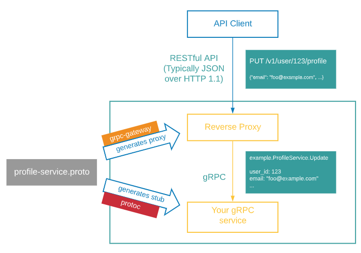
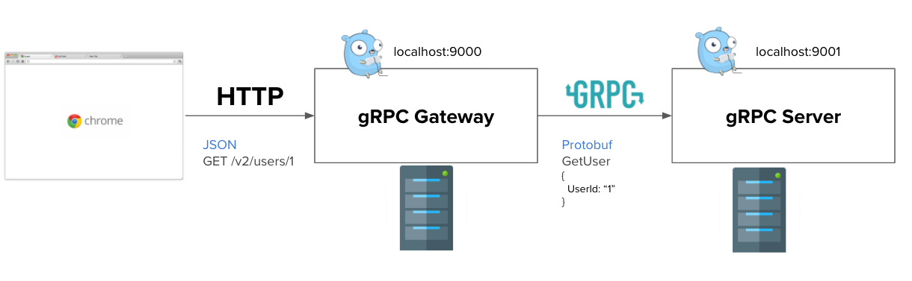
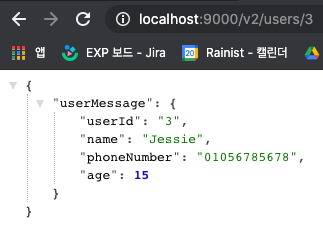

이번 블로그 글은 Golang gRPC server 구축하기의 3번째 글이다. 지난번 글들에서는 ([1번째 글](https://devjin-blog.com/golang-grpc-server-1/), [2번째 글](https://devjin-blog.com/golang-grpc-server-2/))

- gRPC의 개념
- gRPC의 장단점과 왜 요새 관심을 많이 받고 있는지
- 간단히 protobuf로 gRPC server 구성하는 방법
- microservice 아키텍쳐에서 gRPC server간 통신하는 방법
- gRPC server의 형식들
- gRPC server 구성할 때 유용한 feature들

들에 대해서 다뤘다. 

이번 글에서는 gRPC server와 HTTP로 RESTful하게 통신할 수 있게 해주는 gRPC gateway에 대해 설명하려고 한다. 

**Contents**

1. [Golang gRPC server 구축하기 (1) - gRPC란 무엇인가?](https://devjin-blog.com/golang-grpc-server-1/)

2. [Golang gRPC server 구축하기 (2) - gRPC server 파헤쳐보기](https://devjin-blog.com/golang-grpc-server-2/)

3. [Golang gRPC server 구축하기 (3) - RESTful하게 gRPC server와 통신하기]((https://devjin-blog.com/golang-grpc-server-3/))

4. Golang gRPC server 구축하기 (4) - gRPC middleware란?

# 왜 gRPC server를 RESTful하게 통신하게 해야 하는가?

이전 글에서 설명했듯이 gRPC server는 microservice 아키텍쳐에서 server들간 통신할 때 사용하기 좋다. 하지만, 실제 서비스는 server만 있다고 운영이 되는 것이 아니다. 일반적으로는 iOS, Android나 Web client가 존재하고 이 client들이 server와 통신을 하면서 서비스가 운영된다. 물론, iOS, Android, Web에서 gRPC 통신이 가능하지만 gRPC로 모바일 or 웹 client들과 통신하는 레퍼런스도 많이 없기에 안정적으로 운영하기에는 리스크가 있다. 심지어 gRPC web같은 경우는 아직 experimental feature인걸로 알고 있다.

([A new experiment: Call .NET gRPC services from the browser with gRPC-Web](https://devblogs.microsoft.com/aspnet/grpc-web-experiment/))

또한, 다른 외부 서비스에서 내 server와 통신할 때 내 server가 gRPC 통신밖에 못한다면 문제가 발생한다. 예를 들어, 네이버 지도를 사용하기 위해서 네이버 API를 사용하려고 봤더니 gRPC로 밖에 통신이 안되는 경우이다. 내 server들은 RESTful하게 HTTP로만 통신하도록 구현되어있는데 네이버 지도를 사용하기 위해 gRPC 통신을 할 수 있도록 내 server들을 바꿔야 하는 것이다. 실제로는 gRPC로 통신하는 서비스들보다는 RESTful하게 구현되어 있는 서비스들이 훨씬 많다. 그렇기 때문에 gRPC로만 통신하는 것을 고집하는 것은 여러모로 cost가 크다.

더 다양한 용도로 사용될 수 있는 호환성이 좋은 server를 구축하기 위해서는 gRPC로 통신하는 server라도 HTTP로 RESTful하게 통신할 수 있도록 만들어야 한다. 그리고 gRPC server가 HTTP로 통신할 수 있게 해주는 것이 바로 🎉 **gRPC Gateway** 🎉이다.

# gRPC Gateway

[gRPC Document](https://grpc-ecosystem.github.io/grpc-gateway/)

[gRPC gateway Github Repository](https://github.com/grpc-ecosystem/grpc-gateway)

공식 도큐먼트는 gRPC gateway를 다음과 같이 소개하고 있다:

gRPC-Gateway helps you to provide your APIs in both gRPC and RESTful style at the same time.

gRPC-Gateway는 API를 동시에 gRPC와 RESTful style로 제공할 수 있도록 도와준다

Github Repository에서는 gRPC gateway가 왜 필요한지에 대한 배경을 다음과 같이 정리하고 있다:

(중략) However, you might still want to provide a traditional RESTful JSON API as well. Reasons can range from maintaining backward-compatibility, supporting languages or clients that are not well supported by gRPC, to simply maintaining the aesthetics and tooling involved with a RESTful JSON architecture. 

그럼에도 기존에 일반적으로 사용되는 RESTful JSON API를 제공하고 싶은 경우가 있을 것이다. 이유는 다양할 수 있다 하위호환성 보장부터, gRPC에서 지원되지 않는 client나 언어들을 지원, 그리고RESTful JSON 아키텍처를 사용하고 있는 툴들과 그 철학들을 유지하는 것까지. 

gRPC gateway가 무엇이고 왜 만들어졌는지에 대한 개념을 조금 이해했으니, 어떻게 동작하는지 설명해보려고 한다. 



gRPC gateway도 protobuf를 기반으로 작동을 한다. Protobuf 컴파일러인 `protoc` 로 gRPC server에서 사용하기 위한 message들 및 서비스를 생성했던 것 처럼, `protoc`로 gRPC gateway에서 사용할 수 있는 message들과 서비스를 생성해주는 것이다. gRPC gateway에서는 protobuf 파일을 읽고 HTTP JSON을 protobuf로 변환한 뒤에 gRPC로 reverse proxy해준다.

예를 들어, 외부에서 내 gRPC server로 JSON형태인 message를 요청했으면, 

```json
PUT /v1/user/123/profile
{
   "email": "abc@hanmail.net"
} 
```

gRPC gateway에서는 이 JSON을 읽고나서 gRPC 서비스에서 정의된 message 형식에 맞춰서 데이터를 잘 protobuf로 변환한 다음에 내 gRPC server에 gRPC로 message를 보낸다. 그렇기 때문에 gRPC server는 기존처럼 protobuf 형태의 message를 읽고 처리를 하는 것이다.

reverse proxy에 대해 더 잘 이해하고 싶으면 [Reverse Proxy, Forward Proxy (프록시란?)](https://cornswrold.tistory.com/404) 블로그 글을 읽어보는 것을 추천한다. 

# RESTful하게 통신 가능한 gRPC server 정의하기

gRPC-gateway를 사용한 server를 구현하기 위해서는 준비 과정이 조금 필요하다. 준비과정에 대한 자세한 영문으로 된 내용은 [gRPC-gateway repository](https://github.com/grpc-ecosystem/grpc-gateway)에서 볼 수 있고, 이 섹션에서는 repository README에 있는대로 진행해보려고 한다. 

1. gRPC gateway용 protobuf 컴파일러 설치하기

작업을 시작하기에 앞서 protobuffer 컴파일러인 `protoc`가 설치되어있어야 한다. Golang gRPC server 구축하기 시리즈를 차례대로 따라왔다면 이미 컴파일러가 설치되어있을 것이다. 만약 아직 설치가 안되었다면 [https://github.com/protocolbuffers/protobuf/releases](https://github.com/protocolbuffers/protobuf/releases) 에서 다운로드 받으면 된다.

```shell
go install \
    github.com/grpc-ecosystem/grpc-gateway/v2/protoc-gen-grpc-gateway \
    github.com/grpc-ecosystem/grpc-gateway/v2/protoc-gen-openapiv2 \
    google.golang.org/protobuf/cmd/protoc-gen-go \
    google.golang.org/grpc/cmd/protoc-gen-go-grpc
```

그 다음에는 위 명령어를 통해 gRPC gateway용 컴파일로 플러그인(?)들을 설치한다. 명령어가 실행되면 4개의 binary들이 `$GOBIN`에 들어가게 된다. 그리고 이 `$GOBIN`을 `$PATH`에 추가된걸 확인해야 한다.

- `protoc-gen-grpc-gateway`
- `protoc-gen-openapiv2`
- `protoc-gen-go`
- `protoc-gen-go-grpc`

2. Protobuf 정의 및 서버 구현하기

컴파일러를 설치하고 나서는 `proto` 에 구현할 서비스를 생성해주고 서버를 구현하면 된다. 여기서는 이전 블로그 글인 [Golang gRPC server 구축하기 (1) - gRPC란 무엇인가?](https://devjin-blog.com/golang-grpc-server-1/) 에서 구현한 [simple user service](https://github.com/dojinkimm/go-grpc-example/blob/main/simple-user/main.go)부분을 똑같이 구현하려고 한다. `proto`를 정의해주고, `protoc` 명령어로 gRPC에서 사용 가능한 컴파일된 파일을 생성해주고 이를 기반으로 서버 코드를 똑같이 작성한다.

3. 정의한 `proto` 서비스에 HTTP로 접근 가능한 Endpoint 추가해주기

정의된 `proto` 서비스에 `google/api/annotations.proto`를 import해준다. 이 3rd 파티 protobuf 파일을 제대로 import해서 사용하기 위해서는 이 파일을 repository에 갖고와야 한다. 그리고  `annotations.proto`와 `http.proto`를 똑같이 생성해준다 (해당 파일들은 [여기서](https://github.com/grpc-ecosystem/grpc-gateway/tree/master/third_party/googleapis/google/api) 찾을 수 있다). 여기서 가장 중요한 부분은, 해당 **파일들을 `google/api`라는 폴더에 저장하는 것이고 + repository에 가장 top level 위치시키는 것**이다.

(😢 이 부분을 읽지 않고 넘어가서.... 자꾸 `annotations.proto` 파일을 찾을 수 없다는 에러를 마주했다)

```protobuf
syntax = "proto3";

package v2.user;

option go_package = "github.com/dojinkimm/go-grpc-example/protos/v2/user";

import "google/api/annotations.proto"; // 추가된 부분

service User {
    rpc GetUser(GetUserRequest) returns (GetUserResponse) {
        option (google.api.http) = {
            get: "/v2/users/{user_id}"  // 추가된 부분
        };
    }
    rpc ListUsers(ListUsersRequest) returns (ListUsersResponse) {
        option (google.api.http) = {
            get: "/v2/users" // 추가된 부분
        }; 
    }
}
```

3rd 파티 파일을 추가해주면 service의 rpc내에서 `google.api.http` option을 사용할 수 있게 된다. 이 option이 바로 **gRPC service의 rpc에 HTTP로 접근할 수 있는 HTTP endpoint를 제공해주는 옵션**이다. 옵션 안에는 enpoint와 이 enpoint에 접근할 HTTP method를 정의해주면 된다. 예를 들어,`GetUser`는 user_id로 하나의 유저 정보를 리턴하는 rpc이기 때문에 GET HTTP method를 추가했고, 버전2이기 때문에 `/v2/users/{user_id}`로 정의했다.

💁‍♂️  HTTP endpoint를 어떻게 RESTful하게 정의할지 모른다면 [[Network] REST란? REST API란? RESTful이란?](https://gmlwjd9405.github.io/2018/09/21/rest-and-restful.html) 블로그 글을 참고하면 좋다. 

4. `proto` 서비스 컴파일하기

HTTP로 접근 가능한 enpoint를 생성했다면 이제 컴파일을 할 시간이다 🎉.  

3rd 파티 `proto` 파일을 repository에 잘 저장했고, service에 `google.api.http` option으로 http endpoint를 잘 생성하고 이 명령어를 입력하면 컴파일이 되고 `user.pb.gw.go` 파일이 생성된다.

```shell
.PHONY: generate-user-v2-gateway-proto
generate-user-v2-gateway-proto:
	protoc -I . \
	    --grpc-gateway_out . \
	    --grpc-gateway_opt logtostderr=true \
	    --grpc-gateway_opt paths=source_relative \
	    protos/v2/user/user.proto
```

이로써 gRPC Gateway를 gRPC server에서 사용할 준비가 완료되었다.

# RESTful하게 통신 가능한 gRPC server 구현하기

gRPC gateway의 역할을 다시 정리하자면, client로부터 HTTP JSON 정보를 받고, 이 정보를 gRPC server 서비스의 형식대로 protobuf로 변환한 다음에 그 message를 gRPC server에 gRPC로 보내는 것이다. 



그림에서 보면 알 수 있듯이 client는 `9000` port로 HTTP 요청을 하고 gRPC gateway는 HTTP JSON 요청을 protobuf로 변환한 다음에 `9001` port로 gRPC로 요청한다. Port가 2개나 필요하기 때문에 2개의 서버가 띄워져있어야 한다는걸 알 수 있다. 

### **gRPC server**

gRPC server는 [simple user service](https://github.com/dojinkimm/go-grpc-example/blob/main/simple-user/main.go)부분을 그대로 가져다 쓴다. 한가지 변화를 준다면 위 그림과 같이 `port` 번호를 `9001`로 설정하는 것이다. [code](https://github.com/dojinkimm/go-grpc-example/blob/main/simple-grpc-gateway/server/main.go)

```go
...
const portNumber = "9001"

type userServer struct {
	userpb.UserServer
}
...
```

### gRPC gateway

[gRPC gateway부분의 코드](https://github.com/dojinkimm/go-grpc-example/blob/main/simple-grpc-gateway/grpc-gateway/main.go)는 다음과 같이 구현할 수 있다. 짧은 코드이지만 각각 어떤 역할을 하는지 breakdown 해보자.

```go
package main

import (
	"context"
	"log"
	"net/http"

	"github.com/grpc-ecosystem/grpc-gateway/v2/runtime"
	"google.golang.org/grpc"

	userpb "github.com/dojinkimm/go-grpc-example/protos/v2/user"
)
const (
	portNumber = "9000"
	gRPCServerPortNumber = "9001"
)

func main(){
	ctx := context.Background()
	mux := runtime.NewServeMux()

	options := []grpc.DialOption{
		grpc.WithInsecure(),
	}

	if err := userpb.RegisterUserHandlerFromEndpoint(
		ctx,
		mux,
		"localhost:"+gRPCServerPortNumber,
		options,
	); 	err != nil {
		log.Fatalf("failed to register gRPC gateway: %v", err)
	}

	log.Printf("start HTTP server on %s port", portNumber)
	if err := http.ListenAndServe(":"+portNumber, mux); err != nil {
		log.Fatalf("failed to serve: %s", err)
	}
}
```

가장 먼저 `context` 패키지에 있는 ctx를 선언해준다. 이 `context`는 gRPC gateway와 gRPC server를 이어주는 맥락이라고 생각하면 된다. 이 값을 밑에 `RegisterUserHandlerFromEndPoint`에 주입해주는데, 이로 인해 gRPC gateway는 gRPC server에서 context Done 신호가 오면 (맥락을 끊겠다) connection을 끊게 된다.  

`context`에 대해 더 깊이 알고 싶다면 이전에 작성한 [Go의 context 패키지 이해하기](https://devjin-blog.com/golang-context/) 글을 읽어보는 것을 추천한다.

```go
...
ctx := context.Background()
...
```

그 다음에는 gRPC gateway 패키지에서 갖고온 mux를 선언해준다. Mux는 multiplexer의 약자인걸로 알고 있는데, 이 mux는 HTTP 요청이 오면 그 요청을 gRPC server에 그대로 바로 보낼지 아니면 특정 요청들만 보낼지와 같은 작업들을 할 수 있게 해준다. (뭔가 gRPC gateway의 middleware느낌으로 봐도 괜찮을 것 같다)

```go
...
mux := runtime.NewServeMux()
...
```

이 `NewServeMux`에는 다양한 옵션들을 추가할 수 있다. 밑에서 소개한 옵션들 외에도 더 많은 옵션들을 [gRPC gateway/runtime](https://github.com/grpc-ecosystem/grpc-gateway/tree/master/runtime)에서 찾아볼 수 있다.

```go
// WithIncomingHeaderMatcher gateway에 들어온 요청에 대해 특정 헤더만 허용하는 옵션이다.
// Client로부터 요청이 왔을 때 여기에 정의된 헤더를 포함하는 경우에만 gRPC server에 요청을 전달한다.
func WithIncomingHeaderMatcher(fn HeaderMatcherFunc) ServeMuxOption {
	return func(mux *ServeMux) {
		mux.incomingHeaderMatcher = fn
	}
}

// WithOutgoingHeaderMatcher은 반대로 gateway에서 나가는 요청에 대해 특정헤더들을 허용하는 옵션이다.
func WithOutgoingHeaderMatcher(fn HeaderMatcherFunc) ServeMuxOption {
	return func(mux *ServeMux) {
		mux.outgoingHeaderMatcher = fn
	}
}

// WithErrorHandler 는 커스텀 에러 핸들러를 configure 할 수 있게 해준다.
func WithErrorHandler(fn ErrorHandlerFunc) ServeMuxOption {
	return func(serveMux *ServeMux) {
		serveMux.errorHandler = fn
	}
}

// WithMarshalerOption marshaler에 대한 옵션을 제공해준다. 
func WithMarshalerOption(mime string, marshaler Marshaler) ServeMuxOption {
	return func(mux *ServeMux) {
		if err := mux.marshalers.add(mime, marshaler); err != nil {
			panic(err)
		}
	}
}
```

mux를 선언하고 나서는 option을 선언해준다. Option은 지난 블로그 글을 봤다면 낯이 익을 것이다. Client(여기서는 gRPC gateway)와 Server(여기서는 gRPC server)가 연결을 맺을 때 추가할 수 있는 옵션들에 대한 부분이다. 

옵션들을 정의하고 나면 이제 gRPC gateway를 사용하기 위해 등록하는 일만 남았다. 위에서 proto 파일을 gRPC gateway에서 사용할 수 있도록 컴파일 했으면 `RegisterUserHandlerFromEndpoint` 를 사용할 수 있게 된다. 이 함수는 총 4가지의 parmeter를 받아들인다.

- ctx - gRPC server와 통신을 할 때 전달하기 위해 사용된다.
- mux - 각 request마다 middleware처럼 HTTP 요청을 정의한 옵션대로 가공(?)을 하는데 사용된다.
- 주소 - 통신할 주소이다. gRPC server는 9001 port에서 실행되게끔 했으니 `localhost:9001`을 추가해줬다.
- dial option - client ←→ server간 connection을 맺을 때 추가적인 작업을 하기 위해 사용된다.

```go
...
options := []grpc.DialOption{
	grpc.WithInsecure(),
}

if err := userpb.RegisterUserHandlerFromEndpoint(
	ctx,
	mux,
	"localhost:"+gRPCServerPortNumber,
	options,
); 	err != nil {
	log.Fatalf("failed to register gRPC gateway: %v", err)
}
...
```

어떤 gRPC server와 통신할지 등록을 했으면 이제 gRPC gateway를 실행시키는 일만 남았다. 예제에서는 `9000` port를 제공해주고, HTTP JSON요청을 받아야 하기 때문에 HTTP server를 실행시킨다.

```go
...
log.Printf("start HTTP server on %s port", portNumber)
if err := http.ListenAndServe(":"+portNumber, mux); err != nil {
	log.Fatalf("failed to serve: %s", err)
}
...
```

위 작업들만 진행하면 HTTP JSON 요청을 받아들이는 gRPC gateway server를 생성할 수 있게 된다. 

### gRPC + gateway 실행하기

gRPC gateway는 client이고 gRPC server와 connection을 맺어야 하기 때문에 gRPC server가 먼저 실행되어야 한다.

2개의 다른 terminal(혹은 bash)들을 열고 다음의 명령어들을 순차적으로 실행시킨다. 실행이 되면 gRPC gateway의 서버에서 client와 connection이 맺어졌다는 문구가 나올 것이다. 문구가 보이면 connection이 잘 맺어진 것이고 확인을 하러 가면 된다.

```shell
go run simple-grpc-gateway/server/main.go
```

```shell
go run simple-grpc-gateway/grpc-gateway/main.go
```

아무 브라우저에 가서 `localhost:9000/v2/users/3`을 주소창에 입력해본다. User service 정의한대로 `GetUser` rpc와 `ListUsers` rpc가 잘 작동되는 것을 확인할 수 있다.

`GetUser` rpc



`ListUsers` rpc


# 🙇‍♂️ 마무리

Golang gRPC server 구축하기 시리즈의 3편이 끝났다. 이번 포스트에서는 gRPC server에서 RESTful한 HTTP JSON 요청을 받아들일 수 있게 해주는 gRPC gateway에 대해서 다뤄봤다. gRPC와 HTTP 요청과 응답을 줄 수 있는 대단한 서버를 만든 것이다 🤩. 다음 (드디어 마지막) 포스트에서는 gRPC server에 사용하기에 유용한 middleware들에 대해서 다뤄볼 예정이다. 

이 예제에 나오는 모든 코드들은 [Github Repository](https://github.com/dojinkimm/go-grpc-example)에 공개되어 있다.