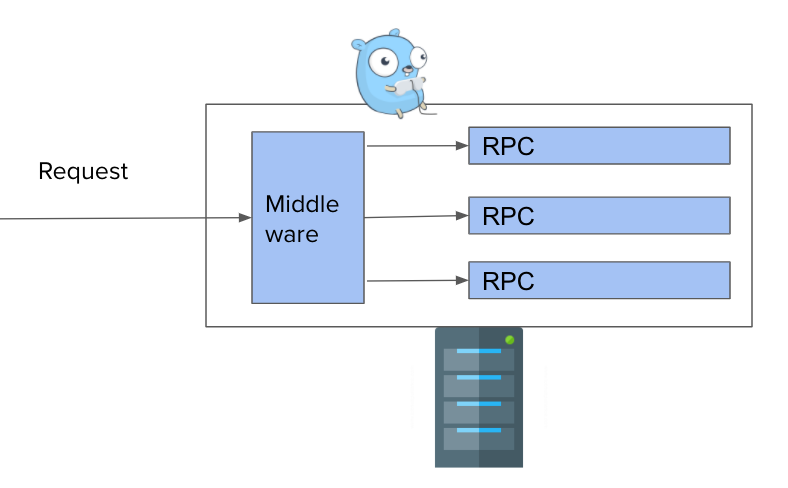
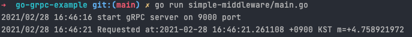
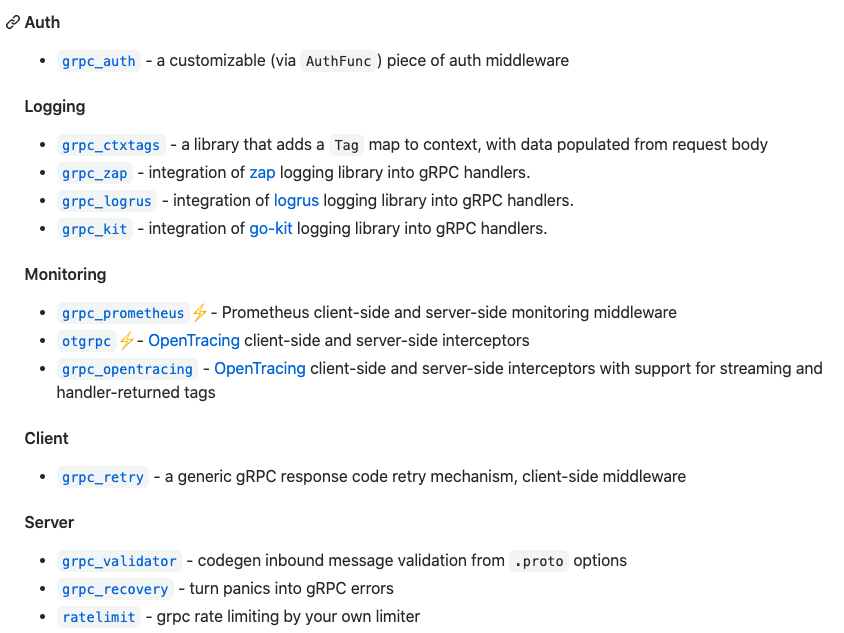
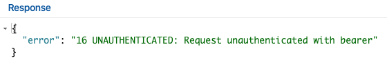
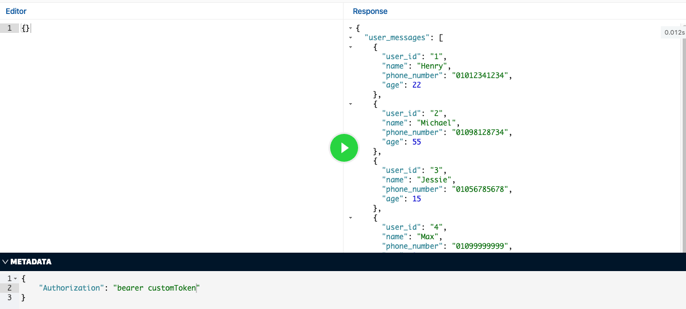
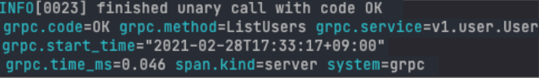
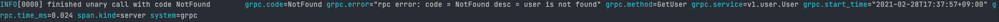
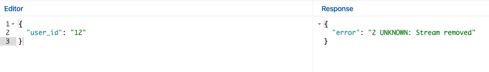
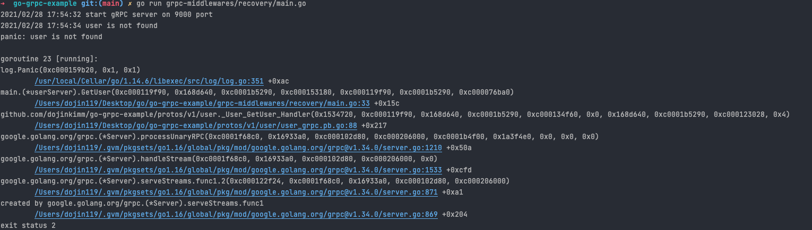

이번 블로그 글은 Golang gRPC server 구축하기의 마지막 글이다 🎉  지난 글들에서

- gRPC의 개념
- gRPC의 장단점과 왜 요새 관심을 많이 받고 있는지
- 간단히 protobuf로 gRPC server 구성하는 방법
- microservice 아키텍쳐에서 gRPC server간 통신하는 방법
- gRPC server의 형식들
- gRPC server 구성할 때 유용한 feature들
- gRPC server와 RESTful하게 통신하기 위한 gRPC gateway 사용법

들에 대해서 다뤘다. 

이번 글에서는 gRPC server를 구성할때 유용한 middleware들에 대해 소개하려고 한다. 

**Contents**

1. [Golang gRPC server 구축하기 (1) - gRPC란 무엇인가?](https://devjin-blog.com/golang-grpc-server-1/)

2. [Golang gRPC server 구축하기 (2) - gRPC server 파헤쳐보기](https://devjin-blog.com/golang-grpc-server-2/)

3. [Golang gRPC server 구축하기 (3) - RESTful하게 gRPC server와 통신하기](https://devjin-blog.com/golang-grpc-server-3/)

4. [Golang gRPC server 구축하기 (4) - gRPC middleware란?](https://devjin-blog.com/golang-grpc-server-4/)

# Middleware란?

Middleware를 [Azure docs](https://azure.microsoft.com/ko-kr/overview/what-is-middleware/)에서는 다음과 같이 표현하고 있습니다. 

> 미들웨어는 운영 체제와 해당 운영 체제에서 실행되는 응용 프로그램 사이에 존재하는 소프트웨어입니다.

다른 말로 표현하자면, middleware는 Client와 Server간 통신을 할때 **중간(Middle)에서** 특정 작업을 하는 **소프트웨어(Ware)**라고 할 수도 있다. 



## 그럼 왜 Middleware를 사용할까?

RPC로 요청이 오거나, RPC에서 응답을 내보낼때 반복되는 혹은 공통적으로 수행해야할 작업들이 있을 때 Middleware를 사용한다. 일반적으로, 인증이나 로깅, 모니터링과 같은 작업들을 Middleware에 둔다.

예를 들어, 3개의 RPC가 있는 server가 있다고 가정해보자. Client로부터 요청이 올 때마다 누구로부터 요청이 왔고, 언제 요청이 왔는지, 어떤 요청을 했는지와 같은 정보들을 로깅하고 싶은 경우가 있을 것이다. 이를 로깅하기 위해서는 각 RPC에 로깅하는 코드를 작성해야 한다. 각 RPC에 로깅하는 코드가 중복으로 들어가게 되기도 하고, 로깅하는 코드를 변경할때 3개의 RPC에 각각 다 수정을 해줘야 한다. 

이런 공통적으로 모든 RPC가 수행해야 하는 작업을 바로 middleware로 두면 되는 것이다. 요청이 client로부터 온다면 middleware에서 요청에 대한 로깅을 한 다음에 그 요청을 client가 요청한 RPC로 흘려보낸다. 로깅하는 코드를 변경할때 middleware의 코드만 수정하면 된다. 


# Go gRPC middleware

위에서 middleware에 대해 알아봤으니 이제 Golang gRPC server에서 어떻게 middleware를 사용할 수 있을지 알아보려고 한다. gRPC middleware를 gRPC server에 추가하는 방법이 여러가지가 있는데, [gRPC middleware github repository](https://github.com/grpc-ecosystem/go-grpc-middleware) 예시에 나온대로 설명하려고 한다.  일단 gRPC middleware를 사용하려면 `NewServer()` 함수에 옵션들을 추가해야 한다.

```go
func customMiddleware() grpc.UnaryServerInterceptor {
	return func(ctx context.Context, req interface{}, info *grpc.UnaryServerInfo, handler grpc.UnaryHandler) (_ interface{}, err error) {
		log.Print("Requested at:", time.Now())

		resp, err := handler(ctx, req)
		return resp, err
	}
}

func main() {
	lis, err := net.Listen("tcp", ":"+portNumber)
	if err != nil {
		log.Fatalf("failed to listen: %v", err)
	}

  // grpcServer := grpc.NewServer() 기존 gRPC middleware 없는 방식
	grpcServer := grpc.NewServer(
		grpc.UnaryInterceptor(grpc_middleware.ChainUnaryServer(
			customMiddleware(),
			)),
		)
	userpb.RegisterUserServer(grpcServer, &userServer{})

	log.Printf("start gRPC server on %s port", portNumber)
	if err := grpcServer.Serve(lis); err != nil {
		log.Fatalf("failed to serve: %s", err)
	}
}
```

이 때,

- grpc.UnaryInterceptor
- grpc_middleware.ChainUnaryServer

라는 새로운 함수들이 등장한다. 

여기서 또 Unary라는 개념이 나오는걸 보니 StreamInterceptor도 있을 것으로 예상할 수 있다 ([Unary, Stream이란?](https://devjin-blog.com/golang-grpc-server-2/#grpc-%ED%98%95%EC%8B%9D-ex-unary-stream)). 이 포스트에서는 UnaryInterceptor에 집중해보려고 한다.

UnaryInterceptor는 주석에 나와있듯이 Unary 형식의 server에 interceptor를 추가해주는 서버 옵션이다. 하지만, 이 방식으로는 하나의 interceptor만 추가 가능하다. 즉, 여러개의 interceptor들을 추가하고 싶어도 추가하지 못하는 것이다.

```go
// https://github.com/grpc/grpc-go/blob/master/server.go#L334-L344
// UnaryInterceptor returns a ServerOption that sets the UnaryServerInterceptor for the
// server. Only one unary interceptor can be installed. The construction of multiple
// interceptors (e.g., chaining) can be implemented at the caller.
func UnaryInterceptor(i UnaryServerInterceptor) ServerOption {
	return newFuncServerOption(func(o *serverOptions) {
		if o.unaryInt != nil {
			panic("The unary server interceptor was already set and may not be reset.")
		}
		o.unaryInt = i
	})
}
```

grpc.UnaryInterceptor는 하나의 interceptor만 받아들일 수 있지만, 개발을 하다보면 여러개의 interceptor들을 추가하고 싶은 경우가 있다. 이러한 경우를 위해서 grpc_middleware.ChainUnaryServer를 사용하는 것이다. 이 함수의 파라미터로 여러개의 interceptor를 넣으면 여러개의 interceptor들을 체인처럼 하나씩 순서대로 실행될 수 있게 이어주는 것이다.

```go
// https://github.com/grpc-ecosystem/go-grpc-middleware/blob/master/chain.go#L14-L36
// ChainUnaryServer creates a single interceptor out of a chain of many interceptors.
//
// Execution is done in left-to-right order, including passing of context.
// For example ChainUnaryServer(one, two, three) will execute one before two before three, and three
// will see context changes of one and two.
func ChainUnaryServer(interceptors ...grpc.UnaryServerInterceptor) grpc.UnaryServerInterceptor {
	n := len(interceptors)

	return func(ctx context.Context, req interface{}, info *grpc.UnaryServerInfo, handler grpc.UnaryHandler) (interface{}, error) {
		chainer := func(currentInter grpc.UnaryServerInterceptor, currentHandler grpc.UnaryHandler) grpc.UnaryHandler {
			return func(currentCtx context.Context, currentReq interface{}) (interface{}, error) {
				return currentInter(currentCtx, currentReq, info, currentHandler)
			}
		}

		chainedHandler := handler
		for i := n - 1; i >= 0; i-- {
			chainedHandler = chainer(interceptors[i], chainedHandler)
		}

		return chainedHandler(ctx, req)
	}
}
```

두 함수의 개념 및 동작법에 대해 간단히 설명을 들었으니, 이제 밑의 코드가 대략 어떻게 실행될지 예상이 될 것이다. gRPC server를 시작하고, server가 호출이 될 때마다 `customMiddleware`를 거쳐갈 수 있게 된 것이다.   

```go
func customMiddleware() grpc.UnaryServerInterceptor {
	return func(ctx context.Context, req interface{}, info *grpc.UnaryServerInfo, handler grpc.UnaryHandler) (_ interface{}, err error) {
		log.Print("Requested at:", time.Now())

		resp, err := handler(ctx, req)
		return resp, err
	}
}
	
...
grpcServer := grpc.NewServer(
		grpc.UnaryInterceptor(grpc_middleware.ChainUnaryServer(
			customMiddleware(),
			)),
		)
...
```

Server를 run한 다음에 rpc를 호출하게 되면 밑과 같이 customMiddleware 함수의 내용이 실행됨을 알 수 있다.




# Go gRPC middleware 예시

개발할때 추가되면 좋은 middleware들이 이미 많이 오픈소스로 개발되어있고, 그 중 대표적으로 많이 사용되는 [grpc_middleware github repository](https://github.com/grpc-ecosystem/go-grpc-middleware)를 소개하려고 한다. 물론 나의 니즈를 완벽하게 충족시켜주지 못한다면 직접 구현하면 된다.

2021-02-28 기준으로 밑의 middleware들이 이 repository에 존재한다.




## Auth

grpc_auth는 이름에서 알 수 있듯이 인증관련 middleware이다. grpc_auth에서 알아서 요청으로부터 Authorization 헤더의 값을 읽어들이고 토큰 값만 빼네서 전달해준다. 그러면 custom 함수에서는 그 토큰 값을 검증하는 코드만 작성하면 되는 것이다. 

```go
func customAuthFunc(ctx context.Context) (context.Context, error) {
	token, err := grpc_auth.AuthFromMD(ctx, "bearer")
	if err != nil {
		return nil, err
	}

	if token != "customToken" {
		return nil, status.Errorf(codes.Unauthenticated, "invalid auth token: %v", err)
	}

	newCtx := context.WithValue(ctx, "token", token)

	return newCtx, nil
}

...
	grpcServer := grpc.NewServer(
		grpc.UnaryInterceptor(grpc_middleware.ChainUnaryServer(
			grpc_auth.UnaryServerInterceptor(customAuthFunc),
		)),
	)
...
```

똑같이 요청을 했는데, 아무 토큰 값을 보내지 않는 경우에는 인증되지 않는 유저, 혹은 인증에 실패했다는 에러 문구를 middleware에서 자동으로 리턴해준다.




Authorization 헤더에 검증에 성공할 수 있는 valid한 토큰 값을 넣어준다면 정상적으로 요청이 되고 정상 응답값이 리턴된다.




이처럼 grpc_auth를 사용한다면, 매번 모든 rpc에다 토큰을 인증하는 로직을 넣을 필요 없이 client가 요청을 할때마다 middleware에서 알아서 토큰을 검증할 수 있게 되는 것이다. *~~중복 없는 코드 만세~~*

## Logging

매 요청에 대해 로깅을 해주는 middleware이다. `kit` `logrus` `zap` 3가지의 패키지들이 사용 가능하지만, 이 포스트에서는 자주 사용하는 `logrus` 위주로 얘기해보려고 한다.

(왜 `logrus` 를 사용하는게 좋은지는 ⇒ [뱅크샐러드 블로그#옵저버빌리티를-확보하기-위한-로깅](https://blog.banksalad.com/tech/production-ready-grpc-in-golang/#%EC%98%B5%EC%A0%80%EB%B2%84%EB%B9%8C%EB%A6%AC%ED%8B%B0%EB%A5%BC-%ED%99%95%EB%B3%B4%ED%95%98%EA%B8%B0-%EC%9C%84%ED%95%9C-%EB%A1%9C%EA%B9%85) 참고) 

먼저 `logrus` 패키지를 initialize한 후에 그 값을 interceptor에 넣어준다. logrus.ErrorKey는 에러일 경우에는 `grpc.error`로 로깅하라는 의미이다. `logrus` 패키지의 여러 옵션들을 사용해서 로깅 포맷을 변경할 수도 있다. 

```go
...
logrus.ErrorKey = "grpc.error"
logrusEntry := logrus.NewEntry(logrus.StandardLogger())
grpcServer := grpc.NewServer(
	grpc.UnaryInterceptor(grpc_middleware.ChainUnaryServer(
		grpc_logrus.UnaryServerInterceptor(logrusEntry),
	)),
)
```

이렇게 되면 기존에는 rpc가 call될때 아무 로깅도 안되었다면 이제는 성공했을 때 어떤 rpc가 성공했는지 잘 로깅을 해주고, 실패했을때 rpc에서 리턴된 에러 문구를 잘 로깅해준다. 덕분에 서버가 장애나면 어떤 이유로 에러가 발생했는지 보다 쉽게 알 수 있게 되는 것이다.

정상 응답 케이스



실패 응답 케이스



### Recovery

Recovery는 rpc내에서 panic이 일어나도 서버가 종료되지 않게 한다. Golang에서는 panic을 호출하면 프로그램이 자동 종료된다. 하지만, 실제 서비스를 하는 서버에서는 에러가 한번 났다고 서버 프로그램이 죽어버리면 안된다. 오히려 에러가 나면 에러가 계속 나도록 유지하면서 동시에 어떤 에러인지 로깅을 해서, 어느 부분이 문제인지 빠르게 인지해서 그 에러를 고치는 것이 이상적인 방법이다. 

[recover는 언제 사용하나요?](https://hamait.tistory.com/1027)

그렇기에 panic이 일어나도 서버 프로그램이 종료되지 않게 하는 것이 바로 grpc_recovery이다. 

만약 밑과 같이 user가 존재하지 않을때 panic하는 코드가 있다고 가정해보자. 

```go
// GetUser returns user message by user_id
func (s *userServer) GetUser(ctx context.Context, req *userpb.GetUserRequest) (*userpb.GetUserResponse, error) {
	userID := req.UserId

	var userMessage *userpb.UserMessage
	for _, u := range data.Users {
		if u.UserId != userID {
			continue
		}
		userMessage = u
		break
	}

	if userMessage == nil {
		log.Panic("user is not found")
	}

	return &userpb.GetUserResponse{
		UserMessage: userMessage,
	}, nil
}
```

grpc_recovery middleware가 없고 존재하지 않는 user에 대해 요청했을 때, 이렇게 *~~무시무시한~~* 에러가 터미널에 찍히고 프로그램이 종료된다.





만약 panic하는 코드가 있음에도 밑과 같이 grpc_recovery middleware를 추가해준다면, 

```go
grpcServer := grpc.NewServer(
		grpc.UnaryInterceptor(grpc_middleware.ChainUnaryServer(
			grpc_recovery.UnaryServerInterceptor(),
		)),
	)
```

panic이 되도 프로그램이 종료되지 않고 그 다음 요청을 다시 받을 수 있게 된다.


# 🙇‍♂️ 마무리

Golang gRPC server 구축하기 시리즈의 마지막 4편이 끝났다. 이번 포스트에서는 gRPC server에서 사용하기 유용한 gRPC middleware들에 대해서 다뤄봤다. 1~4편으로 진행된 Golang gRPC server 구축하기 시리즈를 다 정독했다면 이제 Golang으로 gRPC 및 HTTP request를 받는 server를 microservice 아키텍처에 맞게 구축을 할 수 있게 되었을 것이다.

이 예제에 나오는 모든 코드들은 [Github Repository](https://github.com/dojinkimm/go-grpc-example)에 공개되어 있다.