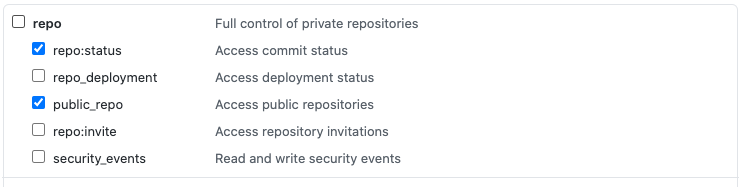
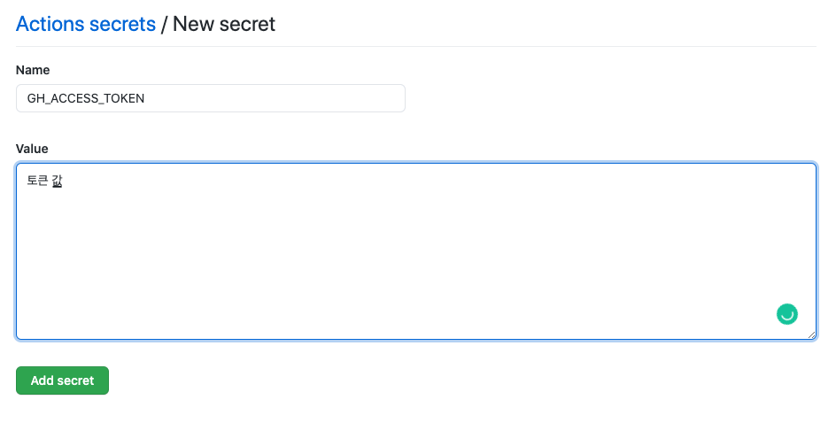
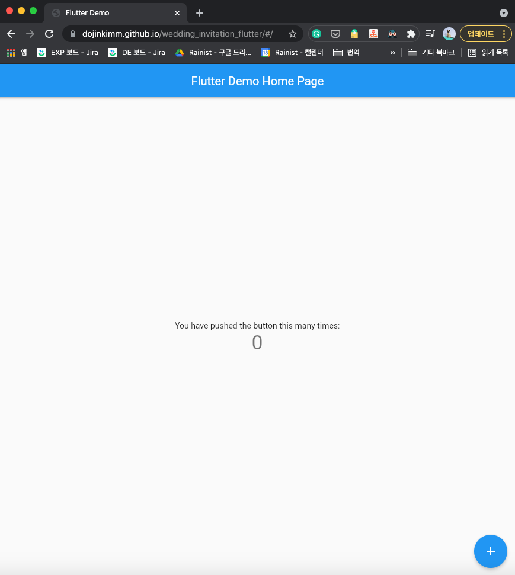

개발자라면 한 번쯤은 "결혼할 때 모바일 청첩장은 내가 직접 개발해봐야지" 라는 생각을 해봤을 겁니다. 그리고 올해 저에게 결혼이라는 모바일 청접장을 직접 개발해볼 기회(?)가 왔습니다. 

모바일 청첩장을 어떤 언어나 프레임워크로 모바일 청첩장을 개발할까 고민하던 중에 구글에서 Flutter 2.0을 런칭한 것을 보게 되었습니다. 예전에 Flutter로 앱을 개발한 적이 있었지만 그 때는 Flutter가 막 세상에 나온 때여서 Web의 기능이 너무 허접해서 웹은 개발을 시도해보지도 않았었습니다. Flutter 2.0 영상을 보고 나서는 Flutter Web이 꽤 사용할만한 수준이 된 것 같아서 모바일 청첩장은 Flutter로 개발하고 + 호스팅은 Github Pages를 활용하기로 결정했습니다. 

Flutter Web으로 어떻게 모바일 청첩장을 개발했고, 어떻게 Github Pages에 호스팅했고, 개발하면서 느꼈던 Flutter Web에 대한 생각을 나누려고 합니다. 실제로 제가 사용한 모바일 청첩장은 다른 도메인과 + Private Repository에 구현했습니다 (지도 활용을 위해 구글 API Key등을 embed해서 사용했기에 private으로 돌렸습니다). 이 글에서는 작업한 것을 재구현해서 공유하려고 합니다.

⚠️ NOTE ⚠️: 이 글을 따라하며 Flutter로 Web 모바일 청첩장을 개발해보기 위해서는 Flutter가 미리 컴퓨터에 설치되어있어야 합니다.

# Flutter Web 시작하기

Flutter는 Google이 만들었기에 documentation이 너무나 잘되어있습니다. Flutter 설치부터 Flutter에 대해 이해를 원하시면 [공식 document](https://flutter.dev/)를 처음부터 읽어보는 것을 추천합니다. 그 중에서 Flutter Web을 시작하는 방법은 [Getting Started Flutter Web](https://flutter.dev/docs/get-started/web)을 봐야 합니다.

Flutter로 Web을 실행하는 방법은 매우 매우 간단합니다 👏

Flutter Web을 개발할 폴더를 먼저 생성해놓고, 밑의 명령어를 입력하면 됩니다. 그러면 설치된 flutter가 알아서 flutter web 개발에 필요한 모든 설정들을 구성합니다.

```bash
flutter create .
```

그 다음에 Flutter 앱 실행이 아닌 웹을 실행하기 위해서는 밑의 명령어를 입력하면 됩니다. 그러면 기본 default 웹 화면이 크롬에 보이게 됩니다.

```bash
flutter run -d chrome
```

# Flutter Web Github Page에 호스팅 하기

Flutter로 개발한 Web을 Github Page에 호스팅할 차례입니다. Github Page는 Github에서 도메인과 웹서버를 무료로 제공해줘서 github에 있는 repository를 웹페이지로 보여주는 서비스입니다.

웹사이트에 유저가 접근하려면 도메인이 필요하고, 도메인에 접속했을 때 보여줄 웹페이지를 제공해주는 웹서버가 필요합니다. 이 2가지를 Github Page를 활용하면 무료로 사용할 수 있는겁니다!! (단, 무료로는 [dojinkimm.github.io/wedding_invitation_flutter](http://dojinkimm.github.io/wedding_invitation_flutter라는) 와 도메인만 사용 가능합니다) 

가장 먼저, Github Secret Token이 필요합니다. Settings > Developer Settings > Personal access tokens 에 들어가서 새로운 토큰 생성하기를 클릭하고 밑의 권한만 주고 토큰을 생성하면 됩니다. 

 



생성된 토큰 값을 저장해놨다가, 작업하고 있는 Flutter 모바일 청첩장 repository Settings > Secrets 에 들어가서 토큰 값을 저장해줍니다. 이 토큰 값은 github action같이 외부에서 개인 github repository를 컨트롤할 수 있게 해주는 권한을 줍니다. 여기서는 github actions로 자동으로 새로운 브랜치를 만들고, flutter web을 빌드하는 용도로 활용하려고 합니다. 





작업하고 있는 코드에 `.github/workflows/build.yml` 이란 파일을 생성해주고 밑의 코드를 Ctrl C + V를 해줍니다. 그리고 user email, name, github repository 이름을 본인의 것으로 다 변경합니다. 

밑의 github actions 파일은 master에 push한 flutter web 코드를 자동으로 build하고 `gh-pages`라는 브랜치에 빌드 파일을 push합니다. 그렇게 되면 github에서는 자동으로 이 브랜치에 있는 결과물을  [dojinkimm.github.io/wedding_invitation_flutter](http://dojinkimm.github.io/wedding_invitation_flutter라는)라는 도메인에 접속했을 때 볼 수 있게 해줍니다.

```yaml
name: Flutter Web
on:
  push:
    branches:
      - master

jobs:
  build:
    name: Build Web
    env:
      my_secret: ${{secrets.GH_ACCESS_TOKEN}}
    runs-on: ubuntu-latest
    steps:
      - uses: actions/checkout@v1
      - uses: subosito/flutter-action@v1
        with:
          channel: 'dev'
      - run: flutter config --enable-web
      - run: flutter pub get
      - run: flutter build web --release
      - run: |
          cd build/web
          git init
          git config --global user.email dojinkim119@gmail.com
          git config --global user.name dojinkimm
          git status
          git remote add origin https://${{secrets.GH_ACCESS_TOKEN}}@github.com/dojinkimm/wedding_invitation_flutter.git
          git checkout -b gh-pages
          git add --all
          git commit -m "update"
          git push origin gh-pages -f
```

그래서 `본인의 깃헙 io 링크/github repository 이름`으로 접속하면 밑과 같이 flutter의 default ui를 볼 수 있게 됩니다.





⚠️ NOTE ⚠️ : Default로 생성된 flutter 프로젝트를 바로 github page로 올릴 때 에러가 나는 현상이 있습니다. serviceWorker 관련 에러인데, 따로 원인은 파악하지 않고 단순하게 index.html에 불필요한 부분들을 다 제거해서 문제를 해결했습니다.

Flutter로 개발한 Web을  [dojinkimm.github.io/wedding_invitation_flutter](http://dojinkimm.github.io/wedding_invitation_flutter라는) 에서 볼 수 있게 됩니다. 이제 모바일 청첩장을 꾸밀일만 남았는데 그 부분은 다음 글에서 다루려고 합니다. 🙇‍♂️

공개된 모바일 청첩장 코드는 [https://github.com/dojinkimm/wedding_invitation_flutter](https://github.com/dojinkimm/wedding_invitation_flutter)에서 보실 수 있습니다.

References

- [Getting Started Flutter Web](https://flutter.dev/docs/get-started/web)
- [Flutter Web github actions](https://medium.com/flutter-community/flutter-web-github-actions-github-pages-dec8f308542a)
- [Github Page란](https://mygumi.tistory.com/285)