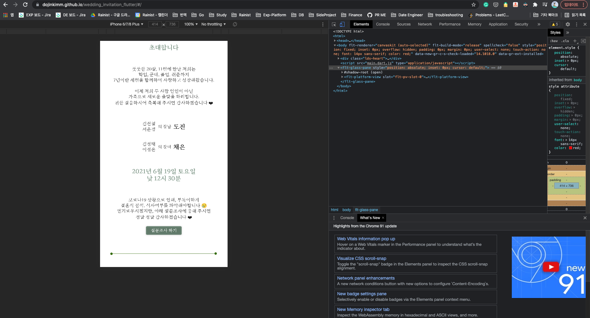
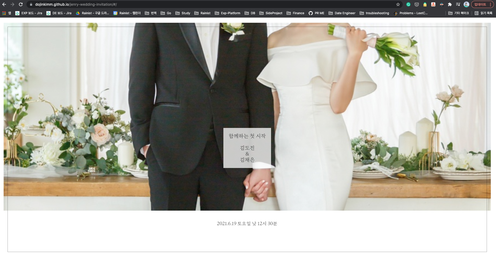
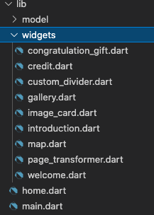
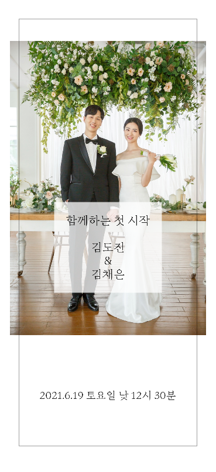
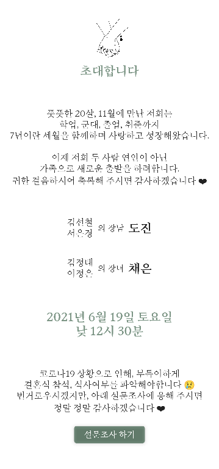
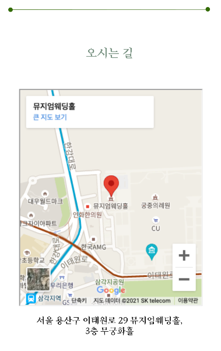
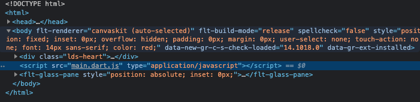

Flutter Web으로 모바일 청첩장을 만드는 글 Part 2입니다. [지난 파트 1](https://devjin-blog.com/wedding-invitation-flutter-1/)에서는 Flutter로 Web을 빌드하고 빌드한 결과물을 Github Pages로 호스팅하는 방법에 대해 다뤘습니다.

이번 파트에서는 모바일 청첩장을 꾸미고 Flutter Web에 대한 제 개인적인 생각을 나눠보려고 합니다. 공개된 모바일 청첩장 코드는 [여기](https://github.com/dojinkimm/wedding_invitation_flutter)서 보실 수 있습니다.

# 모바일 청첩장 꾸미기

⚠️ NOTE ⚠️   모바일 청첩장이다 보니 website full screen에 대해서는 responsive하게 구현하지 않았습니다. 모바일에만 최적화된 view로 구현했습니다.

<div>
  
  
</div>


### 1. Layout 잡기

다른 청첩장들을 참고해보니 일반적으로 밑의 컨텐츠들이 있었습니다. 

- 메인 표지
- 소개 글
- 갤러리
- 지도
- 계좌
- 연락처
- 댓글

이 중 연락처와 댓글 기능은 불필요하다고 생각해서 위의 5개의 컨텐츠만 만들기로 결정했습니다. 구현하려고 하는 모바일 청첩장은 하나의 페이지이지만 스크롤 가능하고 그 페이지 안에 여러 컨텐츠들로 이뤄져있어야 했습니다. 그래서 메인페이지는 하나의 파일로 구성했고, 그 안에 여러 컨텐츠들은 각각의 widget으로 구현했습니다.

```dart
class MyHomePage extends StatefulWidget {
  @override
  _MyHomePageState createState() => _MyHomePageState();
}

class _MyHomePageState extends State<MyHomePage> {
  @override
  Widget build(BuildContext context) {
    return Scaffold(
      body: SingleChildScrollView(
        child: Column(
          children: [
            Welcome(), // 메인 표지 widget
            Introduction(), // 소개글 widget
            CustomDivider(),
            Gallery(), // 갤러리 widget
            CustomDivider(),
            Map(), // 지도 widget
            CustomDivider(),
            CongratulationGift(), // 계좌 widget
            Credit() 
          ],
        ),
      ),
    );
  }
}
```



### 2. Image, Font 및 dependency 추가하기

Flutter Web에서 특정 이미지를 보여주거나, 커스텀 폰트를 사용하거나, 외부 패키지를 사용하기 위해서는 `pubspec.yaml` 이란 파일에 경로나 버전을 추가해서 flutter에서 해당 파일들이나 패키지를 읽을 수 있도록 해야합니다. 이 부분은 Flutter 앱을 만들때도 동일한 부분입니다.

이미지나 폰트는 `assets/images` `assets/fonts` 폴더에 저장을 해서 `pubspec.yaml`에서도 해당 경로를 지정해서 Flutter Web 내에서 import해서 사용할 수 있게 했습니다.

외부 패키지로는 자동으로 텍스트 사이즈를 재조정해주는 라이브러리와, URL을 실행시켜주는 패키지를 사용했습니다. 해당 패키지들은 Flutter 관련 패키지들을 검색할 수 있는 [pub.dev](https://pub.dev/packages)에서 찾아서 import했습니다.

```yaml
dependencies:
  flutter:
    sdk: flutter

  cupertino_icons: ^1.0.2
  auto_size_text: ^3.0.0-nullsafety.0
  url_launcher: ^6.0.7

# The following section is specific to Flutter.
flutter:

  uses-material-design: true

  assets:
    - assets/images/

  fonts:
    - family: Eulyoo1945
      fonts:
        - asset: assets/fonts/Eulyoo1945-Regular.ttf
        - asset: assets/fonts/Eulyoo1945-SemiBold.ttf
          weight: 700
```

**auto_size_text에서 패키지 버전에 있는 null-saftey란?**

제가 알기론 Flutter 2.0, Dart 3.0 부터는 Null Safety를 지원하게 되었습니다. Null Safety를 사용하게 되면 nullable 한 필드가 있다고 강제로 지정하지 않는 이상, type에 null이 없도록 강제하는 것입니다. 그렇게 되면 null한 값을 갖을 수 있을 것 같은 변수들은 flutter run하기 전에 IDE에서 에러를 내면서 null 값이 와서 에러가 나는 것을 방지할 수 있습니다. 요새 트랜드(?)가 강타입 언어를 통해 컴파일이나 runtime 전에 type error를 미리 잡는 것이기 때문에 dart도 그 트랜드에 따른 것으로 보입니다. 

이런 언어의 null safety 가 반영된 최신 버전에 맞춰서 기존에 null safe하게 작성되지 않던 패키지들은 dart 최신 버전에서는 null safe한 버전으로 패키지를 업데이트 한 겁니다.

하지만, null-safe하도록 구현되어야 하는 니즈를 모바일 청첩장을 만들때는 못느껴서 저는 강제로 null-safety check를 없앴습니다. `main.dart` 파일과 null safe하지 않아서 에러가 발생하는 파일들 맨위에 밑의 주석을 추가해서 null safety check를 하지 않도록 했습니다.

```dart
// @dart=2.9
```

### 3. 디자인 widget들 추가하기

디자인은 미적인 감각이 너무 없어서 😢 😢 😢   여러 다른 업체의 모바일 청첩장들을 참고했고 비슷하게 widget들을 구성해서 구현했습니다.  모바일 청첩장은 컨텐츠가 다이나믹하게 변동이 되지 않기도 하고 복잡한 애니메이션들이 없기 때문에 코드를 보면 쉽게 이해할 수 있을겁니다.

갤러리에서 있는 옆으로 스크롤 부분은 [https://github.com/roughike/page-transformer](https://github.com/roughike/page-transformer) 의 코드를 가져와서 사용했습니다 


<div>
  
  
  
</div>

<div>
  
  
  
</div>


### 4. 지도 추가하기

제가 Flutter Web으로 지도를 추가하려고 할때는 google map 패키지가 제대로 되는 것들이 없었고, naver & kakao map패키지들도 없었습니다. 그래서 iframe으로 google map을 embed해서 사용했습니다.

Google Map을 모바일 청첩장에 embed시키려면 GCP(Google Cloud Platform)에서 API KEY를 얻어야 합니다. 

- [Get Started Google Maps Embed API](https://developers.google.com/maps/documentation/embed/get-started)
- [구글맵 API KEY 간단하게 받는 방법](https://webruden.tistory.com/378)

을 참고해서 API KEY를 얻었습니다. 그 다음에는 API KEY google map url에 대입해서 지도를 불러온 다음에 iframe 형태를 flutter widget으로 만들어서 사용했습니다.

```dart
final API_KEY = ""; // API KEY를 넣어주세요

Widget getMap() {
  // ignore: undefined_prefixed_name
  ui.platformViewRegistry.registerViewFactory('iframe', (int viewId) {
    var iframe = html.IFrameElement();
    iframe.src = 'https://www.google.com/maps/embed/v1/place?key=$API_KEY&q=뮤지엄웨딩홀'; // embedded google map url
    return iframe;
  });

  return HtmlElementView(viewType: 'iframe');
}
```

### 5. 초기 로딩 화면 만들기

Flutter Web를 빌드할때 dart2js가 dart 코드 전체를 javascript로 컴파일한 다음 결과를 `build/web/main.dart.js`로 저장합니다.  그리고 `index.html`에서는 이 javascript를 불러와서 화면을 그리게 되는 것입니다. 내부 동작은 다르지만 겉으로 봤을때는 React.js와 사뭇 비슷하다고 느꼈습니다. 

Flutter Web이 `main.dart.js`를 불러올때 시간이 꽤나 걸려서 화면이 하얀색 바탕화면으로 오랫동안 남아있었는 단점이 있었습니다 😇  그래서 청첩장을 받아보신 분들이 볼때 화면이 계속 하얀색에 있어서 에러로 인식할 수 도 있을 것 같았습니다. 그래서 링크를 클릭하고 Flutter Web widget들이 보여지기 전까지의 공백을 줄이기 위해 Loading Indicator를 추가했습니다.

Flutter Web의 코드 자체가 불러와지지 않았기에 하얀색 화면 공백이 뜨는 것이었기 때문에 Loading Indicator는 dart 코드로 작성하는 것이 아니라 HTML/CSS 로 직접 구현해야 했습니다.  이 부분도 디자인 감각이 없어 기존에 존재하는 [css loader](https://loading.io/css/)들을 추가해서 구현했습니다.

```dart
...
<style>
    .lds-heart {
      position: absolute;
      top: 45%;
      left: 45%; 
      width: 80px;
      height: 80px;
      transform: rotate(45deg);
      transform-origin: 40px 40px;
    }
    .lds-heart div {
      top: 32px;
      left: 32px;
      position: absolute;
      width: 32px;
      height: 32px;
      background: #ff0000;
      animation: lds-heart 1.2s infinite cubic-bezier(0.215, 0.61, 0.355, 1);
    }
    .lds-heart div:after,
    .lds-heart div:before {
      content: " ";
      position: absolute;
      display: block;
      width: 32px;
      height: 32px;
      background: #ff0000;
    }
    .lds-heart div:before {
      left: -24px;
      border-radius: 50% 0 0 50%;
    }
    .lds-heart div:after {
      top: -24px;
      border-radius: 50% 50% 0 0;
    }
    @keyframes lds-heart {
      0% {
        transform: scale(0.95);
      }
      5% {
        transform: scale(1.1);
      }
      39% {
        transform: scale(0.85);
      }
      45% {
        transform: scale(1);
      }
      60% {
        transform: scale(0.95);
      }
      100% {
        transform: scale(0.9);
      }
    }
  </style>
</head>
<body>
  <div class="lds-heart">
    <div></div> 
  </div>
  <script src="main.dart.js" type="application/javascript"></script>
</body>
...
```


### 6. og Tags

마지막으로 모바일 청첩장을 외부에 링크로 공유할 것이기 때문에 metadata og tag들을 추가했습니다. 

```dart
<meta property="og:title" content="도진❤️채은 결혼식에 초대합니다" />
<meta property="og:description" content="모바일 청첩장" />
<meta property="og:type" content="website" />
<meta property="og:url" content="https://dojinkimm.github.io/wedding_invitation_flutter/#/" />
<meta property="og:image" content="https://dojinkimm.github.io/wedding_invitation_flutter/assets/assets/images/2.jpeg" />
```


이렇게 6가지 step을 통해 모바일 청첩장을 마무리 할 수 있었습니다!!!


# 맺음말

Flutter로 모바일 청첩장 Web을 처음 구현해보면서 좋았던 점도 있었고 아쉬웠던 점들도 있었습니다. 

### 좋았던 점

- Flutter 앱 만들었을때의 지식만으로 Web을 구현할 수 있었습니다.
- Flutter 앱 만들때 사용되는 패키지들 대부분을 그대로 Web에서도 사용 가능했습니다.

### 아쉬웠던 점

- Web인데 Web처럼 디버깅하기가 어려웠습니다. Web 코드를 디버깅할때 개발자 도구를 켜서 margin이나 padding을 확인하는 경우가 꽤 있었는데, Flutter Web에서는 html이 안나와서 그렇게 하기가 어려웠습니다.

    

- 패키지들 전부가 flutter web을 지원하고 있지 않습니다. (특히 제가 구현할 당시에는 google map....) 물론 시간이 지남에 따라 패키지들이 flutter web도 지원하게끔 업데이트 될 걸로 보입니다.
- 처음에 페이지 로딩되는 시간이 생각보다 깁니다.

아쉬운 점들이 조금 있긴 했지만, Flutter라는 프레임워크 하나와 Dart라는 언어 하나만 알아도 Android, iOS, 이젠 Web까지 만들 수 있는 건 엄청 큰 메리트로 느껴졌습니다. 물론, 각 플랫폼마다의 특성이 다르기 때문에 하나의 코드 베이스로 만든 결과물을 3가지 플랫폼에 다 배포하는 건 좋지 방법은 아니라고 생각합니다. 같은 프레임워크 & 언어로 구현하더라도 플랫폼별로는 다른 코드 및 UI, UX가 나와야 한다고 봅니다. 

앞으로 어떻게 사용될지 기대를 하게 만들어준 Flutter Web 기술이었습니다. 개발자가 Flutter Web으로 만드는 모바일 청첩장 Part2는 여기서 마무리합니다 :)

> 모바일 청첩장 Flutter Web 코드는 https://github.com/dojinkimm/wedding_invitation_flutter
모바일 청첩장 링크는 https://dojinkimm.github.io/wedding_invitation_flutter/#/ 에서 볼 수 있습니다 :)


### References

- [Pubspec이란?](https://dart.dev/tools/pub/pubspec)
- [Null Safety - Dart](https://dart.dev/null-safety)
- [Get Started Google Maps Embed API](https://developers.google.com/maps/documentation/embed/get-started)
- [구글맵 API KEY 간단하게 받는 방법](https://webruden.tistory.com/378)
- [og tags](https://blog.ab180.co/posts/open-graph-as-a-website-preview)
- [My experience with Flutter Web (Performance, Advantages, Disadvantages) — Part 2](https://medium.com/nonstopio/my-experience-with-flutter-web-performance-advantages-disadvantages-part-2-556eaa5d6e4a)