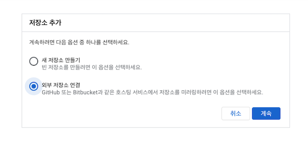

혼자서 사이드 프로젝트를 시작하려고 하던 참에 사이드 프로젝트용 서버를 만든다면 어떤 클라우드에 배포하는게 좋을까 고민이 들었다. AWS, GCP, Azure 다 도큐먼트도 많고 새로운 계정으로 가입하면 넉넉하게 프리티어를 주기에 다 좋은 대안이라고 느껴졌다. 그런데 만들어 보려고 하는 사이드 프로젝트가 앱 기반이기 때문에 어차피 Firebase를 사용할 것 같기도 하고 + GCP를 사용해본 경험이 없어서 GCP로 서버를 배포하기로 결정했다. 

지금까지 주로 AWS EC2에 서버를 직접 올리던지, Kubernetes를 통해 서버를 운영해본 경험이 있었다. 이번 사이드 프로젝트의 목표는 빠르게 MVP를 배포해보는 것이었다. 그렇기에 인프라까지 직접 구축하는건 너무 overengineering일 것 같다고 판단을 했다 (확장성있게...직접 인프라까지 구축하려다가....흐지부지된 프로젝트가 너무 많다...). 정적인 데이터를 전달할 수 있는 API 서버 정도면 충분했기에 이번에는 빠르게 배포할 수 있는 방식을 찾다가 `서버리스`에 도전 해봤다.  

공모주 관련 정적인 데이터를 내려주는 API를 `서버리스`로 배포해본 경험을 공유하려고 한다.

# 서버리스란?

서버리스가 실제로 서버가 없다는 의미는 아니다. 서버가 존재하긴 하는데 엄청 추상화가 되어있어서 개발자는 코드만 작성해서 배포하면 되는 것이다. AWS, GCP, Azure 같은 클라우드사에서 개발자들이 불필요한 인프라 구축 작업을 하지 않고도 코드를 배포할 수 있도록 제공하는 FaaS인 것이다. 

예를 들어, AWS EC2나 GCP Compute Engine에 Golang으로 된 API 서버를 구축한다고 생각해보자. 먼저 서버에 접속한 다음 Golang을 직접 설치해야 한다(도커 파일 사용하던지). 그 다음에 Github에서 Goalng 코드를 다운 받은 다음에 서버를 실행시켜야 한다. 그리고 외부에서 서버에 접근하게 만들기 위해서는 도메인 같은 것을 서버에 붙혀야 한다. 그외에 조금씩 챙겨야 하는 부분들이 꽤나 있다. 그리고 사이드 프로젝트의 트래픽이 0에 수렴하더라도 이 방식대로 서버를 구축하면 리소스 + 시간당 계산되기 때문에 계속 돈을 지불해야 한다.

서버리스는 위 모든 작업들을 이미 다 AWS, GCP, Azure가 구축해주고 개발자는 그 위에 코드만 작성하면 되는 것이다. 서버가 호출되기 전에는 잠자는 상태에 있다가 서버가 호출될때만 실행되고 실행된 경우에만 돈을 지불하면 된다. 그래서 트래픽이 적다면 지불해야 하는 돈도 매우 적은 것이다! (GCP 서버리스 cloud function은 200만 호출까지는 무료 👏)

물론 실제 큰 서비스를 운영할때는 조금 번거롭더라도 위 방식대로 인프라를 구축하고 자동화하는 것이 더 안정적인 경우가 많다. 하지만, 사이드 프로젝트를 진행하기에 서버리스만큼 가볍고 편리한 것이 없는 것 같다.

# GCP 시작하기

먼저 [https://console.cloud.google.com/](https://console.cloud.google.com/) 에 들어가서 회원가입 및 로그인을 한다 (새로 회원가입하면 무료 크레딧을 준다!). 

상단에 프로젝트 선택하기를 누르고 새로운 프로젝트를 생성한다. 

프로젝트를 생성하면 GCP 시작 끝이다. 너무 너무 간단 ㅎㅎ

# 깃헙 코드 GCP와 연동하기

GCP의 serverless 서비스는 `Cloud Function`이라고 불린다. `Cloud Function`에서 실행될 서버 코드를 배포하는 방식은 총 4가지가 있다. 

1. 자체적으로 제공해주는 인라인 편집기 - 화면에 코드를 편집할 수 있는 툴이 보여져서 바로 거기서 코드를 작성할 수 있다. 하지만, 조금 복잡한 코드를 작성하기에는 lint나 자동완성 기능들이 없어서 많이 불편하다.
2. ZIP 업로드 - 파일을 zip해서 올려놓기만 하면 된다. 이 방법은 매번 업로드 해야하기에 번거롭다.
3. Cloud Storage의 ZIP - 이 방식도 2번이랑 비슷한데, Clould Storage라고 GCP의 스토리지에 올라와있는 ZIP을 선택하는 방식인데 그러려면 미리 Cloud Storage에 zip을 올려놔야 해서 번거롭다.
4. Cloud 소스 저장소 - 클라우드에 소스코드를 올려놓으면 그 소스코드를 실행하는 방식이다. Github repository 연동해놓으면 github repository에 push할때마다 알아서 이 저장소에 코드가 업데이트 된다. Github를 잘 활용하는 개발자라면 이 방법이 제일 편할 것이라고 생각한다.

### Cloud Source Repository 접근하기

검색창에 cloud source repository라고 검색을 한 다음 시작하기를 클릭한다.

### Repository 연결하기

저장소 추가하기 화면이 나오는데 이 때 외부 repository 연결을 선택하면 된다. Github나 Bitbucket과 같은 호스팅 서비스의 repository와 연동을 시키는 방법이다.

어떤 프로젝트에서 이 repository를 사용할지 설정을 한 다음, Git 제공업체를 선택한다.

위 작업들을 거치게 되면 내 개인 github repository와 cloud source repository를 연동할 수 있게 된다. Github repository에 코드를 커밋하고 푸시하게 되면 바로 cloud source repository에도 업데이트 된 코드가 반영된다.

# Serverless Google Cloud Function 시작하기

서버리스에 배포할 소스 코드를 편하게 연동할 수 있는 환경을 구축했으니 이제 본격적으로 `Cloud Function` 을 시작해보려고 한다.

### 함수 만들기

`Cloud Function` 서비스를 선택한 후 함수 만들기를 선택한다.

함수 만들기를 하면 밑의 화면이 보이게 된다. 함수 이름과 리전은 필수적으로 등록해준다. 리전은 이 서버리스 서버가 배포되어있을 지역적 위치를 의미한다. 가능하면 가까운 리전을 선택하는 것이 latency 측면에서 좋다.

그리고 어떻게 하면 이 서버리스 서버를 호출할 수 있는지에 대한 `트리거` 설정을 하게 된다. 웹이나 앱에서 이 서버리스 서버를 호출하게 된다면 그냥 HTTP를 선택하면 된다. 그리고 서버리스를 배포하고 나서 URL로 접근하게 되면 내가 구현한 소스코드의 응답을 받을 수 있게 된다. 인증을 허용할지나 HTTPS 요청으로만 `트리거`할지도 설정할 수 있다.

이 단계를 넘어가면 바로 배포할 소스코드 부분이다. 어떤 환경의 소스코드를 배포할지 선택할 수 있다. GCP `Cloud Function`은 다양한 언어들을 지원한다: C#, Golang, Java, Nodejs, PHP, Python, 그리고 Ruby. Golang 1.17까지 나온 현 상황에 1.13까지만 지원하는건 조금 안타깝지만.... Gopher이기 때문에 Golang을 선택했다.

언어를 선택하면 위에서 언급한 소스 코드 배포 방식으로 인라인 편집기가 먼저 선택되고 default로 기본 함수를 제공해준다. 기본 함수의 이름은 `HelloWorld` 이고 오른쪽 위에 진입점에도 `HelloWorld` 가 작성되어있는걸 알 수 있다. 서버리스 서버로 요청을 보낼때 `HelloWorld`라는 함수로 요청이 가는 것을 뜻한다.

### Cloud Function과 Cloud Source Repository 연결하기

소스 코드 방식에서 4번째 방식인 Cloud 소스 저장소를 선택한다. 선택하고 나서 소스 코드내에 요청이 올때 실행될 함수의 이름을 진입점에 추가해준다.

[https://github.com/dojinkimm/ipo](https://github.com/dojinkimm/ipo) - 소스 코드

위 설정을 해석하자면 서버리스의 서버는 외부에서 요청이 오면 Golang 1.13으로 Cloud 소스 저장소에 있는 코드를 실행시킨다. 실행시킬 때 요청이 ListIpos라는 함수로 전달되고 함수의 로직이 실행되고 응답이 전달되게 하는 것이다.

### 함수 트리거하기

서버리스 서버가 배포가 성공적이면 함수 이름 옆에 초록색 체크표시가 뜨게 된다. 이 서버를 트리거 하기 위해서는 트리거 메뉴에 가서 이 서버리스의 URL을 받는다.

terminal에서 curl이나 Postman과 같은 툴로 해당 URL에 요청을 보내게 되면 밑과 같이 내가 구현한 소스 코드가 잘 작동이 되서 응답을 내려주게 된다.

# 마무리

사이드 프로젝트를 기획하면서 `서버리스` 서버를 간단하게 구현해보고 소스코드를 배포해봤는데 생각보다 너무 간단해서 좋았다. 

서비스의

- 트래픽이 많이 없고
- 응답이 조금 느려도 되고
- 비용을 줄이고 싶고
- 인프라 구축에 노력을 덜 들이고 싶고
- 정적인 응답만 줘도 되는 서버를 구축하고 싶다면

`서버리스`는 매우 좋은 대안이 될 수 있을 것 같다 (AWS Lambda나 Azure Function도 이처럼 비교적 사용이 간단할 것이라고 생각한다). 

사이드 프로젝트 기획 단계여서 `서버리스` 방식으로 서버를 배포하는게 좋을지는 아직 더 고민 해봐야겠지만, 이번 기회에 `서버리스` 서버를 배포해본건 좋은 경험이었다. 나중에 비교적 간단하고 정적인 응답을 주는 서버를 구축해야 하는 경우에는 overengineering하지 않고 `서버리스` 방식을 선택할 것 같다.