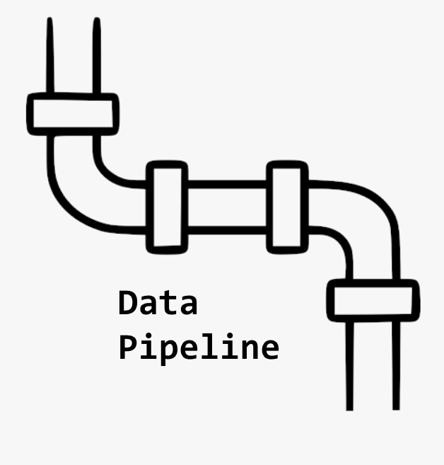
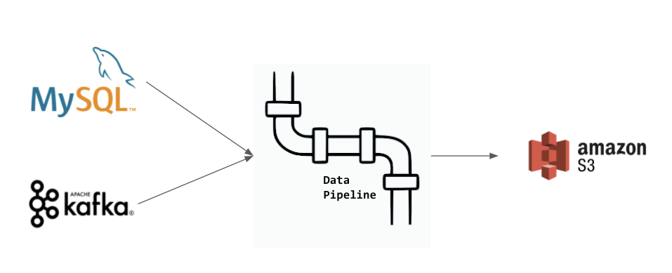
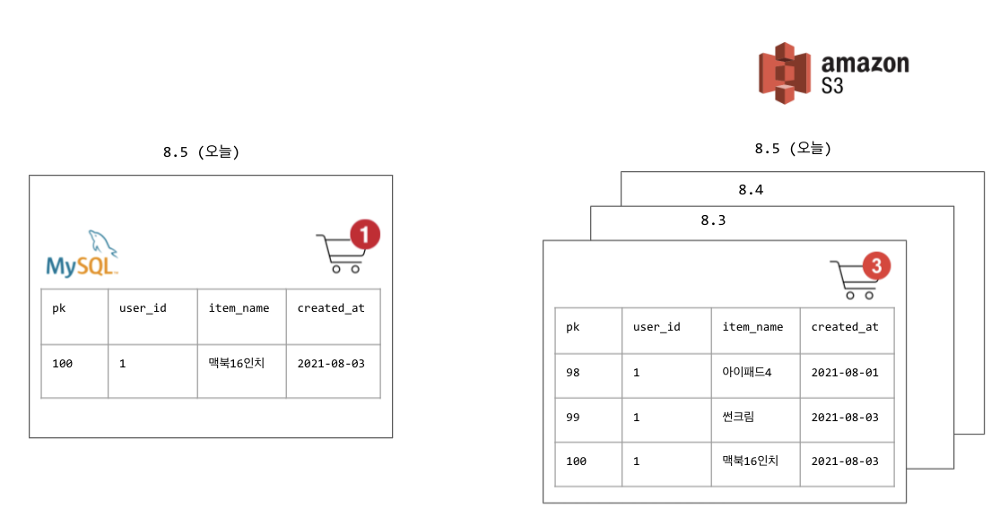

개발자로 커리어를 시작하면서 쭉 백엔드 및 가끔 프론트 개발을 했지만, 올해부터는 데이터 엔지니어링 작업을 많이 하게 되었다. 사실, 데이터 엔지니어링을 해보고 싶다는 light한 관심만 있었고 한번도 깊게 데이터 엔지니어가 어떤 일을 하고, 어떤 스킬들이 필요로 하는지, 내가 데이터 엔지니어가 되려면 어떤걸 배워야 할지 고민해보지 않았다. 그런데 운이 좋게도 회사에서 데이터 엔지니어링 관심 있다면 해보지 않겠냐고 제안을 했고 나는 덥썩 물었다.

원래는 데이터 엔지니어링에 대한 공부를 조금 한 다음에 실무에 투입되고 싶은 마음이었지만 바로 실무에 투입되었다. 그렇다보니 그때 그때 문제를 마주하고 해결하면서 데이터 엔지니어링에 대해 배우게 되었다 (속된말로 `개밥먹기`를 통해 데이터 엔지니어링을 하게 되었다). `개밥먹기` 방법은 생각보다 유효해서 데이터 파이프라인 여러개를 직접 수집부터 가공, 적재까지 성공적으로 구현을 했다 (역시 사람은 굴러봐야...). 하지만, 초반에 `개밥먹기` 하느라 정신이 없어서 기초를 잘 배우지 못한 것이 아쉬웠다. 지금은 조금 데이터 엔지니어링 직무에 적응해서 여유가 생겼기에 [Data Engineering Roadmap](https://github.com/datastacktv/data-engineer-roadmap)을 통해 더 나은 데이터 엔지니어가 되기 위해 진행한 공부 내용들을 정리 및 공유해보려고 한다.

데이터 엔지니어는 알아야 하는 + 알면 좋은 주제들에 대해 `데이터 엔지니어라면` 이라는 시리즈를 이어 나가려고 하고, 다음의 주제들을 다루려고 한다:

- 데이터 엔지니어는 어떤 일을 하는지? 왜 데이터 엔지니어링이 필요한지?
- 분산처리, Hadoop, Yarn
- Spark
- RDD, DataFrame, Dataset
- CDC, Debezium, Kafka, Hudi
- Airflow
- AWS EMR 혹은 다른 GCP, Azure의 비슷한 서비스
- Metabase, Superset, Redash와 같은 BI tool들
- Amundsen, Datahub과 같은 datadiscovery platform들
- 등등

왜 이 시리즈를 시작했는지 서론이 조금 길었는데, 이번 글은 간단하게 데이터 엔지니어는 어떤 일을 하는지 조금 구체적인 예시와 함께 정리해보려고 한다.

# 데이터 엔지니어란?

데이터 엔지니어라는 직무는 비교적 최근에 생겼다고 볼 수 있다. PC 및 모바일 인터넷이 급속도로 발전하게 되면서 유저들이 업로드한 데이터나, 앱내의 유저들의 행동, 로그 데이터 등 모든 종류의 데이터들의 양이 방대해졌다, 이른바 `빅데이터`의 시대인 것이다. 물론 명시적으로 데이터 엔지니어라는 직무가 없었을때도 데이터를 보는 기업들은 있었고 일반적으로 백엔드 엔지니어들이 이 작업을 진행한 것으로 알고 있다. 하지만, 데이터의 양이 너무 많아짐에 따라서 데이터를 잘 관리할 수 있는 전문적인 엔지니어들이 필요해졌다고 생각한다. 그래서, 데이터를 잘 관리하는 엔지니어들을 데이터 엔지니어라고 부르게 된 것이다.

데이터 엔지니어가 하는 대표적인 작업이 ETL이다. 방대한 양의 데이터를 Extract(수집), Transfrom(가공), Load(적재)하는 일련의 작업들을 의미하고 이 작업을 데이터 파이프라인을 구축 혹은 설계라고 표현한다. 각 E,T,L을 하는 방법은 매우 다양하다. Extract만 봐도 유저의 정보가 MySQL, PostgreSQL과 같은 RDB나 Redis, MongoDB, Neo4j와 같은 NoSQL에 있을 수도 있고, 유저의 앱내의 행동 정보는 또 다른 방식으로 전달이 될 수 있다. 데이터 엔지니어는 회사에서 사용하는 데이터 소스에 따라서 그 데이터들을 적절하게 ETL해야하는 것이다.

데이터를 잘 관리하는 것이 중요해졌고, 이 작업만 해도 도메인 지식이 많이 필요하기 때문에 데이터에 전문화된 데이터 엔지니어 직무가 생긴 것이다.

# 데이터 엔지니어링이 왜 필요한가요?

데이터 엔지니어가 어떤 일을 하는지에 대해 이해했어도, 이런 의문이 들 수도 있다.

- 그래서 데이터 엔지니어링이 왜 필요한거지?

데이터 엔지니어링이 필요한 이유는 결국 `분석을 잘하기` 위함이라고 생각한다. 수 GB~TB의 데이터를 수집, 가공, 저장하는 것은 매우 돈이 많이 나가는 작업이다. 그럼에도 많은 회사들이 TB단위의 데이터를 수집하고 관리하려고 하는 이유는 그 데이터들을 통해서 유의미한 정보를 얻을 수 있고 그 정보를 통해 돈을 벌 수 있기 때문인 것이다. 데이터 엔지니어링은 방대한 양의 데이터를 `잘 분석하기 위한 환경` 을 구축해줌으로써 데이터로부터 유의미한 정보를 얻을 수 있게 해주는 것이다.

`분석을 잘하기`위해서는 데이터 소스가 다르더라도 **데이터들이 하나의 플랫폼에서** **정형화된 상태**여야 한다. 예를 들어, MySQL에 있는 유저의 정보와 Kafka에 있는 유저의 행동 정보를 모아서 분석을 하고 싶은 경우가 있다고 가정해보자. 데이터 엔지니어링을 통해 MySQL 데이터를 수집 하고, 정형화시키고 이를 하나의 플랫폼에 적재한다. Kafka의 유저 행동 정보도 비슷하게 작업을 한다. 이런 과정을 통해서 하나의 플랫폼에서 MySQL의 데이터와 Kafka의 데이터를 join 같은걸 해서 분석할 수 있게 되는 것이다. 이러한 작업이 없으면 두 데이터 소스간 분석은 불가능해진다 (MySQL에서 Kafka의 데이터를 읽을 수 없기 때문, 반대도 동일).

실무에서는 여러 종류의 데이터를 하나의 데이터 소스에 모을 수는 없기 때문에 필연적으로 여러개의 데이터 소스가 생기게 된다. 그렇기 때문에 분석을 하기 위해서는 데이터 엔지니어링 작업이 필요할 수 밖에 없는 것이다.

추가로 데이터 엔지니어링 작업을 통해서 과거의 데이터들을 유지해서 분석을 할 수 있다. 예를 들어, 쇼핑 장바구니 서비스를 떠올려보자. 일반적으로 장바구니의 데이터를 담은 데이터베이스는 유저의 가장 최신 장바구니 상태에 대한 정보만 갖고 있을 것이다. 8월3일에 장바구니에 상품들을 담았어도 오늘 8월 5일 전에 상품들을 삭제 혹은 이미 구매를 했다면 8월5일 데이터베이스에는 이전에 담았던 상품들의 목록이 없을 것이다. 데이터베이스에 쿼리를 해서 분석을 하면 그 쿼리 당시의 최신 데이터들로만 분석을 할 수 있고 과거의 데이터들에 대해서는 분석을 할 수 없다 (+ 운영계 데이터베이스에 직접 쿼리하는 것은 좋은 방법이 아니다).

하지만 데이터 엔지니어링 작업을 통해서 매일매일의 데이터베이스 데이터를 ETL을 통해 하나의 플랫폼에 적재할 수 있고 이를 분석에 활용할 수 있게 되는 것이다. 과거의 데이터들을 통해 해당 유저가 어떤 상품들을 장바구니에 많이 담는지, 어떤 상품들은 왜 삭제하는지, 어떤 상품들이 결국 구매까지 이뤄지는지 등을 분석할 수 있는 것이다.

# 마무리 🙇

`데이터 엔지니어라면` 시리즈의 첫 글을 작성 완료했다. 이번 글에서는 빅데이터 시대에 들어서게 되면서 많은 관심을 받고 있는 데이터 엔지니어링이란 직무와 데이터 엔지니어링이 왜 필요한지 정리를 했다. 결국, 데이터가 돈이 되는 세상이 되었기 때문에 이런 직무가 생겨났다고 생각한다. 앞으로의 시대는 더 다양하고 많은 데이터들이 쌓일 것이기 때문에 데이터 엔지니어는 풀어야 할 문제들이 더욱 많을 것이다.

# References

- [https://github.com/datastacktv/data-engineer-roadmap](https://github.com/datastacktv/data-engineer-roadmap)
- [https://tech.kakao.com/2020/11/30/kakao-data-engineering/](https://tech.kakao.com/2020/11/30/kakao-data-engineering/)
- [https://brunch.co.kr/@imagineer/301](https://brunch.co.kr/@imagineer/301)
