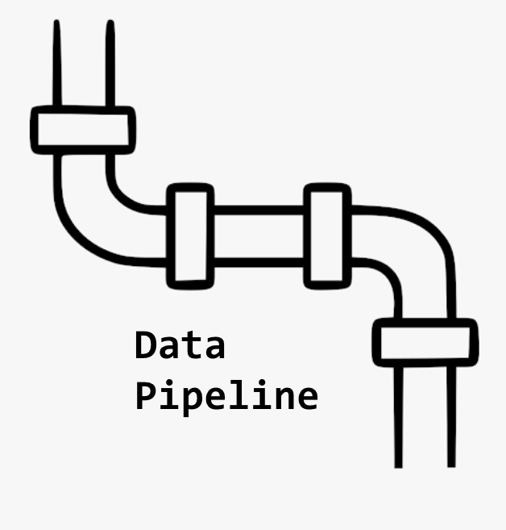
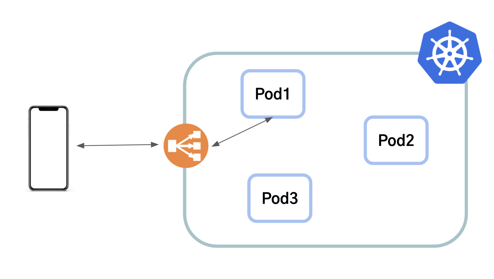
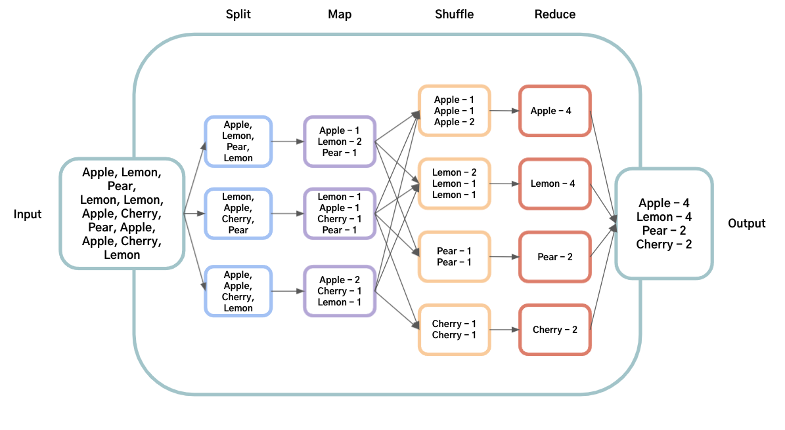

이번 글은 데이터 엔지니어라면 알아야 하는 분산처리에 대한 개념과 MapReduce에 대해 짚어보려고 한다.

# 분산 시스템, 분산 처리란?

데이터 엔지니어라면 분산 시스템, 분산 처리에 대해 이해를 하고 있어야 한다. 지난 글에서 언급했던 것 처럼, 데이터 엔지니어가 대표적으로 하는 일이 데이터를 ETL, Extract(수집), Transfrom(가공), Load(적재)하는 데이터 파이프라인을 구축 하고 설계하는 일이다. 그리고 이 작업들을 진행할 때 분산된 시스템에서 데이터를 분산 시켜서 처리를 한다.

분산 시스템이란 여러 컴퓨터들이 네트워크 상에서 연결되어있어서 서로 통신하고 협력해서 하나의 컴퓨터처럼 작업을 하는 시스템을 의미한다. 이때 사용자는 어떤 작업을 할때 그 작업이 어디에서 어떤 컴퓨터에서 진행되고 있는지는 크게 신경쓰지 않게 된다. 예를 들어, AWS, GCP와 같은 클라우드의 컴퓨팅 엔진 (ex. EC2)를 사용해서 서버를 관리하고 있다면 분산 시스템에서 서버를 운영하고 있는 것이다. 분산 시스템을 구축했을 때의 대표적인 이점들은 다음과 같다:

- High Performance - 하나의 컴퓨터로는 CPU, disk, memory의 한계로 해결하지 못하는 문제들도 여러 컴퓨터를 scale out해서 해결할 수 있어 높은 퍼포먼스를 달성 할 수 있다.
- Fault tolerant - 하나의 컴퓨터가 장애가 나도 같은 일을 하는 컴퓨터가 여러대가 있기 때문에 작업이 끊기지 않고 진행될 수 있다.
- Openness - 접근을 로컬이나 리모트에서 할 수 있다. 예를 들어, 한국에서 US-region의 서버를 사용할 수도 있다.

분산 처리는 위와 같은 장점들을 지닌 분산된 시스템에서 작업을 처리하는 것을 의미한다.

단, 데이터 엔지니어링에서 얘기하는 분산 처리는 병렬처리 "동시에 여러 일"을 하는 것과는 구분해서 "하나의 일을 동시에 여럿이 하는 일"이라고 이해해야 한다. 일반적인 API 서버는 분산 시스템에서 동시에 같은 일을 병렬적으로 하게 된다. 예를 들어, Kubernetes에서 여러 Pod을 지닌 서버를 Deployment를 배포해서 운영을 할때, 각 Pod들은 서로 어떤 작업을 하는지에 대한 맥락을 공유하지 않고 병렬적으로 일을 진행한다. 클라이언트에서 요청이 들어오면 한개의 Pod에서만 요청을 받고 로직 처리한 다음에 응답을 준다. 다른 Pod들도 동일하게 요청이 들어오면 각자 일을 하고 응답을 준다 - "여러 일을 동시에 진행하는 것이다".

<figure style="text-align: center;">
	
  <figcaption>분산 시스템에서 서버를 운영하는 Figure1</figcaption>
</figure><br>

데이터 엔지니어링에서 얘기하는 분산 처리에서는 여러 서버들이 협력해서 "하나의 큰 작업을 나눠서 진행"하는 것이다. 데이터 엔지니어가 하는 일을 잘 생각해보면 왜 하나의 큰 작업을 나눠서 진행하는지 이해할 수 있다. 데이터 엔지니어들은 여러 GB ~ TB 혹은 그 이상의 큰 데이터들을 수집, 가공, 및 적재를 하는데, 하나의 컴퓨터에서 이렇게 큰 데이터를 다 처리하려면 매우 오랜 시간이 걸릴 것이고 리소스(메모리, 디스크 등)가 그 크기를 수용할 수 없는 경우도 있다. 그렇기 때문에 이런 경우에는 하나의 큰 작업을 여러 컴퓨터에 나눠서 병렬적으로 진행시킴으로써 작업 시간을 줄이고 적은 리소스로도 작업이 가능해지는 것이다.

지금까지 얘기한 부분을 정리하자면,

- 분산 시스템은 그냥 분산된 시스템 그 자체이고
- 분산 처리는 하나의 큰 작업을 분산 시스템에서 여러 서버들이 연산(작업)을 하는 것

이다.

# MapReduce

`MapReduce` 대용량의 데이터를 처리할 수 있는 분산 처리 모델이다. 요즘 데이터 엔지니어링 필드에 사용되는 여러 분산처리 프레임워크들도 다 이 모델을 베이스로 하고 있다.

2000년대 초반이 되면서 구글이 엄청 성장하면서 데이터도 많이 쌓이게 되었다. 그러면서 기존의 방식으로 데이터 처리가 어렵다는 것을 점점 느끼게 되었다. 기존 방식으로는 한번 하드웨어의 문제나 코드의 문제로 실행되던 작업이 중단되면 처음부터 작업을 실행했어야 했다. 그래서 이 비효율적인 문제를 해결하기 위해 구글의 엔지니어들이 고안해낸 방법이 `MapReduce` 이고 [MapReduce: Simplified Data Processing on Large Clusters](https://www.usenix.org/legacy/event/osdi04/tech/full_papers/dean/dean_html/)라는 논문으로 세상에 소개되었다.

논문에서 소개된 `MapReduce` 에 대해 밑에서 설명하려고 한다.

<aside>
💡 논문에 의하면 논문에서 나오게 된 map reduce 방식은 Lisp나 다른 함수형 언어에서 염감을 얻었다고 한다

</aside>

## Programming Model

`MapReduce`는 2가지 단계로 나뉜다: Map / Reduce. 이 방법은 큰 하나의 작업을 Map이랑 Reduce라는 단계로 나누고 그 작업을 여러 서버에 분산시켜서 실행시킨다. Map 단계에서는 하나의 큰 데이터를 input의 pair로 받게 되고 특정 패턴으로 쪼개서 key-value 형태로 만든다. MapReduce 라이브러리에서는 중간 단계 value들 중 같은 key를 갖는 데이터들을 모아서 Reduce 단계로 넘겨준다.

Reduce 단계에서는 Map단계에서 작업된 결과물들을 key 별로 value들을 받은 다음에 더 작은 단위의 value의 형태로 합치는 일을 한다(aggregation).

`MapReduce` 방식에서는 하나의 큰 작업이 여러 단계로 나뉘어져 있기 때문에 작업이 실패했을때 전체 작업을 다시 실행시키는 것이 아니라, 실패한 단계만 다시 수정해서 실행시키면 되는 방식으로 바뀌게 되어서 더 효율적 작업이 가능해졌다.

<figure style="text-align: center;">
	
  <figcaption>MapReduce 방식으로 단어의 수를 세는 Figure2</figcaption>
</figure><br>

논문에서는 여러 문서들에 단어들이 있고 전체 문서들에서 각 단어의 출현 빈도를 세려고 할때, `MapReduce` 로 그 작업을 하는 코드를 구현한다면 밑과 같은 pseudo 코드와 비슷할 것이라고 한다:

```cpp
map(String key, String value):
	// key: document name
	// value: document contents
	for each word w in value:
		EmitIntermediate(w, "1");

reduce(String key, Iterator values):
	// key: a word
	// values: a list of counts
	int result = 0;
	for each v in values:
		result += ParseInt(v);
	Emit(AsString(result));
```

map 함수에서는 각 단어와 그 단어의 출현빈도를 더해서 넘겨준다. reduce함수에서는 map함수에서 전달해준 단어별 출현빈도들을 다 더한다.

## Map Reduce의 구현

논문의 3장에서는 실제 분산된 시스템에서 `MapReduce` 가 어떻게 실행되는지에 설명한다. 물론, 지금은 하드웨어 성능이 더 좋아지기도 했고, 분산 처리 프레임워크마다 추가된 프로세스들이 더 생겨서 이 프로세스와 살짝 차이는 있을 수 있다.

`MapReduce` 함수를 유저가 호출하게 되면 다음의 step대로 계산이 된다:

1. MapReduce 라이브러가 처음에 M개의 파일로 데이터를 쪼갠다 (16~64MB 단위). 클러스터 내에 있는 머신들은 여러개의 복사본들을 만들고 시작된다.
2. 마스터라는 프로그램은 특별한 역할이다. 다른 워크들은 마스터에 의해 작업이 할당된다. M개의 map 작업과 R개의 reduce 작업들이 할당될 수 있다. 마스터는 쉬고 있는(idle) 워크들에 map이나 reduce 작업을 할당한다.
3. map 작업에 할당된 워커는 split된 input의 데이터를 읽습니다. 이 데이터를 key-value pair로 쪼갠 다음에 유저가 정의한 Map 함수에 전달한다. Map 함수에 의해 중간 결과물 key-value pair가 만들어지고 메모리에 보폳한더.
4. 주기적으로 이 버퍼된 pair들은 로컬 디스크에 write되고 파티셔닝 함수에 의해 R개로 파티셔닝 된다. 이 버퍼된 pair의 로컬 디스크의 위치는 마스터에게 전달된다. 마스터는 이 위치를 reduce 워크들에게 넘겨주는 역할을 한다.
5. reduce 워커가 마스터로부터 위치에 대한 정보를 알게 되면 rpc를 사용해서 map 워커들의 로컬 디스크의 버퍼된 데이터를 읽게 된다. 중간 결과물을 reduce 워커가 다 읽어들이면 같은 key들끼리 그룹 지을 수 있도록 중간 결과물들을 key기반으로 정렬한다.
6. reduce 워커는 정렬된 중간결과물 데이터를 순회하면서 유니크한 중간결과물 key를 마주했을때 그 key와 value들을 Reduce 함수로 보낸다. Reduce함수의 결과물은 결과물 파일에 추가된다.
7. map과 reduce 작업들이 다 끝나게 되면 마스터는 유저 프로그램을 깨우고(?), 유저의 코드 부분으로 되돌아간다. (MapReduce를 실행했던 코드 부분으로 돌아간다고 이해했다)

### Master 데이터 구조

각 map과 reduce 작업에 대해 마스터는 상태를 저장한다 (idle, in-progress, completed). 위 step에서 언급한 것처럼 마스터를 통해 map 작업의 중간 결과물들에 대한 위치가 reduce 작업으로 전달된다. 그래서, map 작업이 끝나면 마스터는 중간 결과물의 위치와 사이즈를 저장하고 이 정보를 점진적으로 in-progress인 reduce 워커한테 전달된다.

### Fault Tolerance

MapReduce 라이브러리는 수천개의 머신에서 수GB~TB의 데이터를 다루기 때문에 머신이 실패해도 그것을 잘 수용하고 극복 할 수 있어야 한다.

마스터는 주기적으로 워커에게 핑을 보낸다. 일정 시간안에 워커가 답변을 주지 않는다면 마스터는 그 워커는 실패했다고 간주한다. 일반적으로 map 작업이 끝난 워커는 다시 쉬는 상태(idle)로 돌아간다. 실패한 워커도 다시 쉬는 상태(idle)로 리셋되고 다시 스케줄될 수 있게 된다. 완료된 map 작업들의 결과물은 로컬 디스크에 저장되기 때문에 실패하면 재실행되어야 하지만, 완료된 reduce의 작업은 글로벌 파일 시스템에 저장되기 때문에 실패되도 재실행될 필요가 없다.

마스터도 checkpoint를 계속 작성해서 죽으면 checkpoint부터 다시 시작할 수 있다. 하지만, 논문에서 구현할때 마스터는 하나이기 때문에 마스터가 실패하면 MapReduce 전체 실행이 실패하게 된다.

### Locality

네트워크 대역폭은 컴퓨팅 환경에서 상대적으로 희소한 자원이다. 로컬 디스크에서 파일을 읽을때는 네트워크 통신이 일어나지 않지만 다른 머신의 파일을 읽기 위해서는 네트워크 통신이 생기고 이 비용은 분산 처리에서는 항상 큰 비용이다. 그래서, MapReduce에서는 마스터가 가능하면 input 파일을 로컬 디스크에 저장하고 있는 그 머신에서 연산이 이뤄지도록 한다. 그게 실패하더라도 데이터를 저장한 로컬 디스크와 가까이 있는 머신에게 작업을 할당해서 네트워크 비용을 최소화하려고 한다.

# 마무리 🙇

이번 `데이터 엔지니어라면` 시리즈 2에서는 분산 처리와 데이터 엔지니어링의 기반이 되는 MapReduce 모델에 대해 정리를 했다.

논문에 있는 내용들을 다 정리하지는 않았고 Map Reduce 분산 처리 모델의 메인 로직과 인프라적인 부분에 대해서만 정리했다. 논문 뒷부분에서는 Map Reduce를 더 유용하게 사용할 수 있는 팁(?)들이나 퍼포먼스 측정 등에 대해 얘기를 한다.

데이터 엔지니어링 직무를 시작하면서 부족함을 메꾸기 위해, 꾸준히 공부를 하며 배운 데이터 엔지니어링 관련 내용들을 시리즈로 정리하려고 했으나... 바쁘다는 핑계로 공부를 조금 게을리 했다. 그래도 데이터 엔지니어라면 시리즈 2편을 시작으로 2주마다 새로운 글을 올릴 예정이다. 다음은 Hadoop에 대한 글을 써보려고 한다.

# References

- [https://computernetworktopology.com/distributed-computing/](https://computernetworktopology.com/distributed-computing/)
- [https://www.splunk.com/en_us/data-insider/what-are-distributed-systems.html](https://www.splunk.com/en_us/data-insider/what-are-distributed-systems.html)
- [https://static.googleusercontent.com/media/research.google.com/ko//archive/mapreduce-osdi04.pdf](https://static.googleusercontent.com/media/research.google.com/ko//archive/mapreduce-osdi04.pdf)
