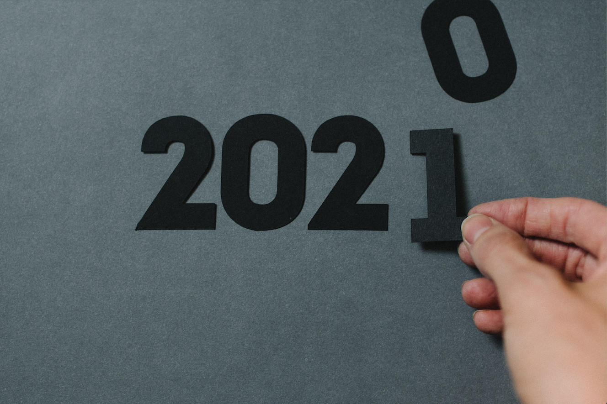
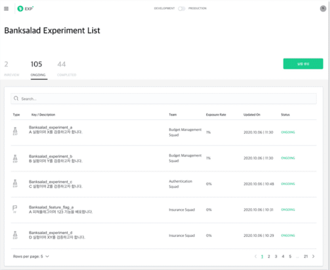
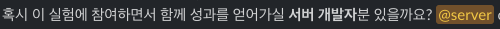
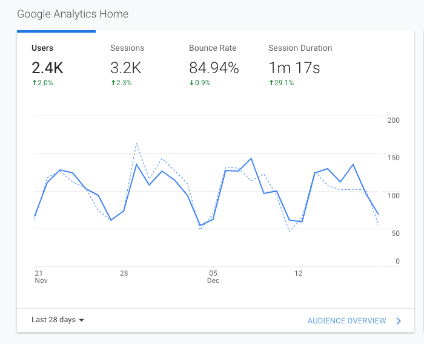
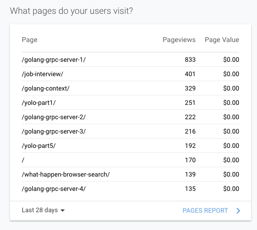
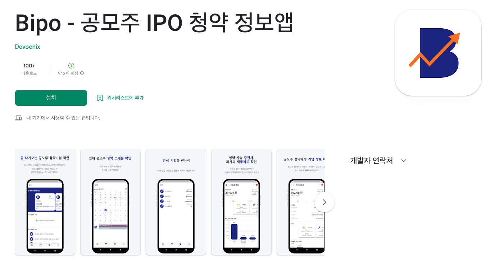

2021년은 학생의 신분을 벗어나 온전히 직장인으로서 시간을 보낸 한해였다. 온전히 직장인으로서 보낸것 외에도 2021년에는 개인적으로 다양한 이벤트들이 있었다. 그래서 이 한해를 잊지 않기 위해 기록해놓으려고 한다.

# 1. 실험플랫폼 🧪

2020년 취업한 이후로 2021년 1분기까지 뱅크샐러드의 AB Testing 실험플랫폼을 개발했다.

뱅크샐러드 앱이라는 제품에 새롭게 추가 및 개선되는 대부분의 기능들이 내가 만든 실험플랫폼을 통해서 배포되었고, 데이터 분석을 통해 실제 유저들한테 선보여졌다. 지금도 매일 수십개의 실험들이 동시에 앱에서 진행되고 있다.

- [진정한 실험 조직의 탄생](https://blog.banksalad.com/tech/birth-of-a-genuine-experiment-organization/) 블로그 글
- [뱅크샐러드의 실험플랫폼 분석 인프라 살펴보기](https://blog.banksalad.com/tech/experiment-platform-analysis-architecture/) 블로그 글

실험플랫폼 개발을 하면서 가장 좋았던 건 좋은 팀원들과 협업해서 하나의 목표를 향해 달려가는 것이었다. 너무 좋은 팀이었다. 지금은 각자의 사정으로 다들 뿔뿔히 흩어져서 나만 팀에 남았지만 같이 일했던 경험이 너무나 좋았어서 아직까지 연락을 하며 지낸다. 실험플랫폼 팀원으로 일을 하면서 다음의 것들을 항상 염두에 두며 일을 했다.

1. 임팩트가 있는가

   실험플랫폼이라는 서비스를 개발을 할때 한번에 A-Z를 만들 수는 없었기에 매번 임팩트 순으로 우선순위를 매겨서 일을 진행했다. 외부에서 들어오는 다양한 요청들도 있었지만 그때도 임팩트를 고려해서 한정된 리소스 내에 외부의 요청들을 진행할지 말지를 결정했다. PM님이 이런 우선순위에 대한 완급 조절을 너무 잘해주셨다, 덕분에 나는 임팩트 있는 일들을 먼저 진행해서 실험플랫폼의 기능들을 하나씩 개발해나갈 수 있었다.

2. 목표를 달성하려면 내가 무엇을 해야하는가?

   회사 내에서는 각자의 R&R이 있고 각자에게 정해진 직무가 있다. R&R을 명확하게 하는 것도 좋지만 종종 목표를 빠르게 잘 달성하기 위해서는 명확한 R&R을 지키는 것이 오히려 허들이 되는 경우도 있을 수 있다. 그래서 실험플랫폼에 있을 때는 실험플랫폼이라는 하나의 팀 안에서는 모두가 모든 일을 했다. 나도 잠시 프론트엔드 개발자분이 전사의 다른 우선순위로 인해 잠시 실험플랫폼 개발에 공백이 있었을때, 팀의 실험플랫폼 출시라는 목표를 빠르게 달성하기 위해 웹 개발에 온보딩을 해서 개발을 했다. 그 외 구성원들을 위한 실험플랫폼 가이드나 문서들도 직접 작성을 했다. 서로가 팀의 목표를 위해서는 해보지 못한 일들도 했다.

   팀이라면 그 목표를 달성하는 것이 중요하다는 것을 느끼게 되었고, 나의 롤을 한정하지 않고 팀의 목표를 위해 더 달려나갈때 자연스럽게 임팩트 있는 일들을 빠르게 달성할 수 있음을 느끼게 되었다. 목표를 달성하기 위해서는 내가 무엇을 해야할까를 고민하며 연습을 하게 되었다.

3. 커뮤니케이션, 커뮤니케이션, 그리고 커뮤니케이션

   아직도 잘 못하는 부분이라고 생각되지만 커뮤니케이션의 중요성을 너무나도 많이 배웠다. 입사 후 처음에는 개발자의 마인드여서 그런지 스크럼이나 회의때 장황하게 기술에 대해 설명을 많이 했다. 간단한 질문에 대해서도 긴 답변을 했었다. 회의 시간이 길어지는 것 뿐만 아니라 듣는 사람들에게도 별로 도움이 되지 못하는 커뮤니케이션 스킬이었다. 이런 부분들에 대해서는 PM님이 개선이 필요하다고 말씀해주셔서 나 자신의 커뮤니케이션 방법을 돌아보게 되었다.

실험플랫폼팀에서 일을 하면서 너무 좋은 팀원들과 너무 많은 것들을 배웠다. 팀이 어떻게 일할때 시너지를 내서 임팩트를 낼 수 있는지를 배울 수 있었다.

# 2. 데이터 엔지니어링 ⚙️

2021년 2분기부터 실험플랫폼 소속이지만 더 이상 백엔드 개발이 아닌 데이터 엔지니어링을 하게 되었다. 실험플랫폼 일도 그대로 하지만 이미 실험플랫폼이 많이 고도화가 되었고 필수적인 기능들은 그 전에 많이 개발되었기 때문에 전체 리소스에서 실험플랫폼 일의 비중을 줄이고 데이터 엔지니어링 일의 비중을 늘렸다. 당시에 데이터 엔지니어가 많이 없는데 필수적으로 되어야 하는 데이터 엔지니어링 작업들이 많았기 때문에 매니저님이 데이터 엔지니어링 해보는 것을 제안해주셨고 나는 바로 응했다.

처음 데이터 엔지니어로 온보딩을 할때 MySQL DB를 CDC하는 과제를 받게 되었다. 여러 오픈소스들의 공식문서, 외부 블로그들 및 발표자료들을 다 읽으면서 어떤 인프라를 구축할지 구체화해갔다. 데브옵스팀과 다른 데이터 엔지니어링 팀원분들의 도움을 받아 기간내에 과제를 완성시킬 수 있었다. 새로운 기술 스택들 Spark, Airflow, Kafka, Debezium등등을 배우면서 재미있었고 백엔드 개발때는 경험을 많이 해보지 못한 인프라들에 대한 이해도 높아져서 좋은 경험이었다. 그리고 데이터 엔지니어링 팀에 와서 새로운 좋은 팀원들을 만나서 일을 하는 것도 좋았다.

CDC 작업 이후로는 기본적인 데이터 엔지니어링 작업에 대해서는 잘 적응을 해서 그 이후부터 지금까지 쭉 데이터 엔지니어링 일을 하고 있다. 데이터 엔지니어링일을 이벤트 및 데이터 적재의 구조를 이해하게 되면서 실험플랫폼과 파이프라인에 대한 이해도도 한층 높아졌다. 새로운 도전이었지만 그만큼 많은 것을 배우게 되어서 성공적인 도전이었다고 생각한다.

# 3. 잠시 PM - 로깅 인프라 🛠

2021년 2분기부터 데이터 엔지니어링일을 새로 시작했지만 그와 함께 로깅 인프라 개선하는 tft팀의 PM(?)을 병렬로 맡게 되었다. 공식적으로 PM역할을 맡아라라고 해서 맡은 건 아니었고, 내가 그나마 로깅 인프라에 대한 맥락들을 이해하고 있었어서 겸사겸사 PM처럼 일하게 되었다. 클라이언트에서의 작업이 필요했기에 클라이언트 개발자분들과 팀으로 일을 했다. 나는 전체 이 tft팀이 해야하는 일에 대한 마일스톤 및 작업들을 할당했고, 필요시에 백엔드 개발 지원 및 이벤트 로깅 디버깅 등을 지원했다.

잠시 PM처럼 일을 하게 되면서 PM이 얼마나 어려운 직무인지 깨닫게 되었다. 기존에 일을 할때는 전체 마일스톤 중에 내가 해야하는 일에만 집중하면 됐었다. 하지만 PM으로써 일을 할때는 다른 팀원이 어떤 일을 하고 있고, 그 일이 전체 프로젝트 마일스톤에서 어느 부분이고, 기간내에 일을 완성시키려면 어떻게 해야하는 지 등 프로젝트의 모든 것에 대한 고민해야 했다. 그리고 이 팀원들간 원활한 커뮤니케이션을 하기 위한 노력도 해야 했다.

다시 한번 커뮤니케이션의 중요성을 느끼게 된 때였다.

# 4. 제품 개발 💻

너무 많은 일을 벌리는가 싶기도 한데 제품 개발을 해보고 싶었다. 뱅크샐러드에 와서 실험플랫폼 인프라나 데이터 엔지니어링을 통해 제품 개발에 필요한 요소들을 다른 팀들에게 제공해줬지만, 실제로 나는 그 인프라를 통해 제품 개발해본 경험이 없었다. 물론 실험플랫폼도 내부 고객을 위한 제품이었지만, 실제 유저들을 위한 제품을 내본적이 없었다. 나는 어떤 일을 즐거워하고 어떤 개발자가 되고 싶은지 고민하고 있었기 때문에 최대한 다양한 경험들을 해보고 싶었다. 그래서 기회가 왔을때 잡았다.

슬랙 채널에 다른 팀에서 임팩트가 있는 실험을 진행하려고 하는데 서버 리소스가 부족해서 지원을 요청하는 글이 올라왔다.

임팩트가 있을 것 같고, 제품 개발을 해보고 싶었기 때문에 일단 매니저와 같이 일하는 데이터 엔지니어링 팀에게 양해를 구하고 자원을 했다. 이 실험을 진행하면서 실제로 뱅크샐러드 내에 어떤 데이터들이 있고 어떻게 내가 데이터를 가공해서 유저들에게 임팩트를 줄 수 있을지 고민하며 스펙을 구체화해나갔다. 데이터 엔지니어로서 데이터 적재를 진행했지만 실제로 어떤 데이터가 있는지 딱히 본적은 없었던 것 같다. 근데, 실제 제품을 개발하려고 하다 보니 데이터를 보게 되었고 그 경험이 너무 좋았다. 그리고 실제로 이 실험의 지표 결과를 봤을때 꽤나 임팩트 있는 실험이었다. 내가 만든 실험플랫폼에서 내가 진행한 실험의 지표를 보고 그 지표가 잘 나온걸 확인했을때 뿌듯했다.

이 경험을 한 이후로 제품 개발을 할 수 있는 기회가 있을때 개인 시간을 더 내서 지원을 했다 (본업은 데이터 엔지니어링과 실험플랫폼). 인프라 구축이나 제품 개발이 다 재밌어서 아직까지 어떤 분야에 더 집중해야겠다는 고민중에 있다.

# 5. 블로그 📚

올해 비록 많은 글을 쓰지는 못했지만, 2021년도 초반에 세웠던 목표는 월 2K가 방문하는 블로그로 활성화시키자 였다. 이 2021년도를 기록하는 글을 포함해서 총 11개의 글 밖에 쓰지는 못했지만 그 목표를 달성했다.

어떤 글들이 가장 많이 노출되었나를 확인했을때는 golang 관련해서 작성했던 시리즈 글들과 취업 후기, yolo 번역한 글들임을 보게 되었다. Golang이라는 언어에 대한 관심도가 차츰 높아졌구나라는 생각을 하게 되었다.

한달에 최소 한개의 글을 작성하는 것이 목표였으나 되돌아보니 한달에 한개도 작성하지 못했다. 물론 올해 결혼도 하고, 새로운 직무에 도전도 해보고, 추가로 시간을 내서 제품 개발도 하면서 바쁜 해였다. 내년에는 조금 이 모든 것들이 안정화되기에 더 많은 글들을 써보는 것을 목표로 하겠다.

# 6. 개인 앱 📱

아 블로그 글을 더 많이 못 쓴 이유 중 하나가 더 있었다. 바로 개인 앱 개발이다. 회사에서 주어진 인프라에서 개발은 너무나 잘 적응해서 잘 하고 있으나, 내가 혼자 처음부터 끝까지를 개발해볼 수 있을까?에 대한 고민에서 시작한 사이드 프로젝트이다.

- Android 플레이스토어: [https://play.google.com/store/apps/details?id=com.henry.bipo](https://play.google.com/store/apps/details?id=com.henry.bipo)

회사내에서 제품 개발 일을 해보기 전에 제품 개발에 대한 경험을 쌓기 위해 개인적으로 시작했던 일이다. 간단히 만들어 볼 수 있는 주제를 찾다가 `공모주 청약` 이라는 키워드로 프로젝트를 시작했다. 백엔드는 GCP Cloud Registery에 도커 파일을 올리고 GCP Cloud Run에 배포를 했다. 프론트는 Flutter로 만들었다. GCP는 처음 써봤는데 앞으로 간단한 서버를 만들 거면 무조건 GCP를 써야겠다 생각이 들 정도로 만드는 것이 너무나 간단헀다. 그리고 Flutter는 2.0이 나오고 나서 많이 안정화가 되기도 했고 reference들이 많아져서 개발할때 참고할 문서나 글들이 많아 빠르게 개발할 수 있었다. 앱의 특징에 따라서 다르겠지만 간단한 앱을 만든다면 나는 무조건 Flutter로 만들어야겠다는 생각이 들었다.

처음부터 Android / iOS 앱을 바로 출시하려고 했으나 iOS는 개발자 등록 비용이 너무 비쌌다. 그래서 먼저 Android 앱만 만들고 지인들한테 피드백을 통해 앱을 개선해나갔다. 원래는 마케팅도 좀 태워보고, 광고도 붙혀보고 하려고 했으나 갑자기 여러 다른 일들로 바빠져서 일단 홀드된 상태이다. 내년에 다시 진행할지 혹은 새로운 프로젝트를 진행할지는 아직 고민이다.

# 마무리 🙇

2021년 한해는 새로운 도전들로 가득한 해였다. 그만큼 바빴지만 많은 것들을 배우고 성장하는 느낌이 들어 뿌듯한 한해였다. 개인적인 일상에도 다양한 변화들이 있었지만 나는 공개적인 곳에서 그런 얘기하는 것은 아직 부끄러워 적지는 않겠다 ㅎㅎ.

아직 2022년 플래닝을 하지는 않았지만 2021년보다 더 열심히 살아보려고 한다.
