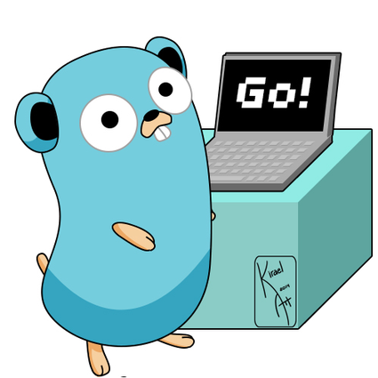

Go 1.19이 공식적으로 릴리즈 되었습니다. 

앞선 버전인 Go 1.18에는 generic이라는 Golang 언어에 큰 변화를 가져왔다면, 이번 Go 1.19는 Go 1.18에서 생긴 변화들에 대해 더 안정성을 확보하고, 퍼포먼스를 향상 시켰다고 볼 수 있을 것 같습니다.

이번 릴리즈에서 밑의 변화들을 조금 눈여겨 볼 만한 것 같습니다:

1. Memory Model
2. Doc 
3. Runtime
4. Compiler
5. Core Library

# Memory Model

Go의 메모리 모델을 C, C++, Java, Javascript, Rust, 그리고 Swift등에서 사용하는 메모리 모델과 맞췄습니다. 기존에 작성된 프로그램들에는 영향이 안가기 때문에 크게 우려할 점은 없다고 합니다. 또한, 메모리 모델을 업데이트 하면서 `sync/atomic` standard library에 새로운 type도 추가했습니다:

- `atomic.Int64` 처럼 atomic value들을 쉽게 사용할 수 있게 해주는 `atomic.Pointer[T]`

Go 1.18에서 generic이 나온 이후로 처음으로 standard library에서 generic을 활용한 사례라고 합니다. 기존에도 `atimic.StorePointer`라고 해서 비슷한 기능을 제공하기는 했으나, generic을 통해 atomic value들을 보다 더 편리하게 사용할 수 있게 되었습니다.

이번 memory model업데이트와 atomic type들이 추가되었는지는 Russ Cox가 작성한  [Updating Go Memory Model](https://research.swtch.com/gomm) 글을 읽으면 어느정도 이해할 수 있습니다. 이 글에서는 Go의 철학에 대해서 다시 한번 얘기해주고 있습니다. 

# Doc

이제 doc comment에 link, list, clear한 heading들이 지원이 됩니다. `gofmt`를 활용하면 doc comment도 자동 포맷팅이 가능해졌습니다.

# Runtime

Garbage collector에 soft memory limit을 지원하게 되었습니다. 이 limit은 `GOMEMLIMIT` 환경변수로 혹은 `runtime/debug.SetMemoryLimit`으로 관리될 수 있습니다. Container에서 주어진 메모리에서 Go program을 효율적으로 실행할 수 있도록 최적화해준다고 합니다.

런타임에서 application이 idle상태일때 더 적은 수의 GC 워커 goroutine들을 스케줄링 한다고 합니다. 

# Compiler

Compiler가 큰 integer나 string switch문을 구현할때 `jump table`을 사용한다고 합니다. `GOARCH=amd64` 와 `GOARCH=arm64`에 대해서는 약 20% 정도 빨라졌다고 볼 수 있습니다.

# Core Library

새로운 기능들

`sync/atomic`

- 새로운 Bool, Int32, Int64, Uint32, Uint64, Uintptr, Pointer type들으 추가 되었습니다.

`fmt` 

- 새로운 Append, Appendf, Appendln 함수들이 추가되었고 포맷팅된 데이터를 byte slice로 append 할 수 있게 해준다고 합니다.

`sort`

- sorting 알고리즘이 [pattern-defeating quicksort](https://arxiv.org/pdf/2106.05123.pdf)를 사용하도록 재작성되었다고 합니다.
- 새로운 Find 함수가 추가되었고, Search와 유사하지만 더 사용하기 쉽다고 합니다. 일치하는 값이 존재하는지에 대한 추가적인 boolean을 전달해준다고 합니다.

`time`

- Duration.Abs 메소드는 duration의 절댓값을 편하고 안전한 방식으로 제공해줍니다.

이외에도 Go 1.19에 많은 변화들이 있었고 자세한 내용은 공식 릴리즈 노트를 참고해주세요.

# References

- [https://go.dev/blog/go1.19](https://go.dev/blog/go1.19)
- [https://tip.golang.org/doc/go1.19](https://tip.golang.org/doc/go1.19)
- [https://news.hada.io/topic?id=7122](https://news.hada.io/topic?id=7122)
- [https://research.swtch.com/gomm](https://research.swtch.com/gomm)
- [https://blog.carlmjohnson.net/post/2022/golang-119-new-features/](https://blog.carlmjohnson.net/post/2022/golang-119-new-features/)