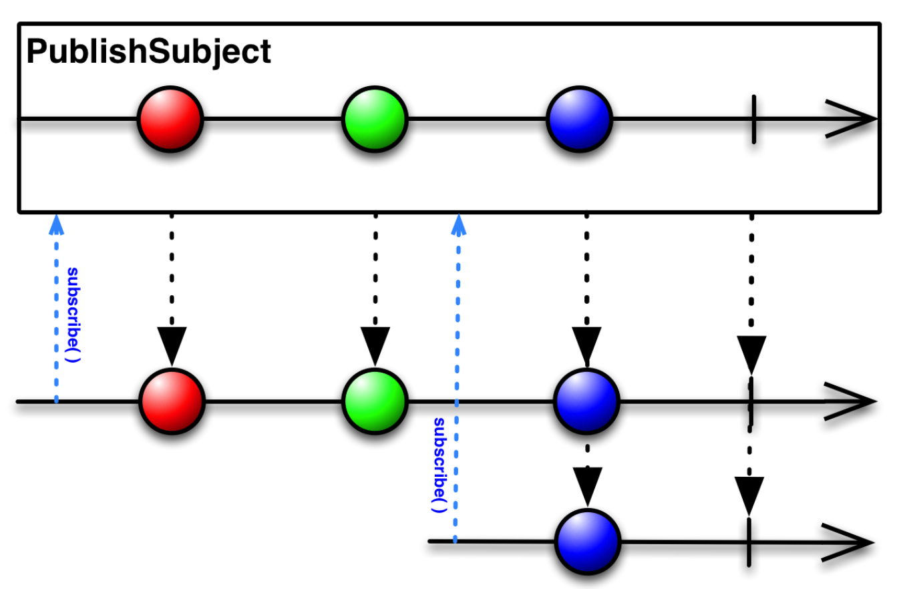
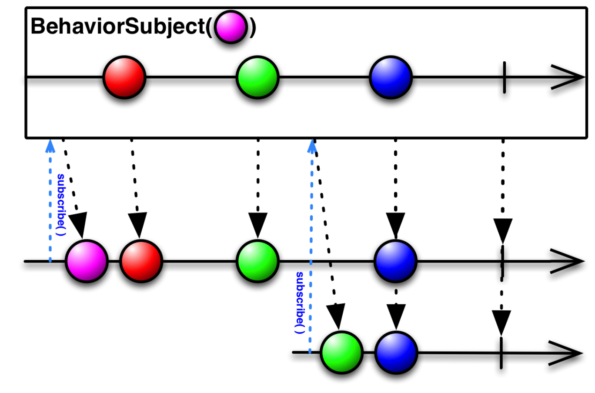
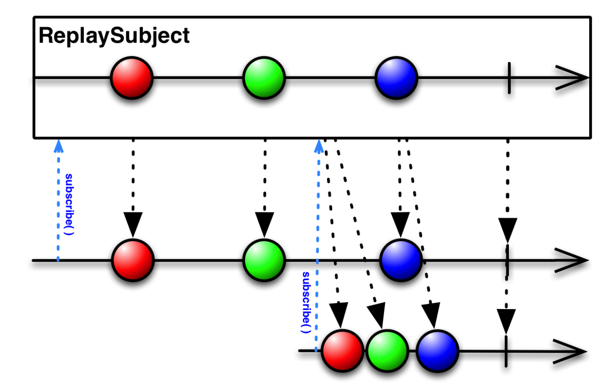

> Didier Boelens가 작성한 Flutter의 Bloc Pattern에 대한 [본문](https://medium.com/flutter-community/reactive-programming-streams-bloc-6f0d2bd2d248)을 공부하면서 번역을 진행했다. Flutter의 Bloc Pattern을 공부할 때 아마 가장 많은 사람들이 참고한 article이라고 생각한다.

Streams, Bloc 그리고 Reactive Programming에 대한 개념, 이론과 예시들 포함되어있다. 

난이도: 중급

---
<br/>

# **Introduction**
<br/>

이 post에서 나오는 예시 프로그램에서는 유저가 온라인 카탈로그에서 영화 리스트를 볼 수 있고, 장르와 방영날짜로 필터링을 할 수 있고, 관심있는 영화를 선택 및 해제할 수 있다. 

모든 것이 interactive(상호작용)하고 유저들의 액션은 다른 페이지 혹은 같은 페이지내에서 이뤄질 수 있고 그 행동이 실시간으로 프로그램에 영향을 준다. 

밑에는 어플리케이션의 애니메이션이다.

<div align="center">
    
</div>

처음에 이 페이지에서는 **Reactive Programming**, **BLoC** 그리고 **Streams**에 대한 개념을 알려주고 그 다음에는 어떻게 실제로 사용할 수 있는지 보여줄 것이다. 이미 다른 사람들에 의해서 많이 다뤄졌기 때문에, 이 article에서는 redux에 대해서 다루지 않을 예정이다.

# **What is a Stream?**

### **Introduction**

**`Stream`** 개념을 이해하기 위해 한쪽에서만 삽입이 가능한 파이프를 연상해보자. 한쪽에 무언가를 삽입하면 파이프를 따라 흐르다가 다른 끝에서 나온다. 

Flutter에서,

- 이 파이프를 **`Stream`** 이라 부르고,
- Stream을 control(조정)하기 위해서 주로(*) **`StreamController`**가 사용되고,
- 무언가를 Stream에 삽입하기 위해, StreamController가 **`sink`** property로 접근 가능한 StreamSink라는 "_entrance_"를 사용하고,
- Stream의 결과(출력)는  StreamContoller의 **`stream`** property로 접근 가능하다.

(*)가 의미하는 것은 굳이 StreamController가 아니어도 다른 방법이 있다는 것이다. 하지만, 이 페이지에서는 StreamController만 다룰 것이다. 

### **What can be conveyed by a Stream?**

**Everything and anything**. Value, event, object, collection, map, error, 다른 Stream, 등 어떠한 형태의 data든 간에 Stream에 전달될 수 있다. 

### **How do I know that something is conveyed by a Stream?**

무언가가 Stream을 통해서 전달 되었다는 것을 알려면, StreamController의 stream property로 `listen` 해야 한다. 

Listener을 정의하면,  **[StreamSubscription](https://api.dartlang.org/stable/2.0.0/dart-async/StreamSubscription-class.html)** object를 받게 된다. 이 StreamSubscription object로 Stream에서 일어나는 일들에 대해 알림을 받을 수 있게 된다. 

최소 한 개 이상의 listener가 `active` 이면, 밑에 상황들이 일어날 때 마다 Stream은 `events` 를 생성해서 `active` 한 StreamSubscription object에 알린다:

- stream 밖으로 data가 나갈 때
- stream에 에러가 들어왔을 때
- stream이 닫혔을 때

StreamSubscription은 다음의 행동들을 허용해준다:

- listening 멈추기,
- pause,
- resume

### Is a Stream only a simple pipe?

아니다, Stream은 data가 들어왔을 때 process 된 후에 나갈 수 있게도 해준다. 즉, stream으로 들어온 data가 그대로 나가는 것이 아니라 stream안에서 수정 혹은 변경이 될 수 있다는 의미이다. Stream안의 data를 처리하기 위해서 **[StreamTransformer](https://api.dartlang.org/stable/2.0.0/dart-async/StreamTransformer-class.html)를** 사용한다. 

StreamTransformer은:

- Stream 에 흐르는 data를 "capture"하는 함수이다
- data에 무언가를 한다
- 이 transform(변형된) 결과물도 Stream이다.

위에 StreamTransformer의 정의를 통해 여러 개의 StreamTransformers를 순차적으로 사용해도 되는 것을 알 수 있을 것이다. 

StreamTransformer가 할 수 있는 processing의 종류는 다음과 같다:

- filtering: 특정 조건으로 data를 filter
- regrouping: data 재그룹화
- modification: data에 modify(수정)
- 다른 stream에 데이터를 삽입
- buffering(버퍼링)
- processing: data에 기반해 어떠한 action/operation(행동)을 하기
- ...

### **Types of Streams**

2 종류의 Streams가 있다.

1) **Single-subscription Streams**

: Stream의 lifetime(생명주기)동안 `single` (한개)의 listener만 허용한다.

> 이러한 Stream은 첫 subscription이 최소되었더라도 두 번 listen할 수 없다.

 

2) **Broadcast Streams**

: `any number` (여러개)의 listener를 허용한다.

> 어느 시점이던 Broadcast Stream에 listener를 추가할 수 있다. 새로운 listener는 listening을 시작하는 순간부터 events들을 받게 된다.

### **Basic Examples**

**Any type of data**

“*Single-subscription*” *Stream*에 대한 예시이다. 이 Stream은 단순히 input을 print한다. 예시를 보면 알 수 있듯이 어떠한 type이 와도 상관이 없다.

```dart
import 'dart:async';

void main() {
  //
  // Initialize a "Single-Subscription" Stream controller
  //
  final StreamController ctrl = StreamController();
  
  //
  // Initialize a single listener which simply prints the data
  // as soon as it receives it
  //
  final StreamSubscription subscription = ctrl.stream.listen((data) => print('$data'));

  //
  // We here add the data that will flow inside the stream
  //
  ctrl.sink.add('my name');
  ctrl.sink.add(1234);
  ctrl.sink.add({'a': 'element A', 'b': 'element B'});
  ctrl.sink.add(123.45);
  
  //
  // We release the StreamController
  //
  ctrl.close();
}
```


**StreamTransformer**

두 번째 예시는 “*Broadcast*” *Stream*을 보여준다. *integer* 값들만 전달하고 그 중에서도 짝수만 print를 한다. 이러한 결과물을 내오기 위해서는 S*treamTransformer* 를 사용해서 값들을 filter (line #14)하고 짝수만 전달될 수 있게 한다. 

```dart
import 'dart:async';

void main() {
  //
  // Initialize a "Broadcast" Stream controller of integers
  //
  final StreamController<int> ctrl = StreamController<int>.broadcast();
  
  //
  // Initialize a single listener which filters out the odd numbers and
  // only prints the even numbers
  //
  final StreamSubscription subscription = ctrl.stream
					      .where((value) => (value % 2 == 0))
					      .listen((value) => print('$value'));

  //
  // We here add the data that will flow inside the stream
  //
  for(int i=1; i<11; i++){
  	ctrl.sink.add(i);
  }
  
  //
  // We release the StreamController
  //
  ctrl.close();
}
```

### **RxDart**

**[RxDart Package](https://pub.dartlang.org/packages/rxdart)** 를 알아야만 Streams를 더 완성도 있게 알 수 있다.

**RxDart**는 [ReactiveX](http://reactivex.io/) API Dart에서 사용할 수 있게 구현한 패키지이다. Dart Streams API에서 extend되서 *ReactiveX* 기준을 따를 수 있게 했다.

Google에서 정의된 개념이 아니기 때문에 다른 단어들을 사용한다. 밑에 table은 Dart의 단어들이 RxDart에서 어떻게 표현되는지 보여준다. 


```csv
Dart	RxDart
Stream	Observable
StreamController	Subject
```


RxDart는 기존 Dart Streams API를 `extends` 하고 StreamController의 3가지의 변형을 제공한다:

## 1) **PublishSubject**

**[PublishSubject](https://pub.dartlang.org/documentation/rxdart/latest/rx/PublishSubject-class.html)** 는 일반적인 **broadcast** *StreamController* 인데, 한 가지 예외 사항이 있다: **stream**은 **Stream** 말고 **[Observable](https://pub.dartlang.org/documentation/rxdart/latest/rx/Observable-class.html)** 을 리턴한다.



그림에서 보면, *PublishSubject* 는 *subscription* 이후에 들어오는 *events* 들만 *listener*에게 보낸다.

## 2) **BehaviorSubject**

**[BehaviorSubject](https://pub.dartlang.org/documentation/rxdart/latest/rx/BehaviorSubject-class.html)** 도 **broadcast** *StreamController*이고  **Stream** 대신에 **[Observable](https://pub.dartlang.org/documentation/rxdart/latest/rx/Observable-class.html)** 을 리턴한다.



*PublishSubject* 와의 차이점은 subscribe 이전의 가장 마지막 *event*도 *listener*에게 보내준다는 것이다.

## 3) **ReplaySubject**

**[ReplaySubject](https://pub.dartlang.org/documentation/rxdart/latest/rx/ReplaySubject-class.html)** 도 **broadcast** *StreamController*이고  **Stream** 대신에 **[Observable](https://pub.dartlang.org/documentation/rxdart/latest/rx/Observable-class.html)** 을 리턴한다.



*ReplaySubject*, 기본으로, Stream에 있던 모든(제일 처음 event 포함해서) event들을 새로운 listener에게 보낸다. 

<hr/>

### **Important note about the Resources**

> 더 이상 사용되지 않은 resource(자원)들을 release해주는 것이 좋다.

- *StreamSubscription* — stream을 더 이상 listen하지 않으면 subscription **cancel**하기
- *StreamController* —  *StreamController*가 필요 없으면 **close**하기
- *RxDart Subjects*에도 동일하게 적용된다. *BehaviourSubject*, a *PublishSubject*…, 등이 필요 없어지면 **close** 한다.

<hr/>

### **How to build a Widget based on the data that goes out a Stream?**

Flutter는 **[StreamBuilder](https://docs.flutter.io/flutter/widgets/StreamBuilder-class.html)**라는 아주 간편한 StatefulWidget을 제공한다.

StreamBuilder는 Stream을 listen하고, data가 Stream을 나갈 때마다 자동으로 builder callback 호출해서  rebuild를 한다. 

밑은 *StreamBuilder* 어떻게 사용해야 하는지 보여준다:

```txt
StreamBuilder<T>(
   key: …optional, the unique ID of this Widget…
   stream: …the stream to listen to…
   initialData: …any initial data, in case the stream would initially be empty…
   builder: (BuildContext context, AsyncSnapshot<T> snapshot){
      if (snapshot.hasData){
         return …the Widget to be built based on snapshot.data
      }
      return …the Widget to be built if no data is available
   },
)
```


밑에는 기존에 Flutter project를 생성할 때 자동으로 생성되는 "counter" application을 setState 대신에 Stream을 사용해서 구현한 코드이다.

```dart
import 'dart:async';
import 'package:flutter/material.dart';

class CounterPage extends StatefulWidget {
  @override
  _CounterPageState createState() => _CounterPageState();
}

class _CounterPageState extends State<CounterPage> {
  int _counter = 0;
  final StreamController<int> _streamController = StreamController<int>();

  @override
  void dispose(){
    _streamController.close();
    super.dispose();
  }

  @override
  Widget build(BuildContext context) {
    return Scaffold(
      appBar: AppBar(title: Text('Stream version of the Counter App')),
      body: Center(
        child: StreamBuilder<int>(
          stream: _streamController.stream,
          initialData: _counter,
          builder: (BuildContext context, AsyncSnapshot<int> snapshot){
            return Text('You hit me: ${snapshot.data} times');
          }
        ),
      ),
      floatingActionButton: FloatingActionButton(
        child: const Icon(Icons.add),
        onPressed: (){
          _streamController.sink.add(++_counter);
        },
      ),
    );
  }
}
```


코드 설명:

- Lines #24–30: stream을 listen하고, stream에서 새로운 결과가 나오게 될 때마다, *Text* 와 값을 업데이트 해준다;
- Line #35: *FloatingActionButton*을 누르면 counter를 증가시키고 그 값을 *Stream*에 *sink*를 사용해서 보낸다. Stream에 sink하는 행동은 *StreamBuilder*로 하여금 rebuild를 하고 counter를 "refresh" 하게 한다.
- 모든 값이 Stream으로 전달되기 때문에 State는 필요없어진다.
- Stream을 사용해서 크게 개선된 점은 바로 *setState(*) 메소드를 호출할 필요가 없어졌다는 것이다. setState()를 사용할 때 마다 **전체** 위젯(sub widget포함)이 rebuild 되었다. 하지만 이제는 **ONLY** *StreamBuilder* 만 rebuild 하게 되었다.
- 그럼에도 이 코드에서 *StatefulWidget* 을 사용하는 이유는 *StreamController* 를 *dispose* 메소드로 release하기 위함이다, line #15;

# What is Reactive Programming?
<br/>

> Reactive programming 은 비동기 데이터 stream으로 프로그래밍하는 것을 의미한다. 즉, event(e.g. tap), 변수가 변경되는 일등이 data stream으로 trigger 혹은 전달된다.

Reactive programming으로 application은 다음과 같이 된다:

- **asynchronous** 하게 된다,
- **Streams와** **listeners**구조를 갖게 된다,
- 어디서 어떤 일이(event, change of variable...) 발생하면 Stream으로 전달된다,
- "누군가"가 Stream을 listen하면, 알림을 받게 될 것이고 **application 어디에 있던 상관 없이** 적절한 action을 취하게 된다.

⇒ 말들이 조금 어렵게 느껴질 수는 있다. 위 counter application의 예를 들면, application을 사용하는 도중에 버튼을 클릭하는 event를 발생시키면 해당 event가 Stream으로 전달이 된다. 그리고 Stream을 listen하고 있는 StreamBuilder가 적절한 action, Text를 rebuild하고 counter의 값을 증가,을 취하는 것이다. 

간단히 얘기해서, Widget이 무언가를 Stream으로 보내면 Widget은 **다음과 같은 정보들을 알 필요가 없다:**

- 다음에 무슨 일이 일어날지,
- 누가 이 정보를 사용할지(아무도 안 쓰게 될지, 1 혹은 그 이상의 widget들이 사용하게 될지...)
- 어디에 이 정보가 사용될지 (아무곳에도 안 쓰이게 될지, 같은 스크린, 다른 스크린...),
- 언제 이 정보가 사용될지(바로 사용, 몇 초 뒤에, 혹은 아예 사용이 안될지...).

> …Widget은 자신에게 주어진 일만하고 그 외에는 신경을 쓰지 않아도 된다!!

지금까지 얘기한 것만 보면 application이 "no-control" 상태가 된다고 느껴질 수 있다. 하지만, reactive programming으로 다음의 것들이 가능해진다:

- 특정 기능만 하고 그 기능에만 책임을 지는 application의 part를 만들 수 있게 되고,
- 컴포넌트들의 behavior를 더 쉽게 모방할 수 있게 되고,
- 컴포넌트 재사용하는 것이 쉬워지고,
- application redesign시 컴포넌트들을 옮길 떄 리팩토링을 많이 하지 않아도 된다,
- …

<hr/>
<br/>
간단한 Flutter counter 예시로  Stream과 Reactive Programming이 무엇인지 간단하게 살펴봤다. 다음 Part2 에서는 Bloc Pattern이 무엇이고 해당 패턴을 사용해서 만든 예시를 소개할 에정이다.