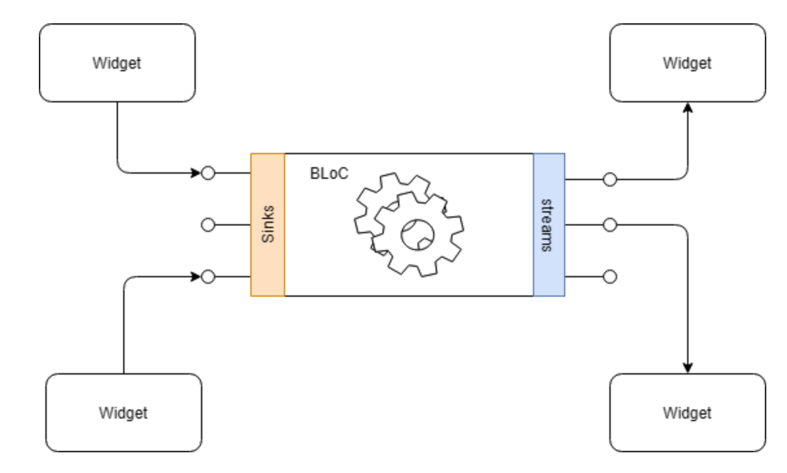
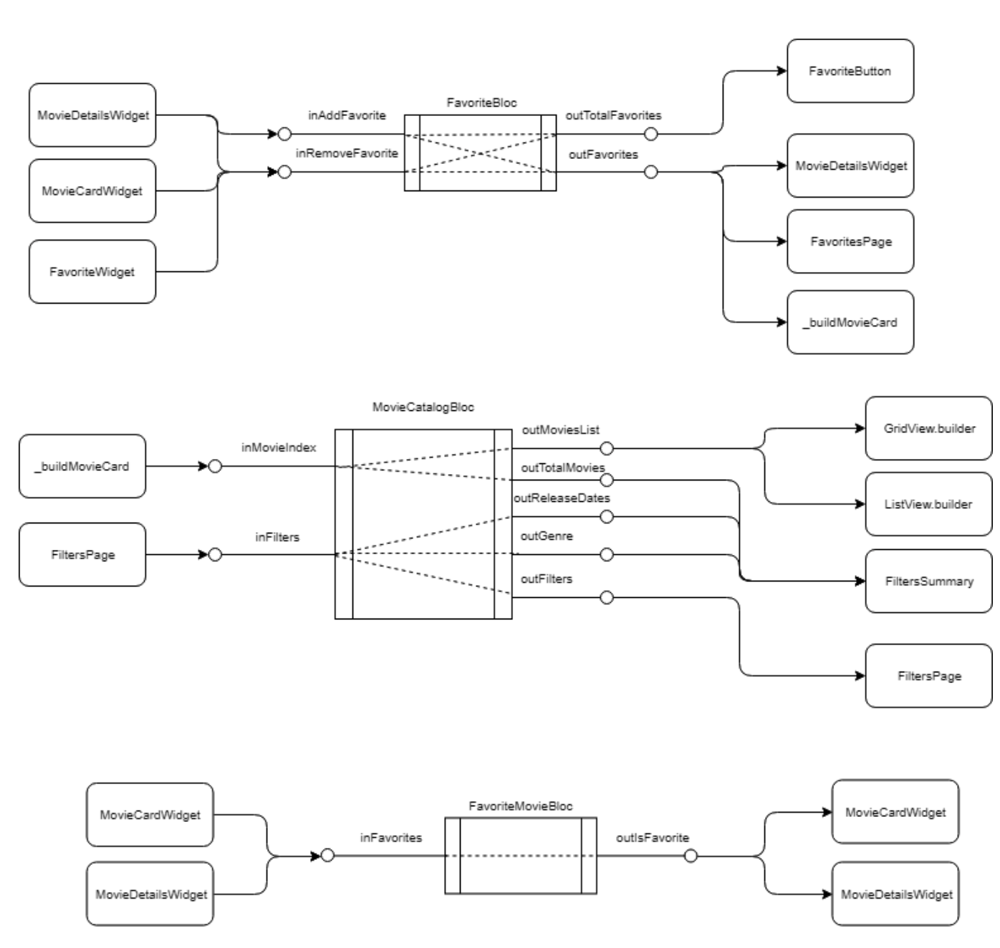

> Didier Boelens가 작성한 Flutter의 Bloc Pattern에 대한 [본문](https://medium.com/flutter-community/reactive-programming-streams-bloc-6f0d2bd2d248)을 공부하면서 번역을 진행했다. Flutter의 Bloc Pattern을 공부할 때 아마 가장 많은 사람들이 참고한 article이라고 생각한다.

# **The BLoC Pattern**
<br/>

**BLoC Pattern** 은 구글의 *Paolo Soares*와 *Cong Hui*에 의해 디자인 되었고 *DartConf 2018* 때 이 것을 처음으로 선보였다.  (January 23–24, 2018). 비디오 - [YouTube](https://www.youtube.com/watch?v=PLHln7wHgPE).

BLoC 은 **B**usiness **Lo**gic **C**omponent 을 의미한다

**Business Logic** 은 다음과 같아야 한다:

- be moved to one or several *BLoC*s (한개 혹은 그 이상의 BLoC으로 나뉘어져야 한다고 이해를 했다),
- Presentation Layer에서 가능한 제거되어야 한다. 다른 말로 하면, UI components는 UI만 고려해야하고 business logic에 관련된 것들은 신경쓰지 않아야 한다,
- rely on exclusive use of Streams for both input (Sink) and output (stream) (input(*Sink*)과 output(stream)에 대해서 전적으로 *Streams*에 의존한다)
- platform 독립적이어야 한다,
- 환경에 독립적이어야 한다.

BLoC pattern은 원래 platform(웹 어플리케이션, 모바일 어플리케이션, 백엔드)에 독립적으로 같은 코드를 재사용하기 위해서 고안됐었다. 

### **What does it actually mean?**

*BLoC* pattern은 *Streams* 를 사용한다.



- Widget들은 *events*를 *Sinks*를 통해 BLoC에 보낸다,
- Widget들은 BLoC의 streams로 notify(알림)을 받는다,
- BLoC에 의해 구현된 business logic은 그 어느것도 신경쓰지 않는다.

밑의 statement를 통해 어떤 **big** benefit을 얻게 되는지 알 수 있다.

> Business Logic을 UI로부터 분리한 덕분에 우리는 Business Logic을 변경해도 application에 minimal(적은)하게 영향을 주게 되었고, UI를 변경할 때도 Business Logic에 거의 아무 영향을 안 줄 수 있게 됬다. 그래서, Business Logic을 test 하는 것이 더 쉬워졌다.

⇒ 즉 BLoC pattern은 UI와 Business Logic이 서로 분리되는 것을 의미한다. 한 파트의 코드를 수정해도 다른 파트의 코드를 수정할 필요가 없게 되니 리팩토링을 덜 할 수 있게 되서 효율성이 높아지는 것이다. 그리고 이 BLoC pattern을 가능케 하는 것이 Stream인 것이다.

### **How to apply this BLoC Pattern to the Counter Application sample?**

이전에 Stream을 사용한 counter application BLoC을 적용해보려고 한다. 물론, 이러한 간단한 프로그램에 BLoC pattern을 적용하는 것은 조금 과하긴하다....

```dart
void main() => runApp(new MyApp());

class MyApp extends StatelessWidget {
  @override
  Widget build(BuildContext context) {
    return new MaterialApp(
        title: 'Streams Demo',
        theme: new ThemeData(
          primarySwatch: Colors.blue,
        ),
        home: BlocProvider<IncrementBloc>(
          bloc: IncrementBloc(),
          child: CounterPage(),
        ),
    );
  }
}

class CounterPage extends StatelessWidget {
  @override
  Widget build(BuildContext context) {
    final IncrementBloc bloc = BlocProvider.of<IncrementBloc>(context);

    return Scaffold(
      appBar: AppBar(title: Text('Stream version of the Counter App')),
      body: Center(
        child: StreamBuilder<int>(
          stream: bloc.outCounter,
          initialData: 0,
          builder: (BuildContext context, AsyncSnapshot<int> snapshot){
            return Text('You hit me: ${snapshot.data} times');
          }
        ),
      ),
      floatingActionButton: FloatingActionButton(
        child: const Icon(Icons.add),
        onPressed: (){
          bloc.incrementCounter.add(null);
        },
      ),
    );
  }
}

class IncrementBloc implements BlocBase {
  int _counter;

  //
  // Stream to handle the counter
  //
  StreamController<int> _counterController = StreamController<int>();
  StreamSink<int> get _inAdd => _counterController.sink;
  Stream<int> get outCounter => _counterController.stream;

  //
  // Stream to handle the action on the counter
  //
  StreamController _actionController = StreamController();
  StreamSink get incrementCounter => _actionController.sink;

  //
  // Constructor
  //
  IncrementBloc(){
    _counter = 0;
    _actionController.stream
                     .listen(_handleLogic);
  }

  void dispose(){
    _actionController.close();
    _counterController.close();
  }

  void _handleLogic(data){
    _counter = _counter + 1;
    _inAdd.add(_counter);
  }
}
```

이 모든 것들이 왜 필요한지 설명하자면:

**First,  separation of responsibilities**

(책임이 분리된다는 의미이다)

*CounterPage* (lines 21–45)을 보면 business logic이 *하나도* 없음을 알 수 있다.

이 page는 이제 다음과 같은 기능을 한다(저자는 책임을 진다고 표현했다):

- counter를 display하기.
- 버튼을 제공해서 눌렸을 때 버튼이 해야할 action 요청하기

Business Logic은 다 “*IncrementBloc*” 라는 클래스 하나에 있다. 이제 business logic을 변경하고 싶으면, 단순히 *_handleLogic* (lines 77–80) 메소드만 변경해주면 된다. Business logic이 아무리 복잡해져도 CounterPage는 알리가 없고, 이건 매우 좋은 현상이라고 볼 수 있다.

**Second, testability**

이제 business logic을 test하는 것이 더 쉬워졌다. User interface로 business logic을 test할 필요가 없어졌고, *IncrementBloc* 클래스만 test하면 된다.  

**Third, freedom to organize the layout**

*Streams* 덕분에 layout을 business logic에서 독립적으로 구성할 수 있게 되었다. Application 어디에서든 *incrementCounter* sink를 호출해서 action을 실행시킬 수 있게 되었다.

*outCounter* stream을 listen해서 counter를 어디에서든 display 할 수 있게 되었다.

**Fourth, reduction of the number of “build”s**

*setState()* 대신에 *StreamBuilder* 사용하는 것은 "build"의 횟수를 엄청나게 줄여준다. 퍼포먼스 관점에서 봤을 때, 이는 매우 큰 개선이다.

# **There is only 1 constraint… accessibility of the BLoC**

이 모든 것이 정상적으로 작동되려면 BLoC accessible(접근 가능)해야 한다. Accessible 하기 위한 방법이 여러가지 있다:

- *global* Singleton. 이 방법으로 할 수 는 있지만 추천하는 방법은 아니다. Dart에는 class **destructor**가 없기 때문에 이 방법으로는 resource들을 release하기 힘들다.
- *local* instance. BLoC의 로컬 인스턴스를 인스턴스화해서 사용할 수 있다. *dispose()* 메소드의 이점을 활용하기 위해 *StatfulWidget*을 사용하는 경우에는 이 방법이 적절하다.
- *ancestor. BLoC*에 access하는 가장 일반적인 방법은 *StatefulWidget* 으로 구현된 **ancestor** Widget을 사용하는 것이다.

⇒ 이 post는 BLoC pattern 매우 초기에 쓰여졌다. 현재는 pub에서 제공하는 bloc 라이브러리들을 사용하는 것도 하나의 방법이 될 수 있다.

밑에 코드는 *generic* **BlocProvider**이다.

(generic을 쉽게 이야기 하자면 어떠한 type도 받아들 일 수 있게 최대한 일반화한 것이다) 

```dart
import 'package:flutter/material.dart';

typedef BlocBuilder<T> = T Function();
typedef BlocDisposer<T> = Function(T);

abstract class BlocBase {
  void dispose();
}

class BlocProvider<T extends BlocBase> extends StatefulWidget {
  BlocProvider({
    Key key,
    @required this.child,
    @required this.blocBuilder,
    this.blocDispose,
  }): super(key: key);

  final Widget child;
  final BlocBuilder<T> blocBuilder;
  final BlocDisposer<T> blocDispose;

  @override
  _BlocProviderState<T> createState() => _BlocProviderState<T>();

  static T of<T extends BlocBase>(BuildContext context){
    _BlocProviderInherited<T> provider = context.getElementForInheritedWidgetOfExactType<_BlocProviderInherited<T>>()?.widget;

    return provider?.bloc;
  }
}

class _BlocProviderState<T extends BlocBase> extends State<BlocProvider<T>>{

  T bloc;

  @override
  void initState() {
    super.initState();
    bloc = widget.blocBuilder();
  }

  @override
  void dispose(){
    if (widget.blocDispose != null){
      widget.blocDispose(bloc);
    } else {
      bloc?.dispose();
    }
    super.dispose();
  }
  
  @override
  Widget build(BuildContext context){
    return new _BlocProviderInherited<T>(
      bloc: bloc,
      child: widget.child,
    );
  }
}

class _BlocProviderInherited<T> extends InheritedWidget {
  _BlocProviderInherited({
    Key key,
    @required Widget child,
    @required this.bloc,
  }) : super(key: key, child: child);

  final T bloc;

  @override
  bool updateShouldNotify(_BlocProviderInherited oldWidget) => false;
}
```


# **Some explanations on this generic BlocProvider**

### **Why using an InheritedWidget inside a StatefulWidget?**

BLoC에 관련된 article들을 보면 *Provider*를 *InheritedWidget*으로 구현한 것을 볼 수 있다. 하지만 위 코드에서는 *StatufulWidget* 안에 구현을 했다. 왜 이렇게 코드를 작성했는지 설명을 하려고 한다.

- *InheritedWidget* 은 내부에 *dispose* 메소드를 제공하지 않는다, 하지만 사용되지 않는 resource를 release하는 것은 필요한 일이고 이렇게 하는 것이 좋은 연습이다.
- 그렇기 때문에,

    InheritedWidget을 StatefulWidget안에 구현한 것은 

    **오로지**

    BLoC에 의해 할당된 resource들을 release하기 위함이다. 

### **Why not a “simple” StatefulWidget?**

저자가 이전 버전에서는 *InheritedWidget*을 사용하지 않고 *BlocProvider*를 구현했었는데, 퍼포먼스 관점에서 최적이 아니어서 코드를 변경한 것이다. 

- **Note about ancestorWidgetOfExactType():**

*InheritedWidget* 을 사용하지 않음으로써 *context.ancestorWidgetOfExactType()* 을 무조건 사용해야만 했고 이 함수는 *O(n)* 이다. 더 설명하자면, 요청된 ansestor를 검색하기 위해서 context부터 parent하나씩 tree 위로 가면서 일치하는 type을 찾는다. ancestor와 context의 거리(?)가 작으면 이 이 함수는 허용할만한데, 그렇지 않다면 좋은 해결책이 아니다. 

```dart
@override
Widget ancestorWidgetOfExactType(Type targetType) {
    assert(_debugCheckStateIsActiveForAncestorLookup());
    Element ancestor = _parent;
    while (ancestor != null && 
            ancestor.widget.runtimeType != targetType)
        ancestor = ancestor._parent;
    return ancestor?.widget;
}
```

- **Note about ancestorInheritedElementForWidgetOfExactType()**

*InheritedWidget*을 사용하면서 우리는 *context.ancestorInheritedElementForWidgetOfExactType()* 함수를 호출 할 수 있게 됐고, 이 함수는 *O(1)*이다. 즉, 곧바로 ancestor를 찾을 수 있다는 것이다. 이게 가능한 이유는 모든 *InheritedWidgets* 들이 Framework에서 의해 memorize되기 때문이다. 

```dart
@override
InheritedElement
        ancestorInheritedElementForWidgetOfExactType(Type targetType){
    assert(_debugCheckStateIsActiveForAncestorLookup());
    final InheritedElement ancestor = _inheritedWidgets == null
                                        ? null
                                        : inheritedWidgets[targetType];
    return ancestor;
}
```
> 일반적으로 inheritFromWidgetOfExactType을 사용하는데, 이 함수를 사용하면 BlocProvider를 호출하는 context가 InheritedWIdget과 link가 된다. 그런데, 이 link가 필요 없기 때문에 ancestorInheritedElementForWidgetOfExactType이 사용되었다.

# **How to use it as a *provider*?**

맨 위 코드 샘플 코드를 보면 다음과 같은 line이 있다 (lines #12–15)

```dart
home: BlocProvider<IncrementBloc>(
          bloc: IncrementBloc(),
          child: CounterPage(),
        ),
```


이 line에서, *IncrementBloc*을 조정할 수 있는 new *BlocProvider*를 인스턴스화하고 *CounterPage* 를 child로 render한다.

밑의 코드를 통해서, **BlocProvider** 밑에 있는 어느 위젯에서나 IncrementBloc 을 조정할 수 있게 된다. 

```dart
IncrementBloc bloc = BlocProvider.of<IncrementBloc>(context);
```

### **Could we have multiple BLoCs?**

그렇다. 추천을 좀 하자면:

- (business logic이 있다면) 페이지당 하나의 BLoC을 올려 놓고,
- 각 “*complex enough component*” 마다 그에 대응하는 BLoC을 만든다.

밑에 코드는 *ApplicationBloc* application 가장 위에 있고, *IncrementBloc*이 *CounterPage* 위에 있다.

두 bloc을 다 사용하려면 밑의 코드와 같이 해야 한다.

```dart
void main() => runApp(
  BlocProvider<ApplicationBloc>(
    bloc: ApplicationBloc(),
    child: MyApp(),
  )
);

class MyApp extends StatelessWidget {
  @override
  Widget build(BuildContext context){
    return MaterialApp(
      title: 'Streams Demo',
      home: BlocProvider<IncrementBloc>(
        bloc: IncrementBloc(),
        child: CounterPage(),
      ),
    );
  }
}

class CounterPage extends StatelessWidget {
  @override
  Widget build(BuildContext context){
    final IncrementBloc counterBloc = BlocProvider.of<IncrementBloc>(context);
    final ApplicationBloc appBloc = BlocProvider.of<ApplicationBloc>(context);
    
    ...
  }
}
```

Flutter는 generic type을 인스턴스화할 수 없다.

그렇기 때문에 BLoC의 인스턴스를 BlocProvider에 전달해야 한다. 

각 BLoC마다 dispose() 메소드를 강제하기 위해서, 모든 BLoC들은 BlocBase interface를 구현해야한다.

<br/><br/>

# **Personal note on BLoC (저자의 개인적인 생각)**
<br/>

BLoC pattern 은 같은 코드를 다른 플랫폼간 공유하기 위해서 고안되었다 (AngularDart, …). 이 의도대로라면 BLoC pattern은 매우 의미 있다고 저자는 이야기 한다. 

**하지만**, Flutter application만 개발하려고 할 때는, 과도한 면이 있다고 한다. 

*sinks* and *streams*만 사용해야 하고 *getter*와 *setters*가 없는 상황에서 “all this is **asynchronous**” (모든 것이 비동기)인 것이 단점이다.

단점을 잘 보여주는 2가지의 샘플을 보면:

- BLoC에서 어떤 데이터를 받아서 페이지에서 사용하기를 원할 때 Streams를 사용하면 페이지 빌드가 비동기적으로 이뤄진다(매우 복잡하다). 밑에 코드는 그 복잡한 과정을 보여준다.

```dart
class FiltersPage extends StatefulWidget {
  @override
  FiltersPageState createState() => FiltersPageState();
}

class FiltersPageState extends State<FiltersPage> {
  MovieCatalogBloc _movieBloc;
  double _minReleaseDate;
  double _maxReleaseDate;
  MovieGenre _movieGenre;
  bool _isInit = false;

  @override
  void didChangeDependencies() {
    super.didChangeDependencies();

    // As the context of not yet available at initState() level,
    // if not yet initialized, we get the list of the 
    // filter parameters
    if (_isInit == false){
      _movieBloc = BlocProvider.of<MovieCatalogBloc>(context);
      _getFilterParameters();
    }
  }

  @override
  Widget build(BuildContext context) {
    return _isInit == false
      ? Container()
      : Scaffold(
    ...
    );
  }

  ///
  /// Very tricky.
  /// 
  /// As we want to be 100% BLoC compliant, we need to retrieve
  /// everything from the BLoCs, using Streams...
  /// 
  /// This is ugly but to be considered as a study case.
  ///
  void _getFilterParameters() {
    StreamSubscription subscriptionFilters;

    subscriptionFilters = _movieBloc.outFilters.listen((MovieFilters filters) {
        _minReleaseDate = filters.minReleaseDate.toDouble();
        _maxReleaseDate = filters.maxReleaseDate.toDouble();

        // Simply to make sure the subscriptions are released
        subscriptionFilters.cancel();
        
        // Now that we have all parameters, we may build the actual page
        if (mounted){
          setState((){
            _isInit = true;
          });
        }
      });
    });
  }
}
```

- at the BLoC level, you also need to convert a “fake” injection of some data to trigger the provision of the data you expect to receive via a stream. Sample code to make this work could be: (이 부분은 번역이 애매해서 일단 그대로 뒀다)

```dart
class ApplicationBloc implements BlocBase {
  ///
  /// Synchronous Stream to handle the provision of the movie genres
  ///
  StreamController<List<MovieGenre>> _syncController = StreamController<List<MovieGenre>>.broadcast();
  Stream<List<MovieGenre>> get outMovieGenres => _syncController.stream;

  ///
  /// Stream to handle a fake command to trigger the provision of the list of MovieGenres via a Stream
  ///
  StreamController<List<MovieGenre>> _cmdController = StreamController<List<MovieGenre>>.broadcast();
  StreamSink get getMovieGenres => _cmdController.sink;

  ApplicationBloc() {
    //
    // If we receive any data via this sink, we simply provide the list of MovieGenre to the output stream
    //
    _cmdController.stream.listen((_){
      _syncController.sink.add(UnmodifiableListView<MovieGenre>(_genresList.genres));
    });
  }

  void dispose(){
    _syncController.close();
    _cmdController.close();
  }

  MovieGenresList _genresList;
}

// Example of external call
BlocProvider.of<ApplicationBloc>(context).getMovieGenres.add(null);
```

저자의 개인적인 의견으로는 모든 것을 BLoC화 하는 거싱 무겁다고 한다. 그는 자신이라면 주로 **getters/setters** 을 사용하고 **Streams/Sinks** 는 responsibility를 분리 그리고 정보를 broadcast(전파)할 필요가 있을 때 사용할 것이라고 한다.  

<br/><br/>

# **It is now time to see all this in practice…**
<br/>

저자는 BLoC pattern을 활용한 간단한 application을 제작했고 source code는 여기서 볼 수 있다 : [Github](https://github.com/boeledi/Streams-Block-Reactive-Programming-in-Flutter).

이 코드의 목적은 단지 BLoC pattern이 동작하는 것을 보여주기 위함이기 때문에 구조적으로나 다른 면에서 perfect 하지 않다는 것을 유의해야 한다.

### **Source of the movie catalog**

저자는 application을 만들 때 무료 영화 API인 [TMDB API](https://www.themoviedb.org/documentation/api) 를 사용해서 영화 리스트, 포스터, 평점, 줄거리 등을 가지고 왔다. 

해당 application을 run하기 위해서는 사이트에 접속해서 로그인을 하고 API key**(무료)**를 받아와야 한다, 그 다음에 API key를  “/api/tmdb_api.dart”, line #15 에 삽입해야 한다.

### **Architecture of the application**

Application의 구조를 보면 다음과 같다:

**3 개의 main BLoCs:**

- *ApplicationBloc* (가장 위에 있음), 모든 장르의 영화를 가지고 오는 역할을 한다;
- *FavoriteBloc* (바로 밑), "Favorites" 기능을 담당한다;
- *MovieCatalogBloc* (2 main page 위에 있음), filter된 영화 리스트를 가지고 오는 역할을 한다;

⇒ 여기서 favorites는 찜, 혹은 관심영화로 등록이라고 생각하면 된다.

**6 pages:**

- *HomePage:* 가장 첫 페이지로 3개의 다른 페이지로 navigate할 수 있는 페이지;
- *ListPage*: 영화들을 GridView로 보여주는 페이지. Filtering, favorite 선택하고, Favorites에 접속, 그리고 영화 Detail을 새로운 페이지에서 볼 수 있게 하는 페이지이다;
- *ListOnePage*: *ListPage*와 유사하나, 영화 리스트가 horizontal 하게 보이고 디테일이 바로 밑에 보여진다;
- *FavoritesPage*: favorites의 리스트를 보여주고 제거할 수 있는 페이지;
- *Filters*: *EndDrawer* 이고 filters의 정의를 보여준다: genres, min/max release dates. 해당 페이지는 *ListPage*나 *ListOnePage*의해 호출된다;
- *Details*: *ListPage*에서만 호출 되고 영화의 디테일을 보여주고, 그 영화를 favorite으로 지정 혹은 지정 해제가 가능하다;

**1 sub BLoC:**

- *FavoriteMovieBloc*, linked to a *MovieCardWidget* or *MovieDetailsWidget* to handle the selection/deselection of a movie as a favorite

**5 main Widgets:**

- *FavoriteButton*: 실시간으로 favorites된 수를 보여주고, *FavoritesPage* 클릭되면 그 페이지로 이동시킨다;
- *FavoriteWidget*: 하나의 favorite 영화의 디테일을 보여주고 favorite 지정 해제를 할 수 있게 하는 역할을 하는 위젯이다;
- *FiltersSummary*: 정의된 filters를 보여주는 역할을 한다;
- *MovieCardWidget:* 하나의 영화를 카드 형식으로 보여준다. 이 카드 형식에는 영화 포스터, 평점, 이름, 그리고 favorite으로 지정 혹은 해제할 수 있는 icon이 있다;
- *MovieDetailsWidget*: 영화의 디테일을 보여주는 위젯이고 favorite을 지정 혹은 해제할 수 있다.

**Orchestration of the different BLoCs / Streams**

밑에 다이아그램은 3개의 BLoC들이 어떻게 사용되었는지 나타낸다:

- BLoC의 왼편에는 *Sink*를 발생시키는 component들이다.
- 오른편에는, *stream*을 listen하는 component들이다.

하나만 예시로 보면, *MovieDetailsWidget 가 inAddFavorite Sink* 를 invoke(부르다)하면, 2개의 stream이 트리거 된다:

- *outTotalFavorites* stream 은 *FavoriteButton*이 rebuild되게 하고,
- *outFavorites* stream은
1. *MovieDetailsWidget* (the “favorite” icon)을 rebuild하고
2. *_buildMovieCard* (the “favorite” icon)을 rebuild한다.
3. 각각 *MovieDetailsWidget*을 build하는데 사용된다.



### **Observations**

대부분의 Widget와 Pages들은 *StatelessWidgets*이고, 이것이 의미하는 바는 다음과 같다:

- *setState()* 은 거의 사용되지 않는다, 다만 예외로는:
    - *ListOnePage* 에서 유저가 MovieCard를 클릭할 때 MovieDetailsWidget을 refresh하는데 사용된다. 물론 이 것도 stream으로 해결할 수 있긴하다...
    - *FiltersPage* 에서 Sink로 accept하기 전에 유저가 filter를 변경할 수 있게 해준다.
- application은 *InheritedWidget* 을 사용하지 않는다.
- application은 거의 100% *BLoCs/Streams* 에 의해 작동되기 때문에 거의 모든 Widgets들은 서로에게 독립적이다.

예로는, favorites가 선택된 수를 보여주는 *FavoriteButton*이다. Application에서는 *FavoriteButton*의 인스턴스가 3개가 있고 각각 다른 페이지에서 display된다. 

### **Display of the list of movies (explanation of the trick to display an infinite list)**

Filter조건에 맞는 영화들을 display하기 위해 [GridView.builder](https://docs.flutter.io/flutter/widgets/GridView/GridView.builder.html) (*ListPage*) 혹은 [ListView.builder](https://docs.flutter.io/flutter/widgets/ListView/ListView.builder.html) (*ListOnePage*) 를 infinite scroll list로 사용한다.

영화들은 *TMDB API* 를 사용해서 페이지당 20개씩 한번에 가져온다.

*GridView.builder*와 *ListView.builder* 는 input으로 *itemCount* 받는다. 이 *itemCount는*  몇개의 item이 display되야하는지 알려준다. *itemBuilder* 가 호출이 되고 *index*는 0부터 *itemCount — 1* 까지이다.

코드를 보면 저자가 *GridView.builder*에 30을 더 추가해줬는데, 이렇게 한 이유는 *GridView.builder* 가 “*up to 30 additional”* item들을 display하기 위함이다. 그리고 *GridView.builder* 와 *ListView.builder는* 특정한 item(index)가 viewport에 render되야할 때만 *itemBuilder를* 호출한다.

*MovieCatalogBloc.outMoviesList 는* *List<MovieCard>*을 리턴한다. 처음에 이 *List<MovieCard>* 는 empty이지만 *`itemCount: …+30`* 덕분에 첫 30개를 가지고 와서 *_buildMovieCard(…)*로 item을 display한다.

코드를 보다보면 밑과 같은 Sink를 이용한 코드가 있다:

> movieBloc.inMovieIndex.add(index);

이 코드는 *MovieCatalogBloc* 한테 MovieCard[index]를 render하고 싶다고 전달을 한다.

그러면 *_buildMovieCard(…) 가*  MovieCard[index]가 존재하는지 확인을 한다. 만약 존재한다면, render가 되고 그렇지 않다면 CircularProgressIndicator가 보여진다.

*MovieCatalogBloc.inMovieIndex.add(index)* call은 *StreamSubscription* 에 의해 listen되고 이는 *index 를 특정 pageIndex* 로 변환한다 (한 페이지당 20개 영화). 만약 이에 대응하는 페이지가 *TMDB API*로부터 받아지지 않았다면 API를 call한다. 만약 받아졌다면, 새롭게 받아진 영화 리스트가  *_moviesController*에게 보내진다. *stream* ( = *movieBloc.outMoviesList*)이 *GridView.builder*에 의해 listen되고 그에 대응되는 MovieCard를 rebuild하도록 요청한다. Data가 있으니 render가 가능해진다. 

# **Credits and additional links**
<br/>

이미지는 [ReactiveX](http://reactivex.io/) 에서 제공되었다.

관심있을 만한 다른 article들:

- [Fundamentals of Dart Streams](https://www.burkharts.net/apps/blog/) [Thomas Burkhart]
- [rx_command package](https://pub.dartlang.org/packages/rx_command) [Thomas Burkhart]
- [Build reactive mobile apps in Flutter — companion article](https://medium.com/flutter-io/build-reactive-mobile-apps-in-flutter-companion-article-13950959e381) [Filip Hracek]
- [Flutter with Streams and RxDart](https://skillsmatter.com/skillscasts/12254-flutter-with-streams-and-rxdart) [Brian Egan]

Originally published at [didierboelens.com](https://www.didierboelens.com/2018/08/reactive-programming---streams---bloc/) on August 20th, 2018

Other articles can also be found on my personal [blog](https://www.didierboelens.com/), also in French.

