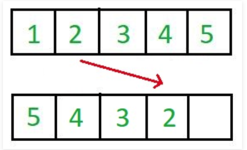

# Stable Sort
<br/>

Stable sort란 중복된 키를 순서대로 정렬하는 정렬 알고리즘들을 지칭한다. 즉, 같은 값이 2개 이상 리스트에 등장할 때 기존 리스트에 있던 순서대로 중복된 키들이 정렬된 다는 것을 의미한다.

예를 들어, 다음과 같은 list가 있다고 가정해보자.

```python
numbers = [9, 3, 12, 1, 6, 2, 1]
```

이 리스트에서 1 이라는 값이 중복이 된다. 이때 중복되는 1의 값들을 구분해서 작성해보려고 한다. 

```python
numbers = [9, 3, 12, 1(1번째), 6, 2, 1(2번째)]
```

만약 이 리스트를 stable sort 알고리즘으로 정렬을 한다면 결과는 다음과 같을 것이다.

```python
[1(1번째), 1(2번째), 2, 3, 6, 9, 12]
```

이처럼 기존 리스트에서 중복된 값들에게 순서가 매겨졌는데, 그 순서대로 정렬이 됬을 때 이 알고리즘은 stable sort라고 부를 수 있는 것이다.

## Why Stable Sort?

그렇다면 왜 stable sort가 중요한지 궁금할 수 있다. 그 이유는 다음과 같다:

- stable sort로 정렬하는 알고리즘들의 순서는 항상 똑같기에 항상 결과가 같음을 보장할 수 있다.
- 숫자를 sorting할 때는 stability가 중요하지 않을 수 있지만, 첫 문자를 기준으로 문자열을 정렬하는 경우에서는 항상 안정적으로 같은 리스트가 리턴되는 것이 바람직할 것이다. (왜냐하면 정렬할 때마다 순서가 다르면 혼란스러울 수 있기 때문이다)

Stable Sorting 알고리즘은 다음과 같다:

- Insertion Sort
- Merge Sort
- Bubble Sort
- Counting Sort

Unstable Sorting 알고리즘은 다음과 같다:

- Heap Sort
- Selection sort
- Shell sort
- Quick Sort

<hr/>

## Inplace algrithm

Inplace 알고리즘이란 추가적인 메모리 공간을 많이 필요로 하지 않는 혹은 전혀 필요하지 않는 알고리즘을 의미한다. 통상적으로, 공간은 O(logn)이고 O(n)이 될 때도 있다.  

즉, n 길이의 리스트가 있고, 이 리스트를 정렬할 때 추가적으로 메모리 공간을 할당하지 않아도 정렬이 이뤄진다면 in-place 알고리즘이라고 불릴 수 있는 것이다.


In-place하지 않은 알고리즘은 n 길이의 리스트를 정렬할 때 n 만큼의 메모리보다 더 많은 메모리 공간을 할당한다. 즉, 이런 알고리즘들은 space complexity가 높다. 




