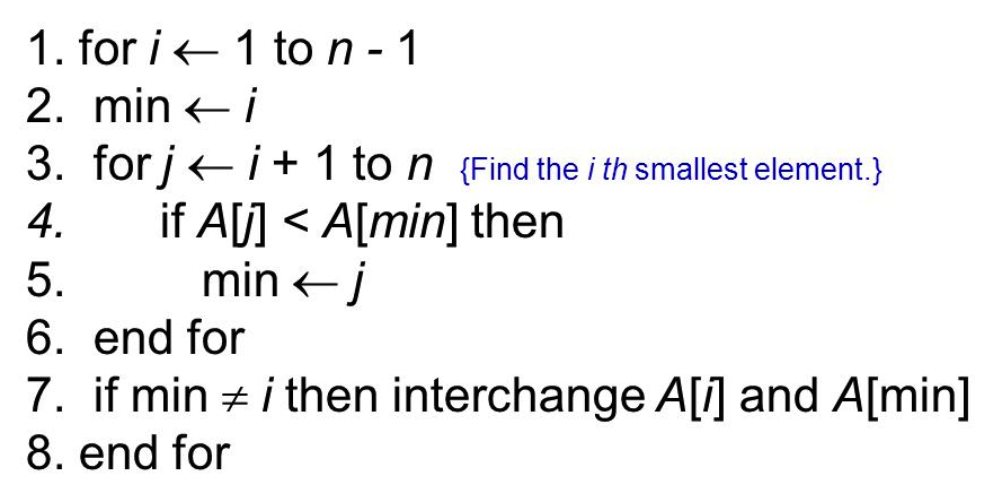
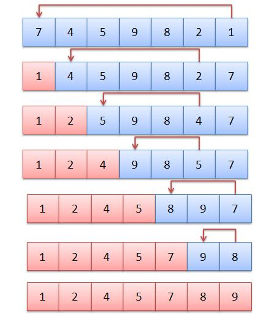

<div align="center">

</div>


## Pseudo-code 설명
위는 Selection Sort(선택정렬)의 pseudo-코드이다. i가 1부터 시작하지만, 가장 첫 Index를 의미하고 프로그램을 할 때는 0 index이다. 알고리즘은 매 iteration마다 2가지 동작을 수행한다. list내에서 가장 작은 값을 찾고 list앞에다 정렬한다. 그 다음에 정렬된 값보다 하나 큰 값에서 다시 같은 알고리즘을 적용한다. <br/>

글로 풀어보면 다음과 같다:

1. min이란 변수에 i를 저장한다.
2. j에는 i +1 값을 대입한다.
3. j부터 list 끝까지 살펴보면서 가장 작은 값을 찾고 그 index를 min에 저장한다.
4. 만약 min 값이 바뀌었다면 i 자리의 item과 min 자리의 item을 바꾼다.
5. i += 1을 하고 1번으로 돌아간다.

<br/>
한 iteration에 list내의 모든 item을 살펴보고, 이러한 과정을 list의 길이만큼 진행하기 때문에 이 sorting algorithm의 시간 복잡도는 `O(n^2)`가 되는 것이다. iteration 수는 언제나 ist 길이와 같기 때문에 average와 worst case에서의 시간복잡도가 같다.

<div align="center">

</div>


<div align="center">

source: <a href="https://stackoverflow.com/questions/36700830/selection-sort-algorithm">stackoverflow_selection_sort</a>

</div>


iteration 과정을 간단히 살펴보자

첫번째 iteration에서는 7부터 시작해서 list 전체를 흝고 1이 제일 작은 것을 파악했고 1을 맨 앞에 위치했다.

두번째 iteration에서는 1을 제외하고 그 다음 item인 4부터 시작해서 list 전체를 흝고 2가 제일 작음을 파악했다. 그래서 2를 1 다음에 위치했다.

세번째 iteration에서는 1,2를 제외하고 그 다음 item인 5부터 시작해서 list 전체를 흝고 4가 제일 작음을 파악했다. 그래서 1, 2 다음에 4를 뒀다.

...

iteration을 list의 item보다 하나 작은 수 만큼 반복을 하면 ⇒ **리스트가 정렬이 된다.**


## Python Code

```python
import random

def selection_sort(num):
    for i in range(len(num)):
        minimum = i
        for j in range(i+1, len(num)): # i보다 하나 큰 수부터 list끝까지 iterate한다
            if num[j] < num[minimum]: 
                minimum = j # list내에 제일 작은 숫자를 찾고 그 index를 minumum 변수에 저장한다
        if minimum != i: 
            num[i], num[minimum] = num[minimum], num[i]
    return num


number = [i for i in range(10)]
random.shuffle(number)
selection = selection_sort(number)
print(selection)
```

