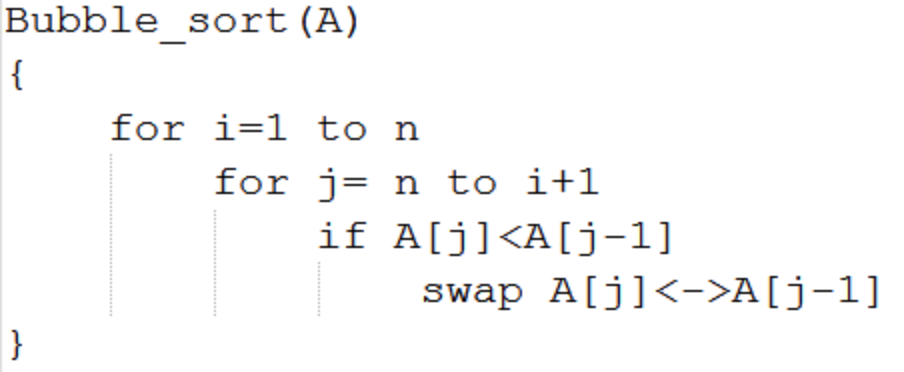

<div align="center">

</div>

## Pseudo-code 설명
위는 Bubble Sort(버블정렬)의 pseudo-코드이다. 정렬을 한다고 했을 때 가장 떠올리기 쉽고 구현하기 쉬운 알고리즘이라고 생각한다. 처음에 2개씩 비교를 하면서 왼쪽이 오른쪽보다 크면 바꿔서 가장 큰 값이 iteration 마다 맨 뒤에 위치하게 한다. (반대로 가장 작은 값을 맨 앞으로 위치하게 만들 수 있다)
<br/>

이 pseudo-코드대로 진행하면 다음과 같다:

1. list 맨앞부터 list의 길이까지 iteration 진행한다.
2. list 끝부터 시작해서 그 앞에 item과 비교를 하고 현 item이 더 작으면 swap을 한다, 이러한 비교를 i + 1까지 iteration 진행한다. 

pseudo-코드만 봐도 다른 알고리즘들보다 더 단순해보이는 것을 볼 수 있다. list길이만큼 iteration을 하는데, iteration마다 끝에서부터 맨 앞까지 다시 한번 iteration을 하며 item끼리 비교를 한다. 두 번의 for loop iteration의 횟수를 제곱만큼 늘리기 때문에 이 sorting algorithm의 시간 복잡도는 `O(n^2)`가 되는 것이다.


<div align="center">

</div>


<div align="center">

source: <a href="https://www.programiz.com/dsa/bubble-sort">programiz-bubble-sort</a>

</div>


그림에 있는 iteration 과정을 간단히 살펴보자. 해당 그림은 pseudo-코드와는 반대 방향으로 진행되서 큰 값을 먼저 뒤로 위치했다.

두 번째 for loop내, 

첫번째 iteration에서 -2와 45를 비교했더니 오른쪽에 있는 45가 더 크기 때문에 다음으로 넘어간다.  

두번째 iteration에서는 45와 0을 비교하고 0이 더 작기 때문에 서로의 위치를 바꿨다. 

세번째 iteration에서는 45와 11을 비교하고 11이 더 작기 때문에 서로의 위치를 바꿨다. 

네번째 iteration에서는 45와 -9를 비교하고 -9가 더 작기 때문에 서로의 위치를 바꿨다.

이렇게 두 번째 for loop의 iteration이 끝나면, 가장 끝이 제일 큰 값으로 정렬된다. 그 다음번에서는 가장 마지막 item을 제외하고 나머지 item끼리만 비교를 한다.


## Python Code

그림과 비슷한 방향으로 코드를 작성했다

```python
import random

def bubble_sort(num):
    for i in range(len(num)):
        for j in range(len(num)-1-i): # 맨 앞부터 비교를 시작한다
            if num[j]>num[j+1]:
                num[j], num[j+1] = num[j+1], num[j] # swap한다
    return num


number = [i for i in range(10)]
random.shuffle(number)
print(number)
bubble = bubble_sort(number)
print(bubble)
```
