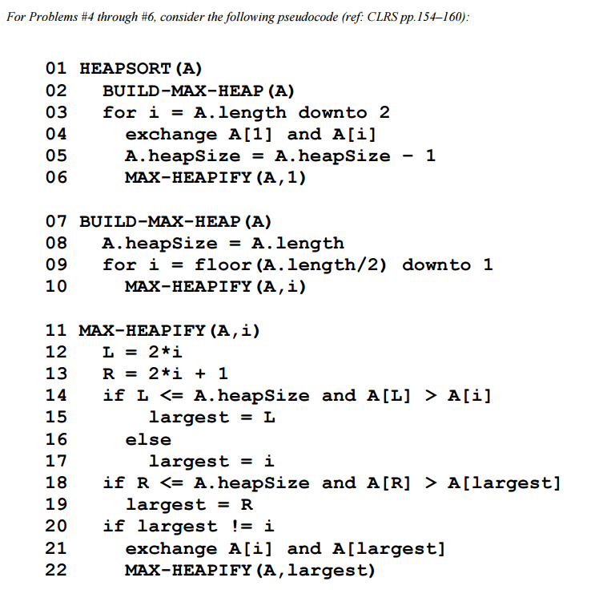
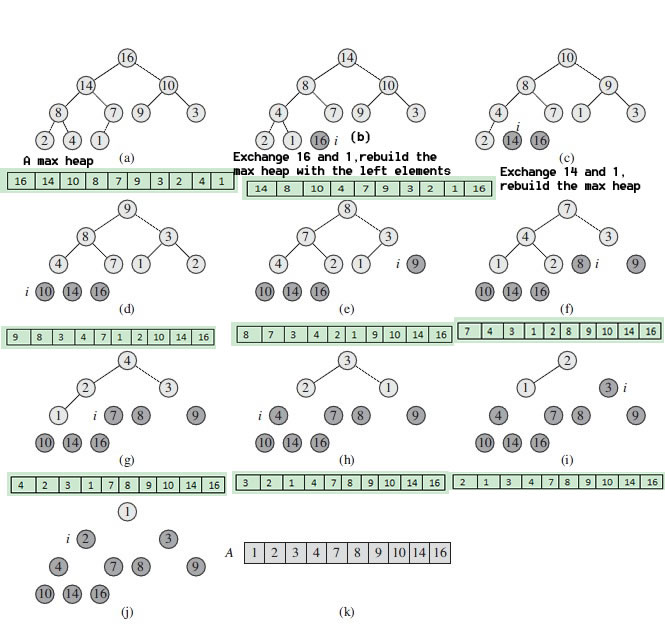

Heap Sort(힙정렬)는 `Complete Binary Tree(완전 이진 트리)` 형식의 자료구조를 사용해서 정렬을 하는 알고리즘이다. 완전 이진 트리란 각 level마다 왼쪽부터 채워넣은 트리의 구조를 의미한다. Binary Heap을 parent 노드가 두개의 child 노드보다 크게 만들수도 있고 작게 만들수도 있다. 전자는 `max heap`이라고 부르고, 후자는 `min heap`이라고 부른다. 이 Heap은 binary tree로 나타낼 수 있지만, 일반 array로도 나타낼 수 있다. 


## 어떻게 Binary Heap을 array로 나타내는가?

Binary Heap이 완전 이진 트리이기 때문에 array로 나타낼 수 있는 것이다. Parent 노드가 l 인덱스에 있다고 가정해보자. 그렇다면 왼쪽의 자식 노드의 index는 2 * l + 1 로 알아낼 수 있고 오른쪽 자식 노드는 2 * l + 2로 알아낼 수 있다. 자식 노드들은 반대로 계산해서 parent 노드의 index를 알아낼 수 있다.

이렇게 array를 이진 트리처럼 연상을 해서 풀 수 있다.

<div align="center">

</div>


## Pseudo-code 설명

Pseudo-code를 하나씩 보기 전에 알고리즘의 기본 작동법을 알아보려고 한다.

작은 숫자 → 큰 숫자로 정렬하려면, `max heap`을 사용해야 한다. `max heap`이기 때문에 가장 큰 숫자가 root에 위치해 있다. 이 root를 가장 마지막 노드와 swap을 하고 array의 사이즈를 하나 줄인다. 이렇게 되면 가장 큰 숫자 순으로 array 맨 뒤에 위치하게 되는 것이다. Swap을 하고나서 `heapify`라는 메커니즘을 사용해서 남아있는 숫자들 중 가장 큰 수를 root로 이동시킨다. 이 동작을 반복하면 sorting이 되는 것이다.

이제 pseudo-code를 하나씩 들여다 보자.

- line 2: BUILD-MAX-HEAP(line 7~10)이라는 함수를 호출하는데, 이 함수는 주어진 array를 heapify해서  `max heap`을 이룰 수 있도록 하는 작업이다. (parent 노드가 자식 노드들보다 큰 트리)
- line 3: for loop
    - line 4: root인 숫자와 array 가장 마지막 숫자와 swap한다.
    - line 5: heapSize를 하나 줄여서, 정렬된 숫자는 이후에 heapify 과정을 안 거치게 한다.
    - line 6: heapify를 하는 MAX-HEAPIFY 함수를 호출한다. 이 함수는 recursion으로 작동한다.
- line 12~13: 자식 노드들의 index를 각각 L,R 변수에 저장한다.
- line 14: 만약 왼쪽 노드가 heapSize보다 작고, 그 값이 주어진 노드의 값보다 크면
    - line 15: L이 가장 큰 숫자의 index인 것으로 간주한다
    - line 16~17: 만약 아니라면, 현재 주어진 노드가 가장 큰 숫자의 index인 것으로 간주한다.
- line 18: L과 i를 비교해서 어떤게 더 큰 숫자를 가진 index인지 확인을 했으니 오른쪽 노드와 비교를 한다.
    - line 19: 오른쪽 노드가 L, i 보다 큰 숫자를 가지고 있으면 R을 가장 큰 숫자의 index로 간주한다.
- line 20: 만약 가장 큰 값의 index가 i가 아니라면,
    - line 21: i 자리에 있는 숫자와 가장 큰 값의 index 자리에 있는 숫자를 swap한다.
    - line 22: MAX-HEAPIFY를 다시 진행하되, largest로 heapify를 시작한다.

## Time Complexity & inplace, stable 여부

Heap sort는 추가적인 메모리를 사용하지 않고 하나의 array로 sorting을 하기 때문에 `in-place`알고리즘이다. 반면에, `unstable`하다. 

시간복잡도는 `O(nlgn)`이다. Heapify하는 과정은 tree의 높이만큼 하기 때문에 `O(lgn)`이다. 처음에 heap을 만드는 과정은 array의 길이만큼 이뤄지기 때문에 `O(n)`이다. 이 둘을 합해서 `O(nlgn)`이 나오는 것이다.


<div align="center">

</div>

그림을 보면서 Heap sort 진행과정을 하나씩 살펴보려고 한다. 머리속으로 진행과정을 그리면서 보면 이해가 어느정도 갈 것입니다.

a. a에서 이미 첫 heapify과정을 마친 상태이다. 

b. root와 가장 마지막 노드를 swap하고 heapSize -= 1을 한다. 그리고 root가 1인데 자식 노드들보다 작기 때문에 heapify과정을 거친다.

- 1은 14와 10중 더 큰 숫자인 14와 swap되서 왼쪽 자식 노드로 이동한다.
- 다시 1의 자식 노드를 봤더니 8과 7이 있고 그 중 더 큰 숫자인 8과 swap되고 다시 왼쪽 자식 노드로 이동한다.
- 1의 자식 노드는 2와 4기에, 4와 swap되서 오른쪽 자식 노드로 이동한다. 그렇게 해서 만들어진 트리의 모양이 (b)의 그림이다.

c. root인 14와 가장 마지막 노드인 1과 swap하고 heapSize -= 1을 한다. 다시 heapify과정을 거친다.

- 8과 10중 10이 더 크기에 10과 1이 swap되고, 1은 오른쪽 노드로 이동한다.
- 자식 노드들이 9와 3이기에, 9와 swap되서 1은 왼쪽 노드로 이동한다. 그렇게 해서 만들어진ㄴ 트리의 모양이 (c)의 그림이다.

...

이렇게 쭉 진행하면 sorting된 array를 얻을 수 있게 된다.


## Python Code

```python
import random

class HeapSort:
    def __init__(self, num, heapSize):
        self.num = num
        self.heapSize = heapSize

    def heap_sort(self):
        # 길이부터 0번째까지 max_heapify를 해야 한다.
        for i in range(len(self.num), -1, -1): 
            self.max_heapify(i) 

        # root에 가장 큰 수를 놨으니, 마지막 자식과 바꾸고 다시 heapify를 진행한다
        for i in range(len(self.num)-1, 0, -1):
            self.num[0], self.num[i] = self.num[i], self.num[0]
            self.heapSize -= 1
            self.max_heapify(0)


    def max_heapify(self, i):
        largest = i
        L = 2 * i + 1
        R = 2 * i + 2
        
        # 왼쪽 자식이 현재 노드의 값보다 큰지 확인한다
        if (L < self.heapSize) and (self.num[L] > self.num[i]):
            largest = L
        else:
            largest = i

        # 오른쪽 자식이 왼쪽 자식, 현재 노드보다 큰지 확인한다
        if (R < self.heapSize) and (self.num[R] > self.num[largest]):
            largest = R
        
        # 자식 중 하나가 현재 노드보다 크면 바꾸고, heapify를 다시 한다
        if largest != i:
            self.num[i], self.num[largest] = self.num[largest], self.num[i]
            self.max_heapify(largest)
         

number = [i for i in range(10)]
random.shuffle(number)
print(number)

heap = HeapSort(number, len(number))
heap.heap_sort()
print(heap.num)
```
