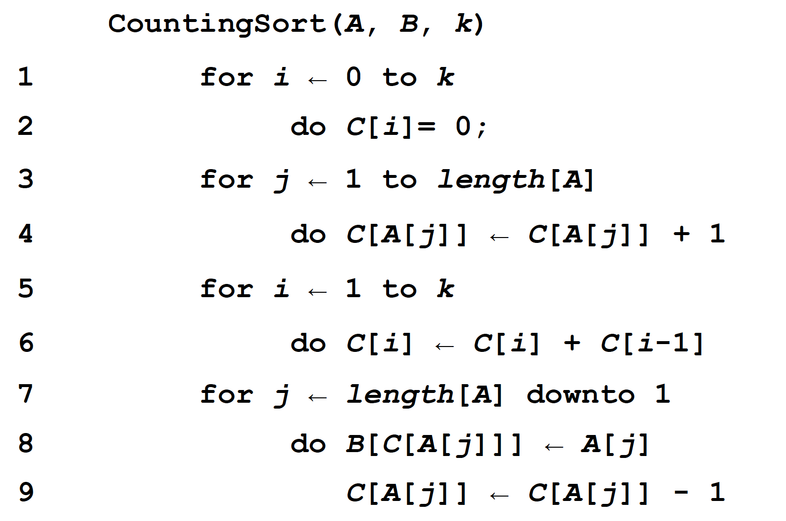
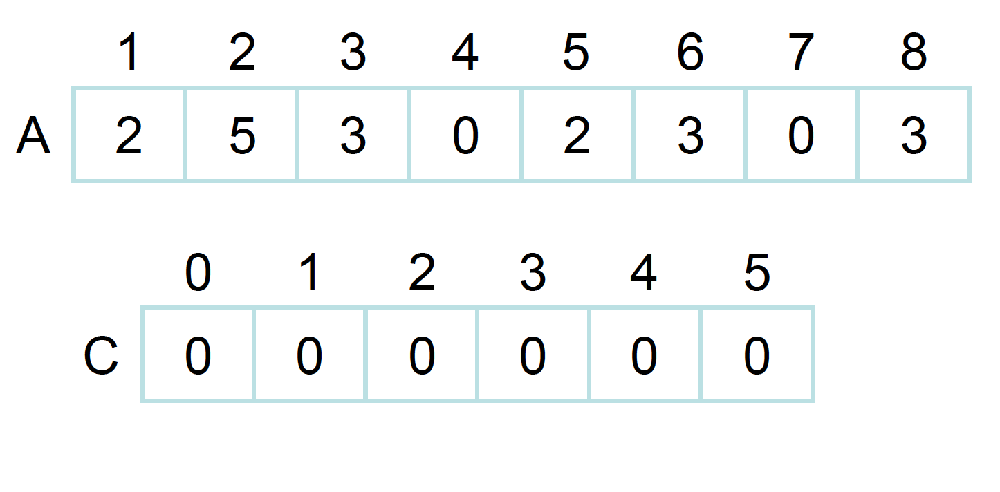
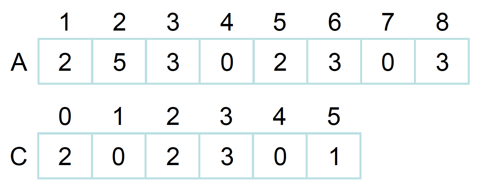
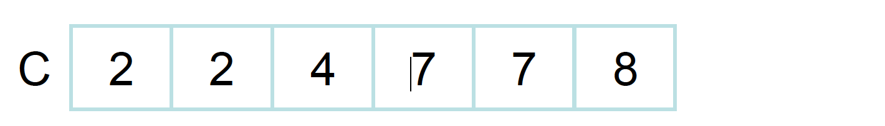
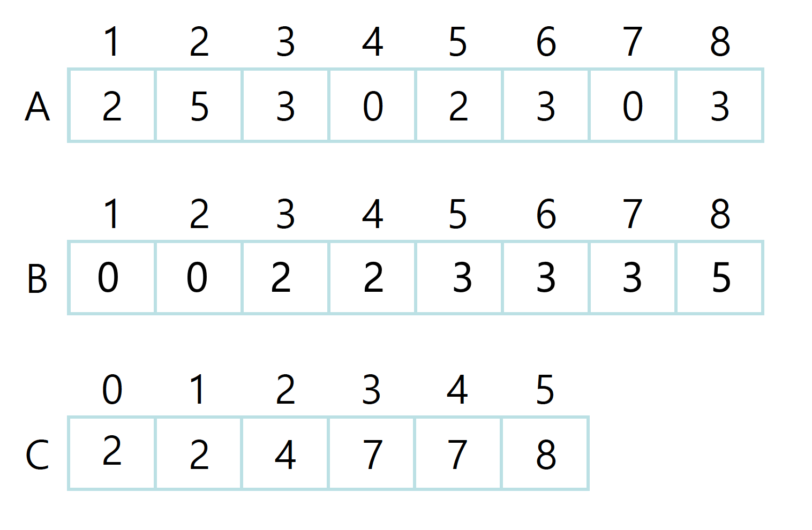

Counting Sort(계수정렬)은 숫자들간 **비교를 하지 않고 정렬을** 하는 알고리즘이다. 일일이 비교를 하지 않고 각 숫자가 몇개인지 센 다음에 정렬을 하기 떄문에 시간복잡도는 `O(n)`이 나오게 된다. 다만, Counting sort는 모든 리스트에 적용을 할 수는 없고, 일정한 **조건**을 만족하는 리스트들에만 해당 알고리즘을 적용할 수 있다. 조건들은 다음과 같다:

1. 리스트 내의 모든 element들은 **정수**여야 한다
2. 리스트 내의 모든 element들의 **범위는 0~k (k는 정수)**여야 한다
3. **k=O(n)**으로 나타나질 수 있어야 한다

<div align="center">

</div>

이제 pseudo 코드를 라인별로 분석해보려고 한다.

<div align="center">

</div>

A라는 정렬되지 않은 리스트를 정렬하고자 한다. 

- **라인 1~2** : C라는 리스트를 새로 만드는데, 이 C의 길이는 **k**이다. Counting sort의 범위는 0\~k가 되어야 한다고 했고, 현재 주어진 리스트에서 k는 5이다. 그래서 0~5, 총 길이 6인 C리스트가 만들어지는 것이다.

<div align="center">

</div>

- **라인 3~4**: 이제 C라는 리스트에 각각 element들이 몇개인지 추가를 한다. 초기에 C는 0으로 초기화 되있고, A를 0번째 index부터 길이까지 순회를 하면서 해당되는 값을 C에 1씩 더해나간다. `C[A[j]] = C[A[j]] + 1` 이 부분을 예시로 설명해보자면,
    1. 처음에 A의 0번째 index 값인 2가 들어온다. A[j]는 2가 되고 C[A[j]]는 C[2]가 되는 것이다. 그러면 기존 C[2]의 값인 0에다 1을 더해서 1이 된다. 
    2. 그다음에 1번째 index의 값인 5가 들어오고, 이는 C[5]에 1을 더하게 된다.

    ...

이런 식으로 진행하다보면 0이 몇개인지, 1이 몇개인지...k가 몇개인지 C 리스트를 통해서 알 수 있게 된다.

<div align="center">

</div>

- **라인 5~6**: C 리스트의 element들을 누적값으로 바꾼다. 0번째 index는 그대로 두고, 1번째 index는 이전값에 자신의 값을 더한다 2+0 = 2, 2번째 index도 이전 값에 자신을 더한다 2+2=4....이렇게 더하다 보면 C의 맨 마지막 element는 당연하게도 **A의 길이**가 된다.

<div align="center">

</div>

- **라인 7~9**: 마지막 for loop에서는 C로 정렬된 B 리스트를 만들어낸다. A의 값을 보고 그 값을 index 삼아서 C의 값을 본다. C의 값을 index삼아서 A의 값을 B에 넣고, 누적 C의 값을 -1 해준다. 말이 어렵기 때문에 한 단계씩 살펴보자
    1. A[0]의 값 2를 보게된다. 이 값을 C의 index로 사용한다 C[2]. 
    2. C[2]의 값은 4이기 때문에 B[4]에 A[0]의 값인 2를 넣게 되는 것이다. B[C[A[j]]] 가 이러한 의미를 가졌다. (실제로는 index가 0부터 시작이기 때문에 B[C[A[j]]-1]을 해줘야 한다)
    3. 그 다음에 2를 사용했기 때문에 누적값을 하나 줄여줘야 한다. 그래서 C[2] -= 1을 한다

    loop을 한번 돌때마다 이러한 동작을 진행하게 되고, A의 마지막 element를 B에 넣을 때까지 진행이 된다.

## Time Complexity & inplace, stable 여부

- 라인 1~2는 0\~k이기 때문에 `O(k)`이다
- 라인 3~4는 n까지여서 `O(n)`이다
- 라인 5~6은 k까지여서 `O(k)`이다
- 라인 7~9는 n까지여서 `O(n)`이다

시간복잡도를 다 더하면 `O(n+k)`가 된다. 만약 **k=O(n)** 이면 counting sort의 시간복잡도는 `O(n)`이 된다. 정렬을 하는 것이 이렇게 빠를 수 있는 이유는 counting sort는 비교를 하지 않기 때문이다. 하지만, k의 값이 너무 커지면 일반 정렬 알고리즘보다 느려질 수 있는 단점이 있다. 

Counting sort는 기존 element들의 순서를 지키면서 정렬을 시키기 때문에 `stable` sort로 분류된다. 하지만, 추가적인 메모리를 요구하기 때문에 `in-place` 알고리즘은 아니다.

## Python Code

```python
def couting_sort(A, k):
    B = [0] * len(A)
    C = [0] * (k+1)

    for i in range(len(A)): # 각 element가 몇개있는지 C에 저장한다
        C[A[i]] += 1
    
    for i in range(1,len(C)): # C를 누적값으로 바꾼다
        C[i] += C[i-1]

    for i in range(len(A)): # C를 indexing해서 B에 저장한다
        B[C[A[i]]-1] = A[i]
        C[A[i]] -= 1

    return B
        
counting_number = [1, 0, 3, 1, 0, 2, 5, 2, 1, 4]
print(counting_number)
count = couting_sort(counting_number, max(counting_number))
print(count)
```
