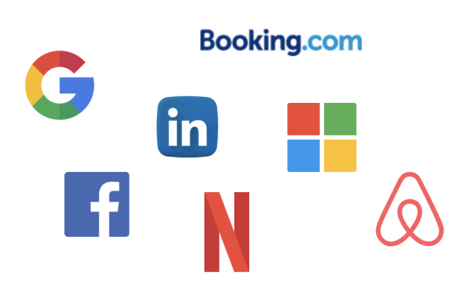
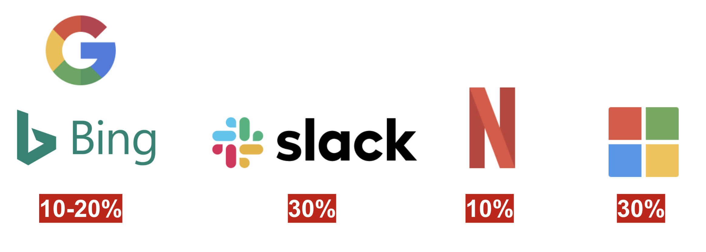

Trustworthy Online Controlled Experiments: A Practical Guide to A/B Testing라는 책을 읽고 요약하고 있다. 이 포스트에서는 **1장: Introduction and Motivation**에 대해 다루고 있다.  

글에서 얘기하는 **실험**은 online controlled experiment를 의미한다. online controlled experiment은 때로 A/B 테스트라고도 불린다.

책에 들어가기 앞서, A/B테스트라고도 불리는 실험(=online controlled experiment)가 무엇이고 어떻게 사용되는지 설명하려고 한다. A/B 테스트라고 하면 특정 변수를 (ex. 앱 화면, 버튼 색깔, 광고 위치 등) 2 가지 버전으로 만들고 테스트의 대상이 2가지 버전에 대해 어떤 반응을 보이는지 테스트를 하는 것을 의미한다.  

내 개인 블로그로 A/B 테스트를 한다면 다음과 같이 할 수 있을 것 같다. A 화면이 기존 화면이라고 가정해보자. 

1. 처음에는 테스트의 목표를 세운다. 이 A/B 테스트의 목표는 유저들의 블로그 재방문율을 늘리는 것이라고 가정해본다.
2. 메인 화면에 블로그 글이 보이면 블로그 재방문율이 높아진다는 가설을 세운다 (그렇다고 가정한다).
3. 실제로 블로그에 방문하는 유저들 중 절반한테는 A 화면, 나머지 유저들한테는 B 화면을 보여준다. 
4. 어느정도 기간 동안 테스트를 진행한다.
5. 📈 기간 이후에 A/B 둘중 어떤 화면을 본 유저들이 더 블로그에 오래 머물렀는지 분석을 해본다. 
6. 재방문율이 높았던 화면을 메인 화면으로 사용한다.

### A 화면

### B 화면

내 개인 블로그로 간단한 A/B 테스팅을 하면 위와 같이 할 수 있을 듯하다. 이와 같은 A/B 테스팅은 국내에서는 주로 UI/UX 혹은 마케팅 방법을 개선하는데 많이 사용되고 있다. 하지만, A/B 테스팅(=실험)으로 UI/UX/마케팅 방법 개선만 할 수 있는 것이 아니다. 

📎 [It's All A/B Testing: The Netflix Experimentation Platform](https://netflixtechblog.com/its-all-a-bout-testing-the-netflix-experimentation-platform-4e1ca458c15 )

📎 [Experiments at Mircrosoft](https://exp-platform.com/experiments-at-microsoft/)

📎 [XLNT Platform: Driving A/B Testing at LinkedIn](https://engineering.linkedin.com/ab-testing/xlnt-platform-driving-ab-testing-linkedin)

📎 [Scaling Airbnb's Experimentation Platform](https://medium.com/airbnb-engineering/https-medium-com-jonathan-parks-scaling-erf-23fd17c91166)

📎 [How Booking.com increases the power of online experiments with CUPED](https://booking.ai/how-booking-com-increases-the-power-of-online-experiments-with-cuped-995d186fff1d)

> 앞으로 A/B 테스트, online controlled experiment를 실험으로 통일해서 사용하겠다

실험은 에어비앤비, 아마존, 이베이, 페이스북, 구글, 유버, 넷플릭스, 마이크로소프트 등 많은 세계적인 기업들에서 사용되고 있다. 이러한 기업들은 매년 수백, 수천개의 실험들을 진행하고 수백만명의 유저들을 대상으로 실험을 진행하고 있다. 실험은 UI 개선에만 국한된 것이 아니라 알고리즘, 응답속도/성능, cms 개선 등 모든 분야를 아우른다. 

> 📕 이제 책 내용을 살펴보자  

# 📈 Online controlled experiments 
 
서비스에 새로운 변화를 가져오려고 할 때 실리콘밸리 기업들은 실험을 하고, 실험으로 얻은 데이터로 변화에 대해 검증을 받고 나서 새로운 변화를 적용할지 말지 결정을 한다. 하지만, 모든 변화들을 실험으로 검증할 수 있는 것은 아니다. 예를 들어, 페이스북이 인스타그램을 인수하는 결정에 대해서는 실험을 할 수 없었을 것이다. 왜냐하면, **인수를 하는 상황**과 **인수를 하지 않는 상황**을 동시에 가져가는 것은 불가능하기 때문이다.

🤔 그렇다면, 실험을 하기 위한 조건은 뭘까? 

### 🙆 실험(=online controlled experiment)가 가능하려면 다음의 4가지 조건을 충족해야 한다: 

1. 실험 단위(e.g. 유저🧍‍♂️, 세션, 등)가 있고, 단위들이 서로에게 영향을 끼칠 수 없어야 한다. 예를 들어, 실험군(주로 변화를 경험하는 그룹)에 있는 유저들은 대조군(주로 변화를 경험하지 않는 그룹)에 있는 유저들에게 아무 영향을 줄 수 없어야 한다. 즉, 서로 독립적이어야 한다. 
2. 충분한 실험 단위가 있어야 한다🧍‍♂️🧍‍♀️🧍‍♂️🧍‍♀️🧍‍♂️🧍‍♀️🧍‍♂️🧍‍♀️🧍‍♂️🧍‍♀️. 모수가 많을 수록 항상 더 나은 측정 결과를 보여줄 수 있다.
3. 구성원간 합의되고 측정가능한 목표(~= Key Metrics), OEC, 가  있어야 한다. 즉, 측정 가능한 목표를 세워야 한다.
4. 쉽게 변경을 할 수 있어야 한다. 일반적으로 소프트웨어는 하드웨어보다 변경하는 것이 쉽다. (물론, 비행기 조종 시스템 소프트웨어 같은 경우는 변경이 어렵기 때문에 실험하기 힘들다) 

결론적으로, 대부분의 온라인 서비스들은 실험할 수 있는 조건을 만족한다. 그렇기 때문에 실리콘밸리의는 온라인 서비스를 하는 기업들이 실험을 진행하는 것이다.

# ✍️ Online controlled experiments를 진행하려는 조직이 지켜야할 3가지 원칙 
 

1. 조직은 데이터 드리븐 의사결정을 원해야 하고, 공식화된 **종합적 평가기준(OEC, Overall Evaluation Criterion)**을 가져야 한다

데이터 드리븐 의사결정을 하려면 비교적 짧은 기간(ex. 1~2주) 에도 측정할 수 있는 OEC를 정의해야 한다. 측정 가능한 metric은 장기적인 목표도 예측할 수 있어야 한다. 예를 들어, "**이익"**은 좋은 OEC가 아니다. 어떤 실험은 단기적으로 이익을 늘릴 수 있지만 장기적으로 봤을 떄는 오히려 악영향인 경우가 있을 수 있기 때문이다. 

2. 실험을 진행하려는 조직은 **실험 인프라에 적극 투자**를 해야하고, 실험의 결과가 **믿을 수 있는 결과라는 것을 보장**해야 한다

3. 조직은 **아이디어의 결과가 좋지 않을 수 있다**는 것을 인정해야 한다

대부분의 아이디어들은 metric을 개선하는데 실패한다. 실리콘밸리 기업들이 실험을 통해서 metric 개선에 성공한 비율은 밑의 그림과 같다. 실험을 하려는 조직은 항상 자신들이 내는 아이디어가 성공하지 않을 수 있다는 것을 인정하면서 실험을 진행해야 한다.

이 포스트에서 간단하게 실험에 대해서 살펴봤다. 

✍️ 다음 포스트는 **Running and Analyzing Experiments: an End-to_end Example**이라는 내용을 요약하려고 한다.

